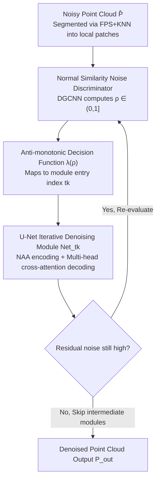

# Routing on Demand: DSNet for Efficient Progressive Point Cloud Denoising

**Conference**: CVPR 2026  
**Paper**: [CVF Open Access](https://openaccess.thecvf.com/content/CVPR2026/html/Cheng_Routing_on_Demand_DSNet_for_Efficient_Progressive_Point_Cloud_Denoising_CVPR_2026_paper.html)  
**Code**: https://github.com/cz-61/DSNet  
**Area**: 3D Vision / Point Cloud Denoising  
**Keywords**: Point cloud denoising, Progressive denoising, Dynamic routing, Normal similarity, Adaptive skip connections

## TL;DR
DSNet (Dynamic Skip Net) is a "Routing on Demand" progressive point cloud denoising framework. It employs a normal similarity-based noise discriminator to quantify the noise intensity of each local patch, which is then mapped by an anti-monotonic decision function to an appropriate denoising module entry. This allows clean regions to skip redundant denoising while noisy regions receive sufficient refinement, achieving a superior balance between denoising quality and computational efficiency.

## Background & Motivation
**Background**: Point cloud denoising is a crucial preprocessing step for 3D perception. Deep learning methods have evolved from single-stage (one-pass forward) to progressive/iterative approaches (multi-step refinement, e.g., IterativePFN using weight-sharing modules), which generally outperform traditional geometric fitting methods.

**Limitations of Prior Work**: Regardless of being single-stage or progressive, mainstream frameworks adopt a **rigid pipeline**—applying a uniform denoising strategy to all regions (either a single forward pass or a fixed sequence of multi-stage refinement). This "one-size-fits-all" approach ignores the spatial non-uniformity of real-world noise, where sensor Gaussian noise, environmental outliers, and geometric distortions often coexist with varying intensities.

**Key Challenge**: Fixed paths lead to both **over-smoothing** in clean areas (erasing fine-grained geometric details) and **insufficient refinement** in heavily noisy areas. Simultaneously, they generate **redundant computation** for low-noise regions, compromising both fidelity and efficiency.

**Goal**: To enable the network to perceive local noise intensity and dynamically plan the denoising iteration path for each patch accordingly. The core problem addressed is: "Can a network dynamically allocate computation by planning optimal paths area-wise?"

**Key Insight**: The authors observe through experiments that the **angular deviation of surface normals** between noisy and clean point clouds is highly correlated with the degree of geometric degradation. Thus, normal deviation can serve as a noise proxy to guide adaptive inference.

**Core Idea**: Quantify degradation using a normal similarity discriminator, map the continuous noise score to discrete module entries using an anti-monotonic decision function, and implement cross-stage skips via a path-selection iterative mechanism. Clean patches skip directly to late-stage fine-tuning modules, while heavily noisy patches follow the complete denoising trajectory.

## Method

### Overall Architecture
Given a noisy point cloud $\hat{P}$, DSNet first selects center points via Farthest Point Sampling (FPS) and constructs local patches using K-Nearest Neighbors (KNN) with $k=1000$. Each patch enters a "Routing on Demand" loop: the noise discriminator computes a normal similarity factor $\rho$ $\rightarrow$ the decision function $\lambda(\rho)$ maps it to a discrete module index (higher noise leads to an earlier entry) $\rightarrow$ the selected U-Net denoising module refines the patch $\rightarrow$ noise is re-evaluated, and the next stage entry is re-planned. This "Assessment-Selection-Execution" cycle repeats for a fixed number of times, and the trajectory **need not be sequential** (intermediate modules can be skipped), transforming traditional static progressive networks into an adaptive system. Training follows the IterativePFN approach, assigning progressively denoised intermediate ground truths to each iterative module.

### Key Designs

**1. Normal Similarity Noise Discriminator: Quantifying Local Geometric Degradation via Normal Angular Deviation**

Addressing the issue that networks cannot perceive local noise intensity, the authors define a normal similarity factor $\rho=\frac{1}{n}\sum_{i=1}^{n}\exp(-\theta_i^4/\gamma)$, based on the observation that the angular deviation between noisy and clean normals is strongly correlated with degradation. Here, $\theta_i=\arccos(n_{clean,i}\cdot n_{noisy,i})$ is the angle between the clean and noisy normals of the $i$-th point, $n$ is the number of points in the patch, and $\gamma$ controls sensitivity to noise deviation. The quartic term $\theta_i^4$ amplifies the penalty for large angular deviations, making $\rho\in(0,1]$ robust to small perturbations but sensitive to significant structural distortion ($\rho$ closer to 0 indicates higher noise). The discriminator is implemented using EdgeConv layers of DGCNN: it first builds a k-NN graph, uses multi-layer EdgeConv to iteratively update node features via dynamic adjacency, concatenates cross-layer features into a point-level representation, and finally predicts $\rho$ via global pooling followed by an MLP.

**2. Anti-monotonic Decision Function $\lambda(\rho)$: Mapping Continuous Noise Scores to Discrete Module Entries**

With $\rho$ obtained, it must be mapped to a discrete module index within $[N_{min}, L]$. The mapping must satisfy three criteria: anti-monotonicity (low $\rho \rightarrow$ high noise $\rightarrow$ earlier, more aggressive stages), non-linear sensitivity (finer granularity in high-noise zones, less sensitivity in low-noise zones), and bounded integer output. The authors design $\lambda(\rho)=\text{clip}\big(\text{round}(L-\frac{(L-N_{min})\log(\beta\rho+1)}{\log(\beta+1)}),N_{min},L\big)$. The core is the logarithmic term $\frac{\log(\beta\rho+1)}{\log(\beta+1)}$: as $\rho\to0$ (highly noisy), the numerator tends to 0 and the ratio maximizes, pushing $\lambda(\rho)$ towards $N_{min}$ and forcing the patch through the full denoising trajectory. As $\rho\to1$ (clean), the ratio approaches 1, making $\lambda(\rho)\approx L$ and allowing the patch to skip most denoising steps. The hyperparameter $\beta$ controls curvature: larger $\beta$ increases non-linearity/granularity in high-noise regions ($\rho \approx 0$), while smaller $\beta$ distributes patches more uniformly across modules.

**3. Path-Selection Iterative Mechanism (Dynamic Skip): Per-stage Re-evaluation and Re-planning for Cross-stage Skips**

This is the core distinction between DSNet and fixed cascades ($Net_1\to Net_2\to\dots\to Net_L$). The $k$-th iteration consists of three steps: (1) State Assessment—the current patch $P_{k-1}$ is fed into the discriminator to compute $\rho_{k-1}$; (2) Module Selection—$t_k=\lambda(\rho_{k-1})$, with the constraint $t_k\in\{t_{k-1}+1,\dots,L\}$ to ensure monotonic progress; (3) Module Execution—$P_k=Net_{t_k}(P_{k-1})$. The cycle repeats for a fixed $K_{total}$ iterations. A trajectory might look like $P_{input}\xrightarrow{Net_2}P_1\xrightarrow{Net_5}P_2\xrightarrow{Net_7}\dots\xrightarrow{Net_L}P_{output}$, effectively skipping intermediate modules like $\{Net_3, Net_4, Net_6\}$. This non-sequential routing enables dense multi-stage refinement for noisy, complex regions while bypassing unnecessary processing for clean, simple regions.

**4. U-Net Iterative Denoising Module: Neighborhood Attention Encoding + Multi-head Cross-attention Decoding**

Each denoising module is a hierarchical U-Net. The encoder uses two consecutive Neighborhood Attention Aggregations (NAA) with MLP residual connections in each layer: $f_l=\text{MLP}([\text{NAA}(f^0_{l-1}),\text{NAA}^2(f^0_{l-1})])+\text{MLP}(f_{l-1})$, with the point set downsampled via FPS. The decoder uses distance-weighted interpolation for upsampling followed by Multi-head Cross-attention (MHCA) for cross-layer fusion: $h_{l-1}=\text{MLP}([\text{MHCA}(\phi(f_{l-1}),\phi(\tilde{h}_l)),f_{l-1}])$, balancing global context with local structural details. The module also adaptively decides the number of encoder-decoder layers based on the estimated noise intensity.

### Loss & Training
Training assigns progressively denoised intermediate ground truths $P_{gt_i}=P+\sigma_i\xi,\ \xi\sim\mathcal{N}(0,I)$ to each iteration step, with the noise standard deviation decaying as $\sigma_i=\sigma_{i-1}/\gamma$ ($\gamma=16/L$). The single-step loss is $L_k=L_{cd}(P_k,P_{gt_k})+L_{disp}(P_{k-1},P_{gt_k},P_k)$, where $L_{cd}$ is the Chamfer Distance between the prediction and target, and the displacement loss $L_{disp}=\|(P_k-P_{k-1})-P_{nearest}\|_2$ (where $P_{nearest}$ is the displacement vector from $P_{k-1}$ to its nearest neighbor in $P_{gt_k}$). The total loss aggregates all intermediate losses with equal weight: $L=\sum_{k=1}^{K_{total}}L_k$, ensuring consistent supervision and stable optimization from coarse to fine stages. The noise discriminator is **independently pre-trained** first to obtain a stable noise feature extractor, which then guides the joint optimization of DSNet to improve convergence speed and stability.

## Key Experimental Results

### Main Results
Training is conducted on the PU-Net dataset (40 meshes, Poisson disk sampling at 10K/30K/50K, Gaussian noise at 0.05–0.2 times the bounding sphere radius). The table below shows results on the PU-Net test set (CD and P2M are multiplied by $10^4$, lower is better):

| Setup | Metric | DSNet | ASDN | IterativePFN | 3DMambaIPF |
|------|------|-------|------|--------------|------------|
| 10K, 1% | CD↓ | **1.829** | 1.871 | 2.055 | 1.989 |
| 10K, 2.5% | CD↓ | **2.604** | 2.697 | 3.352 | 3.262 |
| 50K, 2% | CD↓ | **0.603** | 0.721 | 0.802 | 0.755 |
| 50K, 2.5% | CD↓ | **0.762** | 0.850 | 1.015 | 0.928 |
| 50K, 2.5% | P2M↓ | **0.514** | 0.575 | 0.588 | 0.531 |

> Note: CD = Chamfer Distance; P2M = Point-to-Mesh Distance. Both are geometric fidelity metrics where lower values are better.

Real-world scanning data (Kinect, limited quantitative evaluation due to lack of ground truth; Paris-Rue-Madame qualitative only):

| Dataset | Metric | DSNet | P2P-Bridge | IterativePFN | 3DMambaIPF |
|--------|------|-------|-----------|--------------|------------|
| Kinect | CD↓ | 1.040 | **0.974** | 0.993 | 1.008 |
| Kinect | P2M↓ | 0.885 | **0.854** | 0.867 | 0.883 |

DSNet achieves SOTA on synthetic data but is only comparable to peers on real Kinect scans (slightly trailing P2P-Bridge). The authors acknowledge that cross-domain generalization still has room for improvement.

### Ablation Study
Comparison of stage count $L$ and Dynamic vs. Static paths (PU-Net, CD↓, selected):

| Configuration | 10K, 1% CD↓ | 50K, 2.5% CD↓ | Description |
|------|-----------|-------------|------|
| DSNet-2 (Dynamic) | 1.919 | 0.868 | 2 stages |
| DSNet-Static-2 | 1.914 | 0.975 | Fixed path, 2 stages |
| DSNet-4 (Dynamic, Final) | **1.829** | **0.762** | Optimal configuration |
| DSNet-Static-4 | 1.897 | 1.017 | Fixed path, 4 stages |
| DSNet-5 (Dynamic) | 1.847 | 0.816 | Degradation with excessive depth |

### Key Findings
- Performance improves as stage count $L$ increases from 2 to 4 (deeper $\rightarrow$ more effective coarse-to-fine refinement), but $L=5$ shows a slight drop (likely due to over-smoothing or error accumulation). $L=4$ is chosen.
- Dynamic paths consistently outperform static variants. In low-noise cases, skipping redundant stages avoids over-smoothing. In high-noise cases, it remains robustly superior (e.g., DSNet-Static-4 actually worsened to CD 1.017 on 50K/2.5%, whereas the dynamic version reached 0.762).
- Synthetic-to-Real Domain Gap: Improvements on real scans are less pronounced than on synthetic data, indicating cross-domain generalization as a future research direction.

## Highlights & Insights
- "Routing on Demand" upgrades progressive denoising from a "fixed pipeline" to an "adaptive path per patch." This directly improves upon fixed cascades like IterativePFN. The core insight is that since noise is spatially non-uniform, computation should be allocated as needed.
- Using normal angular deviation as a noise proxy is clever: normals are sensitive to geometric degradation and allow for residual noise assessment during inference without ground truth. The $\rho$ design (quartic + exponential) balances robustness to small jitters with sensitivity to major distortions.
- The anti-monotonic logarithmic decision function provides an interpretable and adjustable (via $\beta$) closed-form mapping from continuous scores to discrete modules, avoiding the need for an additional learned router and maintaining engineering simplicity.
- The monotonic constraint $t_k\in\{t_{k-1}+1,\dots,L\}$ ensures the process always moves forward, allowing skip connections to save computation while guaranteeing convergence. This "skip-to-save" design is transferable to other progressive refinement tasks like iterative image or depth restoration.

## Limitations & Future Work
- Weak generalization to real scans: Performance on Kinect is only on par with SOTA and slightly behind P2P-Bridge.
- The discriminator relies on the quality of normal estimation, which can be inaccurate for noisy point clouds. (Note: The specific implementation of obtaining "clean normals" for $\theta_i$ computation during inference is not fully detailed in the summary).
- Requires independent pre-training of the noise discriminator before joint training, adding an extra step compared to end-to-end methods. The cost of tuning multiple hyperparameters ($\gamma,\beta,N_{min},L,K_{total}$) is not systematically analyzed.
- Evaluation is primarily on PU-Net synthetic noise plus two real scan sets. Noise types are still dominated by Gaussian, with limited validation against structured noise or sparse outliers.

## Related Work & Insights
- **vs. IterativePFN (Direct Comparison)**: Both use progressive iterative denoising and intermediate ground truth supervision. IterativePFN enforces a fixed sequence for all patches, risking over-smoothing; DSNet uses a discriminator + decision function to implement non-sequential skips, customizing the path based on patch noise.
- **vs. Single-stage Methods (PD-Flow / ASDN / Score-Denoise)**: Single-stage methods lack adaptability to non-uniform noise. DSNet's multi-stage dynamic routing shows significant advantages in high-resolution/high-noise scenarios (e.g., 50K/2.5% CD 0.762 vs. ASDN 0.850).
- **vs. RL-based Routing**: Some related works explore reinforcement learning for routing. DSNet replaces learned policies with a geometry-driven normal similarity proxy and a closed-form decision function, offering better interpretability and training stability.

## Rating
- Novelty: ⭐⭐⭐⭐ "Routing on demand + cross-stage skips" is a clear new paradigm in point cloud denoising. The normal similarity proxy and anti-monotonic decision function are well-conceived.
- Experimental Thoroughness: ⭐⭐⭐⭐ Comprehensive on synthetic multi-resolution/noise levels and dynamic vs. static ablation, though quantitative results on real scans and hyperparameter sensitivity analysis are relatively sparse.
- Writing Quality: ⭐⭐⭐⭐ Motivation, the three-step routing loop, and formula derivations are clearly explained with intuitive illustrations.
- Value: ⭐⭐⭐⭐ Achieves a better balance between quality and efficiency with practical significance for 3D perception preprocessing; the skip-connection logic is transferable.

<!-- RELATED:START -->

## Related Papers

- [\[ICML 2026\] SIMPC: Learning Self-Induced Mirror-Point Consistency for Unsupervised Point Cloud Denoising](../../ICML2026/3d_vision/simpc_learning_self-induced_mirror-point_consistency_for_unsupervised_point_clou.md)
- [\[ICCV 2025\] Noise2Score3D: Tweedie's Approach for Unsupervised Point Cloud Denoising](../../ICCV2025/3d_vision/noise2score3d_tweedies_approach_for_unsupervised_point_cloud_denoising.md)
- [\[CVPR 2026\] MHopReg: Efficient Hierarchical Multi-Hop Graph Search for Point Cloud Registration](mhopreg_efficient_hierarchical_multi-hop_graph_search_for_point_cloud_registrati.md)
- [\[ECCV 2024\] P2P-Bridge: Diffusion Bridges for 3D Point Cloud Denoising](../../ECCV2024/3d_vision/p2p-bridge_diffusion_bridges_for_3d_point_cloud_denoising.md)
- [\[CVPR 2026\] SuP: Sub-cloud Driven Point Cloud Registration](sup_sub-cloud_driven_point_cloud_registration.md)

<!-- RELATED:END -->
