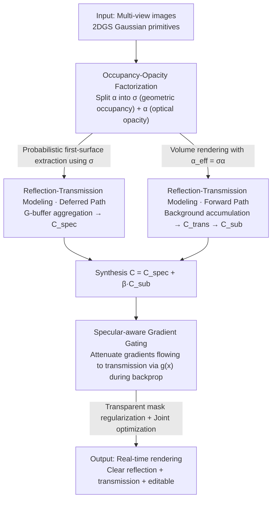

# RT-Splatting: Joint Reflection-Transmission Modeling with Gaussian Splatting

**Conference**: CVPR 2026  
**arXiv**: [2605.18263](https://arxiv.org/abs/2605.18263)  
**Code**: https://sjj118.github.io/RT-Splatting (Project Page)  
**Area**: 3D Vision  
**Keywords**: Gaussian Splatting, Semi-transparent surfaces, Reflection-transmission decomposition, Deferred Shading, Gradient Gating

## TL;DR
RT-Splatting decouples the "geometric occupancy" and "optical opacity" of each Gaussian primitive into two independent attributes. This allows a single set of Gaussians to serve as both a reflective surface (performing deferred shading for high-frequency specular effects) and a transmissive volume (performing forward integration for clear backgrounds). A "specular-aware gradient gating" mechanism is utilized to suppress floaters caused by reflection residuals leaking into the transmission branch, achieving SOTA results on real-world scenes with simultaneous reflection and transmission, such as car windows and plastic films.

## Background & Motivation
**Background**: 3D Gaussian Splatting (3DGS) achieves real-time, high-quality novel view synthesis through rasterization. To represent high-frequency, view-dependent specular effects, recent variants commonly replace Spherical Harmonics (SH) per Gaussian with physics-based shading and adopt "deferred shading"—first rasterizing the nearest surface attributes into a G-buffer, then performing per-pixel shading.

**Limitations of Prior Work**: These methods collectively fail on **thin semi-transparent specular surfaces** (car windows, glass, plastic films). The appearance of such surfaces is an overlay of the "background seen through the surface" and the "environment reflected by the surface." Standard 3DGS hallucinations a cluster of "floaters" behind the surface to fit high-frequency speculars, which neither reconstructs reflection accurately nor allows the background to be visible, resulting in cloudy transmission. Deferred shading naturally cannot handle transparency because the G-buffer only stores the nearest surface attributes per pixel—either failing to aggregate necessary surface properties for reflection or treating the surface as opaque, completely blocking transmission.

**Key Challenge**: A single opacity parameter $\alpha$ simultaneously handles two conflicting tasks: "geometric presence" (rendering high-frequency reflection requires a solid surface) and "optical light blocking" (transmission requires a clear surface). One parameter cannot satisfy "geometrically solid + optically clear" simultaneously, forcing a choice between "blurry reflection" and "opaque occlusion."

**Limitations of Prior Work**: Methods like TransparentGS use multi-stage pipelines to reconstruct the background separately (masking out transparent areas) before overlaying transparent objects. However, when the background is **only visible through the transparent surface** (e.g., car interiors seen only through windows), the background reconstruction stage never sees this content, and the method fails. Other works impose strong planar assumptions or controlled capture conditions.

**Core Idea**: Factorize the opacity of each Gaussian into two learnable quantities: geometric occupancy $\sigma$ and optical opacity $\alpha$. A hybrid rendering pipeline of "deferred reflection + forward transmission" is supported by the same set of Gaussians, with gradient gating resolving ambiguity during joint optimization.

## Method

### Overall Architecture
RT-Splatting aims to solve the reconstruction of "strong coupling between reflection and transmission on thin semi-transparent surfaces." The pipeline is built on 2DGS: first, the opacity of each Gaussian is decomposed into geometric occupancy $\sigma$ and optical opacity $\alpha$, forming a unified "surface-volume" representation. The same set of Gaussians then follows two paths—a **deferred path** uses $\sigma$ for probabilistic first-surface extraction, aggregating attributes like normals/roughness into a G-buffer to compute reflection color $\mathbf{C}_{\text{spec}}$ via a specular shading network; a **forward path** uses effective opacity $\alpha_{\text{eff}}=\sigma\alpha$ for volume rendering to accumulate background radiance $\mathbf{C}_{\text{trans}}$ passing through the surface. After blending the two paths for the final pixel color, "specular-aware gradient gating" attenuates gradients flowing into the transmission branch based on pixel specular complexity during backpropagation, preventing reflection residuals from polluting the background. Training involves joint optimization with a transparent mask regularization for $\alpha$.

### Key Designs

**1. Occupancy-Opacity Factorization: Making a set of Gaussians both a solid surface and a clear volume**

Addressing the fundamental conflict where a single parameter $\alpha$ cannot balance geometric solidity and optical clarity, this paper decomposes per-Gaussian opacity into two learnable quantities with physical meanings: geometric occupancy $\sigma\in[0,1]$, representing the probability of a ray **hitting** the Gaussian entity, and optical opacity $\alpha\in[0,1]$, representing the conditional probability of light being absorbed/scattered upon hitting. The product $\alpha_{\text{eff}}=\sigma\alpha$ is the effective opacity used in volume rendering (Eq. 1)—meaning "optical attenuation only occurs where there is a geometric surface." Thus, transparent objects can be expressed with "high $\sigma$ + low $\alpha$": geometrically a solid wall (required for reflection) and optically almost fully transparent (required for transmission).

Crucially, $\sigma$ alone provides the **probabilistic first-surface extraction** for deferred shading: after sorting Gaussians along the ray by depth, the expectation of any surface attribute $\mathbf{a}$ (normal, roughness, etc.) is:

$$\mathbf{A}=\sum_i p_i\,\mathbf{a}_i,\quad p_i=\sigma_i\mathcal{G}_i\prod_{j=1}^{i-1}(1-\sigma_j\mathcal{G}_j)$$

where $p_i$ is the probability that the $i$-th Gaussian is the first surface element the ray interacts with. This is formally identical to standard alpha-blending, but the paper reinterprets these Gaussians as a "probabilistic representation of a single surface" rather than a set of semi-transparent surfels—providing physical grounds for modeling high-frequency reflections via deferred shading in Gaussian Splatting.

**2. Hybrid Deferred-Forward Reflection-Transmission Modeling: Deferred for reflection, forward for transmission, with transmission modulated by specular intensity**

The appearance of a semi-transparent surface = high-frequency specular reflection + transmitted light. Parallel deferred and forward paths are used. The deferred path uses Eq. (2) to aggregate normals $\mathbf{n}$, roughness $\rho$, and material features $\mathbf{z}$ into the G-buffer, feeding them into a specular shading network $f_{\text{spec}}$ (architecture following Ref-GS) to calculate view-dependent reflection color $\mathbf{C}_{\text{spec}}$. To represent materials like colored glass with internal scattering/absorption, each Gaussian learns an intrinsic scattering color $\mathbf{C}_{\text{scatter}}$ and a transmittance $\tau\in[0,1]$, combining "penetrating background light" with "internally scattered light" into a subsurface transmission term:

$$\mathbf{C}_{\text{sub}}=\tau\,\mathbf{C}_{\text{trans}}+(1-\tau)\,\mathbf{C}_{\text{scatter}}$$

The background radiance $\mathbf{C}_{\text{trans}}$ is obtained via volume integration in the forward path using $\alpha_{\text{eff}}=\sigma\alpha$, ensuring the background is not occluded by transparent objects. The final color is not blended via pure Fresnel physics (which is often corrupted by non-linear camera responses like tone mapping), but based on a perceptual observation—"transmission details are visible under light reflection but suppressed or obscured by strong specular highlights." Thus, the shading network outputs an attenuation factor $\beta\in[0,1]$ to directly modulate the transmission term:

$$\mathbf{C}=\mathbf{C}_{\text{spec}}+\beta\,\mathbf{C}_{\text{sub}}$$

Contrary to previous approaches of "modulating the reflection component," this method **modulates the transmission component**, providing a more direct and stable mechanism for "strong reflection suppressing background light."

**3. Specular-Aware Gradient Gating: Blocking reflection residuals from leaking into transmission and causing floaters**

Even with decoupled representations, joint optimization remains ambiguous: high-frequency speculars are difficult to fit perfectly, and their residuals are erroneously routed into the transmission branch during backpropagation. The transmission branch then "compensates" by hallucinating floaters behind the surface to cancel errors, blurring the background. The key insight is that this error compensation primarily occurs in **regions with high-frequency specular details**. Thus, pixel-wise gating weights are calculated using the variance of $\mathbf{C}_{\text{spec}}$ in a local neighborhood $\mathcal{N}(x)$ to estimate complexity:

$$g(x)=\exp\!\big(-k\cdot\mathrm{Var}_{p\in\mathcal{N}(x)}[\mathbf{C}_{\text{spec}}(p)]\big)$$

where $k$ controls gating sensitivity. During backpropagation, $g(x)$ scales the image loss gradients flowing back via $\mathbf{C}_{\text{trans}}$: $\frac{\partial\mathcal{L}_{\text{img}}}{\partial\mathbf{C}_{\text{trans}(x)}}\leftarrow g(x)\cdot\frac{\partial\mathcal{L}_{\text{img}}}{\partial\mathbf{C}_{\text{trans}}(x)}$. In specular-complex pixels, $g(x)\to 0$, suppressing misleading supervision; in simple/weak specular pixels, $g(x)\to 1$, allowing the background to receive full supervision. This **attenuated rather than complete cutoff** preserves valid optimization paths for background geometry and appearance.

**4. Transparent Mask Regularization + Joint Optimization: Eliminating "Ghost Geometry" ambiguity and unifying training**

Factorization introduces a new ambiguity: Gaussians with "high $\sigma$ + near-zero $\alpha$" can be placed anywhere in the scene without affecting the final rendered color, accumulating as "ghost geometry" in diffuse regions, corroding surfaces, and disrupting optimization. To address this, a pre-trained SAM2 provides a transparent mask $\mathbf{M}$. In the deferred path, the expected optical opacity $\alpha$ of the first surface is aggregated into the G-buffer and constrained by a BCE loss to match the inverted semantic mask:

$$\mathcal{L}_{\text{mask}}=\mathrm{BCE}(1-\mathbf{M},\,\alpha)$$

Unlike TransparentGS, which "slices the scene for separate processing," the mask here acts **only as regularization**. All components (Gaussian primitives, factorized occupancy/opacity, shading networks) are jointly optimized. This joint optimization allows the method to handle complex scenes where the "background is only visible through a transparent surface."

### Loss & Training
Implemented in PyTorch within the 2DGS framework; deferred path shading function hyperparameters follow Ref-GS. The training objective is the image reconstruction loss $\mathcal{L}_{\text{img}}$ (with gradients gated through the transmission branch by $g(x)$) plus the transparent mask regularization $\mathcal{L}_{\text{mask}}$, with joint optimization of all components.

## Key Experimental Results

### Main Results
Evaluation covers 6 public scenes (Sedan / Toycar / Compact / Hatchback / Audi / Truck) from Ref-Real, NeRF-Casting, EnvGS, and T&T, plus 2 self-captured scenes (Van / Swab, 220-240 views via smartphone). Metrics include PSNR / SSIM / LPIPS on the full image and transparent regions, plus FPS and training time.

Public Benchmarks (Tab.1):

| Method | Full PSNR↑ | Full LPIPS↓ | Trans. Area PSNR↑ | Trans. Area LPIPS↓ | FPS↑ | Train Time↓ |
|------|-----------|-------------|--------------|----------------|------|-----------|
| 3DGS | 26.493 | 0.181 | 37.673 | 0.012 | 218.95 | 0.3h |
| 2DGS | 26.384 | 0.197 | 37.333 | 0.012 | 208.82 | 0.3h |
| 3DGS-DR | 26.597 | 0.190 | 37.890 | 0.012 | 119.62 | 0.8h |
| Ref-GS | 26.599 | 0.188 | 37.761 | 0.013 | 38.41 | 0.8h |
| EnvGS | 27.141 | 0.182 | 37.953 | 0.012 | 18.31 | 2.9h |
| **Ours** | **27.490** | **0.167** | **39.765** | **0.010** | 33.28 | 0.9h |

The gap is larger in self-captured scenes (Tab.2)—Trans. Area PSNR 35.490 vs 32.567 for second-best 3DGS (+2.9dB), and Full PSNR 28.780 also leads (3DGS 27.507). Improvements are particularly significant in transparent regions, with 33 FPS real-time performance and efficient 0.9h training time.

### Ablation Study
Component-wise ablation on transparent regions (Tab.3, degradation relative to Full):

| Configuration | PSNR↑ | LPIPS↓ | Description |
|------|-------|--------|------|
| Full (Ours) | 37.983 | 0.0095 | Full model |
| w/o occupancy | 36.919 | 0.0113 | Returns to single opacity; reflection and transmission sacrifice each other |
| w/o joint optimization | 36.288 | 0.0120 | Separate training; car interiors seen through windows fail to reconstruct |
| w/o scattering | 37.597 | 0.0102 | Without $\mathbf{C}_{\text{scatter}}$ and $\tau$, material tint is baked into background |
| w/o attenuation | 37.541 | 0.0102 | Without $\beta$, fails to model view-dependent background suppression |
| w/o gating | 37.754 | 0.0101 | Floater artifacts appear near transparent surfaces |
| w/o $\mathcal{L}_{\text{mask}}$ | 37.167 | 0.0106 | Unstable optimization and surface quality degradation |

### Key Findings
- **Joint optimization contributes most** (dropping 1.70dB to 36.288), followed by occupancy-opacity factorization (dropping 1.06dB)—these are critical for scenes where the background is only visible through transparent surfaces.
- Scattering, attenuation, gating, and mask regularization each contribute ~0.2-0.8dB. Gating and masks primarily improve **floater artifacts and optimization stability** (visible in Fig.5).
- Gains in transparent areas are significantly higher than full-image gains, confirming that the benefits come from reflection-transmission decoupling rather than overall capacity.

## Highlights & Insights
- **Splitting one parameter into two to resolve a conflict**: Decoupling "geometric occupancy" and "optical opacity" is a precise surgery on 2DGS opacity semantics. Lifting the dual burden of single-parameter alpha-blending allows "high occupancy + low opacity" to naturally represent semi-transparent surfaces using a single set of Gaussians.
- **Modulating transmission instead of reflection**: Unlike previous works that adjust the reflection component, using $\beta$ to attenuate the transmission component aligns with the perceptual reality that strong highlights obscure background details, providing a more stable mechanism.
- **Gradient gating as an optimization tactic**: Instead of altering the forward pass, it attenuates gradients flowing into transmission based on specular variance. This cuts the "reflection residual → transmission floater" error path while preserving background supervision in simple regions.
- **Decoupled representation supports scene editing**: Explicit separation of reflection/transmission, roughness, transparency, and tint allows independent adjustment of car window properties or colors.

## Limitations & Future Work
- **Limited to thin semi-transparent surfaces**: The method does not model refraction or multiple light bounces; thin surface "straight transmission" is a prerequisite.
- **Dependency on external masks**: Relies on pre-trained SAM2 for transparent masks; segmentation errors can propagate into the optimization.
- **Gating hyperparameter $k$**: The sensitivity of $g(x)$ depends on $k$, which requires tuning.
- **Future Work**: Extending straight transmission to differentiable refraction paths for thick media; replacing SAM2 with an end-to-end learnable transparency prior.

## Related Work & Insights
- **vs Reflection-based Gaussians (3DGS-DR / Ref-GS / EnvGS)**: These use deferred shading for high-frequency speculars but treat surfaces as opaque. Ours leads by ~1.8-3.7dB in transparent areas by handling the reflection-transmission mixture.
- **vs Multi-stage transparent reconstruction (TransparentGS)**: These freeze the background first; Ours uses joint optimization, enabling reconstruction of backgrounds only visible through transparent surfaces.
- **vs Planar-assumption methods**: While assuming thin-surface transmission, the representation is not limited to planes and can handle complex curved geometries like car bodies.

## Rating
- Novelty: ⭐⭐⭐⭐⭐ Factorization, transmission modulation, and gradient gating are effective new mechanisms.
- Experimental Thoroughness: ⭐⭐⭐⭐ Extensive real-world scenes and ablations, though lacks sensitivity analysis for $k$.
- Writing Quality: ⭐⭐⭐⭐⭐ Clear problem definition and well-motivated solutions.
- Value: ⭐⭐⭐⭐ High practical value for semi-transparent surfaces with real-time editing support.

<!-- RELATED:START -->

## Related Papers

- [\[CVPR 2026\] PolarGuide-GSDR: 3D Gaussian Splatting Driven by Polarization Priors and Deferred Reflection for Real-World Reflective Scenes](polarguide-gsdr_3d_gaussian_splatting_driven_by_polarization_priors_and_deferred.md)
- [\[CVPR 2026\] TagSplat: Topology-Aware Gaussian Splatting for Dynamic Mesh Modeling and Tracking](tagsplat_topology-aware_gaussian_splatting_for_dynamic_mesh_modeling_and_trackin.md)
- [\[CVPR 2026\] CUPID: Generative 3D Reconstruction via Joint Object and Pose Modeling](cupid_generative_3d_reconstruction_via_joint_object_and_pose_modeling.md)
- [\[CVPR 2026\] DirectFisheye-GS: Enabling Native Fisheye Input in Gaussian Splatting with Cross-View Joint Optimization](directfisheye-gs_enabling_native_fisheye_input_in_gaussian_splatting_with_cross-.md)
- [\[CVPR 2026\] Part$^{2}$GS: Part-aware Modeling of Articulated Objects using 3D Gaussian Splatting](part2gs_part-aware_modeling_of_articulated_objects_using_3d_gaussian_splatting.md)

<!-- RELATED:END -->
