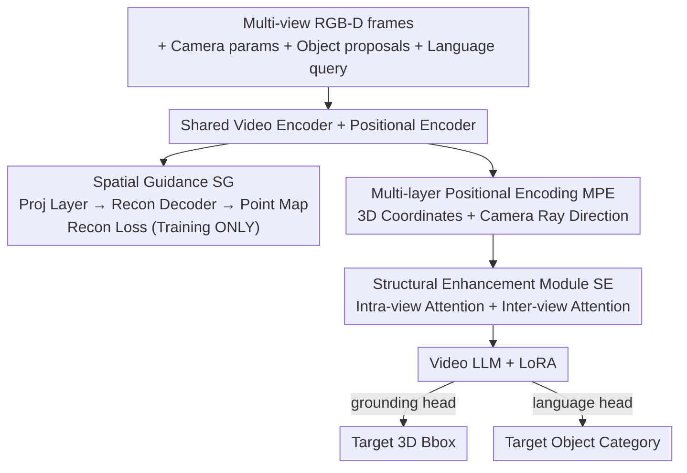

# S$^2$-MLLM: Boosting Spatial Reasoning Capability of MLLMs for 3D Visual Grounding with Structural Guidance

**Conference**: CVPR 2026  
**Paper**: [CVF Open Access](https://openaccess.thecvf.com/content/CVPR2026/html/Xu_S2-MLLM_Boosting_Spatial_Reasoning_Capability_of_MLLMs_for_3D_Visual_CVPR_2026_paper.html)  
**Code**: https://github.com/IRMVLab/S2-MLLM.git  
**Area**: 3D Vision / Multimodal VLM  
**Keywords**: 3D Visual Grounding, MLLM, Spatial Reasoning, Feed-forward 3D Reconstruction, Implicit Spatial Reasoning

## TL;DR
S²-MLLM enables Multimodal Large Language Models (MLLMs) to perform 3D Visual Grounding (3DVG) **without relying on expensive point cloud reconstruction and multi-view rendering during the inference phase**. Instead, it treats feed-forward 3D reconstruction as "spatial guidance" for joint optimization during training, paired with a structural enhancement module that injects 3D coordinates and camera rays into visual features. This allows the model to perform **implicit** 3D spatial reasoning in the latent space, achieving state-of-the-art performance on ScanRefer / Nr3D / Sr3D with only 25% of the training overhead and zero additional inference latency.

## Background & Motivation
**Background**: 3D Visual Grounding (3DVG), which involves identifying objects in a 3D scene based on natural language, is a fundamental capability for embodied AI and robotics. Recent efforts have sought to leverage the reasoning and generalization capabilities of MLLMs for 3DVG. However, MLLMs are essentially "2D-centric" in their training, making it difficult for them to comprehend the 3D spatial structure of a scene from 2D images alone.

**Limitations of Prior Work**: To supplement 3D structure, existing methods (e.g., SeeGround, GPT4Scene) follow an "explicit reconstruction" route—reconstructing the scene into point clouds during inference and then rendering them into multi-view or BEV (Bird's Eye View) images for the MLLM. This approach has two major flaws: ① Specific rendered views **cannot reflect the complete 3D structure** and are affected by viewpoint selection and occlusion; the same relative spatial relationship may change if the viewpoint is altered. ② **Reconstructing point clouds on-the-fly during inference is extremely slow** (SeeGround requires multiple API calls, resulting in nearly 4× latency).

**Key Challenge**: A trade-off exists between "desiring 3D structural understanding" and "avoiding the costs of reconstruction/rendering during inference." Moving structural information to the inference stage is inevitably slow and prone to viewpoint bias.

**Goal**: To enable the MLLM to internalize 3D structural perception into its weights during the **training phase**, thereby allowing implicit reasoning of spatial relationships directly in the latent feature space without any reconstruction or rendering during inference.

**Key Insight**: The authors observe that **feed-forward 3D reconstruction models** (such as Fast3R) can predict dense 3D structures directly from multi-view RGB, possessing inherent spatial understanding. By incorporating this reconstruction objective into **joint training** as a "free" spatial guidance supervision signal, the information is used during training and discarded during inference.

**Core Idea**: Use "reconstruction as supervision" to distill 3D structural knowledge into the MLLM's visual representation (Spatial Guidance). Then, use "3D coordinate + camera ray encoding + intra/inter-view attention" to explicitly anchor spatial information into features (Structural Enhancement), achieving high-performance implicit spatial reasoning that is "heavy during training, light during inference."

## Method

### Overall Architecture
S²-MLLM treats the 3D scene as a **video sequence** to preserve the rich texture and semantics of 2D images. The input consists of sampled multi-view RGB-D frames $\{(I_v,D_v)\}_{v=1}^{V}$, corresponding camera parameters, object Proposals $\{o_i\}$, and a natural language description $Q$; the output includes the 3D bounding boxes and categories of the target objects. A shared video encoder and positional encoder extract visual and geometric features. **Multi-layer positional encoding** injects 3D coordinates and camera ray information, followed by a **Structural Enhancement module** (intra/inter-view attention) to form visual inputs for the Video LLM (fine-tuned with LoRA). The LLM processes the visual inputs and tokenized query, with a grounding head predicting 3D bboxes and a language head predicting categories. **Crucially, a reconstruction branch is attached during training**: encoder features are passed through a projection layer into a reconstruction decoder to predict point maps and calculate reconstruction loss. This "Spatial Guidance" exists only during training; the entire guidance branch is removed during inference, resulting in zero additional latency.

### Key Designs

**1. Spatial Guidance Strategy (SG): Feed-forward Reconstruction as Supervision**

Prior methods required point cloud reconstruction during inference to obtain structural information, which was slow and bias-prone. The authors add a reconstruction branch to the MLLM, reusing the fusion transformer and decoder head from Fast3R, but **replacing the original ViT in Fast3R with the MLLM's own visual encoder** $E_v$. This ensures that reconstruction and 3DVG share the same representation space. A projection layer $P$ aligns/normalizes semantic features to the dense structural features required for reconstruction. The branch predicts local point maps $X_L$ and global point maps $X_G$:

$$X_L,X_G=D\big(P(E_v(I))\big)$$

Reconstruction loss is **jointly optimized** with grounding/language losses during training, forcing the model to internalize 3D structures into the latent space. The reconstruction loss converges early, providing stable structural supervision that helps the model gain structure-aware features without harming multimodal alignment. During **inference, the reconstruction branch is discarded**, avoiding viewpoint bias and latency—the fundamental difference from the "explicit reconstruction" route.

**2. Multi-layer Positional Encoding (MPE): Anchoring 3D Coordinates and Camera Rays**

MLLMs often lack the ability to explicitly associate visual appearance with 3D positions, making it hard to distinguish distance, direction, and relative relationships. Each RGB-D pixel can be projected into a 3D coordinate and lies on a camera ray. Given depth $d=D(u,v)$, intrinsic $K$, and extrinsic $T$, the world coordinate is:

$$p_{world}=T\begin{bmatrix} d\,K^{-1}(u,v,1)^\top \\ 1 \end{bmatrix}$$

The ray viewing direction is $r=\dfrac{p_{world}-o_{world}}{\lVert p_{world}-o_{world}\rVert_2}$ (where $o_{world}$ is the camera center). For each patch, sinusoidal positional encoding $\phi(\cdot)$ encodes the average 3D coordinate, which is added to visual features followed by neighborhood average pooling. Finally, a learnable encoding $\psi(\cdot)$ (MLP) encodes the ray direction, yielding a position-aware representation:

$$f^{vis}_i=\text{AvgPool}\big(f_i+\phi(p^i_{world})\big)+\psi(r_i)$$

This ensures features contain both "where I am" (3D coordinates) and "where I am looking from" (viewpoint direction), enabling accurate fine-grained spatial reasoning. Ablation shows that removing MPE results in the largest performance drop (Acc@0.25 −15.05%).

**3. Structural Enhancement Module (SE): Divided Inter/Intra-view Attention**

This module addresses two issues: (i) MLLMs pre-trained on independent image-text pairs lack **inter-view semantic consistency**—they may not recognize that a chair seen from different angles is the same 3D object; (ii) a lack of intra-view patch structural correlation. Borrowing from "space-time decomposition" in video modeling, the authors use divided attention: given multi-view features $f\in\mathbb{R}^{B\times(V\cdot H\cdot W)\times dim}$, **inter-view attention** aggregates across viewpoints for patch index $s$ ($f^{inter}_s\in\mathbb{R}^{B\times V\times dim}$) to force semantic alignment; **intra-view attention** groups by viewpoint index $v$ to capture dependencies between patches within the same view. This separation is computationally efficient and effectively models both cross-view correspondence and intra-view structure.

### Loss & Training
The total objective is a weighted sum of three terms:

$$L=\lambda_g L_{ground}+\lambda_r L_{recon}+\lambda_l L_{lang}$$

- **Grounding Loss**: 3DVG is treated as a classification of object proposals. For each bbox, features of internal patches (overlap >50%) are averaged to get $f_{obj}$ and added to the 3D positional encoding of the object center. The hidden state $h$ of the `<ground>` token is used in an InfoNCE contrastive loss to align $L_{ground}=\text{InfoNCE}(f_{obj},h)$ ($\tau=0.07$).
- **Reconstruction Loss**: A confidence-weighted regression loss is used for predicted point maps $\hat X$ (with confidence $\hat\Sigma$) against ground truth, summing local and global maps $L_{recon}=L_{X_G}+L_{X_L}$.
- **Language Loss**: Cross-entropy supervises the generation of sentences like "The [category] is located at \<ground\>…", correcting **category misidentifications** (e.g., mistaking a stool for a chair).

The backbone is LLaVA-Video-7B + LoRA, trained for 1 epoch on a single A100 (80G) with batch size 8. GT bboxes are used as proposals during training; the reconstruction decoder is frozen, while the projection layer, visual encoder, and LLM are fine-tuned. During inference, Mask3D generates proposals.

## Key Experimental Results

> Metric Note: **Acc@0.25 / Acc@0.5** refers to the accuracy (%) where the predicted 3D bbox has an IoU with the GT exceeding 0.25 / 0.5. Unique = single-object scenes, Multiple = scenes with similar distractors.

### Main Results

ScanRefer Validation Set (Acc, %):

| Method | LLM | Unique@0.25 | Multiple@0.5 | Overall@0.25 | Overall@0.5 |
|------|-----|------|------|------|------|
| TSP3D (CVPR'25) | - | 87.3 | 42.4 | 56.5 | 46.7 |
| Video-3D-LLM (CVPR'25) | LLaVA-Video-7B | 88.0 | 45.3 | 58.1 | 51.7 |
| SeeGround (CVPR'25, Zero-shot) | Qwen2-VL-72B | 75.7 | 30.0 | 44.1 | 39.4 |
| **Ours (S²-MLLM)** | LLaVA-Video-7B | 87.4 | **46.6** | **59.2** | **52.7** |

In challenging "Multiple" scenes, Acc@0.5 improved by **Gain** 10.0% over Prev. SOTA. Compared to Video-3D-LLM (also LoRA fine-tuned), all metrics improved by over +5.1%.

ReferIt3D (Nr3D / Sr3D, Acc@0.25, %):

| Method | Pred-Sr3D | Pred-Nr3D | GT-Nr3D |
|------|------|------|------|
| MCLN (ECCV'24) | 53.9 | 46.1 | 59.8 |
| SeeGround (CVPR'25) | − | − | 46.1 |
| **Ours (S²-MLLM)** | 53.9 | **50.6** | 59.8 |

In the more realistic "Predicted boxes (Pred)" setting, Nr3D reached 50.6% (showing significant advantages in natural language queries).

### Ablation Study

Ablation by component on ScanRefer (Overall Acc, %, 16 frames):

| Configuration | Overall@0.25 | Overall@0.5 | Description |
|------|------|------|------|
| Full (S²-MLLM) | 59.18 | 52.67 | Complete Model |
| w/o SG | 54.40 | 48.45 | Drop of 4.78 / 4.22; structural supervision is vital |
| w/o MPE | 44.13 | 38.49 | **Drop of 15.05**; positional info is most critical |
| w/o Attn | 59.13 | 52.30 | Slight decrease |
| w/o LG | 57.75 | 50.85 | Drop of 1.43 / 1.82; corrects category errors |

Efficiency Comparison (Single A100):

| Method | GPU Hours↓ | Trainable Params(MB)↓ | Inference Latency(s)↓ |
|------|------|------|------|
| Video-3D-LLM | 256 | 8078.79 | 1.04 |
| SeeGround | - | - | 3.97 + t₀ (Recon) |
| **Ours (S²-MLLM)** | 72 | 1767.50 | 1.16 |

Ours requires only ~25% of the trainable parameters and GPU hours of Video-3D-LLM. SG adds only ~10% training time with zero inference overhead.

### Key Findings
- **MPE is the largest contributor**: Removing MPE causes Acc@0.25 to plummet by 15.05%, indicating that "explicitly anchoring 3D coordinates/rays into visual features" is the lifeblood of 3DVG for LLMs; implicit spatial guidance alone is insufficient.
- **SG makes sparse observations viable**: With SG, increasing input frames from 16 to 24 yielded only a +1.41% gain (compared to +2.06% without SG). This suggests SG can extract reliable structures from sparse views.
- **Strong OOD Generalization**: On unseen MultiScan / ARKitScenes, S²-MLLM achieved Acc@0.25 of 59.13 / 43.26, outperforming zero-shot SeeGround and supervised MCLN, proving spatial reasoning comes from SG rather than dataset memorization.

## Highlights & Insights
- The **"Heavy Training, Light Inference" structural injection paradigm** is clever: moving 3D reconstruction from inference to training as a supervision signal distills structural understanding into weights, achieving zero inference overhead. This "training-time scaffold" strategy is transferable to other multimodal tasks requiring geometric priors.
- **Reusing the MLLM encoder for reconstruction** (rather than a separate 3D encoder) ensures reconstruction and localization share the same representation space, avoiding fragmented learning.
- **Applying spatiotemporal decomposition from video modeling to multi-view**: Inter-view attention acts as the "time" dimension while intra-view attention acts as "space." This analogy provides a clean solution for cross-view consistency.

## Limitations & Future Work
- Inference still relies on an external proposal generator (Mask3D); 3DVG is modeled as proposal classification rather than end-to-end regression, meaning localization is capped by proposal quality.
- Performance on **templatized synthetic queries** like Sr3D is not significantly better than traditional fully supervised methods, as pattern matching is not the focus of this approach; strengths lie in natural language (Nr3D).
- SG depends on the quality of feed-forward reconstruction (Fast3R) and RGB-D input; the reliability of guidance in pure RGB or reconstruction-degraded scenarios is not fully verified.

## Related Work & Insights
- **vs SeeGround / GPT4Scene (Explicit Recon + Rendering)**: They reconstruct point clouds during inference, which is slow and biased. Ours treats reconstruction as training supervision, making inference implicit and faster.
- **vs Video-3D-LLM (3D as Video Sequences)**: Similar video-based approach and backbone (LLaVA-Video-7B), but Ours adds spatial guidance and explicit positional encoding, yielding a +5.1% gain with only 25% of the training cost.
- **vs 3D MLLMs with Point Cloud Encoders**: Those methods are limited by the modal gap of point clouds and scarce 3D labeling. Ours learns 3D structure from 2D sequences, bypassing point cloud annotation bottlenecks.

## Rating
- Novelty: ⭐⭐⭐⭐ The "Reconstruction as training supervision, branch removal at inference" paradigm is novel and practical.
- Experimental Thoroughness: ⭐⭐⭐⭐ Comprehensive coverage of ScanRefer/Nr3D/Sr3D, OOD datasets, and ablation studies.
- Writing Quality: ⭐⭐⭐⭐ Clear motivation-solution chain; high-quality module explanations.
- Value: ⭐⭐⭐⭐ Excellent trade-off between accuracy, efficiency, and generalization; significant for real-time embodied AI/robotics.

<!-- RELATED:START -->

## Related Papers

- [\[CVPR 2026\] HAMMER: Harnessing MLLMs via Cross-Modal Integration for Intention-Driven 3D Affordance Grounding](hammer_harnessing_mllms_via_cross-modal_integration_for_intention-driven_3d_affo.md)
- [\[CVPR 2026\] PV-Ground: Text-Guided Point-Voxel Interaction for 3D Visual Grounding](pv-ground_text-guided_point-voxel_interaction_for_3d_visual_grounding.md)
- [\[CVPR 2026\] Masking Matters: Unlocking the Spatial Reasoning Capabilities of LLMs for 3D Scene-Language Understanding](masking_matters_unlocking_the_spatial_reasoning_capabilities_of_llms_for_3d_scen.md)
- [\[ECCV 2024\] ScanReason: Empowering 3D Visual Grounding with Reasoning Capabilities](../../ECCV2024/3d_vision/scanreason_empowering_3d_visual_grounding_with_reasoning_capabilities.md)
- [\[CVPR 2026\] Context-Nav: Context-Driven Exploration and Viewpoint-Aware 3D Spatial Reasoning for Instance Navigation](context-nav_context-driven_exploration_and_viewpoint-aware_3d_spatial_reasoning_.md)

<!-- RELATED:END -->
