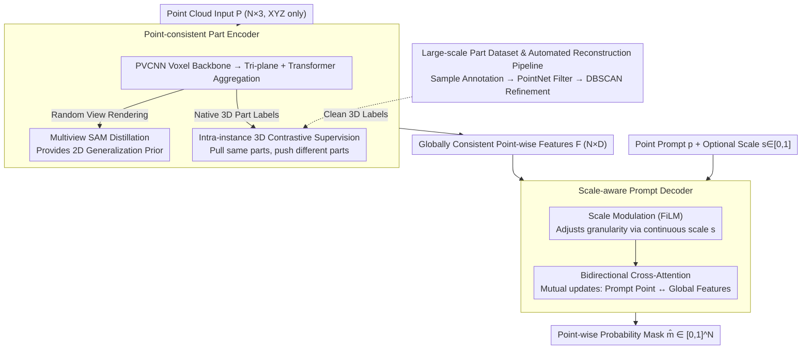

# S2AM3D: Scale-controllable Part Segmentation of 3D Point Clouds

**Conference**: CVPR2026  
**arXiv**: [2512.00995](https://arxiv.org/abs/2512.00995)  
**Code**: [Project Page](https://sumuru789.github.io/S2AM3D-website/)  
**Area**: 3D Vision  
**Keywords**: Point cloud part segmentation, multi-granularity control, contrastive learning, joint 2D-3D supervision, SAM  

## TL;DR

Ours proposes S2AM3D, a point cloud part segmentation framework that merges 2D pre-trained priors with 3D contrastive supervision. It employs a point-consistent encoder to obtain globally consistent point features and a scale-aware prompt decoder to achieve continuous and controllable segmentation granularity adjustment, significantly outperforming existing methods across multiple benchmarks.

## Background & Motivation

Point cloud part-level segmentation is a critical task bridging fine-grained geometric details and high-level semantic understanding, with important applications in 3D content creation, robotic manipulation, and reverse engineering. Existing methods face three primary challenges:

1. **Poor Generalization of Native 3D Methods**: High-quality 3D part annotations are expensive, and existing datasets (e.g., ShapeNet-Part, PartNet) are limited in scale and category diversity, severely restricting generalization to open-domain shapes.
2. **Cross-view Inconsistency in 2D Prior Methods**: Approaches that leverage 2D models like SAM to segment 3D rendered views and back-project them suffer from inconsistencies under occlusion, thin structures, and complex topologies, where accumulated errors damage global 3D consistency.
3. **Inflexible Granularity Control**: Feature clustering-based methods like PartField rely on post-processing, making control discontinuous and unintuitive. Point-prompt-based methods like Point-SAM lack explicit mechanisms for granularity control.

## Method

### Overall Architecture

The core challenge S2AM3D addresses is the key challenge: pure 3D part segmentation data is scarce (poor generalization), while using 2D models like SAM for 3D label projection creates cross-view conflicts. The mechanism involves fusing these two paths—2D priors for generalization and 3D contrastive supervision for global consistency—while designing the segmentation granularity as a continuously adjustable "knob."

The training is decoupled into two stages. The first stage trains the **Point-consistent Part Encoder**: given point cloud $\mathbf{P} \in \mathbb{R}^{N \times 3}$, it outputs point-wise features $\mathbf{F} \in \mathbb{R}^{N \times D}$. Training signals come from both multiview SAM distillation and native 3D label contrastive loss. The second stage freezes the encoder and trains the **Scale-aware Prompt Decoder**: given a point prompt index $p$ and an optional scale prompt $s \in [0,1]$, the decoder outputs a probability mask $\hat{\mathbf{m}} \in [0,1]^N$. By delegating granularity to $s$, the same point prompt can return "one table leg" or "the entire set of legs and the tabletop" without re-clustering. The clean 3D labels required for 3D contrastive supervision are provided by a large-scale part dataset constructed by the authors.

### Key Designs

**1. Point-consistent Part Encoder: 3D Contrastive Supervision over 2D Distillation**

The limitation of pure multiview 2D distillation is that views are processed independently. Conflicting judgments under occlusion or complex topologies lead to blurred boundaries in 3D. The encoder uses a PVCNN voxel backbone to extract features, converted into tri-plane representations $\mathbf{T} \in \mathbb{R}^{3 \times D \times H \times W}$ ($xy$, $yz$, $zx$). Tri-planes are rendered into 2D latent variables for SAM distillation. Point features $(x,y,z)$ are retrieved by summing projections:

$$\mathbf{F} = \Big[\mathbf{T}_{xy}(x_n, y_n) + \mathbf{T}_{yz}(y_n, z_n) + \mathbf{T}_{zx}(z_n, x_n)\Big]_{n=1}^{N}$$

To solve cross-view conflicts, intra-instance 3D contrastive supervision is applied directly to native 3D labels. Contrast is restricted to a single object per mini-batch to avoid semantic mismatch across instances. For anchor $i$, positive samples $\hat{P}(i)$ are points with the same label. Cosine similarity $s_{ij} = \mathbf{f}_i^\top \mathbf{f}_j / \tau$ is used to pull positives and push negatives:

$$\mathcal{L}_{\text{contr}} = \frac{1}{|\hat{P}|} \sum_{i \in \hat{P}} -\log \frac{\sum_{j \in \hat{P}(i)} e^{s_{ij}}}{\sum_{j \in \hat{P} \setminus \{i\}} e^{s_{ij}}}$$

**2. Scale-aware Prompt Decoder: Continuous Granularity Knob**

Instead of post-processing, granularity is encoded as a continuous scalar $s \in [0,1]$. The decoder first adds 3D sinusoidal positional encoding to features $\mathbf{F}$ to get $\mathbf{X}^{(0)} = \mathbf{F} + \mathrm{PE}(\mathbf{P})$. 

Scale modulation uses learned sinusoidal embeddings $\mathbf{e}(s)$ and FiLM for affine modulation on global features:

$$[\boldsymbol{\gamma}, \boldsymbol{\beta}] = \text{Linear}(\mathrm{LN}(\mathbf{e}(s))), \qquad \mathrm{FiLM}(\mathbf{X}; s) = \mathbf{X} \odot (1 + \alpha \boldsymbol{\gamma}) + \alpha \boldsymbol{\beta}$$

Bidirectional cross-attention then updates the prompt query from global context and subsequently refines global features based on the query:

$$\mathbf{q}^{(\ell+1)} = \mathbf{q}^{(\ell)} + \mathrm{CAttn}(\mathbf{q}^{(\ell)}; \mathbf{Y}^{(\ell)})$$
$$\mathbf{Y}^{(\ell+1)} = \mathrm{FFN}\Big(\mathbf{Y}^{(\ell)} + \mathrm{CAttn}(\mathbf{Y}^{(\ell)}; \mathbf{q}^{(\ell+1)})\Big)$$

**3. Large-scale Part Dataset & Automated Pipeline**

To provide sufficient clean data, a dataset covering 400+ categories and 100k+ instances was built from Objaverse. The pipeline includes: sampling based on surface area, filtering using a PointNet-based binary validator, and refining disjoint regions using DBSCAN.

### Loss & Training

A hybrid objective of **Dynamically Weighted BCE + Dice** is used:

$$\mathcal{L}_{\text{seg}} = \lambda_{\text{bce}} \mathrm{BCE}_{\text{dyn}}(\hat{\mathbf{m}}, \mathbf{m}) + \lambda_{\text{dice}} \left(1 - \frac{2\hat{\mathbf{m}}^\top \mathbf{m}}{\|\hat{\mathbf{m}}\|_1 + \|\mathbf{m}\|_1}\right)$$

The dynamic weight $\beta = (1-\pi)/(\pi + \varepsilon)$ alleviates class imbalance caused by varying part sizes.

## Key Experimental Results

### Main Results

**Interactive Segmentation (Point prompt → Single part mask)**:

| Method | PartObjaverse-Tiny (IoU%) | PartNet-E (IoU%) | Average |
|------|:---:|:---:|:---:|
| Point-SAM | 31.46 | 50.23 | 40.85 |
| P3-SAM | 35.05 | 39.98 | 37.52 |
| **Ours** | **46.47** | **62.52** | **54.50** |
| **Ours (+scale)** | **61.19** | **77.51** | **69.35** |

**Full Segmentation (Predicting all point labels)**:

| Method | PartObjaverse-Tiny (IoU%) | PartNet-E (IoU%) | Average |
|------|:---:|:---:|:---:|
| PartField | 51.54 | 59.10 | 55.32 |
| P3-SAM | 58.10 | 65.39 | 61.75 |
| **Ours** | **63.29** | **77.98** | **70.64** |

### Ablation Study

| Setting | PartObjaverse-Tiny | PartNet-E | Average |
|------|:---:|:---:|:---:|
| **+scale Full Model** | **61.19** | **77.51** | **69.35** |
| +scale w/o 3D Supervision | 53.94 | 64.11 | 59.03 |
| **No scale Full Model** | **46.47** | **62.52** | **54.50** |
| No scale w/o 3D Supervision | 41.14 | 55.39 | 48.27 |

### Key Findings

- **3D Contrastive Supervision is the Primary Contributor**: Average IoU drops by 10.32% under the +scale setting without it.
- **Scale Prompt Provides Significant Gain**: Average IoU for interactive segmentation improves from 54.50% to 69.35% (+14.85%) with scale hints.
- **Crucial Role of Self-built Dataset**: Replacing it with PartNet training data led to significant performance degradation.
- **XYZ Coordinates Suffice**: Unlike Point-SAM (needs color) or P3-SAM (needs normals), ours achieves SOTA with coordinates only.

## Highlights & Insights

- The joint 2D-3D training paradigm is elegantly designed: 2D priors provide generalization while 3D contrastive supervision ensures consistency.
- The scale-aware decoder enables continuous granularity control via FiLM, supporting smooth transitions from fine to coarse segments.
- The automated data pipeline (annotation → filtering → refinement) is scalable and contributes one of the largest 3D part datasets to date.
- A single framework unifies both interactive and full segmentation tasks.

## Limitations & Future Work

- Only supports point and scale interactions; future work could include text instructions for more intuitive semantics.
- Reliance on PartField pre-trained weights for encoder initialization limits encoder-level novelty.
- Generalization of the filtering strategy (PointNet validator) has not been fully verified.
- Memory consumption for high-resolution tri-planes ($448 \times 512 \times 512$) was not discussed.

## Rating

- Novelty: ⭐⭐⭐⭐
- Experimental Thoroughness: ⭐⭐⭐⭐
- Writing Quality: ⭐⭐⭐⭐
- Value: ⭐⭐⭐⭐

<!-- RELATED:START -->

## Related Papers

- [\[CVPR 2026\] JOPP-3D: Joint Open Vocabulary Semantic Segmentation on Point Clouds and Panoramas](jopp3d_joint_open_vocabulary_semantic_segmentation.md)
- [\[CVPR 2026\] GeoSAM2: Unleashing the Power of SAM2 for 3D Part Segmentation](geosam2_unleashing_the_power_of_sam2_for_3d_part_segmentation.md)
- [\[ICLR 2026\] PartSAM: A Scalable Promptable Part Segmentation Model Trained on Native 3D Data](../../ICLR2026/3d_vision/partsam_a_scalable_promptable_part_segmentation_model_trained_on_native_3d_data.md)
- [\[ECCV 2024\] 3×2: 3D Object Part Segmentation by 2D Semantic Correspondences](../../ECCV2024/3d_vision/3x2_3d_object_part_segmentation_by_2d_semantic_correspondenc.md)
- [\[CVPR 2026\] Vista4D: Video Reshooting with 4D Point Clouds](vista4d_video_reshooting_with_4d_point_clouds.md)

<!-- RELATED:END -->
