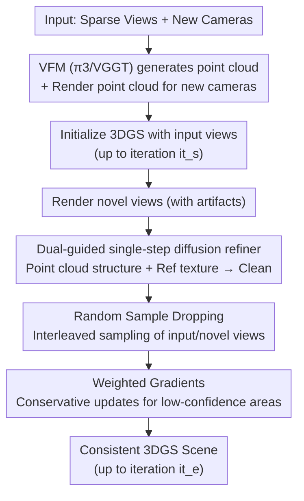

# S2D: Sparse to Dense Lifting for 3D Reconstruction with Minimal Inputs

**Conference**: CVPR 2026  
**Paper**: [CVF Open Access](https://openaccess.thecvf.com/content/CVPR2026/html/Ji_S2D_Sparse_to_Dense_Lifting_for_3D_Reconstruction_with_Minimal_CVPR_2026_paper.html)  
**Code**: https://george-attano.github.io/S2D (Project Page)  
**Area**: 3D Vision / 3D Gaussian Splatting / Sparse-view Reconstruction  
**Keywords**: 3DGS, Sparse-view Reconstruction, Single-step Diffusion, Artifact Removal, Point Cloud Guidance

## TL;DR
S2D bridges "sparse point clouds" and "3D Gaussian Splatting" (3DGS) representations: it utilizes a point-cloud-guided single-step diffusion refiner to clean artifacts in novel views rendered from sparse inputs, paired with a reconstruction strategy featuring random sample dropping and weighted gradients to stabilize optimization. This allows high-quality, 3D-consistent 3DGS reconstruction from minimal inputs (e.g., 1 image for $30^\circ$ coverage, $<10$ images for $180^\circ+$).

## Background & Motivation
**Background**: 3DGS has become a crucial explicit 3D representation for autonomous driving and embodied AI simulations due to its fast rendering and high quality. however, it suffers from a long-standing constraint—rendering quality degrades sharply when the viewpoint deviates from input poses. Maintaining low view-interpolation distances typically requires a large number of input images. In practice, dense inputs are difficult to ensure and computationally expensive, which hinders the practical deployment of 3DGS.

**Limitations of Prior Work**: To reduce input requirements, the community has explored three paths, all of which fail under the most demanding "extremely sparse" settings. ① **Feed-forward models** (pixelSplat, MVSplat, DepthSplat, etc.) directly predict Gaussian attributes but still produce significant artifacts in extremely sparse scenarios; ② **Generative novel view synthesis** (diffusion conditioned on extrinsic parameters or sparse points) fails to maintain 3D consistency and generation fidelity, is time-consuming, and lacks precise camera control for long sequences; ③ **Generative "refiners"** like DIFIX can remove novel view artifacts and support relatively sparse inputs, but they are built on the assumption of small view offsets and minor artifacts. Moreover, they ignore the gap between "novel view guidance" and "ground truth inputs," leading to severe 3D inconsistency during reconstruction—DIFIX fails completely under the sparse settings defined by S2D.

**Key Challenge**: Under sparse inputs, **novel view artifacts are massive** (DIFIX only fixes small artifacts), and there is an **inevitable bias between the refined "pseudo-GT" and the real inputs**. Indiscriminately trusting these refined results during optimization leads to overfitting on incorrect details and destroys 3D consistency; conversely, ignoring them and using only input views leads to underfitting and lack of coverage in extrapolated regions.

**Goal**: Decomposed into two sub-problems—① How to refine high-fidelity, cross-view consistent novel view guidance despite extreme artifacts? ② How to stably fit 3DGS under mixed supervision of "sparse inputs + dense refined guidance" without being misled by erroneous guidance?

**Key Insight**: The authors observe that the latest Vision Foundation Models (VFMs, such as VGGT, π3, MapAnything) can instantaneously perform dense point cloud reconstruction. Point clouds are naturally viewpoint-agnostic and structurally consistent—while point cloud rendering is not photo-realistic (containing aliasing and cumulative error noise), it serves perfectly as "structurally consistent guidance" to fill the gap left by DIFIX.

**Core Idea**: Use a **dual-guidance** scheme (point cloud rendering for structure + adjacent input views for texture) fed into a single-step diffusion refiner to clean extreme artifacts in sparse renderings. This is followed by a reconstruction strategy with random sample dropping and weighted gradients, ensuring the optimization receives sufficient supervision from input views while remaining conservative in regions with potentially incorrect refinement.

## Method

### Overall Architecture
S2D takes an arbitrary number of input views and new camera poses as input, outputting a consistent 3DGS scene with significantly expanded view coverage. The workflow consists of: first using a VFM to generate a point cloud from input views and rendering that point cloud at new camera poses; initializing 3DGS on input views until sampling iteration $it_s$; then rendering all new cameras to obtain artifact-heavy novel view images. These are sent to the artifact refiner along with adjacent input views (texture reference) and corresponding point cloud renderings (structural reference) to produce clean novel views. Subsequently, optimization continues to the final iteration $it_e$ using mixed supervision of "input views + refined results," stabilized by random sample dropping and weighted gradients.

### Key Designs

**1. Dual-Guided Single-Step Diffusion Refiner: Point Cloud Structure + Reference Texture + Mixing Module**

Addressing the limitation that "DIFIX only fixes small artifacts and lacks structural guidance," the authors introduce dual-guidance into a single-step diffusion model. While DIFIX uses adjacent views as references primarily for texture guidance (fixing blur but failing on structural damage), point clouds are viewpoint-agnostic and structurally consistent, providing the necessary structural anchor. Since point cloud renderings contain aliasing and noise, a **Mixing Module** is designed: it extracts DINO and image features from the target view and point cloud guidance, merges them through projection layers, and uses cross-attention to lift them into a "Mixed Input Image" $I_m$. This module specifically encourages the model to utilize valuable parts of the point cloud guidance. The refiner employs single-step diffusion (based on pix2pix-turbo, with the UNet initialized from SD-Turbo and VAE from DIFIX): $I_m$ and reference image $I_r$ are encoded into $[z^m, z^r]$ via VAE. A multi-view temporal-conditioned UNet predicts noise $[Z^m, Z^r] = \epsilon_\theta([z^m, z^r], t_d)$ at a fixed timestep $t_d$. $Z^r$ is discarded, and a single-step denoising on $z^m$ yields $z^d$, which is decoded into the refined image $I^{\text{fix}} = \mathcal{D}(z^d)$. Training only tunes the Mixing Module and LoRA adapters on the VAE/UNet. The loss function replaces the CLIP loss with DINO feature cosine similarity and adds SSIM: $\mathcal{L} = 0.2\mathcal{L}_{\text{LPIPS}} + 0.4\mathcal{L}_2 + 0.25\mathcal{L}_{\text{SSIM}} + \mathcal{L}_{\text{GAN}} + \mathcal{L}_{\text{DINO}}$. Ablations show that directly concatenating point clouds, references, and artifact images into the UNet (without the Mixing Module) causes the model to ignore the point cloud; placing the Mixing Module after the VAE to operate on latents results in over-smoothing.

**2. Random Sample Dropping: Interleaved Input/Novel Views**

Addressing the issue where "input supervision is overwhelmed by a large number of novel views (e.g., 6 inputs vs. 300 novel views)," if unmanaged, details like textures and small text are averaged out by novel view guidance (a common trait of generative methods). The authors utilize a probabilistic sampling strategy to interleave the two types of views uniformly in the training sequence, aiming for an input view proportion $\frac{|S_{\text{ref}}|}{|S_{\text{novel}}| + |S_{\text{ref}}|} = \alpha$. During training, each sampled view is discarded with probability $P^{\text{drop}}$: if $s_i \in V_{\text{ref}}$, then $1 - \min(1, \frac{\alpha}{r_i})$; if $s_i \in V_{\text{novel}}$, then $1 - \min(1, \frac{1-\alpha}{1-r_i})$, where $r_i$ is the current proportion of input views in the sequence. This stably controls the ratio of guidance types while providing continuous and sufficient supervision from input views. Experiments on DL3DV scanned $\alpha$ (0 = drop all inputs, 1 = drop all novel views), ultimately using $\alpha = 0.7$.

**3. Weighted Gradients: Conservative Updates for Low-Confidence Refinement Regions**

Addressing the bias between refinement results and ground truth under severe artifacts, previous methods either ignore this or use a global small weight for novel views (still leading to overfitting on errors). The authors implement pixel-level weights $W \in [0,1]^{H \times W}$ based on a confidence mask $M^{\text{conf}}$ derived from point cloud rendering. For novel views, $W_i(x,y) = \beta + (1-\beta)M^{\text{conf}}_i(x,y)$; for input views, the weight is constant at 1. The confidence mask $M^{\text{conf}}_v(x,y) = \mathbb{I}((x,y) \in \mathcal{P})$ indicates whether a pixel is covered by the point cloud projection. Regions with point cloud coverage are trusted (high weight), while regions with massive artifacts but no point cloud coverage receive low weights (conservative updates). For a splatted Gaussian $g_i$, the gradient is weighted as $\nabla_i\mathcal{L} = \frac{1}{|P_i|}\sum_{x,y\in P_i}W_i(x,y)\frac{\partial\mathcal{L}}{\partial G_i(x,y)}$. This prevents the optimization from being dominated by erroneous guidance, which could cause Gaussian model oscillations or failure. $\beta=1$ represents no weighting; the actual value used is $\beta=0.4$ to balance artifact suppression and overall quality.

## Key Experimental Results

### Main Results
Comprehensive evaluation across indoor, outdoor, and driving scenes. Structural quality is measured by PSNR/SSIM, and perceptual quality by LPIPS/FID. In-the-wild evaluations used 1 image for frontal scenes (3DOVS) and 6 images otherwise.

| Dataset @ Input | Metric | S2D | DIFIX | Gain |
|-----------------|--------|-----|-------|------|
| 3DOVS @ 1-view | PSNR↑ | **21.41** | 14.10 | +7.31 |
| 3DOVS @ 1-view | LPIPS↓ | **0.27** | 0.56 | −0.29 |
| RE10K @ 2-view | PSNR↑ | **27.62** | 26.11 | +1.51 |
| MIP360 @ 6-view | PSNR↑ | **20.97** | 19.43 | +1.54 |
| DL3DV @ 6-view | PSNR↑ | **23.2** | 20.4 | +2.8 |
| DL3DV @ 6-view | FID↓ | **41.2** | 55.3 | −14.1 |

Under extremely sparse settings, traditional methods (3DGS, Mip-Splatting) and feed-forward SOTA (DepthSplat, AnySplat) significantly degrade. Generative methods (SEVA) maintain perceptual quality but fail to preserve precise camera control over long sequences. S2D leads across all four in-the-wild datasets, with the most significant advantage seen in 1-view input (3DOVS), where PSNR is 7 points higher than DIFIX.

Leading performance is also observed in driving scenes (Waymo):

| Method | Interp PSNR↑ | Interp LPIPS↓ | Lane Change 2m FID↓ | Lane Change 3m FID↓ | Elevation 1.5m FID↓ |
|--------|--------------|---------------|---------------------|---------------------|---------------------|
| StreetCrafter | 29.31 | 0.10 | 57.4 | 66.4 | 59.0 |
| DIFIX | 30.26 | 0.11 | 60.2 | 71.6 | 60.3 |
| S2D (Ours) | **31.44** | **0.07** | **46.1** | **53.9** | **41.3** |

Note: Lane change/elevation are extrapolated trajectories (no GT), measured by FID. DIFIX's lane change FID is actually higher than StreetCrafter (trained for driving video generation), while S2D excels in both interpolation and extrapolation.

### Ablation Study

| # | Configuration | PSNR↑ | LPIPS↓ | Note |
|---|---------------|-------|--------|------|
| ① | PC generation only (no ref mixing) | 12.7 | 0.71 | Denoising cannot recover accurate background |
| ② | Mixing module after VAE (on latents) | 15.6 | 0.49 | Results are over-smoothed, drifting from source space |
| ③ | No Mixing module (DIFIX style concat) | 19.0 | 0.38 | Model ignores PC, uses only other images |
| ④ | Dual guidance w/o DINO | 22.1 | 0.27 | Attention is less balanced |
| ⑤ | Dual guidance w/ DINO (Full) | **23.0** | **0.26** | DINO guidance helps balance attention |

### Key Findings
- **The Mixing Module is key to utilizing point cloud guidance**: Removing it (③, 19.0 PSNR) causes the model to ignore the point cloud and use only texture references—early loss is dominated by overall image quality, overshadowing the detail/structural guidance of the PC. Adding DINO features (④→⑤) helps balance attention during mixing, though the gain is moderate (+0.9 PSNR).
- **Mixing must occur at the pixel/image level, not the latent level**: Operating on latents after the VAE (②) causes the target to drift from the original space defined by the denoising backbone, resulting in over-smoothing (only 15.6 PSNR).
- **Random Sample Dropping preserves detail, Weighted Gradients handle large artifacts**: Visualizations show that without RSD, textures/small text are averaged out by novel view guidance. Weighted Gradients prevent "permanent incorrect updates" in areas where PC guidance is missing but artifacts are large.

## Highlights & Insights
- **Completing the "Structural Consistency" puzzle with point clouds**: DIFIX lacks structural guidance and cannot fix massive artifacts. S2D leverages the viewpoint-agnostic and structural consistency of point clouds from VFMs as structural anchors—offering a clean paradigm for adding structural constraints to generative refinement in the foundation model era.
- **Efficiency trade-off with Single-Step Diffusion + LoRA**: The refiner uses pix2pix-turbo for single-step denoising, allowing it to run on a single RTX 4090. This avoids the high latency of video diffusion distillation, making it more practical for deployment.
- **Weighted gradient confidence masks are defined by point cloud coverage**, requiring zero additional networks and reusing existing renders—an efficient reliability signal that can be transferred to any optimization problem with partial structural guidance.
- **Plug-and-play**: S2D does not require a fixed number of inputs and supports any input density. it can be integrated with most 3DGS methods to drastically reduce their input requirements.

## Limitations & Future Work
- High training cost: Pairwise data curation took 850 H200 GPU hours, and the refiner took 60 hours on 8 H200s—while inference is cheap, the barrier to retraining the refiner is high. ⚠️
- Refinement quality is limited by VFM point cloud quality: Point clouds have aliasing/noise; if the VFM (π3/VGGT) fails to reconstruct a scene, the structural guidance becomes distorted, and weighted gradients can only conservatively skip updates rather than correct them.
- Purely generative comparison methods do not support precise camera control for long sequences; therefore, some structural metrics (PSNR/SSIM) were not compared against them, focusing instead on perceptual metrics (LPIPS/FID)—note this caveat in evaluation. ⚠️
- Hyperparameters $\alpha=0.7$ and $\beta=0.4$ were tuned on DL3DV; whether they require retuning across diverse scenes (driving vs. indoor 360°) is not fully explored.
- The method remains focused on static/quasi-static scenes; handling dynamic objects (moving vehicles/pedestrians in driving scenes) is not discussed in detail.

## Related Work & Insights
- **vs. DIFIX/DIFIX3D+ (Generative Artifact Refiner)**: DIFIX relies on neighboring views for texture guidance only and is built for small view offsets. S2D adds point cloud structural guidance, a mixing module, and reconstruction strategies to push the limit to 1-view ($30^\circ$) or 6-views ($180^\circ+$), outperforming DIFIX by 7 PSNR points on 3DOVS@1-view.
- **vs. Feed-forward 3DGS (pixelSplat / MVSplat / DepthSplat)**: These directly predict Gaussian attributes but lack explicit 3D supervision, resulting in artifacts and limited generalization under extreme sparsity. S2D follows a "reconstruct then refine + robust fit" route, proving more robust to extreme inputs.
- **vs. VFM Point Cloud Reconstruction (VGGT / π3 / MapAnything)**: S2D does not use VFMs for direct photo-realistic synthesis (as PC renders are noisy). Instead, it uses them as consistent structural guidance for a refiner—a way of using foundation models as middleware rather than endpoints.
- **vs. Driving Video Generation Distillation (StreetCrafter)**: StreetCrafter uses driving video models for new trajectories, but lane change FID remains high. S2D is superior in both interpolation and extrapolation (lane changes/elevation) without being dependent on domain-specific video models.

## Rating
- Novelty: ⭐⭐⭐⭐ The combination of dual-guidance, mixing module, and weighted gradients is novel, though individual components like single-step diffusion and LoRA are based on existing work.
- Experimental Thoroughness: ⭐⭐⭐⭐⭐ Covers indoor, outdoor, and driving scenes with multiple input densities, solid ablations, and hyperparameter scans. Competitors include feed-forward, generative, and refinement models.
- Writing Quality: ⭐⭐⭐⭐ Clear motivation and pain-point analysis; some notation (denoising step $z^d$ coefficients) is slightly cluttered and requires cross-referencing with the text.
- Value: ⭐⭐⭐⭐⭐ Significantly reduces 3DGS input requirements in a plug-and-play manner, offering high value for real-world autonomous driving and embodied AI.

<!-- RELATED:START -->

## Related Papers

- [\[CVPR 2026\] Unblur-SLAM: Dense Neural SLAM for Blurry Inputs](unblur-slam_dense_neural_slam_for_blurry_inputs.md)
- [\[CVPR 2026\] Generalizable Sparse-View 3D Reconstruction from Unconstrained Images](generalizable_sparse-view_3d_reconstruction_from_unconstrained_images.md)
- [\[CVPR 2026\] Dense Metric Depth Completion from Sparse Direct Time-of-Flight Sensors](dense_metric_depth_completion_from_sparse_direct_time-of-flight_sensors.md)
- [\[CVPR 2026\] Minimal Constraint Relaxation for Multiview Autocalibration](minimal_constraint_relaxation_for_multiview_autocalibration.md)
- [\[CVPR 2026\] MotionCrafter: Dense Geometry and Motion Reconstruction with a 4D VAE](motioncrafter_dense_geometry_and_motion_reconstruction_with_a_4d_vae.md)

<!-- RELATED:END -->
