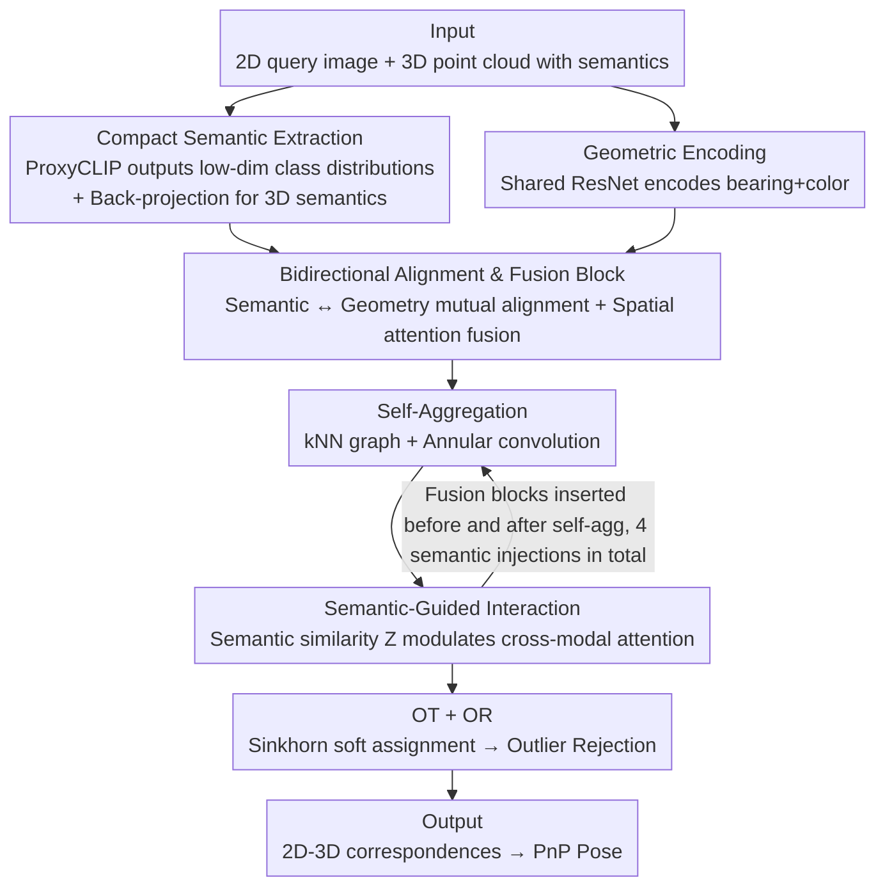

# SAG-GNN: Semantic-Aware Guided GNN for Descriptor-Free 2D-3D Matching

**Conference**: CVPR 2026  
**Paper**: [CVF Open Access](https://openaccess.thecvf.com/content/CVPR2026/html/Zhang_SAG-GNN_Semantic-Aware_Guided_GNN_for_Descriptor-Free_2D-3D_Matching_CVPR_2026_paper.html)  
**Code**: https://github.com/tinxu0203/SAG-GNN  
**Area**: 3D Vision  
**Keywords**: 2D-3D matching, visual localization, descriptor-free matching, semantic priors, graph neural network

## TL;DR
SAG-GNN injects "low-dimensional semantic probability distributions" obtained from open-vocabulary semantic segmentation as an extra prior into descriptor-free 2D-3D matching. It uses a bidirectional alignment and fusion block to co-calibrate semantic and geometric features, and modulates cross-modal attention using semantic similarity. Without increasing storage costs, this approach significantly improves matching and localization accuracy on MegaDepth / Cambridge (reducing pose error by approximately 50% compared to A2-GNN).

## Background & Motivation
**Background**: 2D-3D matching establishes correspondences between keypoints of a query image and 3D points of a scene point cloud for 6-DoF camera pose estimation, acting as a core component of visual localization, SLAM, AR, and robot navigation. Two main paradigms exist: first, **scene coordinate regression**, which directly regresses 3D coordinates from pixels to achieve high accuracy but requires scene-specific retraining and possesses poor generalization; second, **descriptor-based matching**, which stores a set of 2D descriptors for each 3D point and matches them in the feature space using nearest neighbors, offering high accuracy but suffering from high storage and maintenance costs, limiting large-scale deployment.

**Limitations of Prior Work**: To bypass the storage burden, **descriptor-free** methods have emerged. These methods extract features using only low-level geometric cues (such as color and coordinates) as graph nodes, capture context via GNNs + attention, and refine matching through optimal transport and outlier rejection. However, relying solely on low-level geometry makes cross-modal 2D-3D interaction difficult. In complex scenes with dynamic objects (e.g., pedestrians, vehicles, which do not exist in the point cloud), weak textures, or symmetrical structures, regions with similar geometry but different semantics are prone to mismatching, causing severe performance degradation. Figure 1 in the paper illustrates that A2-GNN fails entirely in such scenarios.

**Key Challenge**: Low-level geometric cues are inherently **insufficient and ambiguous**—geometric similarity does not equate to semantic consistency. Furthermore, high-level "semantic" information cannot be stored as high-dimensional vectors (such as descriptors) without defeating the original purpose of storage savings in descriptor-free methods.

**Goal**: Introduce high-level semantics into descriptor-free 2D-3D matching while simultaneously addressing three sub-problems: (1) how to stably extract semantics from 2D images and sparse SfM point clouds while remaining storage-efficient; (2) how to complement and fuse semantics and geometry without suppressing each other; (3) how to make semantics genuinely guide cross-modal information interaction.

**Key Insight**: Semantics serve as a **naturally shared high-level representation** between images and point clouds, capable of resolving low-level ambiguities, bridging modal gaps, and providing context in weak-texture regions. The authors leverage semantics as a "guide" for matching, but insist on using compact **class probability distributions** rather than high-dimensional CLIP embeddings to carry them.

**Core Idea**: Inject semantic priors into descriptor-free matching using a combination of "low-dimensional semantic probability distributions + bidirectional alignment and fusion + semantic-guided attention." This achieves significant gains in accuracy and robustness while adding virtually zero storage overhead.

## Method

### Overall Architecture
The inputs are a 2D query image (keypoint set $A$) and a 3D point cloud with semantic labels ($B$). Each 2D point is represented as a bearing vector + color + semantic distribution $a_i=[v_i,c_i,s_i]$, and 3D points are similarly represented as $b_j=[v_j,c_j,s_j]$ (bearing vectors replace raw coordinates to eliminate camera intrinsic and modality differences). The pipeline is structured in four steps: ① **Dual-Branch Encoding**—the semantic branch uses a frozen ProxyCLIP to extract compact class distributions, while the geometric branch leverages a shared ResNet encoder to map bearings + colors to geometric features; ② **Bidirectional Alignment and Fusion Block**—aligns and adaptively fuses semantics and geometry to obtain a balanced fusion feature; ③ **Semantic-Structure Interaction**—constructs a GNN on the fusion features to alternate between intra-modal self-aggregation (kNN graph + annular convolution) and cross-modal semantic-guided interaction (using semantic similarity to modulate attention); ④ **Matching Output**—calculates soft assignments via Sinkhorn Optimal Transport (OT), establishes mutual nearest neighbors, and outputs the final match $M_{\text{final}}$ after filtering through a lightweight Outlier Rejection (OR) network. The fusion blocks are inserted before and after each self-aggregation step (totaling 4 semantic injections) to progressively fuse semantics into the features.

### Key Designs

**1. Compact Semantic Extraction: Representing semantics via low-dimensional class probability distributions and resolving sparse point cloud semantics via back-projection**

The lifespan of a descriptor-free method is its storage efficiency, meaning semantics cannot be directly represented by 512-dimensional CLIP embeddings. The authors employ ProxyCLIP from **Open-Vocabulary Semantic Segmentation (OVSS)** (which is training-free, relies on CLIP's vision-language aligned space, and offers more accurate spatial localization) to generate a $\frac{H}{8}\times\frac{W}{8}$ semantic map for the query image. Bilinear interpolation is then performed at the keypoint coordinates to obtain the 2D semantic feature $S_A=\mathcal{I}(F_{\text{proxy}}(I_{\text{query}}),u_i)\in\mathbb{R}^{N\times l}$, where $l$ is chosen as only 16 (representing common outdoor classes such as dome, sky, bridge, person, vehicle, wall, statue, etc.). Consequently, the semantics of each point are represented by a mere 16-dimensional probability distribution, requiring negligible storage while keeping class-level discriminative info.

The 3D counterpart is more challenging: off-the-shelf 3D CLIP segmentation models are mostly trained on dense indoor scans or outdoor LiDAR data, causing them to fail on sparse and noisy SfM reconstruction point clouds (e.g., MegaDepth). The authors address this via **back-projection**—instead of extracting semantics directly on the sparse point cloud, they project the semantic labels of 2D keypoints from database images (which were used for SfM reconstruction) back to their corresponding 3D points based on the visibility relationships, yielding $S_B\in\mathbb{R}^{M\times l}$. This ensures that 3D point semantics and query image semantics originate from the exact same 2D extraction pipeline, achieving natural consistency while avoiding the unreliability of direct semantic extraction on sparse point clouds.

**2. Bidirectional Alignment and Fusion Block: Co-calibrating semantics and geometry rather than making one accommodate the other**

Directly concatenating semantics and geometry in a **unidirectional fusion** works for pure 2D tasks, but in 2D-3D matching, it is heavily amplified into a "semantic-geometric domain bias" due to modality differences—leading the network to favor one domain over the other, causing feature imbalance and information loss. The authors design a **bidirectional alignment** block: its core is a cross-domain channel-wise cross-correlation matrix. By swapping the roles of query/key/value, two complementary intermediate features are constructed—one uses geometry as the query and semantics as the key/value to inject semantics into geometry ($F^\kappa_{gs}$); the other does the reverse to inject geometric details into semantics ($F^\kappa_{sg}$):

$$F^\kappa_{gs}=\text{Attn}_1(F^\kappa_{geo},F^\kappa_{sem}),\quad F^\kappa_{sg}=\text{Attn}_1(F^\kappa_{sem},F^\kappa_{geo})$$

Where $\text{Attn}_1$ utilizes a channel attention mechanism $A_c=\text{Softmax}((q^\top k)/\alpha)$, and writes back via a residual block + FFN as $F^\kappa_{gs}=F^\kappa_{geo}+\text{FFN}(F^\kappa_{geo}\,\|\,vA_c)$ ($\alpha$ is learnable). After obtaining the two complementary intermediate states, a second-stage **spatial attention** $\text{Attn}_2$ adaptively fuses them along the spatial dimension to yield $F^\kappa_{\text{fusion}}=\text{Attn}_2(F^\kappa_{gs},F^\kappa_{sg})$, highlighting key regions. Thus, semantics and geometry align by "guiding each other," complementing semantic context without losing local geometric details, producing a more balanced and consistent representation. Replacing this with two unidirectional blocks (for a fair comparison in the ablation study) yields significantly worse results, illustrating the necessity of the bidirectional design in cross-modal matching.

**3. Semantic-Guided Interaction: Modulating cross-modal attention via class similarity to prioritize semantically consistent matches**

During the GNN stage, intra-modal self-aggregation is performed first by constructing a kNN graph and using cosine-based annular convolution to capture local geometric and angular relations: $\hat F^\kappa=G_{\text{feat}}(F^\kappa_{\text{fusion}})+G_{\text{ang}}(F^\kappa_{\text{fusion}})$. In the cross-modal phase, standard attention only considers geometric similarity, which easily leads to mismatching in regions that are "geometrically similar but semantically different." To prevent this, the authors first compute a cross-modal **semantic similarity matrix** $Z=S_A(S_B)^\top$, and use it to modulate the attention scores:

$$A_w=\text{Softmax}\!\left(\frac{(\hat F^A W_q)(\hat F^B W_k)^\top\cdot Z\cdot\beta}{\sqrt{d}}\right)$$

Here, $\beta$ is a learnable parameter that controls the smoothness of the attention. Aligning pairs with high semantic consistency (large $Z$) are amplified, whereas semantically conflicting pairs are suppressed. The representations are updated via residual + FFN: $\tilde F^A=\hat F^A+\text{FFN}(\hat F^A\,\|\,A_w(\hat F^B W_v))$. Crucially, this approach **retains all candidate nodes** for interaction and merely weights them according to semantic similarity (rather than hard-filtering them). This preserves "uncertain but potentially valid" matches while boosting robustness—explaining why the model suppresses mismatches in scenes with dynamic distractors like pedestrians or vehicles, yet achieves precise geometric matching in semantically coherent areas like symmetric sculptures.

### Loss & Training
The training target is a combined loss of matching and classification: $L=L_{\text{match}}+L_{\text{cls}}$. The matching loss applies cross-entropy supervision to the soft assignment matrix $P$ output by OT, supervised by a ground-truth binary matrix $Y$ (including a dustbin row/column for unmatched points) derived from reprojection: $L_{\text{match}}=-\frac{1}{\sum Y_{ij}}\sum_{i,j}Y_{ij}\log P_{ij}$. The classification loss supervises the inlier confidence $R$ of the outlier rejection network, utilizing binary labels $\tilde Y$ obtained from the initial match $M_{\text{init}}$ and balanced via sample weights $w_i$. Pragmatically, $l=16$ semantic classes are used, with alternating self-cross-self attention layers. Optimized with Adam, batch size of 16, and a learning rate of 0.001, the network converges in about 24 hours (75 epochs) on 4 RTX 3090 GPUs using only the MegaDepth dataset (with SIFT keypoints).

## Key Experimental Results

### Main Results
Evaluating descriptor-free 2D-3D matching on MegaDepth (top-k image retrieval with k=1 / k=10). Metrics include reprojection AUC (@1/5/10px, higher is better) and the 75th percentile of rotation/translation errors (lower is better).

| Setting | Method | Reproj AUC@1/5/10px ↑ | Translation @75% (m) ↓ |
|------|------|-----------------------|------------------|
| k=1 | A2-GNN | 12.72 / 41.84 / 48.02 | 2.80 |
| k=1 | **SAG-GNN** | **16.35 / 53.16 / 60.56** | **0.94** |
| k=10 | A2-GNN | 17.29 / 54.41 / 62.24 | 0.48 |
| k=10 | **SAG-GNN** | **21.02 / 65.81 / 74.20** | **0.05** |

Compared to the runner-up A2-GNN, SAG-GNN takes a comprehensive lead across all settings, reducing camera pose error by approximately **50%**. On visual localization (Table 3), the average pose error on Cambridge Landmarks drops from A2-GNN's 39.6cm/1.47° to **18.6cm/0.69°**, substantially narrowing the gap with descriptor-based methods; on 7Scenes, it performs on par with state-of-the-art descriptor-free methods. In terms of storage, by relying only on 16-dimensional semantic distributions, SAG-GNN requires an order of magnitude less storage than descriptor-based methods (e.g., SP+SG's 22,977MB on 7Scenes). In terms of runtime (Table 2, top-10), the total latency is 712ms, with 326.7ms for semantic encoding and 385.3ms for matching—comparable to other advanced methods.

### Ablation Study
Disassembling components on MegaDepth (k=1) (selected from Table 4, metrics: Reproj AUC@1/5/10px):

| Config | Fusion | Semantic Guidance | AUC@1/5/10px | Description |
|------|------|----------|--------------|------|
| Baseline | ✗ | ✗ | 12.72 / 41.84 / 48.02 | Descriptor-free baseline without semantics |
| (a) | ✗ | Hard | 13.36 / 43.86 / 50.33 | Naive hard attention for semantics, minimal gain |
| (d) | Bidirectional | ✗ | 14.37 / 46.69 / 53.23 | Fusion only, no semantic-guided interaction |
| (e) | ✗ | ✓ | 13.35 / 44.11 / 50.49 | Semantic guidance only, no fusion block |
| (f) | Unidirectional×2 | ✓ | 16.01 / 51.81 / 58.95 | Swapping bidirectional with two unidirectional blocks (fair comparison) |
| **SAG-GNN** | **Bidirectional** | **✓** | **16.35 / 53.16 / 60.56** | Full model |

### Key Findings
- **Naive semantic integration is ineffective**: Directly applying hard attention, as in OmniGlue (Config a), results only in marginal improvements. This indicates that semantics must be properly "aligned + modulated"; naive injection fails in 2D-3D scenarios.
- **Both the fusion block and semantic guidance are crucial and complementary**: Omitting the fusion block (e) or semantic guidance (d) results in severe performance drops; the optimal performance is achieved only when both are coupled.
- **Bidirectional > Unidirectional**: Swapping bidirectional fusion with two unidirectional blocks (f) under fair parameter counts still lags behind the full model, verifying that "mutual alignment" is superior to "unidirectional adaptation" in cross-modal matching.
- **Strong Generalization**: Despite being trained solely on MegaDepth (SIFT keypoints, fixed 16 semantic classes), the model directly generalizes to Cambridge Landmarks with SuperPoint keypoints and different semantic labels, outperforming all other descriptor-free methods. This suggests high adaptability to various keypoint detectors and semantic category sets.
- **Outlier Robustness**: Displays the most stable AUC curve under different outlier ratios, showing excellent robustness in noisy scenes.

## Highlights & Insights
- **Using class probability distributions instead of high-dimensional embeddings** represents a smart compromise that injects "semantic priors" into descriptor-free frameworks without damaging their core storage-saving philosophy. The 16-dimensional distribution introduces virtually no storage overhead while retaining highly discriminative power—a trade-off highly transferable to other storage-sensitive matching/retrieval tasks.
- **Back-projection solves the semantic extraction bottleneck for sparse point clouds**: Rather than trying to train a 3D model capable of segmenting noisy SfM point clouds, projecting the 2D keypoint semantics of database images back to their corresponding 3D points via visibility relations is both accurate and naturally aligned with the query side.
- **"Retaining all candidate nodes and weighting them via semantic similarity" instead of hard filtering** prevents the accidental loss of "uncertain but potentially correct" matches. This is a fundamental reason for its high recall in scenes with dynamic objects; this soft modulation concept is widely applicable to any cross-modal attention design.
- The most elegant detail is directly multiplying the semantic similarity matrix $Z=S_A S_B^\top$ into the attention logits—injecting high-level priors into a purely geometric attention framework via an extremely cheap class similarity lookup.

## Limitations & Future Work
- **Extra overhead from semantic encoding**: At top-10 retrieval, semantic encoding accounts for 326.7ms, doubling the total latency to 712ms, which remains a bottleneck for real-time localization. While comparable to existing state-of-the-art runtimes, the absolute latency is still high.
- **Reliance on OVSS quality and category lists**: The semantic prior depends entirely on ProxyCLIP's open-vocabulary segmentation. If the segmentation fails (e.g., under extreme lighting or weak texture), errors propagate to the 3D points via back-projection. Additionally, the 16 outdoor classes were hand-selected and would require redesigning if applied to significantly different environments.
- **3D semantics rely on database image visibility**: Back-projection requires corresponding 2D keypoints during SfM reconstruction, making it non-directly applicable to pure LiDAR or non-image-sourced point clouds.
- **Single training dataset**: The model was only trained on MegaDepth. Although showing cross-dataset generalization, it only performs on par with existing methods on the indoor 7Scenes dataset with limited indoor gains.

## Related Work & Insights
- **vs A2-GNN**: A2-GNN uses annular convolutions with a streamlined design, relying purely on geometry for robustness. SAG-GNN inherits this GNN and annular convolution backbone, but injects semantic priors with bidirectional fusion + semantic modulation, reducing pose errors by ~50% at the cost of additional semantic encoding overhead.
- **vs DGC-GNN**: DGC-GNN incorporates color and angular cues within a hierarchical framework to enrich geometric features, still following a pure-geometry path. SAG-GNN introduces an orthogonal "high-level semantic" dimension, offering stronger complementarity.
- **vs GoMatch**: GoMatch is inspired by SuperGlue, using alternating attention + OT, but is constrained by sparse geometric cues. SAG-GNN modulates attention via semantic similarity during the interaction phase, mitigating geometric ambiguity.
- **vs descriptor-based (SP+SG / AS)**: Descriptor-based methods yield excellent accuracy but suffer from massive storage footprints (GB level). SAG-GNN significantly bridges the accuracy gap with these methods while operating at a fraction of their storage size, making it much more suitable for large-scale deployment.

## Rating
- Novelty: ⭐⭐⭐⭐ First to systematically inject open-vocabulary semantic priors into descriptor-free 2D-3D matching through compact distributions, with self-consistent fusion and modulation designs.
- Experimental Thoroughness: ⭐⭐⭐⭐ Validated across matching, localization, generalization, outlier robustness, and ablation studies, though indoor improvement is limited and training on additional datasets is lacking.
- Writing Quality: ⭐⭐⭐⭐ The link between motivation, pain points, and design is clear, and the formulas integrate well with Figures 1, 2, and 3.
- Value: ⭐⭐⭐⭐ Offers a highly practical compromise between low storage and high accuracy, which is highly valuable for the engineering and deployment of visual localization.

<!-- RELATED:START -->

## Related Papers

- [\[CVPR 2026\] Unlocking 3D Affordance Segmentation with 2D Semantic Knowledge](unlocking_3d_affordance_segmentation_with_2d_semantic_knowledge.md)
- [\[CVPR 2026\] FreeScale: Scaling 3D Scenes via Certainty-Aware Free-View Generation](freescale_scaling_3d_scenes.md)
- [\[CVPR 2026\] EV-CGNet: Co-visible Focused 3D-guided 2D Event Keypoint Detection Network](ev-cgnet_co-visible_focused_3d-guided_2d_event_keypoint_detection_network.md)
- [\[CVPR 2026\] Registration-Free Learnable Multi-View Capture of Faces in Dense Semantic Correspondence](registration-free_learnable_multi-view_capture_of_faces_in_dense_semantic_corres.md)
- [\[CVPR 2026\] SemLT3D: Semantic-Guided Expert Distillation for Camera-only Long-Tailed 3D Object Detection](semlt3d_semantic-guided_expert_distillation_for_camera-only_long-tailed_3d_objec.md)

<!-- RELATED:END -->
