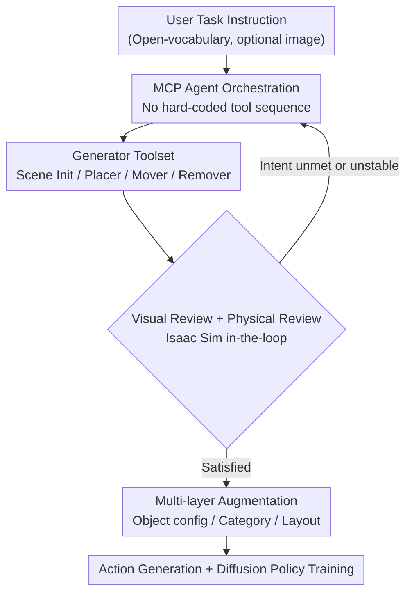

# SAGE: Scalable Agentic 3D Scene Generation for Embodied AI

**Conference**: CVPR 2026  
**Paper**: [CVF Open Access](https://openaccess.thecvf.com/content/CVPR2026/html/Xia_SAGE_Scalable_Agentic_3D_Scene_Generation_for_Embodied_AI_CVPR_2026_paper.html)  
**Code**: Project Page (The paper claims open-source Code/demo/SAGE-10k dataset)  
**Area**: 3D Vision  
**Keywords**: Agentic Generation, 3D Scene Synthesis, Embodied AI, Simulation-Ready, Self-Correction

## TL;DR
SAGE formalizes 3D indoor scene generation as an agent operating under the MCP protocol. It invokes layout/asset generators on demand and employs a closed-loop self-correction mechanism via "Visual Review + Physical Review (Isaac Sim in-the-loop verification)." It produces physically stable, open-vocabulary scenes that can be directly imported into simulators for robot policy training, scaled through multi-layer augmentation.

## Background & Motivation

**Background**: Embodied AI suffers from a severe data shortage—real-world data collection is slow, expensive, and unsafe. Simulation serves as a natural alternative, but simulation data must simultaneously satisfy four requirements: realism, diversity, simulation-readiness, and task relevance. Existing 3D scene generation approaches generally fall into four categories: procedural systems (ProcTHOR, Infinigen), data-driven methods (ATISS, DiffuScene), foundation model pipelines (LayoutGPT, Holodeck), and emerging agentic methods (SceneWeaver).

**Limitations of Prior Work**: Procedural systems are physically sound but comprise closed vocabularies and lack diversity. Data-driven methods are constrained by scarce 3D training data, failing to generalize to new floor plans or open-vocabulary prompts. Foundation model pipelines can generate from text but lack 3D grounding, often producing physically invalid scenes (floating or intersecting objects). Crucially, these systems are "static"—their "computation graphs" are hard-coded, preventing adaptive reasoning and self-correction.

**Key Challenge**: A gap exists between "semantically reasonable" scene generation and "simulation-ready" deployment. Even concurrent agentic works like SceneWeaver fail to yield outputs that can be directly deployed in robot simulators because they lack physical attributes and do not include the simulator in the generation loop for verification. The root cause is the absence of a mechanism to continuously verify "whether the scene remains stable under gravity and collision" during the generation process.

**Goal**: Given an open-ended robot task description (e.g., "pick up the bowl and place it on the table"), automatically generate 3D environments that are simulation-deployable, physically stable, and scalable, and subsequently synthesize action data to train policies.

**Key Insight**: Reframe scene generation from a "fixed pipeline" into a closed loop of "Agent + Tools + Review." The hypothesis is that by enabling an agent to freely orchestrate generators and receive feedback from physical verification, it can perform trial-and-error like a human, converging on results that are both realistic and simulation-ready.

**Core Idea**: Utilize an MCP agent to orchestrate multiple generators, coupled with dual feedback from "Visual Review + Physical Review (Sim-in-the-loop)." This allows scenes to self-improve until they satisfy user intent and physical validity, followed by multi-layer augmentation to expand a single scene into a large-scale dataset for training policies.

## Method

### Overall Architecture
The input to SAGE is a natural language robot task requirement, and the output is a batch of physically stable 3D scenes and accompanying action data ready for Isaac Sim. The pipeline consists of two stages: **Agent-driven single scene generation**, where the agent acts as an MCP client invoking generator tools to build/edit scenes and iteratively corrects them based on visual and physical review feedback; and **Scaling for Embodied AI**, which applies multi-layer augmentation to a generated scene to create mission-consistent variants, followed by automated action generation for imitation learning via Diffusion Policy.

The pipeline lacks a hard-coded tool sequence: at each step, the agent issues structured MCP requests based on current needs (e.g., generate floor, add assets, verify stability), the server executes and returns results as feedback, and the agent decides the next action until the scene is judged both visually realistic and physically stable.

### Key Designs

**1. MCP Agent Orchestration: Replacing hard-coded "computation graphs" with adaptive reasoning**

To address the bottleneck of static computation graphs in existing systems, SAGE operates under the Model Context Protocol (MCP). The agent is an MCP client, and each tool (layout generator, physical simulator, etc.) is hosted behind its own MCP server. Instead of following a preset order, the agent identifies the "required capability" at each iteration (e.g., generate floor plane / verify physical stability / remove an object), issues a structured request, and uses the returned result as feedback to decide the next step. This design ensures orchestration is entirely reasoning-driven, allowing the agent to flexibly "add then move, or swap for smaller objects if unstable," which is impossible for static pipelines.

**2. Generator Toolset: Four atomic editing operations + Asset-level physical property estimation**

The generators invoked by the agent are a set of modular atomic tools. The **Scene Initializer** receives scene specifications and generates an empty room (textures via MatFuse, dimensions predicted by LLM) along with an "object checklist" containing descriptions, estimated physical properties, and placement constraints (spatial relationships/bounds) reflecting the task. The **Asset Placer** uses TRELLIS for text-to-3D generation, utilizes VLM to estimate physical properties (height for scaling, mass for simulation, metallicity/roughness for PBR), and employs an LLM to categorize constraints (floor/wall/on-top) for placement via DFS and collision avoidance. The **Asset Mover** deletes and then replans using the Placer, while the **Asset Remover** locates and deletes objects via LLM reasoning.

**3. Visual Review + Physical Review: Sim-in-the-loop verification to prevent error accumulation**

Stacking generators can accumulate visual artifacts and physical violations. SAGE employs complementary reviews for closed-loop correction. The **Visual Review** inputs the current scene configuration and multi-view renders to suggest additions or adjustments. The **Physical Review** is the key differentiator: after any edit, the scene is loaded into Isaac Sim for a physical test. If an object's pose changes significantly (unstable) or results in collision, the placement is rejected. If no stable configuration is found, the failure is reported to the agent with suggestions for alternatives (e.g., smaller objects). This simulation-in-the-loop ensures near-perfect physical stability.

**4. Multi-layer Augmentation + Action Generation: Scaling single scenes into training data**

To train robust policies, SAGE introduces three layers of augmentation: **Object Configuration Level** resamples poses of task-relevant objects; **Object Category Level** uses LLM text augmentation for geometric/texture variations synthesized via TRELLIS; and **Scene Layout Level** regenerates background geometry and task-irrelevant objects for navigation tasks. Each step is verified by the physical reviewer. Automated action generation follows: **Grasping** uses M2T2 for pose candidates and Curobo for IK trajectories; **Mobile Manipulation** uses RRT for path planning. Failure samples are filtered via collision and verification checks before training with Diffusion Policy.

### Loss & Training
SAGE does not rely on end-to-end training for scene generation; instead, it orchestrates existing foundation models: GPT-oss-120b for agent reasoning, Qwen3-VL for visual-language reasoning, TRELLIS for 3D objects, MatFuse for textures, and Isaac Sim for physical verification. Downstream policies are trained using Diffusion Policy with multi-view RGB-D inputs and end-effector trajectories.

## Key Experimental Results

### Main Results
SAGE was tested across three indoor environments (Bedroom, Kitchen, Living Room). Metrics include Visual quality (Realism/Functionality/Layout/Completeness via GPT-4.1) and Physical metrics (Collision Rate Coll% and Stability Rate Stab%). Segmented results for Bedroom:

| Method | #Obj ↑ | Real. ↑ | Func. ↑ | Lay. ↑ | Comp. ↑ | Coll.% ↓ | Stab.% ↑ |
|------|--------|---------|---------|--------|---------|----------|----------|
| Holodeck | 28.5 | 7.4 | 6.8 | 5.0 | 6.1 | 29.1 | 51.0 |
| SceneWeaver | 17.5 | 9.0 | 9.7 | 7.8 | 7.5 | 31.0 | 58.8 |
| **SAGE (Ours)** | **48.3** | **9.0** | **10.0** | **8.0** | **9.5** | **2.3** | **99.8** |

Ours leads across all metrics: more objects, higher realism, and a collision rate drop from ~30% to 2.3%, with stability reaching ~99.8%. SAGE also demonstrates open-vocabulary capabilities, generating long-tail stylized scenes like Cyberpunk arcades or Starry bedrooms.

### Ablation Study
Ablation of the review modules (Tab. 3 key values):

| Configuration | Coll.% | Stab.% | Description |
|------|--------------|--------------|------|
| Generator only (No Review) | 7.8 | — | High error accumulation and physical violations |
| + Visual Review | — | — | Significant improvement in visual quality |
| + Physical Review | 1.9 | 99.6 | Drastic drop in collisions; stability maximized |
| + Dual Review (Full) | Best | Best | Optimal performance across all metrics |

### Key Findings
- **Physical Review is the determinant for physical stability**: Its inclusion reduces collisions from 7.8% to 1.9% and raises stability to 99.6%, making simulation deployment viable.
- **Visual Review governs semantic integrity**: It significantly improves realism and functionality by correcting missing or misplaced objects.
- **Synergy between reviews**: The combination of visual feedback and sim-in-the-loop verification is necessary to achieve optimal results.
- **Clear scaling trends in downstream policies**: Policy performance improves consistently with increased scene diversity and demonstrations, showing generalization to unseen layouts.

## Highlights & Insights
- **"Sim-in-the-loop" transforms "looking right" into "actually working"**: By embedding Isaac Sim directly into the generation loop to verify stability object-by-object, SAGE eliminates floating and intersecting objects at the root.
- **Unified orchestration via MCP**: Wrapping LLM/VLM/3D generators and simulators as MCP servers decouples the engineering stack, allowing for a flexible, reasoning-driven orchestration that static pipelines cannot match.
- **End-to-end data engine**: Seamlessly linking generation, augmentation, action synthesis, and policy training demonstrates that simulation-driven scaling is a viable paradigm for Embodied AI.
- **Open-vocabulary + Asset physical attributes**: Utilizing text-to-3D generation instead of retrieval allows for long-tail styles while simultaneously assigning physical properties like mass and PBR, fulfilling both diversity and deployability.

## Limitations & Future Work
- **Heavy dependency on foundation models/generators**: The upper bound of the pipeline is constrained by the performance of components like GPT, TRELLIS, and MatFuse, with high computational costs.
- **Computational overhead of sim-in-the-loop**: Invoking Isaac Sim for every edit during generation may result in high latency (not fully quantified in the paper).
- **Sim-to-real gap**: While stability is near-perfect in simulation, real-world robust deployment still requires further validation as simulation stability does not always equate to real-world interactability.
- **LLM-based evaluation**: Dependence on GPT-4.1 for scoring introduces subjectivity; consistent evaluation protocols are required for cross-method comparisons.

## Related Work & Insights
- **vs Holodeck**: Holodeck uses a fixed pipeline lacking self-improvement, resulting in fewer objects and frequent collisions. SAGE uses agentic orchestration and dual reviews to suppress collisions to 2.3%.
- **vs SceneWeaver (Concurrent Agentic Method)**: SceneWeaver accounts for collisions but lacks sim-in-the-loop verification and asset-level physical attributes. SAGE's core contribution is making Isaac Sim verification a default output property.
- **vs Procedural Systems (ProcTHOR/Infinigen)**: These systems are physically reliable but restricted by closed vocabularies; SAGE provides open-vocabulary support via 3D synthesis while maintaining physical validity.
- **vs Data-Driven (ATISS/DiffuScene)**: Data-driven methods have strong spatial priors but are limited by closed taxonomies and lack simulation-ready physical properties.

## Rating
- Novelty: ⭐⭐⭐⭐ Sim-in-the-loop as a default + MCP orchestration provides clear incremental value.
- Experimental Thoroughness: ⭐⭐⭐⭐ Comprehensive scene results and policy scaling, though sim-to-real and latency data are limited.
- Writing Quality: ⭐⭐⭐⭐ Clear logic across motivation, method, and experiments.
- Value: ⭐⭐⭐⭐⭐ Provides an end-to-end paradigm for simulation-driven scaling in Embodied AI.

<!-- RELATED:START -->

## Related Papers

- [\[CVPR 2026\] TGSFormer: Scalable Temporal Gaussian Splatting for Embodied Semantic Scene Completion](tgsformer_scalable_temporal_gaussian_splatting_for_embodied_semantic_scene_compl.md)
- [\[CVPR 2026\] Wanderland: Geometrically Grounded Simulation for Open-World Embodied AI](wanderland_geometrically_grounded_simulation_for_open-world_embodied_ai.md)
- [\[CVPR 2026\] EmbodMocap: In-the-Wild 4D Human-Scene Reconstruction for Embodied Agents](embodmocap_in-the-wild_4d_human-scene_reconstruction_for_embodied_agents.md)
- [\[ICLR 2026\] Scenethesis: A Language and Vision Agentic Framework for 3D Scene Generation](../../ICLR2026/3d_vision/scenethesis_a_language_and_vision_agentic_framework_for_3d_scene_generation.md)
- [\[CVPR 2026\] MANSION: Multi-floor Language-to-3D Scene Generation for Long-horizon Tasks](mansion_multi-floor_language-to-3d_scene_generation_for_long-horizon_tasks.md)

<!-- RELATED:END -->
