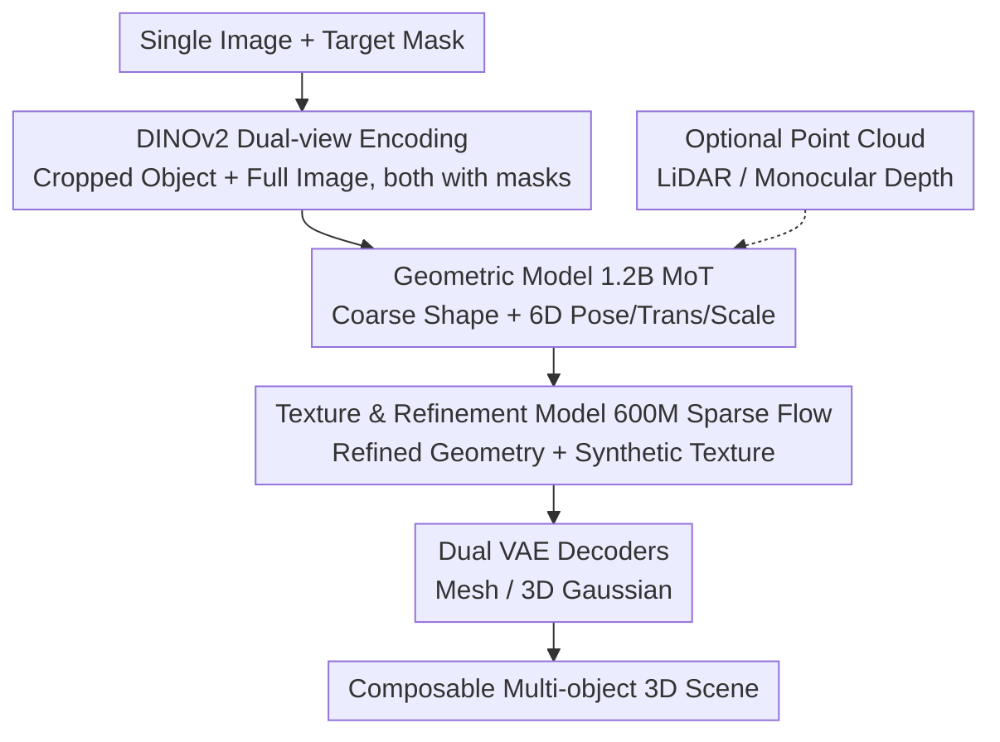

# SAM 3D: 3Dfy Anything in Images

**Conference**: CVPR 2026  
**Paper**: [CVF Open Access](https://openaccess.thecvf.com/content/CVPR2026/html/Chen_SAM_3D_3Dfy_Anything_in_Images_CVPR_2026_paper.html)  
**Code**: https://ai.meta.com/sam3d  
**Area**: 3D Vision  
**Keywords**: Single-image 3D Reconstruction, Generative Reconstruction, Flow Matching, Data Engine, Human Preference Alignment

## TL;DR
SAM 3D is a generative foundation model that reconstructs complete 3D shapes, textures, and layouts for any object from a **single natural image**. It overcomes the barrier of scarce real-world 3D data through a "model-in-the-loop + human annotation" data flywheel and an LLM-style multi-stage training recipe, achieving at least a 5:1 human preference win rate over previous SOTAs on real objects and scenes.

## Background & Motivation
**Background**: Single-image 3D reconstruction has long been a challenge in computer vision. Traditional approaches rely on multi-view geometry for 3D signals, while recent generative methods (e.g., Trellis, Hunyuan3D) have shown impressive shape reconstruction on **isolated synthetic objects**.

**Limitations of Prior Work**: These models are almost exclusively trained on "clean, single-object renderings." They tend to fail when encountering objects in natural images that are **far away, heavily occluded, or in cluttered scenes**. The fundamental issue is that paired real-world image/3D ground truth is extremely difficult to acquire at scale. While labeling a "cat" or drawing a mask is easy, creating a 3D mesh for an object is nearly impossible for average annotators and takes hours for professional 3D artists. This is the "3D data barrier" emphasized by the authors.

**Key Challenge**: For a model to generalize to real images, it requires large-scale paired data of "real images $\leftrightarrow$ 3D ground truth." However, such data is the most expensive and difficult to annotate. Synthetic data is abundant but has a domain gap, while real data is useful but unaffordable to label.

**Key Insight**: The authors leverage two classical observations. First, "pictorial cues" in psychology—humans can perceive shape from a single image, with a key cue being **recognition** ("familiar object" cue): once recognized, the 3D shape and pose can be recovered. Since new objects are composed of seen parts, recognition enables generalization. Second, **annotation asymmetry**: while people cannot easily create meshes, they can **select** the most accurate candidate from a set of 3D models and align its pose to the image.

**Core Idea**: Transform "recognition-driven reconstruction" into a generative model and use a "model-proposes, human-selects/rates" data engine to continuously generate real-world 3D supervision. This is followed by an LLM-style "synthetic pre-training $\rightarrow$ real post-training" recipe to align the model with real images and human aesthetics.

## Method

### Overall Architecture
SAM 3D views "photography" as a lossy mapping that projects 3D objects onto 2D pixels. The goal is to reverse this: given an image $I$ and an object mask $M$, model the conditional distribution $p(S, T, R, t, s \mid I, M)$ and train a generative model $q$ to approximate it—where $S$ is shape, $T$ is texture, and $(R, t, s)$ represents rotation, translation, and scale (layout) in the camera coordinate system. The system is built on three pillars: **inference architecture** (dual-stream MoT + two-stage flow matching), **multi-stage training** (synthetic pre-training to real post-training), and the **MITL data engine flywheel**.

The inference side is a serial pipeline: a single image with a mask is first encoded by DINOv2 into conditional tokens. The geometric model produces coarse shape and layout, followed by the texture and refinement model for details and textures. Finally, dual VAE decoders map latent representations to meshes or 3D Gaussians, allowing multiple objects to be composed into a full scene.

### Key Designs

**1. Dual-stream MoT and Two-stage Latent Flow Matching: Shape First, Color Later**

Regressing 3D from an image in one step is difficult as it must handle both global pose and local details. SAM 3D splits the task into two stages and feeds both "locally clear" and "globally semantic" information. **Input encoding** uses DINOv2 to extract four sets of conditional tokens: the cropped object image and its mask (providing a high-resolution focused view), and the full image and its mask (providing scene context and recognition cues missing from the crop). **The Geometric Model** is a 1.2B parameter flow transformer using a Mixture-of-Transformers (MoT) dual-stream architecture. Two streams separately process geometry $O \in \mathbb{R}^{64^3}$ and layout $(R, t, s)$, sharing information only in multi-modal self-attention layers to model $p(O, R, t, s \mid I, M)$; rotation uses a 6D representation $R \in \mathbb{R}^6$. **The Texture & Refinement Model** is a 600M parameter sparse latent flow transformer that extracts active voxels from the coarse shape $O$ to model $p(S, T \mid I, M, O)$. Finally, two decoders $D_m, D_g$ sharing the same VAE encoder (and thus the same structured latent space) resolve the output into meshes or 3D Gaussians. Unlike Trellis, which reconstructs isolated objects, SAM 3D predicts layout $(R, t, s)$ to compose multiple objects into a coherent scene. It can also optionally condition on point clouds $P$ (from LiDAR or monocular depth).

**2. LLM-style Multi-stage Training: Synthetic Pre-training followed by Real Post-training Alignment**

3D ground truth data is orders of magnitude scarcer than text/image/video. SAM 3D adopts the LLM recipe: "Pre-training $\rightarrow$ Mid-training $\rightarrow$ Post-training." **Pre-training** uses 2.7 million object meshes (e.g., Objaverse-XL) with 24 rendered views of isolated objects (Iso-3DO dataset, 2.5 trillion tokens) to learn a rich shape/texture "vocabulary." **Mid-training** uses "render-and-paste" semi-synthetic data (RP-3DO, 61M samples, 2.8M unique meshes) where textured meshes are alpha-blended into natural images. This teaches the model mask-following, occlusion robustness (completing shapes when occluded), and layout estimation. **Post-training** uses real images in two steps: SFT uses noisy non-expert annotations (MITL-3DO) followed by high-quality professional 3D artist annotations (Art-3DO) to suppress artifacts like floaters or missing symmetry. Preference alignment via DPO uses candidate pairs from the data engine to eliminate flaws that are human-sensitive but hard to capture with flow matching objectives. A distillation phase reduces NFEs from 25 to 4 for sub-second generation. The key finding: **synthetic pre-training capabilities generalize as long as real post-training is sufficient**.

**3. Model-in-the-Loop (MITL) Data Engine Flywheel: Scaling Supervision through Selection**

This engine is the core of the work, exploiting the asymmetry that humans can easily select the best candidate even if they cannot create one. The process involves three sub-tasks: Stage 1 selects the target object $(I, M)$; Stage 2 has annotators pick a shape/texture $(S, T)$ from candidates and provide a rating $r$ (poor candidates become negative samples for DPO); Stage 3 aligns the 3D pose to the point cloud to get $(R, t, s)$. To improve success rates, annotators choose from $N=8$ candidates (a human-powered "best-of-N" search). **Cold-start** is handled by an ensemble of retrieval and learning-based models; as training progresses, SAM 3D's own outputs dominate. Extremely difficult samples are routed to 3D artists (Art-3DO). The engine consumes the current best model $q$ and outputs training samples $D^+$, quality scores $r$, and inferior candidates $D^-$. This creates a virtuous cycle where annotation quality, rate, and model performance scale together. The final dataset includes ~3.14M untextured and ~100k textured meshes from ~1M images.

## Key Experimental Results

### Main Results
SAM 3D leads significantly in shape, texture, and layout. On SA-3DAO (real images with geometric GT), metrics nearly doubled. In human preference tests on real objects, it achieved a ~5:1 win rate over SOTA.

| Dataset | Metric | Ours (SAM 3D) | Prev. SOTA | Note |
|--------|------|------|----------|------|
| SA-3DAO | F1@0.01 ↑ | **0.2344** | 0.1629 (Hi3DGen) | Real image shape, significant lead |
| SA-3DAO | vIoU ↑ | **0.2311** | 0.1531 (Hi3DGen) | Voxel IoU |
| SA-3DAO | Chamfer ↓ | **0.0400** | 0.0844 (TripoSG) | Error reduced by half |
| SA-3DAO | EMD ↓ | **0.1211** | 0.2049 (HY3D-2.0) | Earth Mover's Distance |
| ISO3D | Uni3D ↑ | **0.3707** | 0.3698 (Trellis) | Perceptual similarity, comparable/slight lead |

For layout, joint generation of shape and layout improved ADD-S@0.1 from 2% to 77%:

| Dataset | Paradigm | Method | 3D IoU ↑ | ADD-S @0.1 ↑ |
|--------|------|------|----------|--------------|
| SA-3DAO | Pipeline | HY3D-2.0 + FoundationPose | 0.2937 | 0.5396 |
| SA-3DAO | Joint | **Ours** | **0.4254** | **0.7232** |
| Aria Digital Twin | Joint | MIDI | 0.0336 | 0.0175 |
| Aria Digital Twin | Joint | **Ours** | **0.4970** | **0.7673** |

### Ablation Study
Cumulative ablation across training stages showing monotonic improvement:

| Cumulative Stage | F1@0.01 ↑ | Chamfer ↓ | Texture Win Rate ↑ | Note |
|------|---------|---------|---------|------|
| Pre-training (Iso-3DO) | 0.1349 | 0.1036 | – | Synthetic isolated objects |
| + Mid-training (RP-3DO) | 0.1705 | 0.0760 | 60.7 | Semi-synthetic paste-up data |
| + SFT (MITL-3DO) | 0.2027 | 0.0578 | 66.9 | Real non-expert annotation |
| + DPO (MITL-3DO) | 0.2156 | 0.0498 | 66.4 | Preference alignment |
| + SFT (Art-3DO) | 0.2331 | 0.0445 | – | High-quality artist data |
| + DPO (Art-3DO) | **0.2344** | **0.0400** | – | Full model |

### Key Findings
- **Data engine iterations yield near-linear Elo gains**: Running the engine longer consistently improves performance.
- **Synthetic pre-training generalizes**: Shape/texture priors learned from synthetic data successfully transfer to real images if post-training is sufficient.
- **DPO captures what flow matching misses**: It effectively removes artifacts related to symmetry and closure that the generic objective function ignores.
- **Modular to depth estimators**: The system earns higher preference scores when using better depth estimators it hasn't seen during training.

## Highlights & Insights
- **"Humans can't build, but can pick" as the fulcrum**: Replacing expensive 3D creation with cheap "best-of-N" selection allows for scalable supervision.
- **Applying LLM recipes to 3D**: SAM 3D serves as a blueprint for 3D foundation models using multi-stage training and data flywheels.
- **Dual-stream MoT for decoupling**: Effectively handles geometry and layout as separate but related tasks.
- **Introduction of SA-3DAO benchmark**: 1000 artist-created 3D meshes from natural images provide a necessary upper-bound for real-world 3D evaluation.

## Limitations & Future Work
- **High infrastructure and compute requirements**: Millions of annotations and trillion-token training sessions are difficult for academia to replicate.
- **Layout evaluation depends on depth**: Accuracy is still constrained by the quality of monocular depth estimation in RGB-only settings.
- **Dynamic threshold bias**: There is limited discussion on potential self-reinforcement bias resulting from 80% of data being generated by the model itself.

## Related Work & Insights
- **vs Trellis [112]**: SAM 3D builds on its two-stage flow matching but adds layout $(R, t, s)$ for scene composition and significantly improves robustness on real images (F1 0.1475 $\rightarrow$ 0.2344).
- **vs Hunyuan3D / Hi3DGen**: These are strong on synthetic isolated objects but degrade in cluttered real scenes. SAM 3D's gap comes primarily from real-world MITL supervision.
- **vs MIDI [38] / Pipeline methods**: Joint generation results in massive ADD-S@0.1 leads over MIDI and superior performance compared to stage-wise pipelines.
- **vs SAM [44]**: SAM uses masks that are easy to label; 3D is harder. SAM 3D’s contribution is the specific flywheel designed to bypass this difficulty.

## Rating
- Novelty: ⭐⭐⭐⭐⭐ Systematizes LLM-style training and MITL flywheels for 3D reconstruction.
- Experimental Thoroughness: ⭐⭐⭐⭐⭐ Comprehensive evaluation across shape/texture/layout and ablation studies.
- Writing Quality: ⭐⭐⭐⭐⭐ Clear motivation based on psychological cues and annotation asymmetry.
- Value: ⭐⭐⭐⭐⭐ A landmark work for 3D foundation models with direct impact on robotics, AR/VR, and gaming.

<!-- RELATED:START -->

## Related Papers

- [\[ICML 2026\] Fast-SAM3D: 3Dfy Anything in Images but Faster](../../ICML2026/3d_vision/fast-sam3d_3dfy_anything_in_images_but_faster.md)
- [\[CVPR 2026\] Aligning Text, Images and 3D Structure Token-by-Token](aligning_text_images_and_3d_structure_token-by-token.md)
- [\[CVPR 2026\] PhysX-Anything: Simulation-Ready Physical 3D Assets from Single Image](physx-anything_simulation-ready_physical_3d_assets_from_single_image.md)
- [\[CVPR 2026\] Generalizable Sparse-View 3D Reconstruction from Unconstrained Images](generalizable_sparse-view_3d_reconstruction_from_unconstrained_images.md)
- [\[CVPR 2026\] RoSAMDepth: Robust Self-supervised Depth Estimation Leveraging Segment Anything Model](rosamdepth_robust_self-supervised_depth_estimation_leveraging_segment_anything_m.md)

<!-- RELATED:END -->
