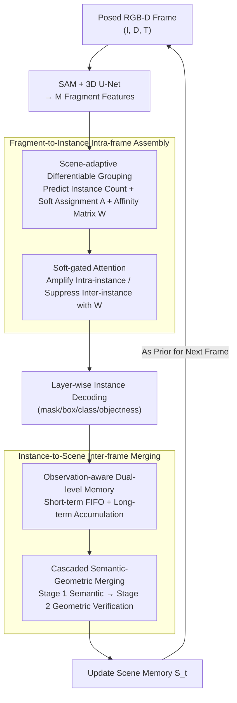

# SAMosaic3D: Modular Scene Assembly for Real-Time 3D Segment Anything

**Conference**: CVPR 2026  
**Paper**: [CVF Open Access](https://openaccess.thecvf.com/content/CVPR2026/html/Wang_SAMosaic3D_Modular_Scene_Assembly_for_Real-Time_3D_Segment_Anything_CVPR_2026_paper.html)  
**Code**: None (Project page only: https://penk1ng.github.io/SAMosaic3D/)  
**Area**: 3D Vision / Semantic Segmentation  
**Keywords**: Online 3D Instance Segmentation, SAM Lifting, Differentiable Grouping, Temporal Association, Embodied Perception

## TL;DR
Ours treats over-segmented 2D masks from SAM as "mosaic fragments" and employs an end-to-end differentiable framework to first assemble fragments of the same object within a frame and then merge instances into scene memory across frames. Achieving 11.2 FPS, it reaches SOTA among online methods on ScanNet/ScanNet200/SceneNN/3RScan with zero-shot cross-dataset generalization.

## Background & Motivation
**Background**: Embodied agents (AR, robots) navigating dynamic environments require "online" 3D instance segmentation—discovering objects on the fly, maintaining identities across views, and incrementally updating the scene. However, mainstream 3D instance segmentation research follows an "offline" paradigm, assuming a complete scene reconstruction or full video for batch processing with heavy backbones and global optimization, which is unsuitable for real-time, partial-observation embodied scenarios.

**Limitations of Prior Work**: A natural online approach is to leverage 2D foundation models like SAM, which provide dense, high-quality masks without 3D supervision or category priors, then "lift" these masks to 3D using depth. Two cascading issues arise: ① **Spatial Fragmentation**: SAM outputs part-level masks rather than complete objects (e.g., a chair is split into "seat/back/legs"), which are treated as independent fragments, especially under occlusion. Geometric clustering attempts to remedy this but fails when fragments are spatially disconnected or occluded. ② **Temporal Drift**: In online reconstruction, instances grow from "partial" to "complete." New detections are geometrically sparse with low 3D box overlap, making IoU-based matching unreliable, whereas accumulated instances are structurally rich and should be verified via geometry. Existing methods often ignore this difference in "observation maturity," applying uniform rules (pure IoU thresholds or heuristics).

**Key Challenge**: These two problems compound—chair fragments in frame $t$ cannot match the "partially unified" representation in frame $t+1$, leading to continuous identity drift. The root cause lies in **treating SAM's part-level masks as final objects and using decoupled, hand-crafted rules to merge them**.

**Core Idea**: Instead of using geometric heuristics to "patch" SAM's output, it is better to view its fine-grained masks as **mosaic tiles** and let the model learn to **assemble** them. By reformulating online 3D segmentation as an end-to-end learnable "composition problem," both spatial grouping and temporal association can be learned from data.

## Method

### Overall Architecture
At each timestamp $t$, SAMosaic3D receives an observation $x_t=(I_t, D_t, T_t)$ (RGB, depth, camera pose) and the previous global scene memory $S_{t-1}$, outputting an updated memory $S_t$. The process is a **dual-level, query-based inference paradigm** that decouples "spatial grouping" and "temporal merging" while allowing joint training:

- **Intra-frame (Spatial)**: A 3D sparse U-Net encodes point cloud features $F_{point}\in\mathbb{R}^{N_p\times C}$, followed by max-pooling within each SAM mask to obtain $M$ fragment features $F_{frag}\in\mathbb{R}^{M\times C}$. **Fragment-to-Instance Adaptive Assembly** uses scene-adaptive grouping and soft-gated attention to cluster over-segmented fragments into instance-level queries.
- **Inter-frame (Temporal)**: **Instance-to-Scene Online Merging** associates current instances with scene memory. Memory is split into short-term/long-term layers based on observation freshness, using a cascaded "Semantic $\rightarrow$ Geometric" two-stage matching to maintain identity consistency under incomplete observations.

When paired with FastSAM, the system runs at 11.2 FPS, meeting real-time requirements.

### Key Designs

**1. Scene-adaptive Differentiable Grouping: Learning "How many and how to group"**

Traditional methods for clustering $M$ fragments into instances (e.g., PointGroup) rely on `arg max` hard clustering, which cuts gradients and prevents grouping decisions from being trained end-to-end with downstream segmentation. Ours makes this fully differentiable: $F_{frag}$ is pooled into a global descriptor $g \in \mathbb{R}^{2C}$, which simultaneously predicts the instance count $\hat N$ as a classification over $N_{max}$ categories and generates a fixed-size center bank $\bar C = \mathrm{MLP}_{center}(g) \in \mathbb{R}^{N_{max} \times C}$. The center generator always outputs $N_{max}$ candidates, but the counting head activates only the top $\hat N$ centers, masking the rest to get active centers $C=\{c_k\}_{k=1}^{\hat N}$.

Grouping uses a soft assignment matrix $A \in \mathbb{R}^{M \times \hat N}$ based on the softmax of squared distances between fragments and centers:

$$A_{ik}=\frac{\exp(-\|f_i-c_k\|_2^2/\tau)}{\sum_{j=1}^{\hat N}\exp(-\|f_i-c_j\|_2^2/\tau)}$$

An **intra-instance affinity matrix** $W \in \mathbb{R}^{M \times M}$ is constructed as $W_{ij} = \sum_{k=1}^{\hat N} A_{ik}A_{jk}$ (higher $W_{ij}$ means fragments $i$ and $j$ tend to belong to the same center). Since $W$ is computed only on visible fragments in the current frame, cost scales with frame complexity rather than history. Because $A$ and $W$ depend on learnable centers $C$, gradients from downstream losses flow back to optimize both the grouping strategy and the center representations.

**2. Soft-Gated Attention: Using the Affinity Matrix as a "Gate"**

Fragment features require refinement for accurate instance prediction, but standard self-attention mixes information across instances. Ours uses an $L$-layer decoder (initialized with $Q^0_{frag}=F_{frag}$) where each layer performs point-to-fragment cross-attention to anchor queries on geometry, followed by **soft-gated self-attention** using $W$ as a log-space bias:

$$Q^l_{frag}=\mathrm{softmax}\!\left(\frac{(Q^l_{ca}W^Q_l)(Q^l_{ca}W^K_l)^\top}{\sqrt{d_k}}+\beta\log(W+\epsilon)\right)Q^l_{ca}$$

Here $\beta$ controls bias strength and $\epsilon=10^{-8}$ ensures stability. Low intra-instance probability results in negative biases that are exponentially suppressed after softmax, inhibiting cross-object mixing (even for adjacent objects of the same class). High probability provides a gentle positive bias to aggregate complementary information. Each layer aggregates fragments into instance queries $Q^l_{instance}=A^\top Q^l_{frag}$ and decodes mask/box/class/objectness for **layer-wise supervision**, establishing coarse boundaries in early layers and refining them later.

**3. Observation-aware Dual-level Memory: Bounded Budget for Learnable Attention**

As the explored scene grows, memory may contain hundreds of instances, making uniform learnable attention computationally prohibitive. Ours splits memory into two layers $S_t=S^{short}_t\cup S^{long}_t$: short-term memory is a fixed-length FIFO ($N_{short}=50$ most recently observed/merged instances). When full, the "least recently merged" instance is demoted to long-term memory. Long-term memory grows dynamically without deletion, but successfully re-merged long-term instances are **promoted** back to short-term status. This bidirectional mechanism keeps the learnable attention phase bounded by $N_{short}$ while focusing attention on currently active objects.

**4. Cascaded Semantic-Geometric Merging: Divid-and-conquer by Observation Maturity**

To address the geometric asymmetry between "sparse new detections" and "accumulated complete instances," two-stage merging is performed. **Stage 1 (Semantic Merging for incomplete observations)**: Learn a merging matrix $M^{short}\in[0,1]^{\hat N\times N_{short}}$ between current instances $I_t$ and short-term memory $S^{short}_t$ using spatially-weighted cross-attention (guided by 3D box proximity and semantic compatibility), establishing correspondence via learned feature similarity rather than geometric overlap. **Stage 2 (Geometric Verification for complete observations)**: Instances $I^{t,merged}_i$ not merged in Stage 1—now **refined** by short-term semantic context—are searched in long-term memory. Merging occurs if $\mathrm{IoU_{3D}}(b^{t,merged}_i, b^{t-1}_k)>\tau_{IoU}$, and the long-term instance is promoted back to short-term. This allows re-appearing objects to switch from "geometric tracking" back to "semantic association," improving robustness after long occlusions.

### Loss & Training
A progressive training strategy is used: the Fragment-to-Instance module is first trained on single frames with $\mathcal{L}_{inst}+\mathcal{L}_{count}$, followed by training the temporal association of the full framework with $\mathcal{L}_{merge}$. Each stage takes 128 epochs on 4×RTX 4090.

Intra-frame supervision uses bipartite matching for $\mathcal{L}_{query}$, but standard losses treat all predictions equally and provide only indirect gradients to $A$. Thus, **Assignment-weighted Instance Supervision** $\mathcal{L}^{l,t}_{inst}=\sum_j w_j\cdot\mathcal{L}_{query}(j,\sigma(j))$ is introduced, where $w_j=\max_i A_{ij}$, directing supervision primarily to centers responsible for high-confidence grouping. For temporal association, **Explicit Merging Supervision** $\mathcal{L}^t_{merge}=\mathrm{BCE}(M^{short}_{(L)}, G^t)$ is used, where $G^t$ is a binary ground truth correspondence based on instance ID. Total loss is aggregated over $T$ frames and $L$ layers: $\mathcal{L}=\frac{1}{T}\sum_t\big(\lambda_{count}\mathcal{L}^t_{count}+\sum_l\mathcal{L}^{l,t}_{inst}+\lambda_{merge}\mathcal{L}^t_{merge}\big)$.

## Key Experimental Results

### Main Results
Evaluation was conducted on four indoor benchmarks: ScanNet, ScanNet200, SceneNN, and 3RScan. Metrics follow the ScanNet protocol reporting AP (IoU 0.5–0.95), AP50, and AP25. Comparisons include 6 baselines (offline: SAMPro3D/Open3DIS/SAI3D; online: SAM3D/ESAM/AutoSeg3D).

**ScanNet200 Class-agnostic Segmentation (FPS includes VFM)**:

| Method | VFM | AP | AP50 | AP25 | FPS |
|------|-----|----|------|------|-----|
| SAI3D (Offline) | SemanticSAM | 28.2 | 47.2 | 67.9 | – |
| SAM3D (Online) | SAM | 20.2 | 35.7 | 55.5 | 0.4 |
| ESAM | SAM | 42.2 | 63.7 | 79.6 | 0.7 |
| ESAM-E | FastSAM | 43.4 | 65.4 | 80.9 | 10.6 |
| AutoSeg3D | SAM | 45.5 | 66.7 | 81.0 | 0.7 |
| AutoSeg3D-E | FastSAM | 46.2 | 67.9 | 81.7 | 10.1 |
| **SAMosaic3D** | SAM | 46.1 | 68.5 | 84.2 | 0.7 |
| **SAMosaic3D** | FastSAM | **48.7** | **69.3** | **85.4** | **11.2** |

Using SAM, ours outperforms AutoSeg3D by +0.6 AP. Using FastSAM, ours achieves 48.7 AP (+2.5 AP over AutoSeg3D-E) at 11.2 FPS.

**In-distribution Evaluation on ScanNet / SceneNN (Online methods)**:

| Method | ScanNet AP | ScanNet AP50 | SceneNN AP | SceneNN AP50 |
|------|-----------|--------------|-----------|--------------|
| AutoSeg3D | 43.4 | – | 33.1 | – |
| **SAMosaic3D** | 45.3 | 65.9 | 33.2 | 56.5 |
| **SAMosaic3D†(FastSAM)** | 46.5 | 67.7 | 35.1 | 58.2 |

**Zero-shot Cross-dataset (ScanNet200 $\rightarrow$ Others)**: SAMosaic3D achieves 31.7 AP on SceneNN (+1.5 over AutoSeg3D-E) and 16.3 AP on 3RScan (comparable to AutoSeg3D-E's 16.8).

### Ablation Study
System-level ablation (ScanNet25K val, progressively adding components):

| F2I | I2S | $\mathcal{L}_{count}$ | $\mathcal{L}_{merge}$ | AP | AP50 | AP25 |
|-----|-----|------|------|----|------|------|
| ✗ | ✗ | ✗ | ✗ | 40.5 | 60.2 | 78.5 |
| ✓ | ✗ | ✓ | ✗ | 44.8 | 65.3 | 82.1 |
| ✓ | ✓ | ✓ | ✗ | 48.2 | 68.9 | 85.0 |
| ✓ | ✓ | ✓ | ✓ | **49.1** | **69.8** | **85.7** |

Differentiable F2I yields +4.3 AP. Dual-level memory + Cascaded merging (I2S) adds +3.4 AP. Explicit supervision $\mathcal{L}_{merge}$ adds +0.9 AP.

### Key Findings
- **Assembly and Merging are both essential**: Removing either module leads to significant drops; learnable pipelines outperform heuristic ones like AutoSeg3D.
- **Differentiable vs. Hard Grouping**: Within F2I, replacing hard clustering (42.5 AP) with differentiable soft assignment yields +2.1 AP.
- **Counting stability**: The classification-based counting head is robust (MAE 0.53) and insensitive to the choice of $N_{max}$.
- **Memory layers for motion**: Short-term memory tracks rapid camera changes in 3RScan, while long-term memory maintains global consistency.

## Highlights & Insights
- **Paradigm Shift from "Patching" to "Assembling"**: Treats over-segmentation not as a bug but as a feature—finer fragments provide more flexibility for differentiable assembly.
- **Affinity Matrix as a Soft Gate**: $W=AA^\top$ serves as both the grouping result and a gating bias for attention, allowing grouping and feature refinement to share gradients and avoiding the "cluster-then-refine" gap.
- **Merging by Maturity**: Decoupling semantic association for new detections and geometric verification for accumulated instances better aligns with the physical reality of incremental perception.

## Limitations & Future Work
- **Dynamic Objects**: Currently handles ego-motion but not independent object motion (e.g., walking people).
- **Dependency on Poses and Depth**: Performance under high pose noise or in RGB-only scenarios is unverified.
- **Bounded Indoor Assumption**: The "never delete" long-term memory relies on bounded instance counts in indoor scenes; outdoor/large-scale scaling may require forgetting mechanisms.
- **Future Directions**: Modeling independent motion within queries and implementing memory pruning.

## Related Work & Insights
- **vs ESAM / EmbodiedSAM**: ESAM also lifts SAM masks to 3D queries but treats masks as final units and uses uniform matching. SAMosaic3D makes grouping differentiable and uses maturity-aware cascaded merging, gaining +2.5 AP on ScanNet200.
- **vs AutoSeg3D**: AutoSeg3D uses instance tracking and memory but relies on heuristic merging. Ours provides end-to-end learnable grouping and merging for more robust cross-dataset generalization.
- **vs Offline Methods**: Offline methods (e.g., OneFormer3D, 59.3 AP) define quality upper bounds but lack real-time capability and online identity maintenance.

## Rating
- Novelty: ⭐⭐⭐⭐⭐ Reformulates online 3D segmentation into "learnable assembly"; affinity-gated attention is a solid mechanism.
- Experimental Thoroughness: ⭐⭐⭐⭐ Comprehensive evaluation across four datasets and zero-shot settings, though independent motion is not covered.
- Writing Quality: ⭐⭐⭐⭐⭐ The "mosaic tile" metaphor is clear and consistently applied.
- Value: ⭐⭐⭐⭐⭐ 11.2 FPS with SOTA performance offers direct utility for embodied AI and AR.

<!-- RELATED:START -->

## Related Papers

- [\[CVPR 2026\] RoSAMDepth: Robust Self-supervised Depth Estimation Leveraging Segment Anything Model](rosamdepth_robust_self-supervised_depth_estimation_leveraging_segment_anything_m.md)
- [\[CVPR 2026\] Real-Time Dynamic Scene Rendering with Controlled Compressibility and Contact Awareness](real-time_dynamic_scene_rendering_with_controlled_compressibility_and_contact_aw.md)
- [\[CVPR 2026\] Changes in Real Time: Online Scene Change Detection with Multi-View Fusion](changes_in_real_time_online_scene_change_detection_with_multi-view_fusion.md)
- [\[CVPR 2026\] KV-Tracker: Real-Time Pose Tracking with Transformers](kv-tracker_real-time_pose_tracking_with_transformers.md)
- [\[CVPR 2026\] Fast-FoundationStereo: Real-Time Zero-Shot Stereo Matching](fast-foundationstereo_real-time_zero-shot_stereo_matching.md)

<!-- RELATED:END -->
