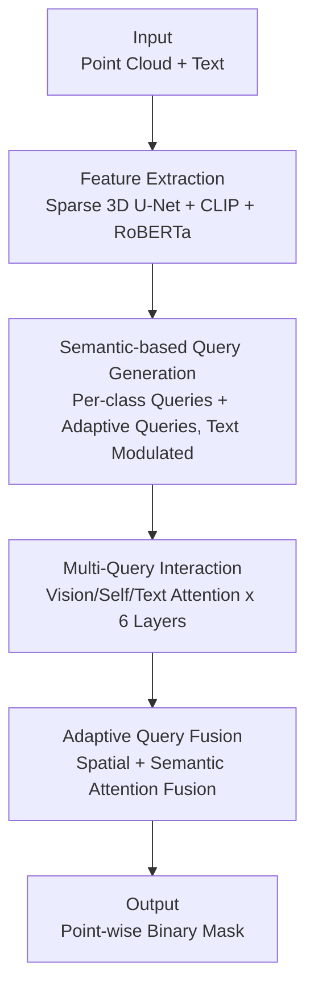

# SAQN: Semantic-based Adaptive Query Network for 3D Referring Expression Segmentation

**Conference**: CVPR 2026  
**Paper**: [CVF Open Access](https://openaccess.thecvf.com/content/CVPR2026/html/Huang_SAQN_Semantic-based_Adaptive_Query_Network_for_3D_Referring_Expression_Segmentation_CVPR_2026_paper.html)  
**Code**: None  
**Area**: 3D Vision / Multimodal Segmentation  
**Keywords**: 3D Referring Expression Segmentation, Semantic-level Query, Adaptive Query, Point Cloud Segmentation, Vision-Language

## TL;DR
SAQN replaces the "point-based query generation" approach in 3D referring expression segmentation with "one learnable query per semantic class." It utilizes a minimal set of queries (21 classes + 10 adaptive queries, totaling 31) to replace the hundreds of queries used in previous works. The Adaptive Query Fusion module resolves ambiguities caused by a single class query representing all identical objects in a scene, achieving SOTA performance for both 3D-RES and 3D-GRES on ScanRefer and Multi3DRefer.

## Background & Motivation

**Background**: The goal of 3D Referring Expression Segmentation (3D-RES) is to segment a target object from a point cloud scene given a natural language description. Early methods followed a two-stage approach (proposal generation followed by text matching), which was inefficient and limited by proposal quality. Recent mainstream methods have shifted to single-stage query-based frameworks. Among these, **instance-based (per-point) query** frameworks like MDIN and IPDN have achieved significant gains by generating queries directly from 3D points. This allows for a one-to-one correspondence between queries and superpoints, bypassing the expensive and unstable Hungarian matching used in 2D.

**Limitations of Prior Work**: Instance-based queries suffer from two inherent issues. First is the **query explosion**: because point clouds contain numerous points, queries derived directly from points are excessive (up to 128 in MDIN), necessitating complex sampling modules. Second is **sampling randomness**: these non-deterministic sampling algorithms force a trade-off between computational cost and information loss. Consequently, they retain many queries yet may **fail to sample the point belonging to the target object**, as shown in the counter-example in Figure 1 where 128 queries still missed the target chair.

**Key Challenge**: Binding queries to "raw points" creates a bottleneck where high point density leads to excessive queries, and subsequent sampling risks omitting the target.

**Goal**: To retain the advantage of "no Hungarian matching" while significantly reducing the query count and completely eliminating the risk of "missing the target via sampling."

**Key Insight**: Each point in a point cloud inherently possesses a semantic label. Therefore, rather than assigning a query to every instance (e.g., every chair), it is more efficient to assign a query to each **semantic class** (e.g., the "chair" class). This reduces the query count from hundreds to the number of semantic classes (only 21 on ScanRefer). Since every point can be reliably assigned to its corresponding class query, the sampling omission problem is resolved.

**Core Idea**: Shift queries from the **instance-level (per-point)** to the **semantic class-level (per-class)** by using one learnable query per semantic class, supplemented by a small number of "adaptive queries" to differentiate multiple instances within the same class.

## Method

### Overall Architecture
SAQN takes a point cloud (coordinates $F_P\in\mathbb{R}^{N_p\times3}$ + RGB $F_C$) and a text description as input, outputting a point-wise binary mask for the referred target. The pipeline consists of four steps: first, extracting vision/text features using a Sparse 3D U-Net, multi-view CLIP features, and RoBERTa; second, performing **Semantic-based Query Generation** to produce a fixed number of queries (one per class + adaptive queries) modulated by text; third, processing queries through a 6-layer **Multi-Query Interaction** decoder interacting with vision/text features and each other; and finally, using the **Adaptive Query Fusion** module to fuse adaptive query masks back into semantic class queries via spatial and semantic attention. The core logic anchors queries to semantic classes rather than points.

### Key Designs

**1. Semantic-based Query Generation: Anchoring Queries to Semantic Classes**

This step addresses the "excessive queries + sampling omission" bottleneck. The authors set learnable positional embeddings $P_1\in\mathbb{R}^{k_1\times C}$ for $k_1$ semantic classes ($k_1=21$ for ScanRefer, including an "others" class for unseen categories) and $P_2\in\mathbb{R}^{k_2\times C}$ for $k_2$ adaptive queries, concatenated as $P=\text{Concat}(P_1,P_2)$. Since $P$ is text-agnostic, it is modulated using text features $T$: first calculating $A^r=\text{Softmax}(PW_{lp}(TW_{lt})^T)$, then obtaining final semantic queries $Q=A^rT+P$. This fixed query length relies only on the number of classes, ensuring a stable input for the decoder and eliminating sampling risks.

**2. Multi-Query Interaction: Decoder-based Alignment**

The decoder (6 layers) ensures queries absorb scene and linguistic information. Each layer performs three types of attention: first, aligning queries to superpoint visual features $V$ using vision attention $\hat Q^i=A^i_v V$, where $A^i_v=\text{Softmax}(Q^iW^i_{vq}(VW^i_{lv})^T)$; second, self-attention between queries to link semantic queries $\hat Q^i_s$ and adaptive queries $\hat Q^i_a$; and third, text attention $\hat Q^i_t=A^i_tT$. Semantic and adaptive queries are updated via independent MLP paths: $Q^{i+1}_s=\text{MLP}^i_s(\hat Q^i_s+\hat Q^i_{t,s}+\hat Q^i_{q,s})$ and $Q^{i+1}_a=\text{MLP}^i_a(\hat Q^i_a+\hat Q^i_{t,a}+\hat Q^i_{q,s})$.

**3. Adaptive Query Fusion: Resolving Cross-Object Ambiguity**

Semantic queries introduce **cross-object ambiguity**: one "chair" query must represent all chairs in a scene, which varies in shape and position. AQF uses adaptive queries to capture fine-grained intra-class differences. Given adaptive query masks $M^i_a\in\mathbb{R}^{k_2\times N_s}$, it calculates **spatial attention** $A^i_{spatial}=\text{Softmax}(M^i_a)$ and **semantic attention** $A^i_{semantic}=(\text{Softmax}(Q^i_aW_q))^T\in\mathbb{R}^{k_1\times k_2}$. The final fusion is $\hat M^i_s=M^i_s+A^i_{semantic}(M^i_a\odot A^i_{spatial})$, where $\hat M^i_s$ is the refined mask.

### Loss & Training
The total loss consists of three terms:

- **Probability Loss** $\mathcal{L}_p=\text{BCE}(P,L^{tgt})$, supervising whether a semantic class is present in the target.
- **Mask Loss** $\mathcal{L}_m=\text{BCE}(\hat M^+,M^{tgt})+\text{DICE}(\hat M^+,M^{tgt})$, where $\hat M^+$ is the mask of the semantic query matching the target class.
- **Adaptive Query Intersection Loss (AQIL)** $\mathcal{L}_a=\frac{1}{k_2(k_2-1)}\sum_{i}\sum_{j\neq i}|M_{a,i}\cap M_{a,j}|$, which penalizes overlap between adaptive queries to ensure they focus on distinct regions.

Total $\mathcal{L}=\mathcal{L}_m+\lambda_p\mathcal{L}_p+\lambda_a\mathcal{L}_a$, with $\lambda_p=0.1, \lambda_a=1.0$. Trained for 70 epochs with a batch size of 16.

## Key Experimental Results

### Main Results

**3D-GRES (Multi3DRefer)**: SAQN leads in mIoU and Acc@0.5, especially in zero-target (ZT) scenarios.

| Method | Acc@0.25 All | Acc@0.5 All | mIoU |
|------|------|------|------|
| MDIN | 67.0 | 44.7 | 47.5 |
| IPDN | **71.5** | 50.0 | 51.7 |
| **Ours** | 70.5 | **53.8** | **53.1** |

**3D-RES (ScanRefer)**: Highest overall mIoU and significant lead in Acc@0.25.

| Method | Overall 0.25 | Overall 0.5 | Overall mIoU |
|------|------|------|------|
| MDIN | 58.0 | 53.1 | 48.3 |
| IPDN | 60.6 | **54.9** | 50.2 |
| **Ours** | **68.3** | 53.4 | **51.1** |

### Ablation Study

Component Ablation (Multi3DRefer, Acc@0.5 Distractor / mIoU):

| IQ | SQ | AQF | AQIL | ZT | ST | MT | mIoU |
|----|----|-----|------|----|----|----|------|
| ✓ | | | | 37.1 | 32.5 | 51.2 | 50.3 |
| | ✓ | | | 54.9 | 37.8 | 49.6 | 52.1 |
| | ✓ | ✓ | ✓ | **55.8** | **39.8** | **52.3** | **53.1** |

### Key Findings
- **SQ (Semantic Query) is the foundation**: Adding SQ increases ZT Acc@0.5 significantly (+17.8) but initially drops MT performance due to cross-object ambiguity.
- **AQF targets multi-object scenarios**: Adding AQF and AQIL recovers MT performance, proving they are necessary complements to SQ.
- **Query count reduction**: 31 queries vs. 128 in MDIN, without the need for point sampling.
- **Importance of Semantic Priors**: Eliminating semantic per-class grouping for queries leads to performance drops.

## Highlights & Insights
- **"Dimension Reduction" of Queries**: Shifting from per-instance to per-class queries effectively solves the sampling omission problem.
- **Functional Division of Queries**: Using stable class queries for "category" and flexible adaptive queries for "intra-class variance" provides a robust paradigm for 3D tasks.
- **Efficient AQIL Trick**: A simple penalty on mask overlap successfully pushes adaptive queries to focus on different spatial regions without complex structural overhead.

## Limitations & Future Work
- The "others" class approach has limited capability in open-vocabulary scenarios with vast category counts.
- High-precision Acc@0.5 on 3D-RES is slightly lower than instance-based methods, indicating that semantic queries may be less effective at producing extremely tight geometric boundaries.
- Sensitivity to the number of adaptive queries $k_2$ suggests a need for more robust hyperparameter selection.

## Related Work & Insights
- **vs. MDIN / IPDN (Instance-based)**: These use many queries (128) and random sampling. SAQN reduces this to 31 queries and removes sampling, outperforming them in mIoU (53.1 vs 51.7).
- **vs. RefMask3D**: Unlike RefMask3D, SAQN avoids expensive Hungarian matching due to implicit class alignment.
- **vs. 3D-STMN**: 3D-STMN uses text features as queries, which can be ambiguous and difficult to train; SAQN provides stable, fixed-length semantic inputs to the decoder.

## Rating
- Novelty: ⭐⭐⭐⭐
- Experimental Thoroughness: ⭐⭐⭐⭐
- Writing Quality: ⭐⭐⭐⭐
- Value: ⭐⭐⭐⭐

<!-- RELATED:START -->

## Related Papers

- [\[CVPR 2026\] Spatial Matters: Position-Guided 3D Referring Expression Segmentation](spatial_matters_position-guided_3d_referring_expression_segmentation.md)
- [\[CVPR 2026\] CompetitorFormer: Mitigating Query Conflicts for 3D Instance Segmentation via Competitive Strategy](competitorformer_mitigating_query_conflicts_for_3d_instance_segmentation_via_com.md)
- [\[CVPR 2026\] Unlocking 3D Affordance Segmentation with 2D Semantic Knowledge](unlocking_3d_affordance_segmentation_with_2d_semantic_knowledge.md)
- [\[CVPR 2026\] GeoGuide: Hierarchical Geometric Guidance for Open-Vocabulary 3D Semantic Segmentation](geoguide_hierarchical_geometric_guidance_for_open-vocabulary_3d_semantic_segment.md)
- [\[CVPR 2026\] Heuristic Self-Paced Learning for Domain Adaptive Semantic Segmentation under Adverse Conditions](heuristic_self-paced_learning_for_domain_adaptive_semantic_segmentation_under_ad.md)

<!-- RELATED:END -->
