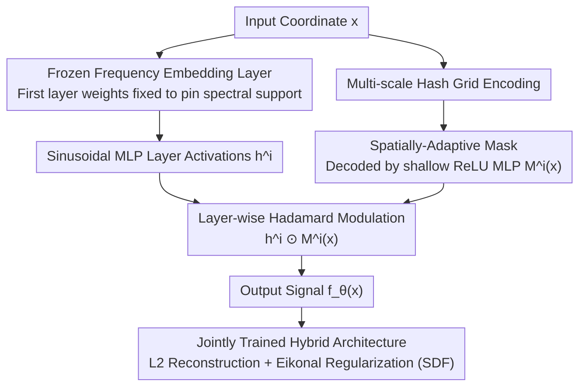

# SASNet: Spatially-Adaptive Sinusoidal Networks for INRs

**Conference**: CVPR 2026  
**arXiv**: [2503.09750](https://arxiv.org/abs/2503.09750)  
**Code**: [https://github.com/Fengyee/SASNet_inr](https://github.com/Fengyee/SASNet_inr)  
**Area**: 3D Vision / Implicit Neural Representations  
**Keywords**: Implicit Neural Representations, SIREN, Spatial Adaptivity, Frequency Leakage, Hash Grid

## TL;DR

SASNet is proposed to solve the issues of frequency initialization sensitivity and high-frequency leakage in SIREN by combining frozen frequency embedding layers with spatially-adaptive masks learned by a lightweight hash-grid MLP. It achieves faster convergence and higher reconstruction quality across image fitting, volume data fitting, and SDF reconstruction tasks.

## Background & Motivation

Implicit Neural Representations (INR) have become powerful tools in computer vision and graphics for modeling low-dimensional signals by mapping coordinates directly to signal values. Among them, Sinusoidal Representation Networks (SIREN) are widely used for modeling high-frequency signals due to their sinusoidal activation functions, making them particularly suitable for tasks requiring high-frequency reconstruction such as image fitting, super-resolution, and SDF modeling.

However, SIREN faces a **Limitations of Prior Work**: extreme sensitivity to the frequency parameter $\omega_0$. A small $\omega_0$ produces clean but overly smooth reconstructions lacking detail, while a large $\omega_0$ captures sharp edges but introduces spurious high-frequency noise in smooth regions (e.g., image backgrounds)—a phenomenon the authors term "frequency leakage," where unwanted high-frequency components are activated in low-frequency areas. Prolonging training to recover high-frequency details further leads to optimization instability and overfitting.

**Key Challenge**: The influence of each neuron in SIREN is global—a neuron responsible for encoding high-frequency details affects the entire spatial domain, including smooth regions that do not require high-frequency information. This is the root cause of frequency leakage. Grid-based methods (e.g., InstantNGP) achieve spatial localization through hash grids, but representing fine details requires extremely high-resolution grids, increasing memory and computational costs.

**Core Idea**: Combine the frequency control capability of SIREN with the spatial localization capability of a hash-grid MLP. Use frozen frequency embedding layers to fix the network's spectral support and a lightweight hash-grid MLP to learn spatially-adaptive masks that constrain the spatial influence of each neuron. This activates high-frequency neurons only in regions requiring detail and suppresses them in smooth areas.

## Method

### Overall Architecture

SASNet aims to resolve the dilemma where a single $\omega_0$ cannot account for the entire signal. The **Mechanism** involves decoupling "which frequencies to use" from "where to use them." Two networks operate in parallel, sharing the input coordinate $\mathbf{x}$: a sinusoidal MLP generates high-frequency expressions, while a lightweight hash-grid MLP generates a "spatially-adaptive mask" $\mathcal{M}^i(\mathbf{x})$. These masks are applied layer-wise to the sinusoidal MLP activations via the Hadamard product $\odot$, dictating whether a neuron should contribute at a given coordinate. The first layer of the sinusoidal MLP is a frozen frequency embedding layer that fixes the spectral range, while the masks perform spatial cropping on this fixed spectrum. The two networks are trained jointly end-to-end.

### Key Designs

**1. Frozen Frequency Embedding Layer: Explicitly Fixing Frequency Support**

In standard SIREN, the spectral range is implicitly determined by $\omega_0$ and the random initialization of the first layer. SASNet explicitly defines a set of frequencies in the first layer and freezes these weights throughout training. This ensures the network's spectral support remains fixed and stable, providing a controllable frequency basis for the spatial masks to crop.

**2. Spatially-Adaptive Mask: Localizing Global Neurons**

This is the **Core Idea** for eliminating frequency leakage. SASNet uses a multi-scale hash grid to encode coordinates into features, which are then decoded by a small ReLU MLP into mask values aligned with the sinusoidal MLP layers. The activations are modulated as $\mathbf{h}^i \odot \mathcal{M}^i(\mathbf{x})$. Due to the spatial locality of the hash grid, masks change smoothly with coordinates: suppressing high-frequency neurons in smooth backgrounds and allowing them in regions with edges and details. This allocation is learned automatically during joint training.

**3. Hybrid Architecture for Joint Training: Balancing Frequency and Locality**

The sinusoidal MLP and hash-grid MLP share inputs and optimize the standard INR objective:

$$\mathcal{L}(\theta) = \frac{1}{N}\sum_i \|f_\theta(\mathbf{x}_i) - \mathscr{f}_i\|^2 + \lambda \mathcal{R}(\theta)$$

The hash-grid component is intentionally lightweight (low-resolution grid and shallow MLP) since it only generates masks rather than representing the signal itself. This hybrid approach inherits the precise derivative properties of sinusoidal activations while gaining spatial locality, bypassing the limitations of both pure SIREN (global leakage) and pure hash grids (high resolution required for details).

### Loss & Training

The primary loss is the L2 reconstruction loss. For SDF tasks, an Eikonal regularization term is added to constrain the gradient norm to 1. The frequency embedding layer is frozen, and masks naturally converge to a spatial allocation where low-frequency neurons handle smooth regions and high-frequency neurons handle details.

## Key Experimental Results

### Main Results

SASNet was evaluated on three types of tasks:

| Task | Metric | SASNet vs SIREN | Description |
|--------|------|------|------|
| 2D Image Fitting | PSNR | Significant Improvement | Sharp edges + clean background |
| 3D Volume Fitting | PSNR | Significant Improvement | Eliminated noise in smooth regions |
| SDF Reconstruction | CD/IoU | Superior | Masks automatically focus on zero-isosurface |
| ×16 Super-resolution | PSNR | Outperforms various $\omega_0$ | Handles both local detail and global smoothness |

### Ablation Study

| Configuration | Key Effect | Description |
|------|---------|------|
| SIREN (low $\omega_0$) | Smooth but blurry | Lacks high-frequency details |
| SIREN (high $\omega_0$) | Sharp but noisy | Severe frequency leakage |
| SASNet w/o frozen embedding | Unstable convergence | Uncontrollable frequency range |
| SASNet w/o masks | Similar to SIREN | No spatial localization |
| **Ours** (Full) | Sharp and clean | Frequency control + spatial localization |

### Key Findings

- **Frequency leakage is a fundamental bottleneck of SIREN**: Adjusting $\omega_0$ cannot simultaneously achieve sharp details and clean backgrounds.
- **Spatial masks automatically learn frequency allocation**: Visualizations show higher mask values for low-frequency neurons in smooth areas and higher values for high-frequency neurons in edge/detail areas.
- **High parameter efficiency**: Using the hash-grid MLP as a mask generator adds few parameters compared to the quality gains.
- **Masks focus on zero-isosurfaces in SDF tasks**: Activation concentrates on specific areas like the limbs of the Armadillo model, consistent with the physical meaning of SDF.

## Highlights & Insights

- **Using a hash grid as a mask generator rather than a feature extractor** is a clever design. It preserves the accurate derivative computation of SIREN while gaining spatial locality.
- **Decoupling frozen frequencies from learned spatial allocation** is conceptually elegant—"fix what frequencies can do, learn where to use them."
- **Transferability**: This mask modulation mechanism could be applied to NeRF or 3DGS, where different spatial regions also require varying frequency capacities.

## Limitations & Future Work

- The current results lack full comparative data on execution time and specific PSNR values in some scenarios.
- The hash grid introduces discretization, which might cause block artifacts if the resolution is insufficient.
- Whether mask learning requires high iterations to converge or remains effective in sparse data scenarios requires further discussion.
- Only validated on low-dimensional signals; scaling to high-dimensional scene representations like NeRF is pending.

## Related Work & Insights

- **vs SIREN**: SASNet solves the global frequency leakage issue via spatial masks while maintaining sinusoidal benefits.
- **vs InstantNGP**: InstantNGP uses ReLU MLPs with poor derivative accuracy; SASNet keeps precise derivatives via sinusoidal activation using the hash grid only for modulation.
- **vs WIRE**: WIRE uses Gabor wavelets for locality but is prone to overfitting; SASNet’s mask approach is more flexible.
- **vs FINER**: FINER performs adaptive frequency modulation via dynamic scaling, but remains global; SASNet achieves true spatial localization.

## Rating

- **Novelty**: ⭐⭐⭐⭐ Innovative architecture using a hash grid as a spatial mask generator for SIREN.
- **Experimental Thoroughness**: ⭐⭐⭐ Covers three task types (Image, Volume, SDF), though some cache data is incomplete.
- **Writing Quality**: ⭐⭐⭐⭐ Clear problem definition and intuitive visualization of "frequency leakage."
- **Value**: ⭐⭐⭐⭐ Provides an elegant solution to frequency control in INRs with high potential for transferability.

<!-- RELATED:START -->

## Related Papers

- [\[CVPR 2026\] EventHub: Data Factory for Generalizable Event-Based Stereo Networks without Active Sensors](eventhub_data_factory_for_generalizable_event-based_stereo_networks_without_acti.md)
- [\[CVPR 2025\] Exploiting Deblurring Networks for Radiance Fields](../../CVPR2025/3d_vision/exploiting_deblurring_networks_for_radiance_fields.md)
- [\[CVPR 2026\] AdaSFormer: Adaptive Serialized Transformers for Monocular Semantic Scene Completion from Indoor Environments](adasformer_adaptive_serialized_transformers_for_monocular_semantic_scene_complet.md)
- [\[CVPR 2026\] MajutsuCity: Language-driven Aesthetic-adaptive City Generation with Controllable 3D Assets and Layouts](majutsucity_language-driven_aesthetic-adaptive_city_generation_with_controllable.md)
- [\[CVPR 2026\] Adaptive 3D Perception for Small Aerial Targets Under Sparse Sampling via Reinforcement Learning](adaptive_3d_perception_for_small_aerial_targets_under_sparse_sampling_via_reinfo.md)

<!-- RELATED:END -->
