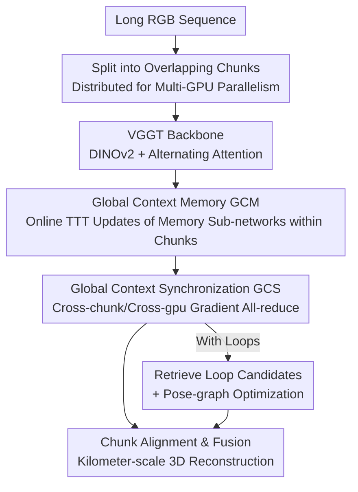

# Scal3R: Scalable Test-Time Training for Large-Scale 3D Reconstruction

**Conference**: CVPR 2026  
**Paper**: [CVF Open Access](https://openaccess.thecvf.com/content/CVPR2026/html/Xie_Scal3R_Scalable_Test-Time_Training_for_Large-Scale_3D_Reconstruction_CVPR_2026_paper.html)  
**Code**: https://zju3dv.github.io/scal3r (Project page, including code)  
**Area**: 3D Vision  
**Keywords**: Large-scale 3D reconstruction, Feed-forward reconstruction, Test-time training, Global context memory, VGGT

## TL;DR
Scal3R inserts a set of test-time online adaptive lightweight memory sub-networks (GCM) into the feed-forward reconstruction model VGGT, and utilizes cross-chunk/cross-GPU gradient synchronization (GCS) to enable chunk-processed long sequences to share a unified global context. Consequently, it achieves state-of-the-art camera pose and reconstruction accuracy on kilometer-scale RGB sequences while maintaining single-GPU runnable efficiency.

## Background & Motivation

**Background**: Kilometer-scale large-scene 3D reconstruction (autonomous driving mapping, robot navigation, digital twins) traditionally relies on SfM/SLAM, which either assumes known camera intrinsics or depends on additional sensors like IMU/LiDAR and complex multi-stage pipelines. Recently, feed-forward reconstruction models (e.g., DUSt3R, MASt3R, VGGT) have shifted the paradigm: they directly employ Transformers to regress camera parameters, depth maps, and point clouds from multi-view RGB without explicit 3D priors. Among them, VGGT yields a complete set of geometric quantities in a single forward pass with a unified architecture, offering high accuracy and scalability.

**Limitations of Prior Work**: The core bottleneck of feed-forward models is the quadratic complexity of attention, making long sequences (thousands of frames) computationally infeasible. Two mitigation paths both suffer from clear drawbacks: FastVGGT uses token merging to reduce redundancy, but aggressive compression loses fine-grained spatial cues, weakens long-range dependencies, and disrupts global structural consistency; VGGT-Long adopts a "divide-and-conquer" approach by partitioning long sequences into overlapping chunks to reconstruct and align them separately, alleviating computational constraints. However, **each chunk is processed independently without access to the global context**. Consequently, once observations in a segment are sparse or the scene is complex, local prediction errors directly propagate to subsequent alignments.

**Key Challenge**: There is a severe conflict between the "global consistency" of long sequences and the "computational/GPU memory budget of a single forward pass." To maintain global context, all frames must interact with each other (quadratic attention, which is computationally prohibitive); to ensure efficiency, frames must be processed in independent chunks (which loses global consistency). Existing methods treat these two requirements as a binary trade-off. Although RNN-like linear attention (e.g., Mamba/RWKV) compresses history into a fixed-size hidden state to improve efficiency, its constant capacity leads to information degradation in long-range tasks like large-scale 3D perception.

**Goal**: To inject a long-range global context that is "compressible, retainable, and shareable across chunks" into chunk-based reconstruction, without sacrificing the scalability of VGGT's chunk-wise processing.

**Key Insight**: The authors draw an analogy to human perception: humans first establish a global understanding of the entire scene and then use it to guide local judgments. Translated to model design, this demands a memory mechanism with a capacity far larger than a fixed hidden state without introducing significant computational overhead. Test-Time Training (TTT) is perfectly suited for this purpose: by treating the context as an unlabeled dataset and the hidden state as the weights of a small network, one can online update these "fast weights" via a self-supervised objective during inference. This scales the memory capacity from a fixed-length vector to a learnable network.

**Core Idea**: Embed a TTT-style online adaptive memory sub-network into the attention layers of VGGT to accumulate global context within chunks (GCM); then, view the multi-GPU chunk-wise parallel processing as "context parallelism" and utilize gradient all-reduce to synchronize memory updates across chunks into a shared global context (GCS).

## Method

### Overall Architecture
Scal3R addresses the problem of reconstructing a globally consistent 3D scene from an RGB sequence of thousands of frames spanning kilometers in a single unified inference pass. The overall pipeline inherits the chunking skeleton of VGGT-Long: the long input sequence is first partitioned into overlapping chunks and distributed to multiple GPUs for **parallel** processing. Each chunk passes through the Scal3R backbone (DINOv2 encoder + alternating attention + multiple output heads, which is essentially VGGT), but has the proposed **Global Context Memory (GCM)** module appended after the global attention layers of the backbone. After each GPU updates its own memory sub-network, the gradients are summed and broadcasted via **Global Context Synchronization (GCS)** to achieve cross-chunk global context sharing. Finally, the camera poses and depth maps predicted for each chunk are aligned using similarity transformations based on overlapping regions and fused into a final point cloud as in VGGT-Long (for trajectories with loops, retrieval-based loop candidates and pose-graph optimization are added to reduce drift).

### Key Designs

**1. Global Context Memory (GCM): Replacing 'fixed-length hidden states' with a 'learnable memory network' using a set of test-time online adaptive sub-networks**

The pain point directly addresses the insufficient capacity of RNN-style fixed hidden states and the consequent degradation of long-range information. GCM encodes the context of each chunk into a set of lightweight neural sub-networks called Adaptive Memory Units (AMUs, implemented as compact MLPs). Their weights $W$ are not static, but are "fast weights" quickly updated by a self-supervised objective during inference. Specifically, the input tokens $\mathcal{X}_k \in \mathbb{R}^{M\times d}$ are first projected into key/value matrices $K,V$. Then, two-step TTT operations are used to write the current context into the AMU. During the update phase:

$$W \leftarrow W - \nabla_W \sum_{i=1}^{M} \eta_i \mathcal{L}\big(f_W(k_i), v_i\big),$$

where the self-supervised loss takes the standard dot-product form $\mathcal{L}(f_W(K),V) = \sum_i -f_W(k_i)^\top v_i$, and $\eta_i$ is the token-wise learning rate predicted from the input tokens. After writing, the apply phase transforms query $Q$ with the updated $W$ to produce the output $f_W(Q)$. GCM modules are appended after the global attention layers (4 in total across the network in experiments) and adaptively fuse the memory output with the original tokens using a learnable gating vector $\alpha$: $\text{gate}(\mathrm{GCM},\mathcal{X}_k^i;\alpha)=\alpha\otimes\mathrm{GCM}(\mathcal{X}_k^i)+\mathcal{X}_k^i$. The overall attention formula is expanded from VGGT's "intra-frame attention fattn $\rightarrow$ inter-frame attention gattn + residual" to inserting a gated GCM after gattn. This is effective because AMU is a network rather than a single vector, offering a representation capacity far exceeding fixed hidden states, compressing long-range context compactly without loss. Furthermore, the gating mechanism allows the model to dynamically decide how much global memory to absorb at each layer, maintaining VGGT's inherent geometric reasoning ability.

**2. Chunk-level Coarse-grained TTT Updates: Treating an entire chunk as a unified update unit to achieve scalability and high GPU utilization**

Even though AMU is stronger than a fixed hidden state, traditional TTT still struggles to scale to long contexts. The root cause is that frequent fine-grained updates on small batches lead to low GPU utilization and bottleneck throughput, which limits the maximum supportable sequence length. Inspired by LaCT, this work treats **all** tokens $\mathcal{X}_k$ in a chunk as a **single** update unit to be written into the AMU at once, rather than performing token-by-token updates. Consequently, each update applies a coarse-grained gradient step over the entire block (summing and backpropagating over $i=1..M$ at once in Eq. 8), greatly improving parallelism and GPU memory efficiency. This enables the non-linear AMU to scale to very long sequences during both training and inference. This is a crucial engineering trade-off that simultaneously enhances "memory capacity" and "computational efficiency": trading granularity for throughput, while preserving context accuracy thanks to the sufficient capacity of AMU.

**3. Global Context Synchronization (GCS): Viewing cross-GPU chunk partitioning as 'context parallelism' and using gradient all-reduce to share memory across the sequence**

GCM can only accumulate context within a single chunk, leaving cross-chunk contexts isolated, which is the root cause of the "global context loss" in VGGT-Long. GCS addresses this by viewing the "distribution of image collections across different GPUs" as a form of context parallelism: each GPU first computes its local gradient for its own AMU, and then **sums and broadcasts the gradients across all chunks to all GPUs**, yielding the synchronized gradient:

$$g = \nabla_W \sum_{j=1}^{K}\sum_{i=1}^{M} \eta_i \mathcal{L}_i = \sum_{j=1}^{K}\nabla_W\sum_{i=1}^{M}\eta_i\mathcal{L}_i,$$

which is then used to uniformly update the AMU $W$ on all GPUs. In practice, this is implemented using PyTorch's all-reduce primitive with minimal communication overhead. As a result, each local chunk is informed by the "entire sequence's observation," leading to higher local accuracy and stronger cross-chunk consistency. This explains why Scal3R is far more robust on long sequences than the independently-chunked VGGT-Long.

**4. Training/Inference Consistent Global Context Flow with Compatibility for Single-GPU Degraded Run**

GCM+GCS operate with the same mechanism during both training and inference: at inference time, input sequences are likewise divided into chunks and assigned to multiple GPUs, passing global context via GCS across devices, and finally aligned and fused using similarity transformations on overlapping regions as in VGGT-Long. Two noteworthy details during training are: first, to enhance length generalization, the 32 GPUs are randomly divided into several groups for each iteration, and GCS is performed only within each group. This design varies the "effective sequence length" randomly between 1 and 32 chunks, forcing the model to adapt to various lengths. Second, the method can degrade to sequential single-GPU processing of chunks (trading inference time for GPU memory), ensuring that the solution is not limited exclusively to large-scale GPU clusters.

### Loss & Training
The GCM module and the VGGT backbone are jointly trained in an end-to-end manner, utilizing the multi-task loss of VGGT, $\mathcal{L} = \lambda\mathcal{L}_{cam} + \mathcal{L}_{dpt} + \mathcal{L}_{xyz}$, where $\mathcal{L}_{cam}$ is the L1 loss supervising the camera head, while $\mathcal{L}_{dpt}$ and $\mathcal{L}_{xyz}$ combine confidence weight terms with gradient-based regularization to supervise the depth head and point cloud head, respectively. The AdamW optimizer is employed with a peak learning rate of $1\times10^{-4}$ for the GCM and $1\times10^{-5}$ for the backbone, with cosine decay and 2k iterations of linear warm-up, and gradient clipping at max norm 1.0. The models are trained on 32 A800 GPUs for 60k iterations, taking approximately 3 days. The training datasets span 18 benchmarks (including Co3Dv2, BlendedMVS, DL3DV, ScanNet++, Virtual KITTI, and MatrixCity), covering diverse scales of indoor/outdoor and synthetic/real environments. Structured sequential datasets are sampled directly as continuous sequences, while unordered datasets are constructed by randomly shuffling images sampled from the same scene.

## Key Experimental Results

### Main Results
Pose accuracy is evaluated on Virtual KITTI (in-domain synthetic), KITTI Odometry, and Oxford Spires (out-of-domain real), reporting Sim(3)-aligned RRE (°/100m), RTE (m/100m), and ATE (m). Scal3R comprehensively outperforms existing methods on the most challenging, large-scale real scenes.

| Dataset | Metric | Scal3R (Ours) | VGGT-Long (Strongest Feed-forward Baseline) | TTT3R | CUT3R |
|--------|------|------|----------|-------|-------|
| KITTI Odometry | ATE ↓ | **14.55** | 25.94 | 177.73 | 209.78 |
| KITTI Odometry | RTE ↓ | **4.61** | 9.67 | 68.55 | 73.65 |
| Oxford Spires | ATE ↓ | **4.45** | 15.46 | 31.57 | 28.01 |
| Oxford Spires | RRE ↓ | **7.87** | 30.91 | 62.68 | 54.69 |

3D reconstruction accuracy is reported using Chamfer Distance (CD) and F1-score on ETH3D, Oxford Spires, and Virtual KITTI:

| Dataset | Metric | Scal3R | VGGT-Long | FastVGGT |
|--------|------|--------|-----------|----------|
| ETH3D | CD ↓ / F1 ↑ | **0.11 / 0.91** | 0.24 / 0.84 | 0.50 / 0.70 |
| Oxford Spires | CD ↓ / F1 ↑ | **0.96 / 0.96** | 3.41 / 0.80 | 2.76 / 0.76 |
| VKITTI2 | CD ↓ / F1 ↑ | **0.40 / 0.91** | 1.78 / 0.70 | 1.73 / 0.67 |

Resource comparison (on KITTI 03/04/10, averaging 758 frames, evaluated on a single RTX 4090 GPU, except FastVGGT which runs on an A800): Scal3R achieves a peak GPU memory of 10.32 GB, total inference time of 300.76s, and an FPS of 2.53. Compared to FastVGGT which encounters Out-of-Memory (OOM) errors or demands an A800, Scal3R runs on a single consumer GPU with moderate memory usage. Lightweight online systems like DPVO++ and CUT3R offer higher throughput but deliver much lower accuracy on long sequences than ours. COLMAP achieves reasonable accuracy but is more than 20 times slower.

### Ablation Study

| Configuration | RRE ↓ | RTE ↓ | ATE ↓ | Description |
|------|-------|-------|-------|------|
| 1M sub-network state size | 1.01 | 1.01 | 0.99 | Minimum memory capacity |
| 2M sub-network state size | 0.95 | 0.91 | 0.93 | Larger capacity |
| 4M sub-network state size | **0.87** | **0.84** | **0.85** | Larger capacity preserves long-range context better |
| w/o GCM | 1.30 | 7.03 | 19.00 | Without global memory, ATE severely deteriorates |
| w/o GCS | 1.28 | 7.01 | 15.80 | Without cross-chunk synchronization, ATE significantly deteriorates |
| Full model | **1.17** | **5.99** | **13.70** | Full model |

> Note: The two blocks "State Size" and "Global Context" are evaluated under different long-sequence settings and therefore cannot be compared directly.

### Key Findings
- **GCM is the primary carrier of long-range context**: Removing GCM results in a more severe performance drop than removing GCS (ATE 19.00 vs 15.80). This indicates that the memory sub-network is primarily responsible for storing long-range information, while GCS propagates it across chunks. Discarding either component leads to a significant performance degradation, proving that both "storage" and "sharing" are indispensable.
- **Memory capacity translates directly into accuracy**: Increasing the state size of the sub-network from 1M to 4M monotonically improves RRE, RTE, and ATE, validating the core premise that "fixed-length hidden states lack capacity." Larger learnable memories indeed retain more long-range context.
- **Robustness on long sequences**: On sequences spanning thousands of frames like KITTI Odometry 00 (4542 frames), where most baselines suffer from OOM or undergo tracking divergence, Scal3R maintains low drift and preserves the global structure.

## Highlights & Insights
- **Converting "Context Parallelism" into "Global Memory Sharing"**: GCS repurposes the multi-GPU chunk-wise parallel processing—originally designed strictly to save GPU memory—into a pipeline for sharing global context across chunks via a single line of `all_reduce`. This paradigm shift elegantly achieves dual benefits: saving computation while bolstering accuracy.
- **A Powerful Combination of TTT-as-Memory and LaCT Coarse-Grained Updates**: Using TTT alone provides sufficient capacity but introduces severe latency, whereas LaCT exists as an acceleration technique in NLP. This work transfers the concept of "treating an entire chunk as a unified update unit" to 3D reconstruction, addressing both capacity and throughput limitations. This serves as a superb example of cross-domain method adaptation.
- **Plug-and-Play Design without Altering the Core VGGT Backbone**: GCM is appended after the global attention layers via a gated residual connection. $\alpha$ enables the model to adaptively absorb context without damaging the pre-trained geometric reasoning capability. This philosophy of "decorating memory modules onto a strong pre-trained backbone" is highly generalizable to other feed-forward geometric or video models.
- **Random Grouping during Training for Varying Sequence Lengths**: Randomly partitioning 32 GPUs into groups at each iteration to only synchronize within groups essentially creates 1 to 32 chunks of length diversity for free. This acts as a cost-effective trick to enhance sequence-length generalization.

## Limitations & Future Work
- **Strong Dependency on Multi-GPU Parallel Design**: While the framework is backward-compatible with a sequential single-GPU execution mode, GCS's global context sharing is inherently designed for multi-GPU context parallelism. Sequential single-GPU degradation incurs higher inference overhead, meaning large kilometer-scale single-pass inference still practically requires multi-GPU clusters.
- **Alignment and Fusion Settle on VGGT-Long's Similarity Transform**: Chunk alignment relies on computing similarity transformations over overlapping regions. Though global context improves local predictions, the final alignment errors and loop-closure handling (retrieval-based loop candidates + pose-graph optimization) remain isolated post-processing steps, limiting the end-to-end nature of the pipeline.
- **Incomplete Exploration of the Memory Capacity vs. GPU Memory Trade-off**: Although the performance monotonically improves when scaling the state size from 1M to 4M, the marginal cost of larger states on VRAM/latency as well as the optimal capacity ceiling are not exhaustively analyzed; the design of the token-wise learning rate $\eta_i$ is also barely elaborated.
- **Future Work**: Incorporating chunk alignment and fusion into a fully learnable/differentiable framework, or letting GCS's synchronization frequency/grouping dynamically adapt to trajectory complexity during inference, could further mitigate drift.

## Related Work & Insights
- **vs VGGT-Long**: Both partition and process long sequences in chunks. However, VGGT-Long processes each chunk independently without global context, meaning alignment heavily depends on local precision and errors propagate in complex scenes. Scal3R uses GCM+GCS to enrich each chunk with global context, achieving remarkably better long-sequence robustness and cross-dataset generalization (Oxford Spires ATE 4.45 vs. 15.46).
- **vs FastVGGT**: FastVGGT relies on token merging to compress attention and improve throughput, but this aggressive compression discards fine-grained details, weakens long-range dependencies, and is prone to OOM. Scal3R avoids token compression and instead utilizes an external learnable memory network to expand capacity, which is single-GPU runnable and more accurate.
- **vs Memory-based Feed-forward Models (e.g., TTT3R, CUT3R)**: These approaches utilize fixed-size memory tokens or causal sequence structures for online updates, but their constant capacities or constrained causal receptive fields still lead to drift accumulation over long sequences. Scal3R's AMU relies on learnable sub-networks (greater capacity) + coarse-grained chunk updates (improved efficiency), fundamentally expanding the memory bottleneck.
- **vs Linear Attention Models (e.g., Mamba, RWKV, DeltaNet)**: These architectures squeeze history into fixed hidden states, which is highly efficient but bottlenecked by storage limits, resulting in weak long-range dependency capture. Scal3R aligns with the TTT paradigm to upgrade hidden states into online adaptive networks, proving more suitable for long-range tasks like large-scale 3D perception.

## Rating
- **Novelty**: ⭐⭐⭐⭐⭐ It blends TTT-based memory, LaCT-style coarse-grained updates, and context-parallel synchronization into a scalable global-context mechanism. The approach is conceptually elegant and achieves successful cross-domain transfer.
- **Experimental Thoroughness**: ⭐⭐⭐⭐ Covers dual tasks (pose estimation & reconstruction), in-domain/out-of-domain benchmarks, resource metrics, and ablation studies; however, some extended validation results (ScanNet++, TUM, Waymo) and runtime scaling characteristics are relegated to the supplementary material.
- **Writing Quality**: ⭐⭐⭐⭐ The progression from motivation to methodology and experiments is logical. GCM/GCS equations are clearly formulated, though the analysis on the memory capacity vs. computational efficiency trade-off is slightly superficial.
- **Value**: ⭐⭐⭐⭐⭐ Outperforming existing methods to achieve SOTA on kilometer-scale RGB-only reconstruction while remaining executable on a single-GPU has direct practical significance for autonomous driving mapping and digital twins.

<!-- RELATED:START -->

## Related Papers

- [\[CVPR 2026\] ZipMap: Linear-Time Stateful 3D Reconstruction via Test-Time Training](zipmap_linear-time_stateful_3d_reconstruction_via_test-time_training.md)
- [\[CVPR 2026\] tttLRM: Test-Time Training for Long Context and Autoregressive 3D Reconstruction](tttlrm_test-time_training_for_long_context_and_autoregressive_3d_reconstruction.md)
- [\[ICLR 2026\] TTT3R: 3D Reconstruction as Test-Time Training](../../ICLR2026/3d_vision/ttt3r_3d_reconstruction_as_test-time_training.md)
- [\[CVPR 2026\] Low-Rank Test-Time Training for Pre-Trained Point Cloud Models](low-rank_test-time_training_for_pre-trained_point_cloud_models.md)
- [\[CVPR 2026\] Learning 3D Reconstruction with Priors in Test Time](tco_learning_3d_reconstruction_with_priors_in_test_time.md)

<!-- RELATED:END -->
