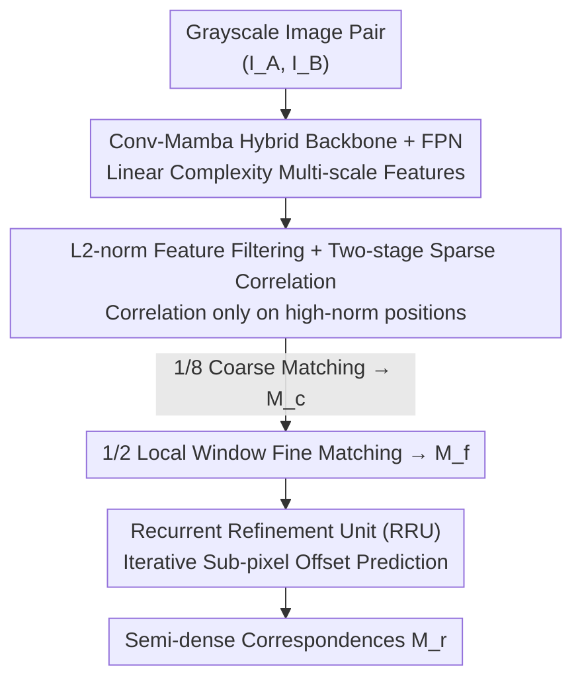

# Scalable Feature Matching via State Space Modeling and Sparse Correlation

**Conference**: CVPR 2026  
**Paper**: [CVF Open Access](https://openaccess.thecvf.com/content/CVPR2026/html/Choo_Scalable_Feature_Matching_via_State_Space_Modeling_and_Sparse_Correlation_CVPR_2026_paper.html)  
**Code**: https://github.com/Band-127/SLiM  
**Area**: 3D Vision  
**Keywords**: Feature Matching, State Space Models (Mamba), Sparse Correlation, High-Resolution Scalability, Semi-Dense Matching

## TL;DR
SLiM utilizes a "Conv-Mamba linear-complexity backbone + L2-norm guided sparse correlation + lightweight recurrent coordinate refinement" triad to liberate semi-dense feature matching from quadratic computational costs. On MegaDepth, it achieves AUC@5°=57.9 with only 5.9M parameters (1.5 points higher than Efficient LoFTR). At 1200×1200 resolution, it reduces memory consumption by 45% compared to JamMa and is 1.8× faster than Efficient LoFTR.

## Background & Motivation
**Background**: Current mainstream "detector-free / semi-dense" matchers (LoFTR, MatchFormer, ASpanFormer, Efficient LoFTR, etc.) follow a coarse-to-fine pipeline. They first establish initial correspondences through global correlation on 1/8 coarse-scale features and then refine them in local windows at a fine scale. These methods model global context effectively using transformer cross-view/cross-scale attention, achieving state-of-the-art accuracy.

**Limitations of Prior Work**: The overhead of such methods expands **quadratically** with spatial resolution due to two factors: first, vanilla transformer attention is naturally $O(N^2)$; second, the coarse matching stage requires computing a **complete correlation matrix** between all positions in both images, with a complexity of $O(W^2H^2)$. Since matching precision relies heavily on high input resolution, memory and latency become prohibitive for latency-sensitive or resource-constrained scenarios (e.g., SLAM, mobile localization) at resolutions like 1200×1200.

**Key Challenge**: Accuracy requires high resolution, but "global context modeling" and "full correlation" become computational bottlenecks at high resolutions—accuracy and efficiency are in direct conflict along the resolution axis.

**Goal**: Design an end-to-end efficient matching pipeline that addresses both quadratic bottlenecks by replacing the backbone with linear-complexity global modeling and shifting from "full" to "salient-only" correlation without sacrificing precision.

**Key Insight**: The authors leverage two key observations. First, State Space Models (Mamba/SS2D) maintain a global receptive field with linear complexity, making them ideal for replacing transformers in high-resolution context modeling. Second, a phenomenon frequently validated in OOD detection—but underutilized in matching—is that **discriminative (in-distribution) features tend to have larger L2 norms** when optimized with log-likelihood loss. Thus, the norm itself serves as a training-free "saliency prior" to filter out redundant positions.

**Core Idea**: Use Conv-Mamba to reduce global modeling to linear complexity, replace full correlation with sparse correlation via "L2-norm filtering," and substitute expectation-based regression with a lightweight recurrent network. The method is named SLiM (Salient Lightweight Matching).

## Method

### Overall Architecture
SLiM takes a pair of grayscale images $(I_A, I_B) \in \mathbb{R}^{H\times W\times 1}$ as input and outputs a semi-dense set of sub-pixel correspondences. The pipeline consists of three sequential stages: first, a **Conv-Mamba hybrid backbone + FPN** extracts multi-scale feature pyramids $\{F^A_l\}, \{F^B_l\}$ and performs cross-view/cross-scale context fusion; second, **Two-stage Sparse Correlation** is performed—at the 1/8 coarse scale, correlation and dual-softmax are computed only for "high L2-norm" salient positions to produce initial matches $M_c$, followed by local-window correlation at the 1/2 fine scale to obtain $M_f$; finally, a lightweight **Recurrent Refinement Unit (RRU)** iteratively predicts sub-pixel offsets to refine $M_f$ into the final correspondences $M_r$.

### Key Designs

**1. Conv-Mamba Hybrid Backbone + FPN: Replacing Transformer Global Modeling with Linear Complexity**

This design targets the quadratic complexity of transformer attention. The backbone comprises three levels, interleaving the local inductive bias of convolutions with the global receptive field of SS2D (the structured spatial scanning of VMamba). The first level uses a 7×7 large-kernel ConvNeXt block to preserve high-frequency details, yielding $F_1 \in \mathbb{R}^{\frac{H}{2}\times\frac{W}{2}\times 48}$. The second level stacks a ConvNeXt and an SS2D block to produce $F_2 \in \mathbb{R}^{\frac{H}{4}\times\frac{W}{4}\times 96}$. The third level adds an SS2D block and two "Aggregation Modules" (each containing InceptionNeXt + SS2D) to output high-level features $F_3 \in \mathbb{R}^{\frac{H}{8}\times\frac{W}{8}\times 192}$.

Cross-view fusion occurs within the SS2D blocks through an elegant "Concatenate-Scan-Split" process: paired features are concatenated along the width dimension to form $F_{AB}\in\mathbb{R}^{H\times 2W\times C}$, scanned in four directions through parallel Mamba blocks, and then split and averaged to obtain $\tilde{F}_A, \tilde{F}_B$ embedded with mutual context. This single scanning pass allows features from both images to "see" each other, avoiding pairwise attention. Cross-scale fusion is handled by a convolutional FPN that merges deep semantics with shallow details: $F_l^{\text{fused}} = \text{Conv}\big(\text{Conv}_{1\times1}(F_l) + \text{Up}(F_{l+1}^{\text{fused}})\big)$.

**2. L2-norm Feature Filtering + Two-stage Sparse Correlation: Eliminating Quadratic Overhead in Coarse Matching**

This is the core efficiency optimization, addressing the $O(W^2H^2)$ bottleneck of full correlation. Borrowing insights from OOD detection where log-likelihood optimization encourages larger L2 norms for in-distribution features, the authors use the **L2 norm as a training-free saliency metric**. Geometric structures (e.g., buildings) naturally exhibit high norms, while textureless backgrounds exhibit low norms. At the 1/8 coarse scale, candidate positions are filtered via a threshold $\eta$:

$$\mathcal{G}^A = \{\, i \mid \|F^A_{3,i}\|_2 > \eta \,\}, \quad \mathcal{G}^B = \{\, j \mid \|F^B_{3,j}\|_2 > \eta \,\}$$

Subsequent correlation and dual-softmax are computed **only on the high-norm subset $\mathcal{G}^A \times \mathcal{G}^B$**. The coarse correlation is $C^c_{ij} = \frac{\langle F^A_{3,i}, F^B_{3,j}\rangle}{\sqrt{d}}$ ($d=192$), and the dual-softmax probability is $P^c_{ij} = \text{softmax}_i(C^c_{ij})\cdot\text{softmax}_j(C^c_{ij})$. Positions that are mutual nearest neighbors with $P^c_{ij}>\tau_c$ form $M_c$. The fine stage crops $k\times k$ ($k=4$) windows around each $M_c$ at the 1/2 scale, computes window-wise correlation $C^f_{pq}$ and dual-softmax $P^f_{pq}$, and maps them to 2D offsets to obtain $M_f$.

**3. Recurrent Refinement Unit (RRU): Enhancing Sub-pixel Precision via Iterative Optimization**

Traditional LoFTR-style methods use expectation-based coordinate regression, which assumes a unimodal probability distribution and fails under matching ambiguity or noise. RRU adopts a recurrent architecture similar to optical flow, reframing sub-pixel refinement as an **iterative coordinate optimization task**. This lightweight module (816K parameters, 32-dim hidden state) achieves high-precision localization in $T=4$ iterations.

In each iteration, $k\times k$ windows $W^A, W^B_t$ are cropped around current coordinates $(x^A, x^B_t)$ from original-scale features. Concatenated features are processed by depthwise separable convolutions and an MLP to update the hidden state $h_t$, which decodes into a sub-pixel displacement map $\Delta x_t$ and confidence weights $w_t$. The target coordinate is updated via weighted averaging while $x^A$ remains fixed: $x^B_{t+1} \leftarrow x^B_t + \sum_{i=1}^{k\times k} w^{(i)}_t \Delta x^{(i)}_t$.

### Loss & Training
The model is supervised by three combined losses. The matching losses for coarse and fine score matrices use negative log-likelihood: $\mathcal{L}_c = -\frac{1}{|M^{gt}_c|}\sum_{i,j\in M^{gt}_c}\log P^c(i,j)$, with $\mathcal{L}_f$ defined similarly. The refinement loss supervises all intermediate iterations with exponentially decayed L2 loss: $\mathcal{L}_r = \sum_{t=1}^{T}\gamma^{T-t}\lVert x^B_{gt}-x^B_t\rVert_2$ ($\gamma=0.8$). The total objective is $\mathcal{L} = \alpha\mathcal{L}_c + \beta\mathcal{L}_f + \lambda\mathcal{L}_r$, where $\alpha=0.25,\ \beta=0.2,\ \lambda=1.0$. Training is conducted on MegaDepth using AdamW with an initial learning rate of $1\times10^{-3}$ and batch size 6 for 19 epochs.

## Key Experimental Results

### Main Results

Relative pose estimation on MegaDepth (1200×1200 outdoor) and ScanNet (640×480 indoor). AUC@5°/10°/20° (higher is better) and inference time (lower is better) are reported. † denotes the 1-iteration variant; ‡ denotes tuned RANSAC thresholds:

| Method | Params(M) | MegaDepth AUC@5° | ScanNet AUC@5° | MegaDepth Time(ms) |
|------|--------|------|------|------|
| LoFTR | 11.6 | 52.8 | 16.9 | 315.4 |
| ASpanFormer | 15.8 | 55.3 | 19.6 | 332.2 |
| Efficient LoFTR | 16.0 | 56.4 | 19.2 | 139.2 |
| JamMa | 5.7 | 55.4 | 14.5 | 181.3 |
| **SLiM** | **5.9** | **57.9** | 18.0 | **77.0** |
| SLiM † (1 iter) | 5.9 | 57.6 | 17.7 | 65.3 |
| SLiM ‡ (tuned RANSAC) | 5.9 | **60.1** | 18.2 | 77.0 |

Ours (SLiM) achieves semi-dense SOTA with 57.9 AUC on MegaDepth using 5.9M parameters (approx. 50.9% of LoFTR), outperforming Efficient LoFTR by 1.5 points while being 1.8× faster.

### Ablation Study

Comparison of filtering metrics (using different saliency measures under the same threshold):

| Filtering Metric | MegaDepth AUC@5° | MegaDepth Time(ms) | ScanNet AUC@5° | ScanNet Time(ms) |
|---------|------|------|------|------|
| No Filtering | 57.9 | 128.7 | 17.4 | 41.1 |
| Mean | 55.1 | 65.0 | 0.6 | 31.7 |
| Variance | 57.2 | 78.4 | 15.1 | 35.0 |
| **L2 Norm** | 57.6 | 77.0 | **17.7** | **23.9** |

Plug-and-play generalization (inserting L2 filtering into existing matchers without retraining; ⋆ denotes modified variant):

| Method | MegaDepth AUC@5° | Time(ms) |
|------|------|------|
| LoFTR | 52.8 | 315.4 |
| LoFTR⋆ | 53.2 | 268.9 |
| Efficient LoFTR | 56.4 | 139.2 |
| Efficient LoFTR⋆ | 56.1 | 76.0 |

### Key Findings
- **L2-norm filtering provides efficiency with negligible precision loss**: On MegaDepth, filtering reduces latency from 128.7ms to 77.0ms with a minor AUC drop (57.9 to 57.6). On ScanNet, it reduces latency and improves AUC (17.4 to 17.7).
- **Metric choice is critical**: Mean filtering collapses on ScanNet (0.6 AUC), whereas L2 norm effectively distinguishes salient regions.
- **Scalability at High Resolution**: At 1200×1200, SLiM saves 45% VRAM vs. JamMa and is 1.8× faster than Efficient LoFTR, with complexity growth being near-linear.

## Highlights & Insights
- **Repurposing OOD "norm-as-saliency" for matching** provides a zero-parameter, training-free bottleneck reducer.
- **Deep integration of Conv and Mamba**: By utilizing "Concatenate-Scan-Split," cross-view fusion is achieved in a single SS2D pass, a more thorough SSM adaptation than simple transformer-to-Mamba replacement.
- **Refinement as an Optimization Task**: The RRU's ability to handle multi-modal distributions and provide an adjustable precision-speed "knob" (via iteration count) offers high practical value.

## Limitations & Future Work
- **Gap with Dense Matchers**: Precision (57.9) still trails dense models like RoMa (62.6), which typically use larger, more diverse training datasets.
- **Threshold Sensitivity**: The optimal threshold $\eta$ is architecture-dependent, requiring per-method tuning for plug-and-play applications.
- **Indoor Performance**: On ScanNet, SLiM is slightly behind Efficient LoFTR. The robustness of the norm-saliency prior in low-texture indoor environments warrants further investigation.

## Related Work & Insights
- **vs. LoFTR / Efficient LoFTR**: While both use coarse-to-fine strategies, SLiM removes quadratic bottlenecks using a linear Conv-Mamba backbone and L2-norm sparse correlation.
- **vs. JamMa**: Both use Mamba, but SLiM's hybrid architecture is 2.4× faster at high resolutions and more accurate on MegaDepth.
- **vs. DKM / RoMa**: Dense matchers offer higher accuracy but are significantly slower (e.g., RoMa at 1176.8ms vs. SLiM at 77ms).

## Rating
- Novelty: ⭐⭐⭐⭐
- Experimental Thoroughness: ⭐⭐⭐⭐
- Writing Quality: ⭐⭐⭐⭐
- Value: ⭐⭐⭐⭐

<!-- RELATED:START -->

## Related Papers

- [\[CVPR 2026\] TextFM: Robust Semi-dense Feature Matching with Language Guidance](textfm_robust_semi-dense_feature_matching_with_language_guidance.md)
- [\[CVPR 2026\] Hyper-PCN: Hypergraph-Based Point Cloud Completion via High-Order Correlation Modeling](hyper-pcn_hypergraph-based_point_cloud_completion_via_high-order_correlation_mod.md)
- [\[CVPR 2026\] AsymLoc: Towards Asymmetric Feature Matching for Efficient Visual Localization](asymloc_towards_asymmetric_feature_matching_for_efficient_visual_localization.md)
- [\[CVPR 2026\] RayNova: Scale-Temporal Autoregressive World Modeling in Ray Space](raynova_scale-temporal_autoregressive_world_modeling_in_ray_space.md)
- [\[NeurIPS 2025\] MVSMamba: Multi-View Stereo with State Space Model](../../NeurIPS2025/3d_vision/mvsmamba_multi-view_stereo_with_state_space_model.md)

<!-- RELATED:END -->
