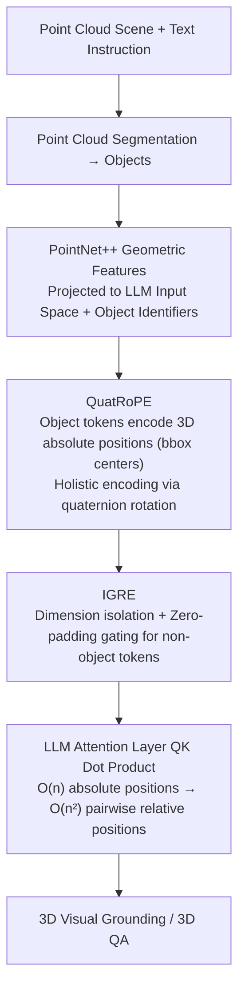

# Scalable Object Relation Encoding for Better 3D Spatial Reasoning in Large Language Models

**Conference**: CVPR 2026  
**arXiv**: [2603.24721](https://arxiv.org/abs/2603.24721)  
**Code**: [https://github.com/oceanflowlab/QuatRoPE](https://github.com/oceanflowlab/QuatRoPE)  
**Area**: 3D Vision / Multimodal VLM  
**Keywords**: 3D Spatial Reasoning, Positional Encoding, Quaternion Rotation, Large Language Models, 3D Vision-Language

## TL;DR

The authors propose QuatRoPE, a 3D positional encoding method based on quaternion rotation, which preserves all $O(n^2)$ spatial relations between objects using only $O(n)$ input tokens. Combined with the IGRE mechanism to reduce interference with language RoPE, it achieves significant improvements across several 3D vision-language benchmarks.

## Background & Motivation

1. **Background**: 3D spatial reasoning requires models to locate target objects based on spatial relationships (e.g., "to the left of the table"), which is a core capability for 3D Visual Grounding (3D VG) and 3D Visual Question Answering (3D VQA). Due to the scarcity of 3D scene-text paired data, the current mainstream approach involves injecting point cloud features into the LLM input space to leverage the LLM's pre-trained reasoning capabilities.

2. **Limitations of Prior Work**: Existing methods primarily use two types of encoding, both with flaws:
    - **Absolute Positional Encoding** (e.g., Chat-Scene, LEO): 3D coordinates are fused too early with geometric features, making it difficult for the LLM to extract spatial relations from these mixed features.
    - **Explicit Pairwise Relation Encoding** (e.g., 3DGraphLLM): Uses additional tokens to represent pairwise relations, but the number of tokens grows quadratically with the number of objects (e.g., 554 objects would generate over 150,000 relation pairs), far exceeding the LLM input limit. KNN pruning strategies reduce tokens, but "nearest neighbors $\neq$ relevance," potentially missing critical spatial relations.

3. **Key Challenge**: How to enable the model to perceive all pairwise spatial relations while maintaining a linear input length?

4. **Goal**
    - Encode $O(n^2)$ spatial relations within $O(n)$ tokens.
    - Avoid spurious similarities caused by independent axis encoding.
    - Integrate spatial positional encoding with language RoPE without interference.

5. **Key Insight**: Drawing from the mechanism of RoPE (Rotary Positional Embedding) which converts absolute positions to relative ones, absolute coordinates can be encoded on each object token, and pairwise relative positions can be automatically calculated through the dot product in the attention layer.

6. **Core Idea**: Use quaternion rotation for holistic vector encoding of 3D coordinates, making the attention score dependent only on the relative position difference between objects.

## Method

### Overall Architecture

The input consists of a point cloud scene and text instructions. First, the point cloud is segmented into objects. Features of each object (geometric features extracted by PointNet++) are projected into the LLM input space, and object identifiers (e.g., `<obj005>`) are assigned. Each object corresponds to several object-related tokens. QuatRoPE encodes the 3D absolute positions (bounding box centers) of objects on these tokens, which are automatically converted into pairwise relative positions via the QK dot product in attention layers. The IGRE mechanism ensures that QuatRoPE only affects the attention between object tokens and does not interfere with language tokens.

### Key Designs

**1. QuatRoPE: Generalizing "Encode Absolute, Calculate Relative" from 1D to 3D using Quaternion Rotation**

Explicit pairwise relation encoding leads to a quadratic explosion of tokens, while concatenating absolute coordinates directly into features disrupts the LLM's understanding of the input. QuatRoPE seeks to achieve both: each object token carries only one absolute coordinate, and the dot product in the attention layer automatically expands it into relative positions—generalizing the original RoPE's logic of "rotate absolute positions, dot product yields relative positions" from 1D sequences to 3D. Specifically, query/key vectors are sliced into several 3D segments (treated as pure quaternions $\vec{q},\vec{k}$) and subjected to a quaternion rotation $f(\vec{q}, \vec{m}) = Q(\vec{m})\,\vec{q}\,Q^{-1}(\vec{m})$ based on the object's bounding box center $\vec{m}$, where the rotation operator $Q(\vec{m})$ is decomposed into rotations around three coordinate axes via Euler angles. The paper proves that if the frequency function $\theta$ takes a linear form, the dot product of two rotated vectors depends only on the coordinate difference $\vec{m}-\vec{n}$:

$$\langle f(\vec{q},\vec{m}),\, f(\vec{k},\vec{n})\rangle = g(\vec{q},\vec{k},\,\vec{m}-\vec{n})$$

Thus, absolute coordinates distributed across $O(n)$ tokens are implicitly reconstructed into all $O(n^2)$ pairwise relative positions through an attention layer, without exploding token counts or losing relations.

The key lies in "holistic vector encoding" rather than splitting coordinates across different dimension segments by axis as in M-RoPE. For example, if two objects A and B on a table have nearly the same height ($z$-coordinate) but are 3 meters apart horizontally, the $z$-axis dimension in M-RoPE would yield a spuriously high dot product because the coordinate difference is near 0, misidentifying them as "neighbors." QuatRoPE ensures each dimension is modulated by the full 3D coordinates; only objects truly close in 3D space receive high attention, fundamentally avoiding "spurious neighbors."

**2. IGRE: Isolating Spatial RoPE and Language RoPE in Different Dimensions via Zero-Padding Gating**

Given the scarcity of 3D scene-text data, it is impossible to train an LLM with both language and spatial RoPE from scratch. Directly superimposing QuatRoPE onto all dimensions of all tokens would rotate against the pre-trained language RoPE, destroying existing language capabilities. IGRE uses isolation: it appends an extra set of dimensions to the query/key of object tokens and applies QuatRoPE rotation, while non-object tokens (system prompts, questions) are zero-padded in those dimensions. Consequently, language RoPE and QuatRoPE occupy distinct dimensions without interference, and the spatial dimension contribution in the dot product is non-zero only when both sides are object tokens—acting as a natural gate where spatial adjustments only occur between objects.

The zero-padding step is crucial: if non-object tokens participated without rotation, it would be equivalent to placing them at the origin $(0,0,0)$, misleading the model to over-attend to objects near the origin. Zero-padding ensures their contribution in the expanded dimensions is zero, preventing incorrect localization while maximizing the preservation of the LLM's original language understanding and reasoning.

**3. ASR Benchmark: Forcing Models to Rely Solely on Spatial Relations for Localization**

Descriptions in existing benchmarks like ScanRefer and SQA3D often mix spatial relations with object attributes (color, category, etc.). A model might correctly guess the answer by recognizing "red chair" alone, bypassing real spatial reasoning. ASR is constructed by subtraction: it selects questions with unique answer object names from ScanQA, removes all descriptions that leak target attributes, and leaves only questions that "must rely on spatial relations to locate," then converts them into a 3D VG multiple-choice format to eliminate language generation bias. For instance, "What is the object in front of the tall white shelf?" is rewritten as "The object in front of the tall white shelf." The model must correctly compute the "in front of" relation to select the right target.

### Loss & Training

The model uses LoRA (rank=16, $\alpha$=16) to fine-tune the LLM with a learning rate of $2 \times 10^{-5}$. Training data is a joint dataset of ScanRefer, Multi3DRef, ScanQA, and SQA3D. The frequency parameters of QuatRoPE vary with 3D segments, following an exponential decay design similar to the original RoPE.

## Key Experimental Results

### Main Results

Results on ScanRefer, Multi3DRef, and SQA3D benchmarks (using GT segmentation):

| Model | ScanRefer Acc@0.25 | ScanRefer Acc@0.5 | Multi3DRef F1@0.25 | SQA3D EM@1 |
|------|-------------------|-------------------|-------------------|------------|
| Chat-Scene-1B | 50.7 | 50.3 | 53.3 | 50.7 |
| Chat-Scene-1B + QuatRoPE | **55.4** | **55.0** | **58.1** | **53.1** |
| 3DGraphLLM-1B | 55.9 | 55.8 | 58.6 | 51.1 |
| 3DGraphLLM-1B + QuatRoPE | **58.3** | **58.2** | **60.7** | **53.2** |
| Chat-Scene-7B (Mask3D) | 55.5 | 50.2 | 57.1 | 54.6 |
| Chat-Scene-7B + QuatRoPE | **57.8** | **52.2** | **59.5** | **54.7** |

### Ablation Study

Comparison of different positional encoding methods (based on Chat-Scene-1B + IGRE):

| Encoding Method | ScanRefer Acc@0.25 | ScanRefer Acc@0.5 | SQA3D EM@1 | Description |
|---------|-------------------|-------------------|------------|------|
| None | 50.72 | 50.33 | 50.72 | Baseline |
| Raw Coordinates | 52.26 | 52.01 | 51.40 | Direct addition of absolute coordinates |
| M-RoPE | 54.30 | 53.92 | 51.55 | Independent axis encoding |
| QuatRoPE | **55.44** | **55.00** | **53.14** | Holistic vector encoding |

Zero-shot results on the ASR spatial reasoning benchmark (3DGraphLLM-8B):

| Model | ASR Acc@0.25 | Gain |
|------|-------------|------|
| 3DGraphLLM (w/o QuatRoPE) | 37.50 | — |
| 3DGraphLLM + QuatRoPE | **41.96** | +4.46 (11.9%) |

### Key Findings

- QuatRoPE achieves consistent gains across all baselines and metrics, with the largest gain on ScanRefer (approx. +4-5 percentage points), indicating that explicit spatial relation encoding helps localization tasks most.
- IGRE significantly outperforms the Trans-Additive combination method, validating the necessity of isolation and gating mechanisms.
- The smaller the single-axis coordinate difference $\delta$ between objects, the larger the advantage of QuatRoPE over M-RoPE (gain reaches 5.83% when $\delta=0.1$), confirming the effectiveness of holistic vector encoding in avoiding spurious neighbors.
- On the ASR pure spatial reasoning benchmark, QuatRoPE brings a relative improvement of 12-19%, directly validating the method's enhancement of spatial reasoning capabilities.

## Highlights & Insights

- **Linear Input Encoding Quadratic Relations**: By skillfully utilizing the dot product property of the attention mechanism, $O(n)$ absolute positions are automatically converted into $O(n^2)$ relative positions. This design is both elegant and efficient. This "encode absolute, calculate relative" logic can be transferred to any scenario requiring pairwise relations (e.g., molecular conformations, social networks).
- **Quaternion Holistic Encoding**: Unlike the spurious neighbor problem in independent axis RoPE, quaternion rotation ensures every dimension of the query/key is modulated by the complete 3D coordinates, fundamentally solving attention inflation caused by single-axis proximity.
- **Exquisite IGRE Design**: Zero-padding non-object tokens + dimension isolation preserves original LLM capabilities while introducing 3D spatial information in a gated manner. This offers a general paradigm for multimodal RoPE extensions.

## Limitations & Future Work

- QuatRoPE assumes objects are represented by bounding box centers, ignoring shape and size information, which may be insufficient for relations requiring precise geometry like "on the surface of X."
- Validated only on ScanNet indoor scenes; large-scale outdoor scenes (with sparser object distributions and larger coordinate ranges) remain untested.
- While the ASR benchmark excludes attributes, it still originates from ScanQA and has a limited data volume (only used for zero-shot evaluation).
- Frequency parameters for quaternion rotation currently use fixed exponential decay; learnable frequencies could be explored to adapt to scenes of different scales.

## Related Work & Insights

- **vs 3DGraphLLM**: 3DGraphLLM explicitly encodes spatial relations through extra tokens but faces $O(n^2)$ scaling issues and KNN pruning errors. QuatRoPE achieves implicit computation of all relations within $O(n)$ via positional encoding, making it more scalable.
- **vs M-RoPE (Qwen2-VL)**: M-RoPE maps dimension segments to different axes, leading to single-axis similarity inflation. QuatRoPE eliminates this problem via quaternion rotation.
- **vs Chat-Scene**: Chat-Scene integrates absolute coordinates into object features, where spatial information is implicit and sparse. QuatRoPE provides explicit spatial relations naturally computed through attention.

## Rating

- Novelty: ⭐⭐⭐⭐⭐ The idea of quaternion rotary positional encoding is highly novel with complete mathematical derivation.
- Experimental Thoroughness: ⭐⭐⭐⭐ Multi-baseline comparison + multiple datasets + ablation analysis + dedicated ASR benchmark, though limited to the ScanNet series.
- Writing Quality: ⭐⭐⭐⭐⭐ Clear motivation, rigorous derivation, and intuitive charts.
- Value: ⭐⭐⭐⭐ Provides a general positional encoding solution for 3D LLM spatial reasoning, pluggable into various architectures.

<!-- RELATED:START -->

## Related Papers

- [\[CVPR 2026\] Masking Matters: Unlocking the Spatial Reasoning Capabilities of LLMs for 3D Scene-Language Understanding](masking_matters_unlocking_the_spatial_reasoning_capabilities_of_llms_for_3d_scen.md)
- [\[ICLR 2026\] Do 3D Large Language Models Really Understand 3D Spatial Relationships?](../../ICLR2026/3d_vision/do_3d_large_language_models_really_understand_3d_spatial_relationships.md)
- [\[CVPR 2026\] ORD: Object-Relation Decoupling for Generalized 3D Visual Grounding](ord_object-relation_decoupling_for_generalized_3d_visual_grounding.md)
- [\[CVPR 2026\] Scal3R: Scalable Test-Time Training for Large-Scale 3D Reconstruction](scal3r_scalable_test-time_training_for_large-scale_3d_reconstruction.md)
- [\[CVPR 2026\] OLATverse: A Large-scale Real-world Object Dataset with Precise Lighting Control](olatverse_a_large-scale_real-world_object_dataset_with_precise_lighting_control.md)

<!-- RELATED:END -->
