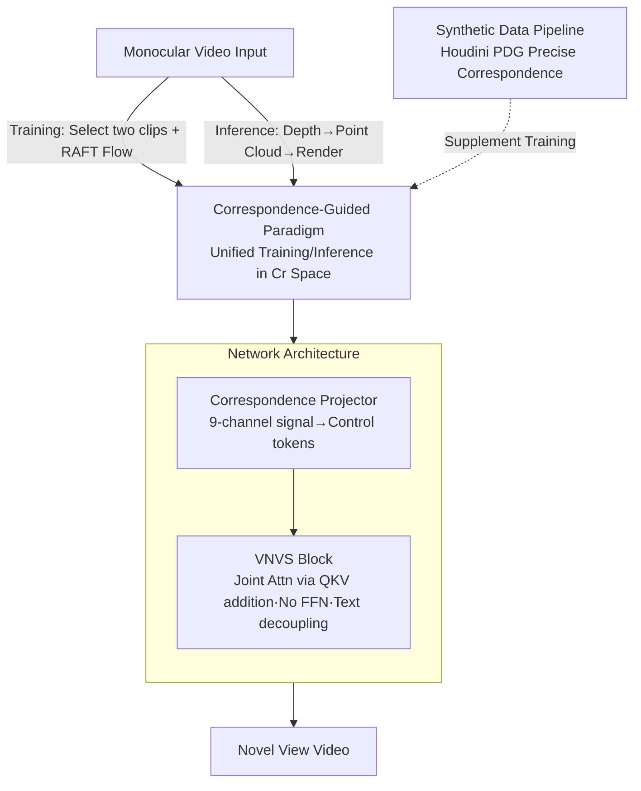

# Scaling4D: Pushing the Frontier of Video Novel View Synthesis through Large-Scale Monocular Videos

**Conference**: CVPR 2026  
**Paper**: [CVF Open Access](https://openaccess.thecvf.com/content/CVPR2026/html/Cai_Scaling4D_Pushing_the_Frontier_of_Video_Novel_View_Synthesis_through_CVPR_2026_paper.html)  
**Code**: Project Page https://rainbowrui.github.io/scaling4d/  
**Area**: 3D Vision / Video Generation  
**Keywords**: Video Novel View Synthesis, Correspondence Guidance, Monocular Video, Diffusion Models, Scalable Training

## TL;DR
Scaling4D reformulates Video Novel View Synthesis (VNVS) from "rendering point clouds followed by inpainting" into a "correspondence-guided generation task." This enables self-supervised training using massive amounts of real-world monocular videos, bridging the training-inference gap of previous methods. It outperforms methods like GEN3C and TrajectoryCrafter on both single-view and multi-view benchmarks, with performance scaling consistently with data volume.

## Background & Motivation
**Background**: Video Novel View Synthesis (VNVS) aims to render a dynamic scene from arbitrary novel camera viewpoints given a monocular video. Due to the sparsity of input information in single-view scenarios, reconstruction or optimization methods such as 4D Gaussian Splatting or Dynamic NeRF are often inapplicable. Recent mainstream approaches leverage the priors of large video generation models (e.g., Wan, Hunyuan Video) to "generate" novel views.

**Limitations of Prior Work**: Training VNVS suffers from a lack of large-scale multi-view video data. Existing routes are limited: (1) Using only synthetic multi-view data (e.g., ReCamMaster), where the data is controllable but diversity is constrained by assets and scenes; (2) Converting the task into video inpainting (e.g., GEN3C, TrajectoryCrafter)—estimating depth $\rightarrow$ converting to dynamic point clouds $\rightarrow$ rendering to the target view to obtain a sparse map $\rightarrow$ using an inpainting model for completion.

**Key Challenge**: The inpainting route exhibits a **training-inference gap**. During training, the model learns to "fill holes," but novel view synthesis essentially requires "viewing the same object from a different angle." As illustrated in Figure 2 of the paper, in a novel view, the red-boxed area should reveal the back of a person, yet inpainting incorrectly fills it with background pixels—it lacks the concept that the other side of an object should exist there.

**Goal**: Can VNVS be trained directly on large-scale real monocular videos while completely eliminating the training-inference gap?

**Key Insight**: The authors seek a "bridge" that serves as a control condition for VNVS and naturally exists in abundance in real monocular videos. The answer is **pixel correspondence**: rendering a point cloud from an input video to a novel view establishes pixel correspondence between the source and target views; meanwhile, in any monocular video, correspondence between adjacent frames can be obtained via optical flow.

**Core Idea**: Unify training and inference using "correspondence." During inference, correspondence is derived from depth and point cloud rendering; during training, it is derived from optical flow. Since both reside in the same "correspondence space," any monocular video can be used for self-supervised training, ensuring the inference scenario is always a subset of the training distribution.

## Method

### Overall Architecture
The input to Scaling4D is a monocular source video $\mathbf{I}^s$ and a set of target camera poses $\mathbf{T}^r$, and the output is the video from the novel viewpoint. The core mechanism compresses the old paradigm $\mathbf{I}^s \xrightarrow{\Phi^{-1}} \mathcal{P} \xrightarrow{\mathbf{T}^r} \mathbf{T}^r\mathcal{P} \xrightarrow{\Phi} \mathbf{I}^r \xrightarrow{G_\theta} \mathbf{I}^*$ (depth back-projection $\rightarrow$ pose transformation $\rightarrow$ projection $\rightarrow$ generation) into $\mathbf{I}^s \xrightarrow{\mathbf{C}^r} \mathbf{I}^r \xrightarrow{G_\theta} \mathbf{I}^*$, because the sequence of projection-transformation-back-projection is equivalent to a correspondence $\mathbf{C}^r$ on the 2D plane. During training, two clips are selected from a monocular video as source/target, and $\mathbf{C}^r$ is computed using RAFT optical flow to form a self-supervised loop. During inference, depth estimation from GeometryCrafter is used to generate $\mathbf{C}^r$ via point cloud rendering. This is supplemented by a synthetic data pipeline and a network architecture (Correspondence Projector + VNVS Block) to inject correspondence into a large video generation model.

### Key Designs

**1. Correspondence-Guided Paradigm: Upgrading VNVS to Unified Correspondence Space Generation**

Addressing the training-inference gap of previous methods, the authors note that the compound operation $\Phi \circ \mathbf{T}^r \circ \Phi^{-1}$ in the old paradigm essentially defines a correspondence $\mathbf{C}^r \in \mathbb{R}^{n\times 2\times h\times w}$ on the 2D image plane, such that $\mathbf{C}^r \Longleftrightarrow \Phi \circ \mathbf{T}^r \circ \Phi^{-1}$. By substituting this, the framework simplifies to $\mathbf{I}^s \xrightarrow{\mathbf{C}^r} \mathbf{I}^r \xrightarrow{G_\theta} \mathbf{I}^* \Leftarrow \mathbf{I}^t$, where $\mathbf{I}^s \to \mathbf{I}^r$ represents warping based on correspondence rather than rendering.

This modification allows any wild monocular video to provide training data by **sampling two clips as source $\mathbf{I}^s$ and target $\mathbf{I}^t$**, with supervision provided by the ground truth $\mathbf{I}^t$. While inference correspondence comes from depth and point clouds, it occupies the same correspondence space—all inference scenarios (including large viewpoint changes) become subsets of the correspondence patterns seen during training, fundamentally eliminating the gap. If multiple source pixels map to the same target pixel during warping, one is selected randomly during training, and the one with the smallest depth (z-buffer) is used during inference. The final control signal is $(\mathbf{I}^s, \mathbf{C}^r, \mathbf{I}^r, \mathbf{M}^r) \in \mathbb{R}^{n\times 9\times h\times w}$.

**2. Synthetic Data Pipeline: Precise Correspondence and Diverse Motion via Houdini PDG**

Since the correspondence accuracy in real videos is limited by optical flow noise, a synthetic pipeline is used as a supplement. Built with Houdini’s Procedural Dependency Graph (PDG), it uses USD format assets with variants for diverse appearances. The pipeline includes combined scenes based on SpatialLM layouts, procedural humans with randomized features/actions, and smooth camera trajectories sampled in 3D space with strict obstacle avoidance. For synthetic scenes, $\mathbf{I}^s, \mathbf{I}^t, \mathcal{P}$, and $\mathbf{T}^r$ are known, allowing for the calculation of exact $\mathbf{C}^r$.

**3. Architecture: Correspondence Projector + VNVS Block for Injection**

To feed the 9-channel control signal into an MMDiT model originally designed for "text + video," two modules are designed. The **Correspondence Projector** uses convolutional layers and a patchify layer to encode the signal into control tokens $\mathbf{F}_{\text{cor}}$ aligned with the DiT latent tokens. The **VNVS Block** is inserted between pre-trained blocks, taking video features $\mathbf{F}_{\text{vid}}$ and control tokens $\mathbf{F}_{\text{cor}}$. It updates only video features while keeping text features unchanged. The attention is formulated as:

$$\mathbf{F}_{\text{vid}} \leftarrow \mathbf{F}_{\text{vid}} + \mathrm{Attn}(\mathbf{Q}_{\text{vid}}+\mathbf{Q}_{\text{cor}},\ \mathbf{K}_{\text{vid}}+\mathbf{K}_{\text{cor}},\ \mathbf{V}_{\text{vid}}+\mathbf{V}_{\text{cor}})$$

Q/K/V projections of video and control tokens are **added** for joint attention—justified by their spatial alignment. Two design choices are critical: (1) Explicit decoupling from text tokens to preserve prompt-following; (2) Omitting FFN layers, as FFNs carry long-term memory while attention carries instantaneous context; "controllability" belongs to the latter.

### Loss & Training
Training utilizes a standard flow matching loss, with correspondence between source/target clips as the self-supervised control condition. Each video contains 49 frames at 480×480 resolution. RAFT follows for training correspondence, and GeometryCrafter for inference depth. Training is conducted on 64 A100 GPUs with a world batch size of 256 and a learning rate of $4\times10^{-5}$. Real data comes from SpatialVID (~3 million monocular videos), supplemented by 10k synthetic samples.

## Key Experimental Results

### Main Results (Single-view dataset, 400 clips from Panda-70M)

| Method | FID ↓ | FVD ↓ | CLIP-V ↑ | RotErr ↓ | TransErr ↓ |
|------|-------|-------|----------|----------|------------|
| GEN3C | 69.35 | 442.70 | 90.14 | 6.98 | 299.68 |
| TrajectoryCrafter | 68.94 | 425.20 | 90.41 | 6.65 | 320.38 |
| Voyager | 68.41 | 414.89 | 91.07 | 7.04 | 347.57 |
| ReCamMaster-Wan | 83.71 | 635.86 | 86.21 | 12.29 | 737.71 |
| **Ours** | **62.83** | **411.17** | **91.81** | **6.48** | **286.77** |

Ours achieves SOTA across all metrics. Inpainting-based methods (GEN3C, Voyager, TrajectoryCrafter) exhibit severe artifacts or holes in occluded areas. ReCamMaster-Wan, using implicit geometry (camera matrices), results in nearly static trajectories and generalizes poorly to novel movements.

### Main Results (iPhone dataset, pixel-wise evaluation with ground truth)

| Method | PSNR ↑ | SSIM ↑ | LPIPS ↓ |
|------|--------|--------|---------|
| GEN3C | 14.09 | 0.304 | 0.531 |
| TrajectoryCrafter | 14.13 | 0.309 | 0.539 |
| Voyager | 14.03 | 0.303 | 0.513 |
| ReCamMaster-Wan | 10.25 | 0.318 | 0.709 |
| **Ours** | **14.85** | **0.336** | **0.468** |

### Ablation Study (Single-view dataset)

| Config | FID ↓ | FVD ↓ | RotErr ↓ | TransErr ↓ |
|------|-------|-------|----------|------------|
| Full model | 62.83 | 411.17 | 6.48 | 286.77 |
| + DoubleProj | 65.17 | 439.77 | **6.27** | **282.85** |
| w/o RealData | 64.26 | 472.62 | 6.79 | 318.61 |
| w/o SynData | **63.61** | 409.16 | 6.58 | 308.92 |

### Key Findings
- **Real data determines quality, synthetic data determines control**: Removing real data causes significant degradation in FVD (472.62), while removing synthetic data increases pose error, showing that synthetic data enhances camera control precision.
- **Double projection (inpainting paradigm) hurts quality**: While it reduces pose error (since it has no intrinsic correspondence error), FID/FVD increase, confirming the analysis of inpainting methods.
- **Training-inference gap is bridged**: Comparison of training optical flow $\mathbf{C}^r_{\text{flow}}$ and inference depth correspondence $\mathbf{C}^r_{\text{depth}}$ on static videos shows high alignment (EPE = 1.18 px). Coarser optical flow forces the model to learn noise-resistant mappings, enhancing robustness.
- **Scalability**: FID/FVD continue to decrease and CLIP-V increases as data scales from 100k to 3M clips, while pose accuracy tends to saturate.

## Highlights & Insights
- **Correspondence equivalence as a pivot**: A simple mathematical equivalence allows a paradigm shift from inpainting (requiring multi-view GT) to self-supervision (monocular video + flow).
- **Unified training/inference space**: Tasks with distribution shifts between training and inference signals can benefit from finding a unified representation like this.
- **FFN-less control modules**: Omitting FFNs in control blocks saves computation without losing performance, as controllability is primarily an instantaneous context memory.
- **Robustness from coarse signals**: Training on slightly noisy optical flow is found to improve inference robustness.

## Limitations & Future Work
- Inference still depends on external depth estimators and point cloud rendering; depth errors propagate to correspondence and quality.
- Pose accuracy saturates at large data volumes, indicating a potential ceiling for the current architecture or task complexity.
- The Houdini-based synthetic pipeline is complex to replicate.
- Fair comparison with ReCamMaster was limited due to architectural incompatibilities.

## Related Work & Insights
- **vs GEN3C / TrajectoryCrafter**: These treat VNVS as inpainting, leading to training-inference gaps and artifacts in occlusions; Ours eliminates this via unified correspondence.
- **vs ReCamMaster**: It relies on synthetic data and implicit geometry (camera matrices), showing poor generalization; Ours scales with real monocular data and uses dense correspondence for better control.
- **vs 4D Reconstruction (NeRF / 4D-GS)**: These require multi-view input for optimization, highlighting the value of Ours in providing high-quality multi-view video from single-view sources.

## Rating
- Novelty: ⭐⭐⭐⭐⭐ 
- Experimental Thoroughness: ⭐⭐⭐⭐ 
- Writing Quality: ⭐⭐⭐⭐⭐ 
- Value: ⭐⭐⭐⭐⭐ 

<!-- RELATED:START -->

## Related Papers

- [\[CVPR 2026\] RHINO: Reconstructing Human Interactions with Novel Objects from Monocular Videos](rhino_reconstructing_human_interactions_with_novel_objects_from_monocular_videos.md)
- [\[NeurIPS 2025\] Reconstruct, Inpaint, Test-Time Finetune: Dynamic Novel-View Synthesis from Monocular Videos](../../NeurIPS2025/3d_vision/reconstruct_inpaint_test-time_finetune_dynamic_novel-view_synthesis_from_monocul.md)
- [\[CVPR 2026\] SpatialVID: A Large-Scale Video Dataset with Spatial Annotations](spatialvid_a_large-scale_video_dataset_with_spatial_annotations.md)
- [\[CVPR 2026\] SmokeSVD: Smoke Reconstruction from A Single View via Progressive Novel View Synthesis and Refinement with Diffusion Models](smokesvd_smoke_reconstruction_from_a_single_view_via_progressive_novel_view_synt.md)
- [\[CVPR 2026\] PR-IQA: Partial-Reference Image Quality Assessment for Diffusion-Based Novel View Synthesis](pr-iqa_partial-reference_image_quality_assessment_for_diffusion-based_novel_view.md)

<!-- RELATED:END -->
