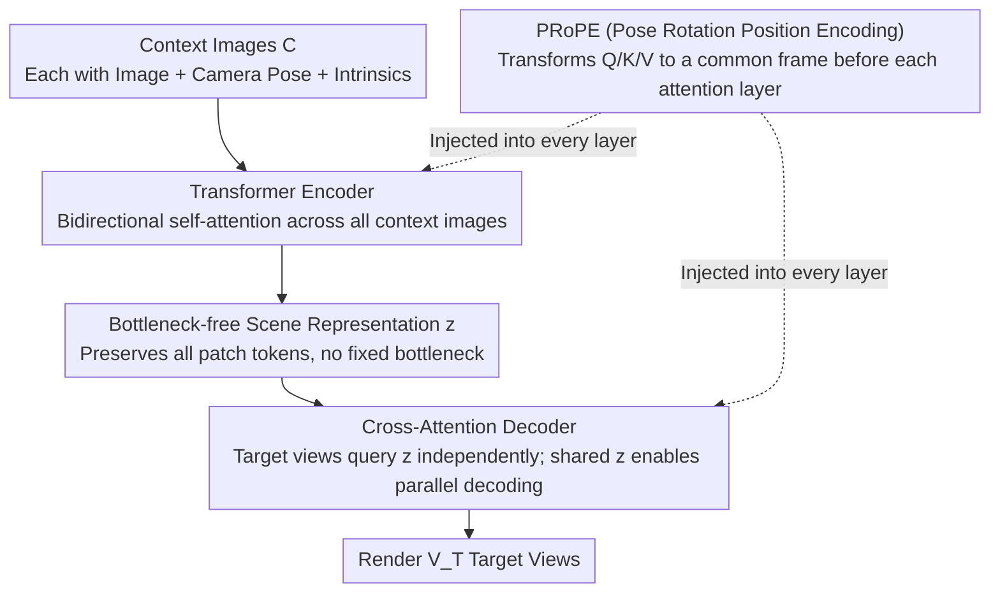

# Scaling View Synthesis Transformers (SVSM)

**Conference**: CVPR 2026  
**arXiv**: [2602.21341](https://arxiv.org/abs/2602.21341)  
**Code**: [https://www.evn.kim/research/svsm](https://www.evn.kim/research/svsm)  
**Area**: 3D Vision / Novel View Synthesis / Scaling Laws  
**Keywords**: Novel View Synthesis, Scaling Laws, Transformer, encoder-decoder, Computational Efficiency, PRoPE  

## TL;DR

This work establishes the first scaling laws for geometry-free NVS Transformers. By proposing the Effective Batch Size hypothesis ($B_{\text{eff}} = B \cdot V_T$), it reveals the root cause for the prior undervaluation of encoder-decoder architectures. The authors design SVSM, a unidirectional encoder-decoder that achieves a new SOTA on RealEstate10K (30.01 PSNR) using less than half the training FLOPs, shifting the Pareto frontier by $3\times$ compared to LVSM's decoder-only baseline.

## Background & Motivation

**Lack of Scaling Analysis in NVS**: While NLP (Chinchilla, Kaplan) and 2D vision (DiT) have established systematic scaling laws, the 3D vision/NVS field remains blank—lacking principled guidance for compute-optimal model design and training configurations.

**Severe Redundancy in Decoder-only Architectures**: In LVSM decoder-only models, rendering each target view requires re-processing all context tokens. The FLOPs for the MLP component $\propto V_T \times (V_C+1)$ and the Attention component $\propto V_T \times (V_C+1)^2$, growing linearly with the number of target views.

**Unfair Dismissal of Encoder-Decoder**: The encoder-decoder variants in the original LVSM paper were significantly weaker than the decoder-only ones. This study finds the root causes to be: (a) the use of fixed-size scene latent representations which introduces a bottleneck, and (b) comparisons under unequal compute budgets rather than inherent architectural inferiority.

**Unknown Interaction between Target Views and Batch Size**: Standard NVS training involves reconstructing multiple target views per scene. However, the impact of increasing $V_T$ versus increasing $B$ on training dynamics has never been formally analyzed.

**Persistence of Multi-view ($V_C > 2$) Scaling**: Whether the scene representation bottleneck leads to scaling degradation when extending encoder-decoders to multi-view scenarios remains an open question.

## Method

### Overall Architecture

This paper aims not to answer "how to make NVS rendering more accurate," but "how to design and train NVS Transformers most cost-effectively under a fixed compute budget"—addressing the previously blank scaling law problem in 3D vision. The vehicle for this study is SVSM, a unidirectional encoder-decoder architecture: context images $C = \{(I_i, g_i, K_i)\}$ are first processed by a Transformer Encoder using bidirectional self-attention to obtain a scene representation $z = E[C]$ that preserves all patch tokens (without compressing them into a fixed bottleneck). Subsequently, a Cross-Attention Decoder renders $V_T$ target views in parallel from $z$ via $\tilde{I} = D[z, g_T, K_T]$. In essence, it "encodes once, decodes many times," where target views do not interact but are decoded in parallel. The true contribution lies in clarifying why the encoder-decoder was undervalued and providing a compute-optimal training recipe.

### Key Designs

**1. SVSM Architecture: Amortizing Multi-target Rendering with Bottleneck-free Representations**

LVSM's decoder-only model must re-process all context tokens for every target view, leading to FLOPs that scale linearly with the number of target views. Prior enc-dec variants in LVSM performed poorly primarily because they compressed the scene into a fixed number of learnable tokens, introducing an information bottleneck. SVSM’s Encoder is a standard ViT that outputs all patch tokens as the scene representation after bidirectional self-attention. The Decoder then uses cross-attention to retrieve information from $z$; each target view is decoded independently but shares $z$ for parallelism. Computationally, $\chi_{\text{MLP}}(\text{SVSM}) \propto V_T + V_C$ and $\chi_{\text{Attn}}(\text{SVSM}) \propto V_C \times (V_T + V_C)$. When $V_T \gg V_C$, this reduces to $O(V_T)$, which is significantly more efficient than LVSM’s $O(V_T \cdot V_C + V_T)$. The trade-off is that the encoder cannot actively discard information irrelevant to the target. While SVSM is weaker than LVSM given the same parameters and steps, the compute saved during rendering can be redirected to larger models and more training steps, making it significantly superior under equal compute budgets.

**2. Effective Batch Size Hypothesis: Product of B and V_T is Key**

While it is standard in NVS training to reconstruct multiple target views per scene, the equivalence of "increasing $V_T$" versus "increasing $B$" for training dynamics was not previously formalized. This paper proposes the Effective Batch Size $B_{\text{eff}} \equiv B \cdot V_T$ (where $B$ is the number of scenes and $V_T$ is the number of target views per scene). Experiments on DL3DV ($V_C=8$) and RE10K ($V_C=2$) keeping $B_{\text{eff}}$ fixed while varying $(B, V_T)$ pairs showed that final PSNR differed only by $\pm 0.1 \sim 0.2$ and loss curves almost coincided. This hypothesis explains two things: for LVSM, $\chi \propto B \cdot V_T \cdot (V_C + 1) = B_{\text{eff}} \cdot (V_C + 1)$, meaning the split does not affect compute and adjusting $V_T$ saves nothing. For SVSM, $\chi \propto B \cdot (V_C + V_T) = B_{\text{eff}} + B \cdot V_C$. Thus, decreasing $B$ and increasing $V_T$ allows for lower total FLOPs while maintaining $B_{\text{eff}}$ (and thus performance), which is the source of the enc-dec efficiency advantage. It also points out that the enc-dec lost to decoder-only in LVSM because they were compared at equal iterations rather than equal FLOPs.

**3. Stereo Scaling Laws: 1/3 Computation for Equal Performance**

On RE10K with $V_C=2$ ($V_T=6$, batch size=256, patch size=16), the authors swept 7M to 300M parameters across 3-4 data sizes, spanning $10^3$ orders of magnitude in compute (100 petaflops to 100 exaflops). A $1/\sqrt{L}$ residual scaling (depth-μP) was used to ensure fair comparison across depths. Results on log-log plots show identical slopes for the Pareto frontiers of both families, but SVSM is shifted left by $3\times$—requiring only 1/3 the FLOPs for the same performance. Following the Chinchilla method, fitting $N_{\text{opt}} \propto \chi^a$ and $D_{\text{opt}} \propto \chi^b$ yields $a=0.52, b=0.47$ for SVSM ($a \approx b$, consistent with Chinchilla; budget doubling should allocate $\sqrt{k}$ to the model and $\sqrt{k}$ to data). LVSM yielded $a=0.65, b=0.33$, leaning more towards model scaling. Ultimately, SVSM-416M (Pareto optimal) and SVSM-740M (iteration matched) both outperformed LVSM-171M at approximately 0.77 zflops (half of LVSM's compute).

**4. Multi-view Scaling Laws and PRoPE: Saving Scaling with Per-Layer Pose Injection**

When scaling SVSM directly to $V_C=4$, the Pareto frontier saturated quickly and scaling behavior disappeared. This was because the fixed-flow scene representation in the encoder-decoder became an information bottleneck, and pose information was lost in deeper layers. The solution is Pose Rotation Position Encoding (PRoPE): before each attention layer, Q/K/V are transformed into a common reference coordinate system via camera poses, and then transformed back after the attention. This embeds pose information directly into every layer rather than just the initial embedding. With PRoPE, SVSM recovers its ideal scaling trend, and its Pareto frontier remains superior to LVSM+PRoPE.

**5. Fixed Latent Counter-experiment: Bottlenecks are the Real Culprit**

To isolate "decoding directionality" from "presence of bottleneck," the authors compared SVSM-fixed (fixed latent + unidirectional decoding) with LVSM enc-dec (fixed latent + bidirectional decoding) on Objaverse ($V_C=8$). Both showed similar scaling behavior; SVSM-fixed still maintained a $5\times$ compute advantage (frontier shifted left $5\times$), but both were significantly worse than the bottleneck-free design. This proves that the main factor limiting scaling is the fixed-size scene representation, not whether the decoder is unidirectional.

## Key Experimental Results

### Main Results: Stereo NVS (V_C=2) Largest Models

| Model | Params | Training FLOPs | PSNR↑ | SSIM↑ | LPIPS↓ | FPS (V_C=4) |
|------|:---:|:---:|:---:|:---:|:---:|:---:|
| LVSM Enc-Dec | 173M | 2.53 zflops | 28.58 | 0.893 | 0.114 | 52.9 |
| LVSM Dec-Only | 171M | 1.60 zflops | 29.67 | 0.906 | 0.098 | 19.5 |
| SVSM (Iter-matched) | 740M | 0.74 zflops | 29.80 | 0.907 | 0.098 | 42.7 |
| **SVSM (Pareto)** | **416M** | **0.77 zflops** | **30.01** | **0.910** | **0.096** | **61.8** |

### Comparison with Geometric Methods (RealEstate10K)

| Method | PSNR↑ | SSIM↑ | LPIPS↓ |
|------|:---:|:---:|:---:|
| pixelNeRF | 20.43 | 0.589 | 0.550 |
| pixelSplat | 26.09 | 0.863 | 0.136 |
| MVSplat | 26.39 | 0.869 | 0.128 |
| GS-LRM | 28.10 | 0.892 | 0.114 |
| **SVSM** | **30.01** | **0.910** | **0.096** |

### Multi-view NVS (V_C > 2)

| Model | Params | Training FLOPs | PSNR↑ | LPIPS↓ | FPS (V_C=4) | FPS (V_C=16) |
|------|:---:|:---:|:---:|:---:|:---:|:---:|
| LVSM+PRoPE | 171M | 43 eflops | 26.19 | 0.145 | 104.7 | 23.8 |
| SVSM (Iter) | 711M | 32 eflops | 26.29 | 0.141 | 280.4 | 230.4 |
| **SVSM (Pareto)** | **400M** | **44 eflops** | **26.87** | **0.129** | **411.1** | **333** |

## Key Findings

1. **3× Compute Efficiency**: The Pareto frontier of SVSM has the same slope as LVSM but is shifted left by $3\times$—requiring only 1/3 of the training compute for the same performance.
2. **Cross-modal Validation of Chinchilla Laws**: SVSM’s $a \approx 0.52, b \approx 0.47$ (where $a \approx b$) aligns with NLP findings, suggesting that a doubling of compute budget should be split equally between model size and data volume.
3. **$B_{\text{eff}}$ Dominance**: The effective batch size $B \cdot V_T$ is the primary determinant of final performance. Specific splits of $(B, V_T)$ result in negligible differences ($\le 0.2$ PSNR).
4. **PRoPE Unlocks Multi-view Scaling**: Without PRoPE, SVSM saturates quickly for $V_C > 2$. Adding PRoPE restores scaling trends and maintains a superior frontier over LVSM.
5. **Fixed Latents as Scaling Bottlenecks**: Regardless of decoder directionality, fixed-size scene representations severely restrict scaling potential.
6. **Inference Speed**: SVSM achieves $4\times$ the rendering speed of LVSM at $V_C=4$, and up to $14\times$ when extrapolated to $V_C=16$.

## Highlights & Insights

**Highlights**:
- The Effective Batch Size hypothesis is an elegant and profound insight that explains the prior undervaluation of the encoder-decoder and provides a way to exploit it.
- Establishes the first Chinchilla-style compute-optimal training recipes for the 3D vision field.
- Rigorous experimental design involving a systematic scan over $10^3$ FLOPs, 3 datasets, and various $V_C$ settings.

**Limitations & Future Work**:
- Training data constraints: Relies on smaller posed datasets like RE10K and DL3DV with repeated sampling, which differs from standard $<1$ epoch scaling practices.
- At high $V_C$, the quadratic complexity of the encoder makes rendering slower than LVSM enc-dec (observed at $V_C=8$).
- Only covers sparse-to-medium view scenarios; linear attention models might be more advantageous for $V_C \gg 16$.
- Limited to deterministic rendering; the applicability of scaling laws to diffusion-based NVS was not explored.

## Rating

- Novelty: ⭐⭐⭐⭐⭐ Effective Batch Size hypothesis + NVS scaling laws fill a significant gap in 3D vision.
- Experimental Thoroughness: ⭐⭐⭐⭐⭐ Systematic analysis across $10^3$ FLOPs covering stereo, multi-view, and fixed latent scenarios.
- Writing Quality: ⭐⭐⭐⭐⭐ Rigorous Chinchilla-style presentation with professional and clear charts.
- Value: ⭐⭐⭐⭐⭐ Compute-optimal training recipes and architectural principles are directly transferable to other 3D vision tasks.

<!-- RELATED:START -->

## Related Papers

- [\[CVPR 2026\] FreeScale: Scaling 3D Scenes via Certainty-Aware Free-View Generation](freescale_scaling_3d_scenes.md)
- [\[CVPR 2026\] Cross-View Splatter: Feed-Forward View Synthesis with Georeferenced Images](cross-view_splatter_feed-forward_view_synthesis_with_georeferenced_images.md)
- [\[CVPR 2026\] Block-Sparse Global Attention for Efficient Multi-View Geometry Transformers](block-sparse_global_attention_for_efficient_multi-view_geometry_transformers.md)
- [\[CVPR 2026\] SmokeSVD: Smoke Reconstruction from A Single View via Progressive Novel View Synthesis and Refinement with Diffusion Models](smokesvd_smoke_reconstruction_from_a_single_view_via_progressive_novel_view_synt.md)
- [\[CVPR 2026\] GeodesicNVS: Probability Density Geodesic Flow Matching for Novel View Synthesis](geodesicnvs_probability_density_geodesic_flow_matching_for_novel_view_synthesis.md)

<!-- RELATED:END -->
