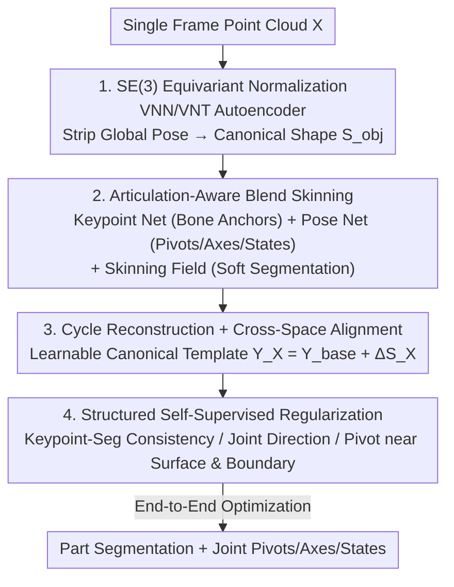

# SCAPO: Self-Supervised Category-Level Articulated Pose Estimation from a Single 3D Observation

**Conference**: CVPR 2026  
**Paper**: [CVF Open Access](https://openaccess.thecvf.com/content/CVPR2026/html/Zhang_SCAPO_Self-Supervised_Category-Level_Articulated_Pose_Estimation_from_a_Single_3D_CVPR_2026_paper.html)  
**Code**: https://lulusindazc.github.io/SCAPOproject/  
**Area**: 3D Vision  
**Keywords**: Articulated Objects, Category-Level Pose Estimation, Self-Supervision, SE(3) Equivariance, Blend Skinning  

## TL;DR
SCAPO utilizes an SE(3) equivariant autoencoder to align articulated objects in arbitrary poses (e.g., laptops, drawers, safes) to a shared canonical space. It then employs "articulation-aware blend skinning" to simultaneously regress part segmentation and joint axes/pivots/states. The entire pipeline is trained via self-supervision through cycle reconstruction and cross-space alignment without any annotations, CAD templates, or multi-frame inputs, outperforming all self-supervised baselines on both synthetic and real-world data.

## Background & Motivation
**Background**: Category-level articulated object understanding requires recovering part segmentation, 6D poses of each part, and joint parameters (rotation axes/sliding directions, pivot positions, joint angles) from observations. This is a critical requirement for robotic manipulation, AR/VR, and digital twins. Prevailing approaches either rely on instance-level CAD templates and articulation annotations or require multi-frame/multi-view observations to extract motion cues.

**Limitations of Prior Work**: The problem is extremely challenging under single-frame, unannotated settings. PartMobility relies on motion cues from point cloud sequences to discover movable parts but depends on dynamic inputs and cannot recover complete part poses; UPPD handles static inputs but depends on voxel supervision and is unstable on sparse/noisy point clouds; EAP learns part-level SE(3) equivariant features but outputs only implicit part transformations, lacking explicit joint pivots and axes necessary for downstream kinematic reasoning; OP-Align performs alignment via canonical reconstruction, but geometry and articulation remain entangled, leading to degradation with large shape variations and fine joints.

**Key Challenge**: In single-frame observations, **shape variation** and **articulation motion** are entangled—objects within the same category exhibit both inter-instance shape differences (different laptop designs) and joint state differences (different screen opening angles). Current methods struggle to distinguish between "different shapes" and "different joint states," resulting in either drifting segmentation or erroneous joint parameters.

**Goal**: To simultaneously output canonical shapes, rigid part segmentation, and **explicit** joint pivots $c^{[j]}$, motion axes $d^{[j]}$, and joint states $a^{[j]}$ under the conditions of single-frame RGB-D/point clouds with zero annotations and zero templates.

**Key Insight**: First, utilize SE(3) equivariance to completely strip away global pose—the largest interference factor—to align all instances to a unified canonical frame. Then, apply blend skinning, a reversible deformation, on the aligned shapes to explicitly model part motion, thereby decoupling geometry from articulation.

**Core Idea**: Replace dense supervision with "SE(3) equivariant normalization + articulation-aware blend skinning + cycle/cross-space consistency self-supervision" to recover interpretable articulated structures from a single frame.

## Method

### Overall Architecture
The input is an articulated object point cloud $X \in \mathbb{R}^{3\times N}$ containing $P$ rigid parts. The outputs include part segmentation, per-part rigid poses $T^{[p]}=[R^{[p]}|t^{[p]}]\in SE(3)$, and the pivots/axes/states for $J$ joints. The pipeline consists of three stages: ① **Normalization**: An SE(3) equivariant autoencoder estimates the global pose $(R_g, t_g)$ and decodes the canonical shape $S_{obj}$, aligning different instances to a shared canonical frame; ② **Articulation-Aware Deformation**: Within the canonical space, a keypoint network defines the skeleton, a pose network regresses joint parameters, and a skinning field assigns soft weights, forming a bidirectional skinning mapping between observation and canonical spaces; ③ **Optimization & Regularization**: End-to-end self-supervised training is conducted using cycle consistency between observation and reconstruction, cross-space alignment of canonical templates, and a set of structural regularization terms.

### Key Designs

**1. SE(3) Equivariant Normalization: Stripping the Global Pose Interference**

To address the entanglement of shape and motion in a single frame and the arbitrary poses of objects, the authors first resolve the "pose" layer. The encoder $\Theta_E$ is built on Vector Neuron Networks (VNN) and Vector Neuron Translation (VNT): First, the VNT layer estimates the translation vector $t_g$ and constructs translation-invariant features; then, the VNN layer extracts orientation-aware features and aggregates them into a rotation matrix $R_g$, yielding a pose-invariant implicit shape code $Z_x$. The decoder $\Theta_D$ decodes $Z_x$ into a canonical shape $S_{obj}$ independent of global transformations. The original input can be reconstructed as $X = S_{obj}\cdot R_g + \mathbf{1}_N\cdot t_g^\top$, ensuring shape features are SE(3) invariant while pose parameters are equivariant. The training objective follows the reconstruction loss $L_{rec}$, orthogonal constraint $L_{ortho}$ (pulling $R_g$ towards $SO(3)$), augmentation consistency $L_{aug\text{-}consist}$, and canonical consistency $L_{can\text{-}consist}$, combined as $L = L_{rec} + \lambda_1 L_{ortho} + \lambda_2 L_{aug} + \lambda_3 L_{can}$. Stripping the pose prior allows subsequent part/articulation modeling within a unified coordinate system.

**2. Articulation-Aware Blend Skinning: Explicitly Expressing Part Motion with Skeleton and Skinning**

To output explicit joint parameters and decouple geometry from articulation, the authors model within a skinning framework in the canonical space. The keypoint network $\Theta_K$ predicts $P$ part centroids $K=\{k^{[p]}\}$ from $Z_x$ as bone anchors. The pose network $\Theta_J$ regresses the pivot $c^{[p]}$, motion axis $d^{[p]}$, and scalar joint state $a^{[p]}$ for each part, constructing bone transformations: rotation joints $R^{[p]}=\mathrm{Exp}_{SO3}([d^{[p]}]_\times\cdot a^{[p]})$ or translation joints $t^{[p]}=d^{[p]}\cdot a^{[p]}$. Each part transformation follows a three-step process: "translate to pivot → apply motion → translate back." The skinning field $\Omega$ uses Mahalanobis distance $W_i^{[p]}=(s_i-O^{[p]})^\top Q^{[p]}(s_i-O^{[p]})$ to measure the fit between points and bones ($O^{[p]}=k^{[p]}$ is the bone center, and $Q^{[p]}$ encodes orientation and scale), followed by a temperature softmax to obtain soft weights $w_i$. This converts hard segmentation into differentiable soft part assignments. The blended transformation for each point $T_i^{c\to o}=\sum_p w_i^{[p]}T^{[p]}$ and its inverse provide bidirectional deformation between observation and canonical spaces, naturally supporting cycle reconstruction. Unlike EAP, which provides only implicit transformations, **all quantities here are explicit with physical meanings** (pivots are 3D points, axes are unit vectors, states are angles/displacements), directly usable for downstream kinematics.

**3. Cycle Reconstruction + Cross-Space Alignment: Decoupling Category Geometry and Instance Residuals with Learnable Templates**

To prevent inter-instance shape differences from being mistaken for joint motion, the authors introduce a cross-instance learnable canonical template $Y_X=\Delta S_X + Y_{base}$, where $Y_{base}$ is a global prior encoding category-shared geometry and canonical pose, and $\Delta S_X=\Theta_\Delta(F_x)$ is an instance-specific residual shape predicted from decoder features. Two types of consistency constraints are used during training: **Cycle Reconstruction** follows the reversible chain $X\to S_{obj}\to S^*\to \hat S_{obj}\to \hat X$, using $L_{cycle}=\|\hat X - X\|_1$ to drive back to the original input, applying the same cycle to template $Y_X$. **Cross-Space Alignment** defines the bone transformation $T^{[p]}_{X\to Y}$ between the input space and canonical template (where $R^{[p]}_{r,x2y}$ aligns the input axis $d_x^{[p]}$ to the canonical axis $d_y^{[p]}$, and $R^{[p]}_{x2y}$ encodes the relative motion between two joint states). Bidirectional alignment is achieved via Chamfer distance $L_{recon}=\mathrm{CD}(\hat S_{x2y}, Y_X)$ and $L^Y_{recon}=\mathrm{CD}(\hat S_{y2x}, S_{obj})$. This design allows "category-shared geometry" to settle into $Y_{base}$ and "instance shape differences" to be absorbed by $\Delta S_X$, thereby separating them from actual articulation motion.

**4. Structured Self-Supervised Regularization: Using Physical Structure as Weak Supervision**

To prevent joint parameters from drifting under zero labels, the authors add four regularization terms reflecting the physical structure of articulated objects. **Keypoint-Segmentation Consistency**: Using soft weights to calculate soft centroids $m^{[p]}=\frac{1}{N_p}\sum_i w_i^{[p]} s_i$, a penalty $L_{kp\text{-}seg}$ is applied to the deviation between keypoints and centroids to keep bone anchors at the part's geometric center; meanwhile, a one-hot pseudo-label based on "nearest keypoint" supervises segmentation weights $L_{seg}$. **Joint Direction Alignment**: PCA is performed on boundary points with high segmentation entropy to find the principal direction $\tilde d$, and $L_{dir\text{-}align}=\frac{1}{B}\sum(1-|\langle d^{[j]},\tilde d\rangle|)$ pulls the joint axis towards the direction of primary geometric change at the boundary (absolute value handles axis sign ambiguity). **Pivot Proximity to Surface**: $L_{joint\text{-}prox}$ constrains pivots from drifting away from the canonical shape surface. **Pivot Proximity to Boundary**: Using segmentation entropy $H_i=-\sum_p w_i^{[p]}\log w_i^{[p]}$ as a boundary cue, soft attention pulls the pivot $c^{[j]}$ towards high-entropy (part interface) regions. These terms encode the physical priors that "joints should lie on part interfaces and axes should align with geometric changes," replacing expensive articulation labels.

### Loss & Training
Two-stage training: Stage 1 trains the SE(3) equivariant autoencoder ($\lambda_1=\lambda_2=\lambda_3=0.1$, learning rate $1\times10^{-3}$). Stage 2 trains articulation-related modules (PointNet-style joint predictors, keypoint detectors, category shape variance MLP heads, etc., learning rate $1\times10^{-4}$). Total loss weights: $\lambda_{cycle}=10,\lambda_{recon}=10,\lambda_{kp\text{-}seg}=1,\lambda_{seg}=1,\lambda_{shape\text{-}var}=10,\lambda_{dir\text{-}align}=0.1,\lambda_{joint\text{-}prox}=1,\lambda_{joint\text{-}boundary}=3$. Each object is uniformly sampled with $N=1024$ points, using Adam (weight decay $10^{-8}$) + cosine annealing for 200 epochs on a single RTX A5000.

## Key Experimental Results

### Main Results
Synthetic datasets are taken from the EAP setup (HOI4D + Shape2Motion, five categories: laptop / safe / oven / washer / eyeglasses), with each mesh rendered as a partial point cloud simulating single-view depth. Evaluation covers three dimensions: Part-level (rotation/translation errors, 3D IoU), joint state (rotation angle error/translation displacement error), and joint parameters (axis orientation error, pivot localization error). The table below shows the mean across five categories (S=Segmentation IoU↑, D=Joint Direction Error↓ deg, C=Pivot Error↓, R=Part Rotation Error↓ deg, t=Part Translation Error↓):

| Metric | Method | Supervision | Mean |
|--------|--------|-------------|------|
| S ↑ | OP-Align | Self-supervised | 82.24 |
| S ↑ | **SCAPO** | Self-supervised | **84.98** |
| S ↑ | 3DGCN | Fully supervised | 92.59 |
| D ↓ | OP-Align | Self-supervised | 4.60 |
| D ↓ | **SCAPO** | Self-supervised | **3.89** |
| C ↓ | OP-Align | Self-supervised | 0.104 |
| C ↓ | **SCAPO** | Self-supervised | **0.075** |
| R ↓ | OP-Align | Self-supervised | 6.73 |
| R ↓ | **SCAPO** | Self-supervised | **5.78** |
| t ↓ | EAP | Self-supervised | 0.067 |
| t ↓ | **SCAPO** | Self-supervised | 0.086 |

SCAPO achieves the highest segmentation IoU and lowest joint direction/pivot/part rotation errors among self-supervised methods, systematically outperforming the previous strongest baseline OP-Align. Translation error is slightly inferior to EAP but better than OP-Align (0.115) and ICP (0.174). Improvements are particularly pronounced in categories with large shape variations like eyeglasses and washers. Notably, compared to fully supervised 3DGCN / NPCS-EPN, SCAPO actually achieves lower joint direction and rotation errors, with competitive segmentation and pivot errors—despite using no labels.

### Ablation Study
Real-world datasets (RGB-D scans of five categories: basket / laptop / suitcase / drawer / scissors, without mesh ground truth) are evaluated using multi-threshold mAP: part pose is considered correct if rotation error < 5°/10°/15° and translation error < 5/10/15 cm, with segmentation using 75%/50% IoU thresholds. ⚠️ Specific numerical values for real data categories refer to the original tables. Summarized role of key design components:

| Component | Function | Impact of Removal/Replacement |
|-----------|----------|-------------------------------|
| SE(3) Equivariant Normalization | Strips global pose, aligns instances | Instances cannot align; part/articulation modeling loses unified coordinates |
| Articulation-Aware Blend Skinning | Explicit pivots/axes/states + soft segmentation | Reverts to implicit transformations; downstream kinematics unusable |
| Learnable Canonical Template $Y_{base}+\Delta S_X$ | Decouples category geometry and instance residuals | Shape differences mistaken for joint motion; segmentation drifts |
| Structured Regularization (4 items) | Joints at boundaries, axes along geometry | Joint parameters drift and become non-physical under zero labels |

### Key Findings
- Completely stripping global pose via SE(3) equivariance is a prerequisite for stable part and articulation modeling within a unified canonical frame.
- Explicit skinning (bone transformations driven by pivot+axis+state) allows self-supervised methods to provide kinematic parameters directly usable for reasoning, distinguishing it from EAP's implicit transformations.
- Self-supervised SCAPO outperforms fully supervised baselines in joint direction and part rotation errors, indicating that structured physical regularization is more "targeted" than dense labeling for this task.

## Highlights & Insights
- **Two-layer decoupling of "pose" and "shape/articulation"**: Stripping pose via SE(3) equivariance first, then stripping geometric residuals via skinning, provides a clean hierarchy where each layer has a clear supervision signal.
- **Using segmentation entropy as a joint boundary cue**: $H_i=-\sum_p w_i^{[p]}\log w_i^{[p]}$ pulls pivots towards regions where "segmentation is most hesitant"—interfaces between parts naturally exhibit segmentation uncertainty, providing a clever geometric/statistical signal to replace joint location labels.
- **Learnable Category Template + Instance Residual**: $Y_{base}$ extracts shared geometry while $\Delta S_X$ absorbs individual differences, serving as a reusable paradigm for explicitly accounting for "category-level generalization" vs "instance specificity."

## Limitations & Future Work
- The method assumes parts are rigid and share a consistent kinematic structure (fixed joint topology) within a category, which may not apply to flexible or topologically variable objects.
- Relying on single-view partial point clouds makes it difficult to eliminate ambiguities in joint parameter estimation when occlusions are severe or parts are nearly invisible.
- Translation error still lags behind EAP, suggesting that pure self-supervision still has a gap in absolute scale localization; potential improvements involve introducing weak physical constraints or sparse self-labeling cues.
- ⚠️ Category-specific mAP values for real-world datasets were not fully captured in the cache and should be verified against the original tables.

## Related Work & Insights
- **vs OP-Align**: Both are single-point-cloud self-supervised category-level articulation alignment methods. OP-Align relies on canonical reconstruction for joint object/part normalization but geometry and articulation remain entangled; SCAPO decouples them via SE(3) equivariance + skinning + template residuals, proving more stable under large shape variations.
- **vs EAP**: EAP learns part-level SE(3) equivariant features but outputs only implicit transformations, lacks explicit pivots/axes, and has slow inference with unstable segmentation. SCAPO directly regresses explicit joint parameters for downstream use.
- **vs UPPD / PartMobility**: These rely on voxel supervision or motion cues from point cloud sequences, respectively; SCAPO is more scalable as it requires only a single frame without labels or templates.

## Rating
- Novelty: ⭐⭐⭐⭐⭐ The combination of SE(3) equivariant normalization + articulation-aware skinning + template residual decoupling is a clean new framework for single-frame self-supervised articulation estimation.
- Experimental Thoroughness: ⭐⭐⭐⭐ Synthetic + real-world datasets, comparisons against self-supervised and fully supervised baselines across three dimensions; however, the ablation is primarily qualitative at the component level.
- Writing Quality: ⭐⭐⭐⭐ Logic progresses clearly through three stages; formulas are complete; notation is dense, posing a slight hurdle for initial reading.
- Value: ⭐⭐⭐⭐⭐ Producing explicit joint parameters with zero labels or templates has direct value for robotic manipulation and digital twins.

<!-- RELATED:START -->

## Related Papers

- [\[CVPR 2026\] DICArt: Advancing Category-level Articulated Object Pose Estimation in Discrete State-Spaces](dicart_advancing_category-level_articulated_object_pose_estimation_in_discrete_s.md)
- [\[CVPR 2026\] SE(3)-Equivariance with Geometric and Topological Guidance for Category-Level Object Pose Estimation](se3-equivariance_with_geometric_and_topological_guidance_for_category-level_obje.md)
- [\[CVPR 2026\] ComPose: A Unified Completion-Pose Framework for Robust Category-Level Object Pose Estimation](compose_a_unified_completion-pose_framework_for_robust_category-level_object_pos.md)
- [\[CVPR 2026\] RoSAMDepth: Robust Self-supervised Depth Estimation Leveraging Segment Anything Model](rosamdepth_robust_self-supervised_depth_estimation_leveraging_segment_anything_m.md)
- [\[ICCV 2025\] Unified Category-Level Object Detection and Pose Estimation from RGB Images using 3D Prototypes](../../ICCV2025/3d_vision/unified_category-level_object_detection_and_pose_estimation_from_rgb_images_usin.md)

<!-- RELATED:END -->
