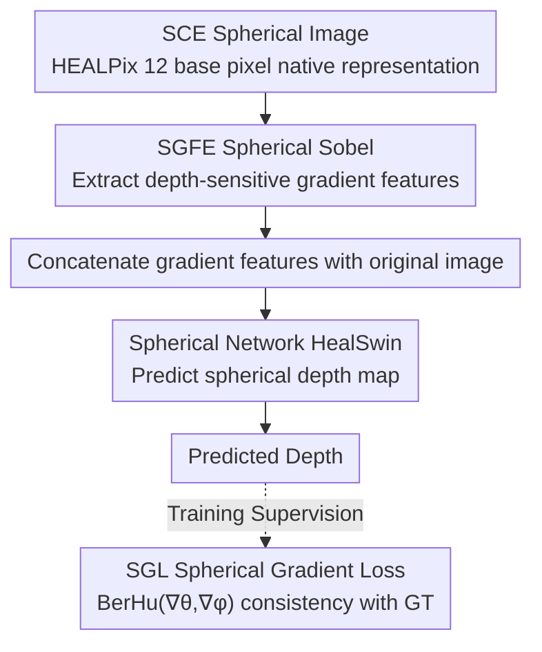

# SCE-Depth: A Spherical Compound Eye Framework for Wide FOV Depth Estimation

**Conference**: CVPR 2026  
**Paper**: [CVF Open Access](https://openaccess.thecvf.com/content/CVPR2026/html/Zhu_SCE-Depth_A_Spherical_Compound_Eye_Framework_for_Wide_FOV_Depth_CVPR_2026_paper.html)  
**Code**: https://github.com/ZhuYi2000/SCE-Depth  
**Area**: 3D Vision / Depth Estimation  
**Keywords**: Wide FOV Depth Estimation, Biomimetic Compound Eye Camera, Spherical Neural Networks, HEALPix, Spherical Gradient  

## TL;DR
SCE-Depth proposes a hardware-software co-designed framework consisting of a "biomimetic spherical compound eye camera + spherical neural network." It processes compound eye images natively on the HEALPix spherical grid to avoid planarization distortions and utilizes the "distance-decaying depth-sensitive gradients" naturally generated by overlapping fields of view of adjacent ommatidia. Combined with a Spherical Gradient Feature Extractor (SGFE) and Spherical Gradient Loss (SGL), it significantly reduces wide-FOV depth errors, especially in peripheral regions.

## Background & Motivation
**Background**: Monocular depth estimation is lightweight and suitable for resource-constrained platforms like AR, drones, and mobile robots, but suffers from low precision and scale ambiguity. While large-scale models are accurate, they are computationally expensive. A promising direction is hardware-software co-design—designing specialized sensor structures alongside task-optimized models. Biological compound eyes feature independent ommatidia and overlapping receptive fields providing rich depth cues, with a spherical arrangement approaching a 180° field of view (FOV), inspiring artificial compound eye cameras.

**Limitations of Prior Work**: Existing artificial compound eye systems are mostly limited by short sensing distances and low computational efficiency, providing only sparse or coarse depth (e.g., point source localization). They struggle with dense pixel-wise depth in complex scenes. More critically, there is a **modality mismatch**: compound eyes produce spherical images; projecting these onto a plane for standard neural networks introduces distortion and breaks geometric consistency between ommatidia, degrading depth estimation.

**Key Challenge**: There is a structural mismatch between spherical imaging data and planar networks—one must either suffer projection distortions or lack learning algorithms capable of native spherical processing. Furthermore, the joint design of compound eye hardware and corresponding learning algorithms has been largely unexplored.

**Goal**: (1) Enable the network to process compound eye images natively on the sphere to eliminate modality conversion errors; (2) Exploit depth cues unique to compound eyes; (3) Fill the gap in native spherical compound eye datasets.

**Key Insight**: The authors observe that adjacent ommatidia in SCE cameras have significant FOV overlap, which naturally enhances local edge cues. These edge intensities decay with distance—a distance-sensitive feature that can be exploited by a network. Combined with spherical networks on the HEALPix grid (e.g., HealSwin), processing can occur without distortion in the spherical domain.

**Core Idea**: Process compound eye images natively on the HEALPix spherical grid, extract "depth-decaying gradient features" using a spherical Sobel operator (SGFE), and reinforce them with a Spherical Gradient Loss (SGL) to achieve gradient-aware wide-FOV depth estimation.

## Method

### Overall Architecture
The input to SCE-Depth is a spherical grayscale image captured by a Spherical Compound Eye (SCE) camera, and the output is a spherical depth map. The pipeline consists of three steps: first, a **Spherical Gradient Feature Extractor (SGFE)** extracts depth-sensitive spherical gradient features from the raw SCE image. These features are concatenated with the original image and fed into a spherical network (using HealSwin as the backbone) running natively on the HEALPix grid to predict depth. During training, the optimization objective is a combination of standard MSE reconstruction loss and a newly designed **Spherical Gradient Loss (SGL)**, which enforces consistency between predicted and ground truth gradients. The entire representation remains on the HEALPix spherical grid throughout, avoiding distortions introduced by planar projection.

### Key Designs

**1. Native Spherical Processing: Eliminating Modality Conversion Distortion on HEALPix Grids**

Addressing the "spherical data vs. planar network" mismatch, the whole framework runs natively on the sphere. Ommatidia in the SCE camera draw from apposition compound eye structures, where each unit consists of "a lens + a single-pixel photodetector." Optical isolation between units eliminates crosstalk, integrating light intensity within the FOV into a single value, forming an SCE grayscale image on a hemispherical array. These images use the HEALPix format, where the sphere is partitioned into 12 equal-area base pixels, each subdivided into an $n_{\text{side}}\times n_{\text{side}}$ regular grid, totaling $12\times n_{\text{side}}^2$ pixels (implementation uses $n_{\text{side}}=128$). This hierarchical design maintains equal-area sampling and provides local Cartesian coordinates for gradient operations. HealSwin is selected as the backbone because it is also built on the HEALPix grid, allowing seamless integration with SGFE/SGL; other networks like SUFormer would require resampling, introducing interpolation errors. A unified 180° FOV is processed natively, bypassing planar projection distortion.

**2. Depth-Sensitive Gradient Features + SGFE: Extracting Distance-Decaying Edge Cues via Spherical Sobel**

This serves as the core physical insight. When the FOV of a single ommatidium $\alpha$ is larger than the angular spacing $\beta$ between adjacent units ($\alpha > \beta$), the overlapping FOVs provide depth cues: as objects move further away, the edge regions captured by multiple ommatidia become blurrier, and the intensity difference $\Delta\text{Intensity}$ between adjacent ommatidia decreases stably. This was verified in simulation (chair models at 1.0–2.0 m) and with a 37-ommatidia physical prototype (white cubes at 0.5–0.9 m), whereas fisheye imaging maintains sharp edges where intensity differences do not depend on depth. $\Delta\text{Intensity}$ is essentially the gradient along the line connecting adjacent ommatidia. Generalizing this to a spherical gradient operator yields a stable depth indicator. **SGFE** adapts the Sobel operator to the sphere: for each base pixel $B_m$, it calculates two angular gradients using Sobel kernels $S_x, S_y$:

$$\nabla_x(i,j) = \sum_{u,v=-1}^{1} S_x(u,v)\cdot I(B_m, i{+}u, j{+}v),\quad \nabla_y(i,j) = \sum_{u,v=-1}^{1} S_y(u,v)\cdot I(B_m, i{+}u, j{+}v)$$

The hierarchical mapping $H$ of HEALPix then projects local gradients to global spherical coordinates $(\theta,\phi)$: $[\nabla_\theta(p), \nabla_\phi(p)] = H(B_m) \odot [\nabla_x(i,j), \nabla_y(i,j)]^T$, where $\odot$ is a coordinate-aware gradient fusion operator ensuring continuity across base pixel boundaries. Experiments ($\alpha=3°$) show SCE gradient maps decay significantly with distance, unlike fisheye planar Sobel gradients, proving SGFE encodes depth-sensitive cues unique to SCE.

**3. SGL Spherical Gradient Loss: Reinforcing Geometric Consistency via BerHu**

Extracting features is insufficient; explicit constraints are needed in the training objective. **SGL** adapts planar gradient regularization to incorporate depth-sensitive geometry, defined as:

$$L_{SG} = \mathrm{BerHu}(\nabla_\theta, \nabla_\theta^*) + \mathrm{BerHu}(\nabla_\phi, \nabla_\phi^*),\qquad L = L_{MSE} + \lambda L_{SG}$$

where $\nabla_\theta, \nabla_\phi$ are two gradient components of the predicted depth. The BerHu function (a hybrid using $\ell_2$ for small errors and $\ell_1$ for large ones) is used for its robustness against outliers, preserving gradient features while suppressing error amplification at discontinuous edges. The weight $\lambda$ (set to 1.0) balances spatial accuracy and geometric consistency. Together with SGFE, it integrates the physical fact that "gradient is a depth cue" into both features and loss.

### Loss & Training
The total loss is $L = L_{MSE} + \lambda L_{SG}$ ($\lambda=1.0$). Implemented in PyTorch with 2x RTX 4090, HEALPix $n_{\text{side}}=128$, HealSwin backbone. Adam optimizer, learning rate $1\times10^{-4}$, batch size 4, 1000 epochs. Global norm gradient clipping at 1.0, fixed seed 42. All metrics are averaged over 5 independent runs.

## Key Experimental Results

> Metric descriptions: RMSE is Root Mean Square Error (lower is better); Abs Rel is Absolute Relative Error (lower is better); $\delta_1, \delta_2$ are the percentage of pixels where the ratio of predicted to ground truth depth is within $1.25$ and $1.25^2$ (higher is better).

### Main Results (Comparison with Prev. SOTA on FisheyeDepth and CompoundDepth)

| Method | Params (M) | CompoundDepth RMSE ↓ | Abs Rel ↓ | δ1 ↑ | δ2 ↑ |
|------|---------|----------------------|-----------|------|------|
| Swin (Planar) | 41.3 | 0.376 | 0.113 | 90.80 | 95.74 |
| DepthAnythingv2 | 24.8 | 0.313 | 0.061 | 94.59 | 98.04 |
| PanDA | 24.8 | 0.283 | 0.064 | 94.35 | 97.86 |
| DepthAnyCamera | 208.9 | 0.266 | 0.055 | 94.89 | 97.84 |
| HealSwin (Spherical) | 41.3 | 0.350 | 0.082 | 92.76 | 96.99 |
| SUFormer (Spherical) | 14.9 | 0.429 | 0.105 | 90.31 | 94.76 |
| **Ours (SCE-Depth)** | 41.3 | **0.256** | **0.050** | **95.74** | **98.48** |

Ours leads across all metrics on CompoundDepth. On FisheyeDepth, it achieves the lowest RMSE and an Abs Rel comparable to the 208.9M DepthAnyCamera while using ~1/5 of the parameters. Notably, pure spherical baselines (HealSwin/SUFormer) performed worse than planar methods due to the maturity of planar architectures; SCE-Depth overcomes this via SGFE+SGL depth-sensitive features.

### Ablation Study: FOV Angle α and Operator Choice

| Config | RMSE ↓ | Abs Rel ↓ | δ1 ↑ | Description |
|------|--------|-----------|------|------|
| α = 1° | 0.279 | 0.061 | 94.90 | Low overlap, weak depth gradient cues |
| **α = 3°** | **0.256** | **0.050** | **95.74** | Optimal trade-off between clarity and sensitivity |
| α = 5° | 0.289 | 0.074 | 93.75 | Excess overlap, blurry boundaries, accuracy degradation |
| α = 7° | 0.284 | 0.072 | 93.47 | Similar to above |
| Laplacian | 0.295 | 0.068 | 94.30 | Excessive smoothing at depth discontinuities |
| Scharr | 0.258 | 0.059 | 95.18 | Close to Sobel but amplifies noise at high-freq edges |
| **Sobel** | **0.256** | **0.050** | **95.74** | Best balance of noise suppression and structural preservation |

### Key Findings
- **Optimal FOV Trade-off**: $\alpha$ controls two competing factors—larger overlap increases depth sensitivity but decreases image clarity; $3°$ is the optimal balance.
- **Sobel is the Most Stable Operator**: Laplacian over-smooths depth edges, Scharr amplifies noise, while Sobel is the most balanced.
- **Omnidirectional Consistency is a Hard Advantage**: Fisheye (Swin) errors concentrate at the periphery (±60° to ±90°) due to barrel distortion, while SCE-Depth maintains uniform error across all directions due to native spherical processing.
- **Cross-Modality Generalization**: Ours outperformed HealSwin/SUFormer on SynWoodScape and Stanley2D3D (though Abs Rel was slightly lower on the latter due to the lack of a relative error term in the loss).

### Generalization Experiments (SynWoodScape and Stanford2D3D)

| Method | SynWoodScape RMSE ↓ | Abs Rel ↓ | Stanford2D3D RMSE ↓ | Abs Rel ↓ |
|------|---------------------|-----------|---------------------|-----------|
| HealSwin | 7.896 | 0.425 | 0.497 | 0.143 |
| SUFormer | 10.376 | 0.519 | 0.432 | 0.071 |
| **Ours (SCE-Depth)** | **7.606** | **0.297** | **0.418** | 0.114 |

## Highlights & Insights
- **Converts physical phenomena into learnable features**: Turning the "overlapping FOV → distance-decaying intensity difference" mechanism into depth features, validated by both simulation and physical prototypes.
- **Native spherical processing + Spherical Sobel**: Suggests that instead of forcing spherical data into planar formats, classical operators (Sobel) and regularizations (gradient loss) should be ported to the spherical grid. This is applicable to any wide-FOV task (panoramic, fisheye).
- **Efficiency over Scale**: 41.3M parameters match the performance of a 208.9M model, proving that appropriate structural priors are more effective than simply increasing parameter counts.
- **Open-source Datasets**: Providing CompoundDepth and FisheyeDepth datasets facilitates comparative studies on compound eye vs. fisheye sensors.

## Limitations & Future Work
- **Dependency on Simulation**: CompoundDepth was synthesized using Isaac Sim. Current physical compound eyes have low resolution; high-resolution hardware is still in lab stages, thus large-scale real-world data is lacking.
- **Missing Relative Error Loss**: Weaker performance on relative metrics like Abs Rel in Stanford2D3D indicates a need for explicit relative error optimization.
- **FOV Trade-off depends on Scene**: The optimal $\alpha=3°$ was selected on CompoundDepth and might vary for different scenes or distance ranges.
- ⚠️ Core evidence relies heavily on simulation and small prototypes; performance in complex dynamic real-world scenes requires further validation.

## Related Work & Insights
- **vs. Planar Projection Methods (CNN/ViT on planarized compound eye images)**: Those methods introduce distortion and break ommatidial consistency; Ours processes natively on HEALPix to eliminate conversion errors.
- **vs. Generic Spherical Networks (HealSwin / SUFormer)**: These are general backbones without depth-sensitive designs for compound eyes; Ours adds SGFE+SGL to outperform both planar and generic spherical baselines.
- **vs. Legacy Artificial Compound Eye Hardware**: Early systems were hardware-heavy, had short ranges, and provided only sparse depth; Ours uses learning to achieve dense depth in high-resolution spherical domains.

## Rating
- Novelty: ⭐⭐⭐⭐⭐ Novel integration of "overlap FOV → depth gradient" physics into SGFE+SGL within a native HEALPix framework.
- Experimental Thoroughness: ⭐⭐⭐⭐ Extensive comparisons, ablations, and generalization tests, though limited by simulation-heavy data.
- Writing Quality: ⭐⭐⭐⭐ Clear physical motivation with strong alignment between formulas and diagrams.
- Value: ⭐⭐⭐⭐ Provides a robust framework and datasets for biomimetic wide-FOV depth sensing, though real-world deployment depends on hardware maturity.

<!-- RELATED:START -->

## Related Papers

- [\[CVPR 2026\] Depth Any Panoramas: A Foundation Model for Panoramic Depth Estimation](depth_any_panoramas_a_foundation_model_for_panoramic_depth_estimation.md)
- [\[CVPR 2026\] MD2E: Modeling Depth-to-Edge Cues for Monocular Metric Depth Estimation](md2e_modeling_depth-to-edge_cues_for_monocular_metric_depth_estimation.md)
- [\[CVPR 2026\] Depth Hypothesis Guided Iterative Refinement for Event-Image Monocular Depth Estimation](depth_hypothesis_guided_iterative_refinement_for_event-image_monocular_depth_est.md)
- [\[CVPR 2026\] Seeing Depth Through Frequency and Motion: A Progressive Training Paradigm for Monocular Depth Estimation](seeing_depth_through_frequency_and_motion_a_progressive_training_paradigm_for_mo.md)
- [\[CVPR 2026\] Radar-Guided Polynomial Fitting for Metric Depth Estimation](radar-guided_polynomial_fitting_for_metric_depth_estimation.md)

<!-- RELATED:END -->
