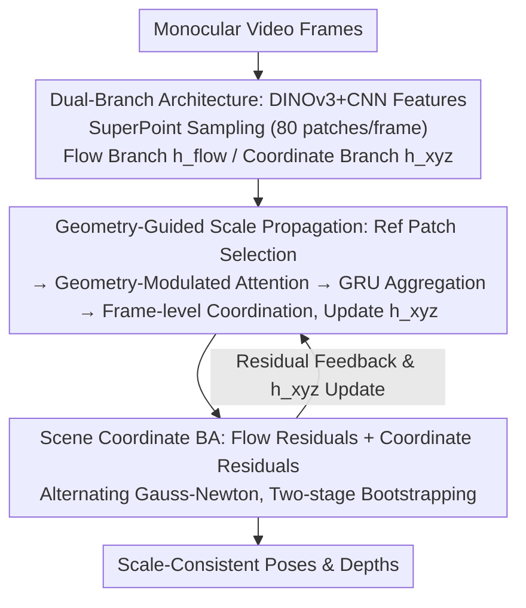

# SCE-SLAM: Scale-Consistent Monocular SLAM via Scene Coordinate Embeddings

**Conference**: CVPR 2026  
**Paper**: [CVF Open Access](https://openaccess.thecvf.com/content/CVPR2026/html/Wu_SCE-SLAM_Scale-Consistent_Monocular_SLAM_via_Scene_Coordinate_Embeddings_CVPR_2026_paper.html)  
**Code**: None  
**Area**: 3D Vision  
**Keywords**: Monocular SLAM, Scale drift, Scene coordinate embeddings, Bundle adjustment, Visual odometry

## TL;DR
SCE-SLAM parallels a "scene coordinate branch" alongside the optical flow branch in frame-to-frame monocular SLAM. It encodes 3D geometric relationships into a canonical scale reference using learnable patch-level scene coordinate embeddings. By propagating scale across windows via geometry-modulated attention and pulling bundle adjustment toward the reference scale using 3D coordinate constraints, it significantly suppresses long-sequence scale drift while maintaining 36 FPS real-time performance (KITTI average ATE reduced from 53.61m in DPVO to 25.79m, or 14.07m with loop closure).

## Background & Motivation
**Background**: Monocular visual SLAM is a fundamental capability for mobile robotics and web-scale 3D reconstruction. Recent frame-to-frame methods (e.g., DROID-SLAM, DPVO) achieve excellent real-time performance using matching-based local sliding window optimization, making them ideal for resource-constrained deployment.

**Limitations of Prior Work**: Monocular cameras can only recover geometry up to an unknown scale factor, leading to "scale drift"—the divergence of estimated scale over long sequences. The root cause is that the core constraints in frame-to-frame methods are pixel-level matches, which are scale-insensitive; scaling the entire scene by any constant yields identical pixel correspondences. As sliding windows advance and optimize independently, each implicitly establishes its own scale, causing map fragmentation and loop closure failure over thousands of frames.

**Key Challenge**: Eliminating scale drift usually requires introducing metric depth prediction, large multiview geometric models, or frame-to-model methods, all of which incur heavy computational overhead and sacrifice the real-time efficiency of frame-to-frame approaches. The authors thus pose a central question: Is it possible to achieve scale consistency while retaining frame-to-frame optimization efficiency?

**Key Insight**: The authors observe that scale drift stems from a "lack of temporal scale memory"—each window starts from scratch without "remembering" the scale of previous windows. Unlike optical flow, which describes instantaneous pixel displacement, scale is a persistent geometric invariant of the environment that should remain constant throughout a sequence. Traditional bundle adjustment has no mechanism to maintain this invariant across windows.

**Core Idea**: Use a set of learnable patch-level "scene coordinate embeddings" as persistent geometric memory to encode 3D relationships under a canonical scale reference. These embeddings accumulate scale-consistent information across time via recurrent updates and are then decoded into explicit 3D coordinate constraints injected into bundle adjustment to actively pull drifting estimates back to the reference scale.

## Method

### Overall Architecture
SCE-SLAM extends the DPVO framework into a dual-branch architecture: the **optical flow branch** inherits DPVO to provide pixel-level matching constraints for local tracking; the new **scene coordinate branch** maintains scene coordinate embeddings $h^{xyz}$ for each patch to handle global scale consistency. The system takes monocular video frames as input and outputs scale-consistent camera poses and patch depths. Two collaborative modules—Geometry-Guided Scale Propagation and Scene Coordinate Bundle Adjustment—form a feedback loop that continuously reinforces scale consistency without needing global optimization.

### Key Designs

**1. Dual-Branch Architecture for Scale Embeddings: Maintaining Complementary Latent States**

Traditional frame-to-frame methods use a single "edge-centric" flow latent state, which is inherently scale-insensitive and cannot carry scale memory. This work maintains two types of latent states for each patch: (i) the edge-level flow state $h^{flow}\in\mathbb{R}^{384}$, updated by correlation volumes from cross-frame matches to drive precise flow prediction; (ii) the **patch-centric** scene coordinate embedding $h^{xyz}\in\mathbb{R}^{384}$, initialized to zero, which accumulates scale-consistent information from all frames observing that patch. $h^{flow}$ captures instantaneous pairwise motion (scale-invariant), while $h^{xyz}$ accumulates persistent geometric relationships (scale-dependent).

To support scale learning, the feature extraction fuses pre-trained DINOv3 features with a lightweight CNN (via $1\times1$ convolution). Patch sampling replaces DPVO's random sampling with 80 SuperPoint keypoints per frame, as scale consistency requires stable multi-view tracking. The coordinate branch decoder predicts residual coordinates $\Delta X_k$ and confidence $w_k$: $X_k^{prior}=X_k+\Delta X_k$, where $X_k$ is the patch position in the world frame. Predicting residuals ensures that previously accumulated geometric information is preserved while being corrected toward the reference scale.

**2. Geometry-Guided Scale Propagation: Borrowing Scale from Spatially Proximal Patches**

The challenge is utilizing the canonical scale in historical embeddings without quadratic computational costs or incorrect associations. Simple global self-attention is infeasible due to the quadratic growth of patches over thousands of frames. Furthermore, not all patches should interact; a patch observing a nearby wall should not attend to a distant mountain.

The **Mechanism** follows the insight that "scale consistency propagates via 3D spatial proximity." The system uses a four-step process: (i) **Reference Patch Selection**: Fragments are filtered by BA residuals (top 50%) and restricted to a 30-frame window, keeping $R\approx1200$ reference patches. (ii) **Geometry-Modulated Attention**: The attention logit is $e_{ar}=\frac{Q_a^\top K_r}{\sqrt{d}}-\lambda\|X_a-X_r\|^2$, where the spatial penalty $-\lambda\|X_a-X_r\|^2$ encodes the inductive bias that 3D-proximal patches share a consistent scale. (iii) **Recurrent Aggregation**: $\tilde h^{xyz}$ combines old memory and spatial context, then passes through a GRU to accumulate scale memory across iterations. (iv) **Frame-level Coordination**: All patches in a frame are aggregated ($h^{xyz}=\text{FrameAgg}(h^{xyz})$) to ensure share camera pose and scale consistency.

**3. Scene Coordinate Bundle Adjustment: Anchoring Scale Across Windows**

This module integrates two types of residuals into a standard BA. While flow residuals $r_{ij}^{flow}$ drive local high-fidelity reconstruction in pixel space, they are invariant to uniform scaling. Scene coordinate residuals $r_k^{xyz}=w_k^{xyz}(X_k^{prior}-T_{t(k)}\cdot\pi^{-1}(u_k,d_k))$ explicitly penalize scale deviation in the world coordinate system. If the current estimation deviates from the canonical scale encoded in $X_k^{prior}$, the resulting gradient pulls $\{d_k,T_{t(k)}\}$ back. Gauss-Newton optimization is used to minimize both residuals.

A two-stage bootstrapping strategy is employed: Stage 1 minimizes flow residuals only to establish an initial reference scale; Stage 2 updates embeddings and performs BA with coordinate residuals to anchor the scale.

### Loss & Training
The model is trained on the TartanAir synthetic dataset for 240K iterations (AdamW, lr $8\times10^{-5}$, sequence length 15). In addition to standard flow and pose supervision, the coordinate branch uses ground-truth coordinates: $\mathcal{L}_{SC}=\sum_k\|X_k-X_k^{GT}\|^2$. The total loss is $\mathcal{L}_{total}=\lambda_1\mathcal{L}_{flow}+\lambda_2\mathcal{L}_{pose}+\mathcal{L}_{SC}$ ($\lambda_1=0.1, \lambda_2=10$). A curriculum freezes the flow branch for the first 10K iterations to initialize the coordinate branch.

## Key Experimental Results

### Main Results
Evaluated on KITTI, Waymo, and Virtual KITTI. Metrics include ATE RMSE (meters) and standard deviation. LC denotes Loop Closure.

| Dataset | Metric | Ours (w/o LC) | Ours (w/ LC) | Representative Competitors |
|---------|--------|---------------|--------------|----------------------------|
| KITTI (Mean of 11) | ATE↓ | 25.79 | **14.07** | DPVO 53.61; DPV-SLAM++(LC) 25.75; VGGT-Long(LC) 27.64 |
| Waymo (Mean of 9) | ATE↓ | **0.915** | — | VGGT-Long 1.996; MegaSaM 2.776; DPV-SLAM++ 3.874 |
| vKITTI (Mean of 6) | ATE↓ | **0.280** | — | DPV-SLAM++ 0.343; VGGT-Long 2.089; DROID-SLAM 1.578 |

On KITTI, the version without loop closure (25.79m) approaches DPV-SLAM++ with loop closure (25.75m). With LC, it improves further to 14.07m. On Waymo, the method (0.915m) significantly outperforms MegaSaM (2.776m), which uses heavy metric depth priors, suggesting that the "learned embeddings" are more effective for consistency.

### Ablation Study
KITTI sequence average ATE:

| Config | SC Branch | Sampler | LC | ATE(m)↓ | Note |
|--------|-----------|---------|----|---------|------|
| A | ✗ | Random | ✗ | 45.84 | DPVO + DINOv3; drift persists without anchor |
| B | Base | Random | ✗ | 43.62 | Basic coordinate branch offers minor gain |
| C | Geo Propagation| Random | ✗ | 31.83 | Geometry-modulated attention provides major gain |
| D | Geo Propagation| SuperPoint| ✗ | 25.79 | SP sampling drops ATE by another 6m |
| E | Geo Propagation| SuperPoint| ✓ | 14.07 | Full model with loop closure |

### Key Findings
- **Novelty**: The primary contribution is not just stronger features (A→B is only 2.2m), but the geometry-guided scale propagation (B→C reduces ATE by 11.8m).
- **Design Motivation**: SuperPoint sampling is critical; while random sampling may provide few tracks in 3D-valid areas, SuperPoint ensures dense, stable tracks across multiple views, which is necessary for scale aggregation.
- **Function**: Scale consistency is vital for successful loop closure. On 4Seasons, the method closes loops where DPV-SLAM++ fails due to scale fragmentation.

## Highlights & Insights
- Treating "scale" as a persistent environment invariant rather than a frame-by-frame estimate is a key shift. Instantiating scale memory as patch-level embeddings and using GRUs for accumulation mirrors recurrent flow updates but applied to 3D scale space.
- The geometry-modulated attention uses a simple $-\lambda\|X_a-X_r\|^2$ penalty to inject the physical prior that only 3D-proximal points should interact. This prunes spurious long-range dependencies and reduces global quadratic attention to a manageable local attention over 1200 high-quality patches.
- By maintaining "consistency" rather than predicting absolute metric scale, the system avoids the overhead of heavy depth models while achieving near-global optimization stability.

## Limitations & Future Work
- The scale reference is established by the initial frames' flow. If the initialization is poor (e.g., rapid motion or low texture), a biased reference scale may propagate throughout the sequence.
- The reference set is limited to a local temporal window (30 frames); the ability to retrieve very long-range scale memory (e.g., returning home after a long trip) still depends on external loop closure modules.
- Training is strictly on TartanAir; generalization to real-world scenes relies heavily on the robustness of DINOv3 features.

## Related Work & Insights
- **vs. DPVO/DROID-SLAM**: These rely on scale-invariant pixel matching. This work adds a parallel scene coordinate branch to provide the missing cross-window scale anchoring.
- **vs. Multi-view Models (MASt3R/VGGT-Long)**: These use all-to-all attention for global alignment but suffer from quadratic complexity and scale inconsistency between independent windows. This work maintains consistency via iterative geometric reasoning in local windows.
- **vs. Metric Depth Priors (MegaSaM)**: These use external models for absolute scale. This work internalizes scale into lightweight embeddings, proving more accurate in datasets like Waymo by focusing on consistency.

## Rating
- **Novelty**: ⭐⭐⭐⭐ Persistent geometric memory as a scale anchor is a fresh and effective take.
- **Experimental Thoroughness**: ⭐⭐⭐⭐ Three benchmarks plus comprehensive ablations, though real-world initialization robustness needs more study.
- **Writing Quality**: ⭐⭐⭐⭐ Clear motivation and structure.
- **Value**: ⭐⭐⭐⭐ Directly applicable for long-sequence SLAM on resource-constrained platforms by suppressing drift while remaining real-time.

<!-- RELATED:START -->

## Related Papers

- [\[CVPR 2026\] Revisiting Monocular SLAM with Spatio-Temporal Scene Modeling](revisiting_monocular_slam_with_spatio-temporal_scene_modeling.md)
- [\[CVPR 2026\] ODGS-SLAM: Omnidirectional Gaussian Splatting SLAM](odgs-slam_omnidirectional_gaussian_splatting_slam.md)
- [\[CVPR 2026\] Unblur-SLAM: Dense Neural SLAM for Blurry Inputs](unblur-slam_dense_neural_slam_for_blurry_inputs.md)
- [\[CVPR 2026\] Flow4DGS-SLAM: Optical Flow-Guided 4D Gaussian Splatting SLAM](flow4dgs-slam_optical_flow-guided_4d_gaussian_splatting_slam.md)
- [\[CVPR 2026\] AERGS-SLAM: Auto-Exposure-Robust Stereo 3D Gaussian Splatting SLAM](aergs-slam_auto-exposure-robust_stereo_3d_gaussian_splatting_slam.md)

<!-- RELATED:END -->

## Related Papers

- [\[CVPR 2026\] Revisiting Monocular SLAM with Spatio-Temporal Scene Modeling](revisiting_monocular_slam_with_spatio-temporal_scene_modeling.md)
- [\[CVPR 2026\] ODGS-SLAM: Omnidirectional Gaussian Splatting SLAM](odgs-slam_omnidirectional_gaussian_splatting_slam.md)
- [\[CVPR 2026\] Unblur-SLAM: Dense Neural SLAM for Blurry Inputs](unblur-slam_dense_neural_slam_for_blurry_inputs.md)
- [\[CVPR 2026\] Flow4DGS-SLAM: Optical Flow-Guided 4D Gaussian Splatting SLAM](flow4dgs-slam_optical_flow-guided_4d_gaussian_splatting_slam.md)
- [\[CVPR 2026\] AERGS-SLAM: Auto-Exposure-Robust Stereo 3D Gaussian Splatting SLAM](aergs-slam_auto-exposure-robust_stereo_3d_gaussian_splatting_slam.md)

<!-- RELATED:END -->
