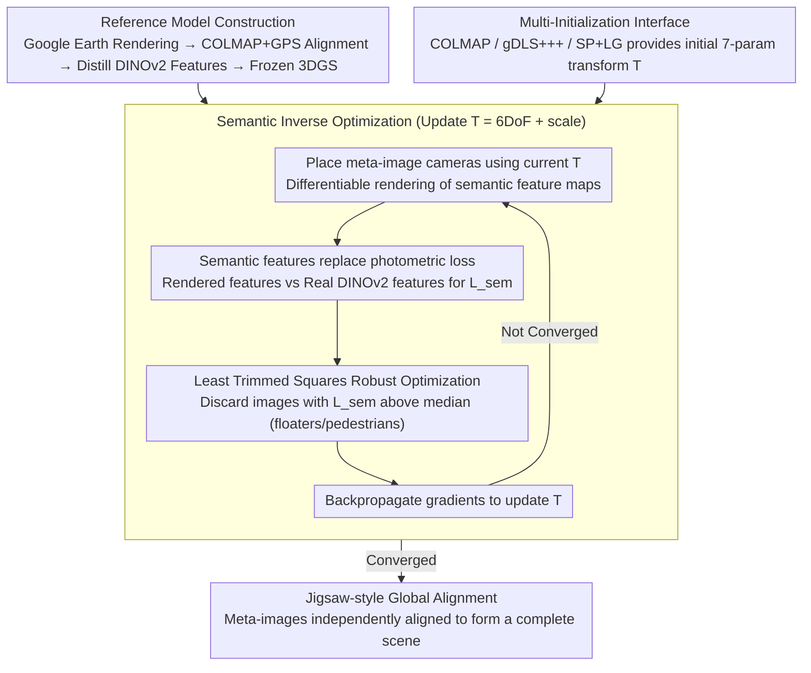

# Scene Grounding In the Wild

**Conference**: CVPR 2026  
**arXiv**: [2603.26584](https://arxiv.org/abs/2603.26584)  
**Code**: [https://tau-vailab.github.io/SceneGround/](https://tau-vailab.github.io/SceneGround/)  
**Area**: 3D Vision  
**Keywords**: Scene grounding, 3D reconstruction, Gaussian Splatting, semantic features, cross-domain alignment

## TL;DR

This paper proposes an inverse optimization framework based on semantic features to align local 3D reconstructions (SfM) captured in the wild to a complete pseudo-synthetic reference model (e.g., Google Earth Studio). By utilizing DINOv2 features and robust optimization, it bridges significant domain gaps and achieves globally consistent fusion of non-overlapping local reconstructions.

## Background & Motivation

1. **Background**: Reconstructing 3D scenes from unstructured photo collections is a core challenge in CV. Classical SfM and modern learning-based methods (DUSt3R, MASt3R, VGGT, etc.) can reconstruct scenes from large-scale image sets, provided there is sufficient visual overlap between input views.
2. **Limitations of Prior Work**: Large-scale real-world image collections often suffer from severe viewpoint bias—for instance, tourists mainly photograph the front of the Milan Cathedral, with few taking photos of the back. This causes SfM to produce multiple disconnected local reconstructions or even incorrectly merge non-overlapping regions.
3. **Key Challenge**: The lack of overlap causes geometric correspondence based on feature matching to fail. While tools like Google Earth Studio provide complete scene coverage, the rendered images differ significantly from real photos in appearance (domain gap), making traditional photometric loss unusable for alignment.
4. **Goal**: To "ground" local reconstructions captured in the wild into a complete reference model to achieve globally consistent alignment.
5. **Key Insight**: Despite massive appearance differences, real photos and pseudo-synthetic renderings share the same scene semantics. Leveraging the insight that semantic features extracted by foundation models like DINOv2 are cross-domain consistent, the authors design a semantic-based inverse optimization.
6. **Core Idea**: Distill semantic features into a 3DGS reference model. Optimize a 6DoF+scale transformation by minimizing the L1 loss between rendered and real semantic features, supplemented by Least Trimmed Squares robust optimization to handle outliers.

## Method

### Overall Architecture

This paper addresses the problem of fragmented 3D reconstructions: when SfM is performed on photos taken in the wild, the lack of overlapping views often causes the scene to split into several disconnected parts. The authors' approach borrows a "map"—using Google Earth Studio to render the entire building, constructing a 3DGS reference model distilled with DINOv2 features, and then "grounding" each local reconstruction (termed a meta-image) onto this complete reference.

The entire pipeline optimizes only a 7-parameter global transformation $T$ (6DoF SE3 rotation/translation + 1 scale). The Gaussian parameters of the reference model are frozen throughout. In each iteration, the current $T$ is used to place the meta-image cameras into the reference coordinate system, a semantic feature map is differentially rendered and compared against the DINOv2 features of the real photos using a loss function (with robust optimization to reject outlier images). Gradients are backpropagated to update only $T$. Multiple local reconstructions are aligned independently and then assembled into a complete scene like a jigsaw puzzle.

### Key Designs

**1. Semantic Features over Photometric Loss: Calculating loss across domains with inconsistent colors**

The most difficult aspect of cross-domain alignment is that reference images come from Google Earth renderings while real images are casual tourist photos; they differ vastly in color, lighting, and texture. Traditional photometric loss (like the direct RGB comparison in iNeRF) fails in this appearance gap—ablation shows its rotation error $\Delta R$ as high as 6.48°, compared to 2.48° with this method. The authors' key observation: while appearance differs, scene semantics are shared. The locations of cathedral towers, rose windows, and portals are identical across domains. Following the logic of Feature 3DGS, they distill an additional DINOv2 feature vector into each Gaussian of the reference model, enabling the model to render feature maps. Optimization utilizes an L1 loss $L_{sem}$ between rendered feature maps and real DINOv2 features. Since DINOv2 encodes scene semantics rather than appearance details, mismatched colors do not disrupt the signal. The authors also tested LSeg segmentation features and DINOv2+DVT enhanced versions, finding that vanilla DINOv2 performed best—alignment requires fine-grained spatial semantics rather than coarse semantic categories.

**2. Least Trimmed Squares (LTS) Robust Optimization: Preventing floaters and pedestrians from dominating the loss**

Outliers are inevitable in "in the wild" data: the reference model contains "floater" artifacts, and real photos include pedestrians, temporary structures, or large-scale occlusions. The feature loss in these areas is exceptionally high, which would bias the optimization if simply averaged. The authors formulate the objective as:

$$\hat{T} = \arg\min_T \varphi\big(\mathcal{L}(T\,|\,\mathcal{I}, \mathcal{M})\big)$$

where the robust operator $\varphi$ is LTS: in each iteration, any image whose $L_{sem}$ exceeds the median loss from the previous round is discarded from the gradient calculation. This "adaptive truncation based on the median" is more stable than fixed-threshold truncation (Fixed LTS) or Iteratively Reweighted Least Squares (IRLS)—ablation shows that removing LTS drops the MTA from 81% to 69% and increases the outlier rate O% from 0% to 3%.

**3. Multi-Initialization + Jigsaw Alignment: Improvement from any starting point**

Inverse optimization is inherently agnostic to initialization. The authors allow the method to interface with outputs from various methods like COLMAP, gDLS+++, and SuperPoint+LightGlue. These three involve different trade-offs: gDLS+++ is the most stable but requires specific configurations, COLMAP is most general but has higher initial error, and SP+LG falls in between. Regardless of the starting point, semantic inverse optimization consistently reduces the error (e.g., $\Delta R$ for COLMAP init drops from 4.99° to 2.48°). Multiple reconstructions are not solved jointly; instead, each meta-image is independently aligned to the same reference model and eventually assembled. This avoids high-dimensional coupling of simultaneous transformations, solving only one 7-parameter problem at a time.

### Loss & Training

The supervision signal is the L1 distance $L_{sem}$ between the rendered feature map and the real DINOv2 features, wrapped in an LTS robust operator. Optimization uses gradient descent to update the 7-parameter transformation (6DoF SE3 + 1 scale), while the 3DGS parameters of the reference model remain frozen. The reference model itself is reconstructed using COLMAP from Google Earth Studio renderings and calibrated via GPS coordinates.

## Key Experimental Results

### Main Results

WikiEarth Benchmark (32 meta-images, 23 scenes):

| Method | $\Delta R^\circ \downarrow$ | $\Delta T \downarrow$ | MTA% $\uparrow$ | O% $\downarrow$ | Failures |
|------|-------|------|--------|------|--------|
| COLMAP | 4.99 | 0.12 | 66 | 12 | 0/32 |
| **Ours (COLMAP init)** | **2.48** | **0.12** | **81** | **0** | - |
| gDLS+++ | 2.86 | 0.12 | 78 | 6 | 1/32 |
| **Ours (gDLS+++ init)** | **2.69** | **0.13** | **84** | **3** | - |
| SP+LG | 3.74 | 0.25 | 74 | 15 | 5/32 |
| **Ours (SP+LG init)** | **3.13** | **0.24** | **81** | **7** | - |

Comparison with feed-forward 3D models (geodesic rotation error):

| Method | $\Delta R_{I\leftrightarrow M}^\circ \downarrow$ | $\Delta R_{I\leftrightarrow I}^\circ \downarrow$ |
|------|-----------|-----------|
| DUSt3R | 54.40 | 29.27 |
| MASt3R | 24.18 | 12.52 |
| VGGT | 51.69 | 24.63 |
| $\pi^3$ | 68.46 | 45.80 |
| **Ours (COLMAP init)** | **2.59** | **1.48** |

The error of this method is an order of magnitude lower than feed-forward models.

### Ablation Study

| Method | $\Delta R^\circ \downarrow$ | $\Delta T \downarrow$ | MTA% $\uparrow$ | O% $\downarrow$ |
|------|-------|------|--------|------|
| **Ours (full)** | **2.48** | **0.12** | **81** | **0** |
| Photometric Loss | 6.48 | 0.38 | 72 | 22 |
| LSeg | 4.78 | 0.34 | 62 | 19 |
| DINOv2 + DVT | 2.86 | 0.14 | 78 | 0 |
| w/o LTS | 3.78 | 0.19 | 69 | 3 |
| Fixed LTS | 2.78 | 0.14 | 72 | 0 |
| IRLS | 3.51 | 0.18 | 72 | 3 |

### Key Findings

- Photometric loss is almost unusable in cross-domain settings ($\Delta R$ 6.48° vs 2.48°, O% 22%), confirming the necessity of semantic features.
- Original DINOv2 features outperform DVT-enhanced versions and LSeg segmentation features—scene alignment requires fine-grained spatial semantics rather than semantic labels.
- LTS adaptive outlier detection is crucial—removing it drops MTA from 81% to 69% and raises O% from 0% to 3%.
- Feed-forward 3D models (DUSt3R, MASt3R, VGGT, $\pi^3$) fail completely in non-overlapping scenes—with errors in the 24°-68° range, compared to only 2.59° for this method.
- The method generalizes to reference models built from drone videos, not just Google Earth.

## Highlights & Insights

- **Semantics as a Cross-Domain Bridge**: Cleverly leverages the insight that images from different domains share scene semantics, distilling DINOv2 features into 3DGS for differentiable rendering and semantic comparison. This strategy is transferable to any task requiring cross-domain 3D alignment.
- **3DGS Upgrade for iNeRF**: Switching from NeRF to 3DGS achieves real-time rendering speeds, making inverse optimization iterations more efficient while extending the concept to global transformations rather than single-frame poses.
- **Value of WikiEarth Benchmark**: The first dataset to provide ground truth alignment between pseudo-synthetic reference models and real-world reconstructions, filling an evaluation gap.
- The "reality check" of SOTA feed-forward models is compelling—DUSt3R/MASt3R/VGGT are almost entirely ineffective in non-overlapping settings, highlighting the necessity of external reference models.

## Limitations & Future Work

- Dependency on external data sources like Google Earth Studio; availability and quality of such data vary by region.
- Each meta-image is aligned independently, failing to exploit potential constraints between multiple meta-images.
- The quality of Google Earth Studio models is limited (low-res textures, coarse geometry), which may not support fine alignment in some scenes.
- The WikiEarth benchmark primarily contains European cathedrals and landmarks, with limited scene diversity.
- Future directions: Jointly optimizing transformations for multiple meta-images; using LLM/VLM for scene-image semantic matching to assist initialization; extending to indoor or non-landmark scenes.

## Related Work & Insights

- **vs iNeRF**: iNeRF optimizes single-frame camera poses using photometric loss and is limited to controlled environments; this paper optimizes global transformations using semantic loss for "in the wild" photo collections. Key upgrades include 3DGS replacing NeRF and LTS robustification.
- **vs DUSt3R/MASt3R/VGGT**: These feed-forward models excel in overlapping scenes but collapse in non-overlapping settings due to a lack of global geometric constraints. This shows that end-to-end methods in the LLM era cannot yet fully replace the classical reference model + inverse optimization paradigm.
- **vs GaussReg, NeRF2NeRF**: These methods perform registration between two 3D scenes but do not handle the massive appearance differences of cross-domain (synthetic-to-real) scenarios.

## Rating

- Novelty: ⭐⭐⭐⭐ Introducing semantic features to inverse optimization for cross-domain scene grounding is a natural but effective innovation; WikiEarth is a valuable contribution.
- Experimental Thoroughness: ⭐⭐⭐⭐⭐ Comprehensive comparison across multiple initializations and feed-forward models, detailed ablation, and drone generalization experiments make it very solid.
- Writing Quality: ⭐⭐⭐⭐ Clear motivation, rich visualization, and organized method description.
- Value: ⭐⭐⭐⭐ High practicality—provides a solution for fragmented large-scale scene reconstruction with direct applications in cultural heritage and urban modeling.

<!-- RELATED:START -->

## Related Papers

- [\[CVPR 2026\] EmbodMocap: In-the-Wild 4D Human-Scene Reconstruction for Embodied Agents](embodmocap_in-the-wild_4d_human-scene_reconstruction_for_embodied_agents.md)
- [\[CVPR 2026\] EG-3DVG: Expression and Geometry Aware Grounding Decoder for 3D Visual Grounding](eg-3dvg_expression_and_geometry_aware_grounding_decoder_for_3d_visual_grounding.md)
- [\[CVPR 2026\] NeoVerse: Enhancing 4D World Model with in-the-wild Monocular Videos](neoverse_enhancing_4d_world_model_with_in-the-wild_monocular_videos.md)
- [\[CVPR 2026\] Affostruction: 3D Affordance Grounding with Generative Reconstruction](affostruction_3d_affordance_grounding_with_generative_reconstruction.md)
- [\[ICLR 2026\] Joint Optimization for 4D Human-Scene Reconstruction in the Wild](../../ICLR2026/3d_vision/joint_optimization_for_4d_human-scene_reconstruction_in_the_wild.md)

<!-- RELATED:END -->
