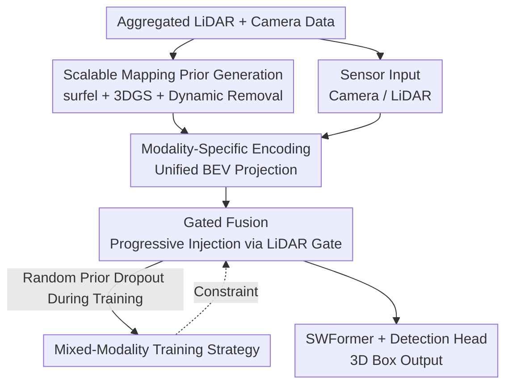

# Scene Reconstruction as Mapping Priors for 3D Detection

**Conference**: CVPR 2026  
**arXiv**: [2605.22997](https://arxiv.org/abs/2605.22997)  
**Code**: None  
**Area**: 3D Vision / Autonomous Driving  
**Keywords**: 3D Detection, Scene Reconstruction, Mapping Priors, 3DGS, Gated Fusion

## TL;DR
This work repurposes "maps" originally intended for planning in autonomous driving for perception—utilizing automatically reconstructed surfel/3DGS scenes as "mapping priors" to replace expensive manual HD maps. A gated fusion module adaptively integrates these priors with LiDAR/camera inputs, outperforming temporal fusion SOTA using 100 frames with only 4 frames on the Waymo Open Dataset.

## Background & Motivation
**Background**: Mainstream 3D detection in autonomous driving relies on multi-sensor setups (LiDAR, camera, radar) combined with voxelized sparse convolutional backbones (e.g., SWFormer, SAFDNet). To counter sparsity and occlusion in single frames, **temporal fusion**—aggregating past LiDAR frames or maintaining object memory banks for trajectory prediction—is widely used, with works like MAD aggregating up to 100 history frames.

**Limitations of Prior Work**: Sensors are unreliable under low visibility, long distances, or harsh weather; point clouds of distant vehicles are extremely sparse and easily submerged in background noise. While HD maps provide strong structural priors to disambiguate and compensate for sparsity, **HD maps themselves are not scalable**: they depend on manual annotation of every road element, making them costly to build, hard to maintain, and impossible to scale across large road networks. Conversely, while temporal fusion densifies representations, it is limited by compute/memory and suffers from accumulated errors if "detection-tracking-fusion" associations fail (e.g., ID switches).

**Key Challenge**: Perception requires dense static priors (like HD maps) to compensate for sensor shortcomings, but scalable map sources are unavailable—manual HD maps are expensive/unscalable, while temporal fusion is both costly and brittle.

**Goal**: To identify a "map" that provides dense static structural priors like HD maps while being **automatically producible at scale**, integrate it effectively into existing detectors, and ensure the system remains functional when maps are missing.

**Key Insight**: The authors observe that recent scene reconstruction methods (surfel, 3DGS) can **fully automatically** reconstruct dense maps with geometry and appearance from vehicle-collected LiDAR and camera data without manual labeling. Using these reconstruction results as "mapping priors" fills the gap for "scalable dense static priors."

**Core Idea**: Automatically reconstructed scenes (surfels + 3DGS) serve as mapping priors to replace manual HD maps. A gated fusion module adaptively blends this "static background prior" with sensor features—once the background is "masked out" by the prior, the remaining mismatched sparse points are highlighted as foreground dynamic objects, making distant or occluded targets easier to detect.

## Method

### Overall Architecture
MPA3D (Mapping Priors Augmented 3D detection) is built upon SWFormer. The pipeline consists of two main components: **Offline Scalable Mapping Prior Generation** and **Online Prior-Augmented Detection**.

The first component uses a MapReduce parallel pipeline to automatically reconstruct two types of priors from aggregated sensor data: **surfel maps** (geometrically efficient but LiDAR-dependent) and **3DGS maps** (optimized with cameras to complete LiDAR-sparse areas). Dynamic objects are removed before reconstruction to ensure scene stasis. During online detection, camera images, LiDAR, surfels, and 3DGS are processed via modality-specific encoders into a unified BEV space. A **Gated Fusion Module** treats LiDAR as the primary feature and injects the two priors progressively. Finally, a SWFormer sparse window Transformer and detection head output 3D boxes. A **Mixed-Modality Training Strategy** ensures the model remains functional if priors are missing.

The architecture diagram below corresponds to: Prior Generation → Modality Encoding → Gated Fusion → Detection Head.

### Key Designs

**1. Scalable Mapping Prior Generation: Replacing Manual HD Maps with Auto-Reconstruction**

This addresses the motivation for "dense static priors" without manual labels. Two complementary priors are reconstructed. **Surfel maps** discretize the scene into 0.25m voxels, fitting a surfel disk to LiDAR scans within each voxel to estimate mean coordinates, surface normals, and mean color, denoted as $\mathcal{S}=\{x_i, n_i, c_i\}_{i=1:N_S}$. Since surfel generation is independent per voxel, large regions can be reconstructed in parallel. However, surfel positions are fixed by initial LiDAR points, leading to noise or gaps in sparse areas. **3DGS maps** use a set of Gaussians $\boldsymbol{\mathcal{G}}=\{(\boldsymbol{\mu}, \text{SH}, \boldsymbol{r}, \boldsymbol{s}, \alpha)_i\}$ initialized by LiDAR, but **all attributes (including position) are optimized** using photometric loss from camera images. This allows Gaussians to move, correct noise, and fill LiDAR gaps. Custom CUDA kernels for 3D Gaussian ray-tracing (rather than splatting) are implemented for geometric precision.

To ensure static priors, **dynamic objects must be removed**. During training, 3D box labels are used to exclude dynamic points; during inference, a map-free configuration first predicts initial 3D boxes to generate masks for "detection-while-mapping." The pipeline uses Apache Beam's MapReduce, employing thousands of CPU cores to generate surfel+3DGS for 600,000 scenes in 10 days—a negligible cost compared to manual HD mapping.

**2. Gated Fusion Module: Avoiding Density Bias via LiDAR-Gated Injection**

A critical issue in multi-modal fusion is that if features from surfels, 3DGS, and LiDAR in the same BEV voxel are simply averaged (segment-mean), the **result is biased toward the modality with the highest point density**. For instance, if a voxel contains 95 LiDAR points and 5 Gaussians, LiDAR dominates 95% of the average, effectively erasing the complementary information from Gaussians.

The Gated Fusion approach first computes independent segment-means $\bar{f}_{\text{lidar}}, \bar{f}_{\text{surfel}}, \bar{f}_{\text{gaussian}}$, treating **LiDAR features as the primary "gate."** First, surfel contributions are injected by modulating them with LiDAR context:

$$\alpha_{\text{surfel}} = \text{Swish}(\sigma_{\text{in}}(\bar{f}_{\text{lidar}})) \cdot \sigma_{\text{surfel}}(\bar{f}_{\text{surfel}})$$

An intermediate fused feature is obtained via a residual connection: $f_{\text{inter}} = \phi_{\text{surfel}}(\alpha_{\text{surfel}}) + \bar{f}_{\text{lidar}}$. Second, this intermediate feature acts as the new gate to inject 3DGS:

$$\alpha_{\text{Gaussian}} = \text{Swish}(\sigma_{\text{inter}}(f_{\text{inter}})) \cdot \sigma_{\text{Gaussian}}(\bar{f}_{\text{Gaussian}})$$

The final feature $f_{\text{fused}} = \phi_{\text{Gaussian}}(\alpha_{\text{Gaussian}}) + f_{\text{inter}}$ is concatenated with dense camera features $f_{\text{final}}=[f_{\text{camera}}, f_{\text{fused}}]$. This design uses LiDAR residual skips to protect reliable LiDAR features from "prior pollution" while allowing the network to adaptively modulate prior influence based on local scene characteristics.

**3. Mixed-Modality Training Strategy: Robustness to Missing Modalities**

In real-world deployment, priors may be missing due to reconstruction failure or environmental factors. The model must handle any modality combination. During training, **modality combinations are randomly sampled for each sample** (assuming camera+LiDAR are always present, while surfel/3DGS are randomly dropped). 

This works due to three properties of Gated Fusion: ① Modalities are aggregated independently; missing modalities contribute zero features without changing the architecture. ② Learnable gate weights automatically suppress missing/unreliable modalities (the network learns to set $\alpha_{\text{surfel}}\approx 0$ when $\bar{f}_{\text{surfel}}=\mathbf{0}$). ③ LiDAR residual skips ensure stability; **if all priors are missing, $f_{\text{fused}}$ naturally degrades to $\bar{f}_{\text{lidar}}$**. Consequently, the model is plug-and-play for any available modality combination during inference without retraining.

### Loss & Training
The detection loss follows SWFormer, consisting of heatmap loss, box regression loss, and foreground segmentation loss for each class $c$. Heatmap loss $L_{\text{hm}}^c$ is a penalty-reduced focal loss. Boxes are parameterized as $\boldsymbol{b}=\{d_x,d_y,d_z,l,w,h,\theta\}$ ($L_{\text{bbox}}^c$ includes bin loss for orientation, Smooth L1 for others, and IoU loss). A per-voxel binary focal loss $L_{\text{seg}}^c$ is used for class-aware foreground segmentation. Total loss:

$$L = \sum_c (\lambda_{\text{hm}} L_{\text{hm}}^c + \lambda_{\text{bbox}} L_{\text{bbox}}^c + \lambda_{\text{seg}} L_{\text{seg}}^c)$$

Weights are set to $\lambda_{\text{hm}}=1.0, \lambda_{\text{bbox}}=2.0, \lambda_{\text{seg}}=1.0$. **Three-stage training** is used: pre-training on 100M internal video sequences (no priors, auto-labeled), mid-training on 350K sequences with priors, and fine-tuning on the WOD training set with full priors.

## Key Experimental Results

### Main Results
Evaluated on the Waymo Open Dataset (WOD) validation and test leaderboards using mAP and APH (orientation-weighted), with IoU thresholds of 0.7 for Vehicles and 0.5 for Pedestrians/Cyclists across 75m.

**Vs. Single-frame/Multi-frame Detectors (Val Overall)**:

| Method | Frames | L1 AP | L1 APH | L2 AP | L2 APH |
|------|------|-------|--------|-------|--------|
| SAFDNet | 1 | 81.7 | 79.7 | 75.5 | 73.6 |
| HEDNet 4f | 4 | 83.6 | 82.3 | 78.1 | 76.8 |
| SAFDNet 4f | 4 | 83.9 | 82.6 | 78.4 | 77.1 |
| **MPA3D (Ours) 4f** | 4 | **86.4** | **84.9** | **81.6** | **80.1** |

Compared to the previous best multi-frame method SAFDNet 4f, MPA3D achieves +2.2% L1 APH and +2.7% L2 APH.

**Vs. Temporal Fusion Methods (Val + Test Overall)**:

| Method | Frames | Val L2 APH | Test L2 APH |
|------|------|-----------|-------------|
| MSF | 4 | 75.5 | 77.0 |
| MAD | 100 | 79.4 | 80.2 |
| **MPA3D (Ours)** | 4 | **80.1** | **81.6** |

Notably, MPA3D using only **4 frames** outperforms MAD using **100 frames** by +1.4% L2 APH on the test set, proving that high-quality reconstruction priors are more efficient than massive temporal aggregation.

### Ablation Study

**Effectiveness of Mapping Priors** (WOD Val subset, L2):

| Baseline | Surfel | 3DGS | Overall AP | Overall APH |
|------|--------|------|-----------|-------------|
| Ours-baseline | ✗ | ✗ | 81.8 | 80.1 |
| Ours-baseline | ✓ | ✗ | 82.7 | 81.1 |
| Ours-baseline | ✗ | ✓ | 82.6 | 81.0 |
| Ours-baseline | ✓ | ✓ | **83.3** | **81.7** |

**Gated Fusion vs. Other Fusion Strategies** (WOD Val subset, Overall L2):

| Strategy | AP | APH |
|----------|----|----|
| Sum | 75.2 | 73.4 |
| Average | 78.7 | 77.0 |
| Concat | 80.4 | 78.7 |
| **Gated** | **83.3** | **81.7** |

### Key Findings
- **Gated Fusion is the most critical component**: Gated fusion outperforms Concat by 2.9% L2 AP, while Sum/Average perform significantly worse by allowing noise or empty prior features to pollute valid signals, confirming the "density bias" issue.
- **Surfel and 3DGS are complementary**: Adding either improves performance, but combining both yields the best results.
- **Mechanism of Background Priors**: Since priors characterize the static background, the model can effectively "subtract" points aligned with the static background. This highlights mismatched sparse points—even partial contours—as dynamic foreground, significantly aiding long-range/occluded detection.
- **Cost**: The baseline latency of 245ms increases to 452ms with both priors. Mapping 600k scenes requires thousands of CPU cores for 10 days.

## Highlights & Insights
- **Cross-task Repurposing of "Maps"**: Repurposing planning maps as structural priors for perception—while bypassing the HD map scalability bottleneck via automatic surfel/3DGS reconstruction—is a highly original and effective insight.
- **Elegant "Elimination" Mechanism**: Instead of telling the model "where the cars are," the system indicates "where the background is." This "elimination" approach naturally lets foreground objects emerge, perfectly addressing long-range sparsity.
- **Robust Multi-functional Gate Design**: The LiDAR-gated residual design solves density bias, supports mixed-modality training (graceful degradation), and enables the "detect-then-map" inference loop.
- **Transferable Framework**: The gated+residual mechanism for controlled auxiliary modality injection under uncertain availability is applicable to many multi-modal fusion scenarios (e.g., SLAM with prior maps).

## Limitations & Future Work
- **Dynamic Reconstruction**: 3DGS assumes a static scene. Inference requires a map-free pass to generate masks, and dynamic objects themselves are not reconstructed. Accurate dynamic reconstruction is designated for future work.
- **Latency**: Operational latency nearly doubles (245ms to 452ms), posing a challenge for real-time deployment without specific acceleration.
- **Heavy Resource Dependency**: The method is tied to industrial-scale compute and data (100M sequences, thousands of CPU/TPU cores), making academic replication difficult and cross-dataset generalization (e.g., nuScenes) unverified.
- **No Open Source Code**: Engineering details like custom CUDA kernels and Apache Beam pipelines are difficult to reproduce without source code.

## Related Work & Insights
- **Vs. HD Map Augmented Detection**: Unlike HDMapNet or VectorMapNet which require manual HD maps or dense map labels, this work uses fully automated reconstruction, offering superior scalability.
- **Vs. Temporal Fusion**: Unlike MAD or VideoBEV which aggregate massive temporal windows and suffer from tracking error accumulation, this work provides rich static context from pre-built priors, achieving better results with only 4 frames.

## Rating
- Novelty: ⭐⭐⭐⭐⭐ Redefining scene reconstruction as a scalable mapping prior for detection is a fresh and clever perspective.
- Experimental Thoroughness: ⭐⭐⭐⭐ Extensive main and ablation results on WOD, but lacks cross-dataset validation and open-source availability.
- Writing Quality: ⭐⭐⭐⭐⭐ Clear motivation and a logical progression from prior generation to fusion and training.
- Value: ⭐⭐⭐⭐ High utility for industrial-grade autonomous driving, though the high resource barrier limits academic accessibility.

<!-- RELATED:START -->

## Related Papers

- [\[CVPR 2026\] Generative Diffusion Priors for 3D Mapping of the Dark Universe](generative_diffusion_priors_for_3d_mapping_of_the_dark_universe.md)
- [\[CVPR 2026\] Learning 3D Reconstruction with Priors in Test Time](tco_learning_3d_reconstruction_with_priors_in_test_time.md)
- [\[CVPR 2026\] Zoo3D: Zero-Shot 3D Object Detection at Scene Level](zoo3d_zero-shot_3d_object_detection_at_scene_level.md)
- [\[CVPR 2026\] NimbusGS: Unified 3D Scene Reconstruction under Hybrid Weather](nimbusgs_unified_3d_scene_reconstruction_under_hybrid_weather.md)
- [\[CVPR 2026\] Geometry-Aligned and Anomaly-Aware Reconstruction for 3D Anomaly Detection](geometry-aligned_and_anomaly-aware_reconstruction_for_3d_anomaly_detection.md)

<!-- RELATED:END -->
