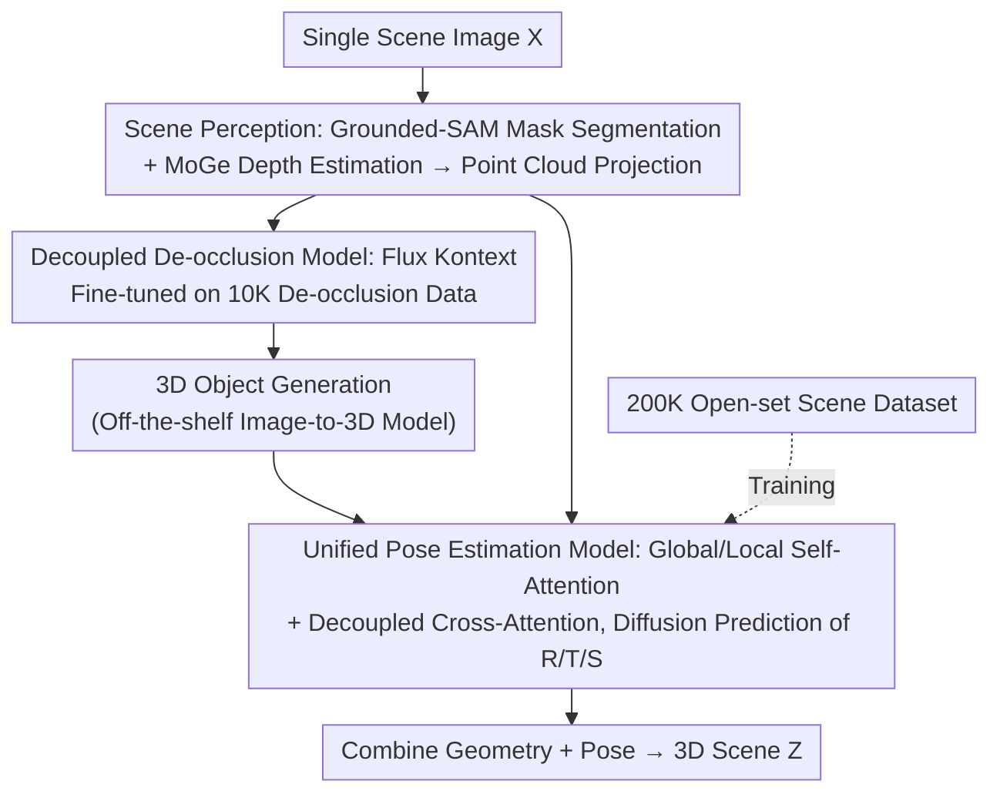

# SceneMaker: Open-set 3D Scene Generation with Decoupled De-occlusion and Pose Estimation Model

**Conference**: CVPR 2026  
**Paper**: [CVF Open Access](https://openaccess.thecvf.com/content/CVPR2026/html/Shi_SceneMaker_Open-set_3D_Scene_Generation_with_Decoupled_De-occlusion_and_Pose_CVPR_2026_paper.html)  
**Code**: https://idea-research.github.io/SceneMaker/  
**Area**: 3D Vision  
**Keywords**: Open-set 3D scene generation, de-occlusion, pose estimation, diffusion models, decoupled framework

## TL;DR
SceneMaker decouples single-image 3D scene generation into three sub-tasks: "de-occlusion / 3D object generation / pose estimation," leveraging image data, 3D object data, and scene data respectively to acquire sufficient open-set priors. It compensates for occluded objects using a de-occlusion model fine-tuned from image editing models and predicts the rotation, translation, and scale of each object directly via a unified diffusion pose model with global/local attention. By utilizing a self-constructed 200K open-set scene dataset, the model achieves high-quality geometry and accurate poses for both indoor and open-set scenarios.

## Background & Motivation
**Background**: The goal of open-set 3D scene generation is to synthesize 3D scenes containing arbitrary open-world objects from a single image, which is a fundamental capability for AIGC and embodied AI (3D asset creation, simulation environment construction, and 3D perception-based decision making). However, constrained by the scarcity of scene datasets, most existing methods are limited to restricted domains such as indoor environments.

**Limitations of Prior Work**: With the emergence of large-scale 3D object datasets, open-set 3D object generation has progressed rapidly, and scene generation has begun to extend toward open sets. However, existing methods still struggle to produce high-quality geometry and accurate poses simultaneously under heavy occlusion and open-set settings. The authors attribute the root cause to the model **lacking two types of open-set priors**: de-occlusion priors and pose estimation priors.

**Key Challenge**: A 3D scene generation model requires three types of open-set priors: de-occlusion, object geometry, and pose estimation. The availability of these three priors varies across scene, object, and image datasets. Scene-native methods learn all three priors only from scene datasets, which have limited open-set priors. Object-native methods supplement object geometry priors using large-scale 3D object data but still lack de-occlusion and pose priors due to data constraints. Furthermore, existing pose estimation methods degrade when applied to scene generation—they lack scale prediction and do not have attention mechanisms tailored for different pose variables.

**Goal**: To decompose the problem into three sub-problems: (1) how to acquire sufficient open-set priors for de-occlusion; (2) how to accurately estimate the 6D pose and scale of each object in a scene; and (3) how to enable the pose model to generalize to open sets.

**Key Insight**: Since different priors naturally reside in different datasets, the task should be "decoupled according to the required priors." This allows each sub-task to be trained independently on the most matching dataset, preventing data interference between tasks (e.g., geometry collapse of small objects or pose drift caused by coupled geometry and pose representations).

**Core Idea**: A three-pronged approach involving a decoupled three-task framework + leveraging massive image data for de-occlusion priors + utilizing a self-constructed 200K synthetic scene dataset for pose priors to address the two major weaknesses of open-set scene generation.

## Method

### Overall Architecture
Given a scene image $X=\{x_1,...,x_n\}$ containing multiple 2D objects, SceneMaker outputs a corresponding consistent 3D scene $Z=\{z_1,...,z_n\}$. The pipeline consists of three major modules: **Scene Perception** (using Grounded-SAM for object mask segmentation and MoGe for depth estimation and 3D point cloud projection) → **3D Object Generation under Occlusion** (using a decoupled de-occlusion model to complete occluded object images, followed by an off-the-shelf image-to-3D model for geometry) → **Unified Pose Estimation** (diffusion-based prediction of each object's rotation, translation, and scale based on point clouds, images, and geometry). Finally, geometry and pose are combined into the complete scene $Z=\{O,P\}$. The core of this design is "decoupling": each module is trained separately on the dataset richest in the corresponding prior.

### Key Designs

**1. Decoupled Three-Task Framework: Splitting Scene Generation by "Required Priors"**

Existing methods mix de-occlusion, object geometry, and pose priors during learning, leading to tasks hindering each other—causing small object geometry collapse or pose drift due to joint representations. This paper explicitly divides scene generation into three independent tasks: de-occlusion trained on image datasets, 3D object generation trained on 3D object datasets, and pose estimation trained on scene datasets. Formally, it follows automated steps: Grounded-SAM provides masks $M$ and occluded images $I$ → MoGe provides depth $D$ and point clouds $C$ → De-occlusion model $\epsilon_\theta^d(I_t^d;t,I)\to I^d$ → 3D generation $\epsilon_\theta^o(O_t;t,I^d)\to O$ → Pose estimation $\epsilon_\theta^p(P_t;t,X,M,I,C,O)\to P$, where $p_i=\{r_i,t_i,s_i\}$ → Combined as $Z=\{O,P\}$. Decoupling ensures each task learns its specific category of open-set priors without contamination.

**2. Decoupled De-occlusion Model: Leveraging Massive Image Data to Complete Objects Before Geometry Generation**

The bottleneck of geometric failure under severe occlusion is the "lack of de-occlusion priors," as 3D datasets are too small and have simple occlusion patterns. The authors' key insight is that image datasets are significantly larger than 3D datasets, covering a broader range of open-set objects and richer occlusion patterns. Thus, de-occlusion is isolated from 3D object generation. Flux Kontext is used as initialization (inheriting its open-set priors and natural language understanding) and fine-tuned on a self-constructed 10K object-level image de-occlusion dataset. The dataset construction involves: GPT generating detailed object descriptions, FLUX producing high-quality target images, and three masking strategies (background-free cutouts, rectangular boundary cropping, and random brush strokes) to simulate realistic occlusion. This produces 10K "occluded image + text prompt + target image" triplets. After completion, an off-the-shelf image-to-3D model $\epsilon_\theta^o$ generates geometry. This decoupled approach provides higher quality and text-controllability under severe occlusion compared to direct 3D methods.

**3. Unified Pose Estimation Model: Diffusion-based Prediction via Global/Local and Decoupled Attention**

Existing pose methods have three weaknesses when applied to scene generation: lack of scale prediction (object generation occurs in normalized canonical space), improper decoupling of pose variables with scene-level vs. object-level features, and degradation under open-set settings due to limited data. This paper proposes a unified diffusion pose model that directly outputs $P=\{R,T,S\}$ (using 6D representation for rotation). The scene is normalized to a unified space and denoised from Gaussian noise using a Flow Matching + DiT architecture (object geometry, images, and point clouds are encoded by frozen 3D VAE, DINOv2, and Point Encoders, respectively). Attention is the core: each object is represented as a quadruple of tokens (Rotation/Translation/Scale/Geometry). **Local Self-Attention** handles interactions within the quadruple, **Global Self-Attention** allows all objects in the scene to interact for coherent relative poses, and **Decoupled Cross-Attention** routes information strategically. Given that rotation can be estimated independently in canonical space, **Local Cross-Attention** makes rotation tokens focus only on cropped object images and normalized point clouds, while **Global Cross-Attention** makes translation and scale tokens focus on scene-level point clouds and images. This fine-grained attention addresses the degradation caused by variable coupling in existing methods.

**4. 200K Open-set Scene Dataset: Supplementing Pose Generalization Priors**

Current datasets lack the priors needed to train open-set pose models. The authors constructed a dataset using Objaverse and Blender. After strict filtering (excluding transparent models, those without BSDF nodes/albedo maps, or those with solid/dark albedo), 90,000 high-quality models were obtained. Each scene randomly combines 2-5 objects with random environment maps as backgrounds, grounds with Perlin noise textures, and random rotations for object-level augmentation. This resulted in 200K scenes with 8 million images. Training with this data alongside indoor data transformed the pose model from severely degraded to state-of-the-art on open-set benchmarks.

### Loss & Training
The de-occlusion model fine-tunes Flux Kontext on 10K de-occlusion data. The pose model applies equal-weight L2 loss to rotation, translation, and scale. For fair comparison, it was initially trained for 25K steps on 3D-Front (merging MIDI3D and InstPifu, aligning via room IDs for 20K scenes), then trained for 40K steps on a mix with the 200K open-set data until convergence.

## Key Experimental Results

### Main Results
Comprehensive comparisons were conducted on the MIDI test set (1K scenes), with generalization verified on more challenging indoor (3D-Front, heavy occlusion) and open-set (self-collected) sets of 1K scenes each. Metrics include Scene-level Chamfer Distance (CD-S), Scene-level F-Score (F-Score-S), Bounding Box IoU (IoU-B), and object-level CD-O / F-Score-O.

| Test Set | CD-S↓ | F-Score-S↑ | IoU-B↑ | Comparison |
|----------|-------|-----------|--------|------------|
| MIDI (1K) | **0.051** | **0.5642** | **0.671** | MIDI 0.080/0.5019/0.518; DiffCAD 0.117/0.4358/0.392 |
| 3D-Front (Heavy Occlusion) | **0.0470** | **0.6312** | **0.7693** | MIDI3D 0.1672/0.3420/0.3855 |
| Open-set | **0.0285** | **0.6125** | **0.7549** | MIDI3D 0.1425/0.3211/0.5079 |

Ours achieved SOTA when compared to PanoRecon, Total3D, InstPIFu, SSR, DiffCAD, Gen3DSR, REPARO, and MIDI on the MIDI test set. It significantly leads MIDI3D and PartCrafter on 3D-Front and open-set benchmarks. Notably, even without the 200K open-set data, the method still achieves the best scene-level results indoors, highlighting the advantage of the decoupled framework.

### Ablation Study
Ablation of attention mechanisms in pose estimation (using GT meshes to exclude geometric influence):

| Config | CD-S↓ | FS-S↑ | CD-O↓ | FS-O↑ | IoU-B↑ | Description |
|--------|-------|-------|-------|-------|--------|-------------|
| Full Model | 0.0242 | 0.7502 | 0.0294 | 0.8121 | 0.7555 | All attention types |
| w/o GSA | 0.0340 | 0.6610 | 0.0556 | 0.6293 | 0.7336 | Removing Global Self-Attention; largest drop |
| w/o LSA | 0.0293 | 0.7434 | 0.0901 | 0.7142 | 0.7733 | Removing Local Self-Attention; CD-O worsens |
| w/o LCA | 0.0274 | 0.7368 | 0.0429 | 0.7113 | 0.7882 | Removing Local Cross-Attention |
| + Full Cloud | 0.0064 | 0.9197 | 0.0124 | 0.8432 | 0.8550 | Upper Bound: significant jump with full point cloud |

### Key Findings
- All three attention components contribute positively: removing Global Self-Attention (GSA) causes the largest performance drop (CD-S 0.0242→0.0340), proving that global interaction between objects is crucial for coherent relative poses. Removing Local Self-Attention (LSA) primarily harms object-level geometry (CD-O 0.0294→0.0901).
- The open-set dataset is indispensable: without the 200K data, open-set scene performance degrades severely (CD-S 0.0285→0.1538), as it provides the necessary patterns to establish pose mappings across diverse geometries.
- Object number generalization: although trained with $\le 5$ objects per scene, the RoPE design allows generalization to scenes with $> 5$ objects.
- High upper bound: performance significantly improves when full point clouds are provided (CD-S 0.0064), suggesting the potential for multi-view or video-based reconstruction.

## Highlights & Insights
- "Decoupling data sources by required priors" is a highly insightful design philosophy. Instead of simply building a larger model, the authors recognized that de-occlusion priors are in images, geometry in 3D object data, and pose in scene data. This "data-task matching" logic is transferable to any generation task constrained by heterogeneous priors.
- Decoupled Cross-Attention encodes geometric intuition (rotation looks at canonical space; translation/scale looks at scene space) into attention routing, precisely addressing the degradation caused by pose variable coupling.
- Using a large image editing model as an initialization for de-occlusion effectively "bridges" the massive open-set priors of 2D models into 3D scene generation, bypassing the scarcity of 3D de-occlusion data.

## Limitations & Future Work
- The pipeline is long and depends on several off-the-shelf modules (Grounded-SAM, MoGe, image-to-3D generator). Failure in any upstream module on open-set images could propagate through the pipeline. *Note: this is an inference based on the architecture.*
- The upper bound experiments show a massive performance jump with full point clouds, implying that pose accuracy in the single-image setting is still significantly constrained by depth/point-cloud quality.
- The 200K open-set data is synthetic. The sim-to-real gap for complex outdoor or cluttered real-world scenes has not been fully evaluated.
- Evaluation is primarily on synthetic or semi-synthetic sets; real-world captures are demonstrated qualitatively but lack quantitative validation.

## Related Work & Insights
- **vs. Scene-native Methods (InstPIFu / Total3D, etc.)**: These learn all priors from limited scene datasets, lacking open-set priors and remaining confined to indoor scenes; Ours decouples tasks to the richest data sources, leading in both geometry and pose quality.
- **vs. Object-native / Direct Scene Space Generation (MIDI3D / PartCrafter)**: These use 3D object data for geometry but lack de-occlusion/pose priors, with coupled representations degrading on small objects. Ours reduces CD-S from 0.1672 to 0.0470 on 3D-Front.
- **vs. CAST3D (Decoupled Geometry/Pose)**: While these decouple geometry and pose, they lack scene-level interaction during the pose stage, leading to inaccurate relative poses. Ours solves this with Global Self-Attention and routes conditions via Decoupled Cross-Attention.

## Rating
- Novelty: ⭐⭐⭐⭐ "Decoupling three tasks by required priors + Decoupled Cross-Attention" is a clear and effective organization, though sub-modules rely on existing components.
- Experimental Thoroughness: ⭐⭐⭐⭐ Solid evaluation across MIDI/3D-Front/Open-set with multi-faceted ablations and upper bound analysis; lacks quantitative real-world data.
- Writing Quality: ⭐⭐⭐⭐ The "Prior-Dataset" mapping explains the motivation very well; clear modules; slightly dense notation.
- Value: ⭐⭐⭐⭐ Tangible advancement in open-set 3D scene generation with open-sourced code and datasets, providing direct value to AIGC and embodied simulations.

<!-- RELATED:START -->

## Related Papers

- [\[CVPR 2026\] DINO Eats CLIP: Adapting Beyond Knowns for Open-set 3D Object Retrieval](dino_eats_clip_adapting_beyond_knowns_for_open-set_3d_object_retrieval.md)
- [\[CVPR 2026\] Exploring 6D Object Pose Estimation with Deformation](exploring_6d_object_pose_estimation_with_deformation.md)
- [\[CVPR 2026\] Iris: Bringing Real-World Priors into Diffusion Model for Monocular Depth Estimation](iris_bringing_realworld_priors_into_diffusion_model_for_monocular_depth_estimation.md)
- [\[CVPR 2026\] Breaking the 3D Dataset Bottleneck: Fast Scalable Generation of Aligned 3D Assets from Scratch for Category 6D Pose Estimation and Robotic Grasping](breaking_the_3d_dataset_bottleneck_fast_scalable_generation_of_aligned_3d_assets.md)
- [\[CVPR 2026\] PoseMaster: A Unified 3D Native Framework for Stylized Pose Generation](posemaster_a_unified_3d_native_framework_for_stylized_pose_generation.md)

<!-- RELATED:END -->
