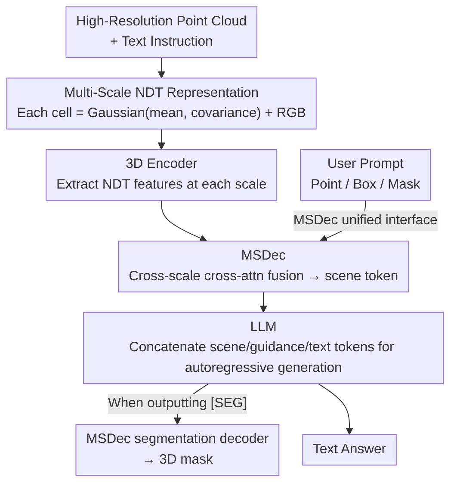

# Scenes as Tokens: Multi-Scale Normal Distributions Transform Tokenizer for General 3D Vision-Language Understanding

**Conference**: CVPR 2026  
**Paper**: [CVF Open Access](https://openaccess.thecvf.com/content/CVPR2026/html/Tang_Scenes_as_Tokens_Multi-Scale_Normal_Distributions_Transform_Tokenizer_for_General_CVPR_2026_paper.html)  
**Code**: https://github.com/snldmt/NDTokenizer3D  
**Area**: 3D Vision / Multimodal VLM  
**Keywords**: 3D VLM, Scene Tokenizer, Normal Distributions Transform, Multi-Scale, Referring Segmentation  

## TL;DR
NDTokenizer3D introduces a three-stage scene tokenizer based on the multi-scale Normal Distributions Transform (NDT) to compress high-resolution point clouds into information-rich "scene tokens" for LLMs. By repurposing a single decoder (MSDec) as both a user interaction interface and a segmentation mask decoder, this unified model simultaneously handles 3D referring segmentation, visual question answering, and dense captioning, achieving state-of-the-art performance among generalist 3D VLMs in segmentation, QA, and hallucination resistance.

## Background & Motivation
**Background**: The key to extending vision-language models from 2D to 3D (e.g., autonomous driving, embodied AI, AR/VR) lies in an effective 3D scene tokenization method that compresses high-resolution point clouds, often consisting of hundreds of thousands of points, into a token sequence with a bounded length suitable for LLM reasoning.

**Limitations of Prior Work**: Existing point cloud tokenizers almost exclusively rely on **downsampling** to reduce the point count (e.g., superpoint pooling or token selection). This directly discards fine-grained geometric details and lacks dedicated mechanisms to capture abstract global structures. Another line of research either treats the entire scene as a **single-scale** entity or operates on a sequence of **object instances**. Both ignore the cross-scale "object-environment" and "object-object" relationships essential for realistic spatial reasoning—objects naturally appear at different spatial resolutions, requiring both clear local details and global contextual understanding.

**Key Challenge**: The inherent conflict between information fidelity (retaining original geometric details of points) and bounded token sequence length (since LLMs can only process fixed-length tokens). While downsampling addresses sequence length, it does so at the cost of sacrificing details. Meanwhile, most 3D VLMs remain task-specific and offer weak support for human interactive prompts (e.g., points, boxes, masks), making them difficult to generalize across diverse scene understanding tasks.

**Goal**: (1) Design a multi-scale 3D representation and tokenizer that preserves both local details and global context without relying on downsampling; (2) Create a unified architecture that handles both text generation tasks (QA, captioning) and point-level understanding tasks (segmentation) while natively supporting interactive human prompts.

**Key Insight**: The authors borrow the Normal Distributions Transform (NDT) from the SLAM literature, which partitions a point cloud into regular grid cells and models the local surface in each cell using a Gaussian distribution (mean and covariance). This grid-based representation naturally supports multi-resolution: fine grids preserve local geometry, while coarse grids encode global structures. Furthermore, Gaussian statistics summarizing the original points within each cell are "lossless" representations, unlike downsampling which simply discards points.

**Core Idea**: Replace "downsampled points" with "multi-scale NDT Gaussian cells" as the 3D representation, then utilize a cross-scale fusion decoder (MSDec) to compress it into holographic scene tokens, while repurposing this MSDec as a unified interface for interactive prompting and segmentation decoding.

## Method

### Overall Architecture
NDTokenizer3D is a generalist 3D VLM. It takes high-resolution raw point clouds (along with text instructions and optional user prompts) as input and outputs text answers or 3D segmentation masks. The pipeline consists of two main parts: first, a **three-stage tokenization** transforms the scene into tokens. Then, the LLM utilizes these tokens to perform various tasks, where both segmentation and interaction reuse the same decoder, MSDec.

Three-stage tokenization: ① Construct **multi-scale NDT representations** from the raw point cloud (each cell is represented by Gaussian statistics and RGB). ② Extract NDT features at each scale using a transformer-based **3D Encoder**. ③ **MSDec** performs cross-attention using a set of learnable queries across different scales (coarse-to-fine), hierarchically fusing them into holographic "scene tokens" $E_V$, which are projected into the LLM input space. In addition to generating tokens, MSDec serves two extra roles: encoding user prompts (points/boxes/masks) into prompt tokens $E_P$, and decoding the hidden state into 3D masks when the LLM outputs a special `[SEG]` token. Finally, the LLM concatenates scene tokens, prompt tokens, and text tokens to generate responses autoregressively, triggering segmentation when necessary.

### Key Designs

**1. Multi-scale NDT Representation: Replacing Downsampled Points with Gaussian Cells to Uniquely Preserve Geometry**

Addressing the core issue of "detail loss caused by downsampling," the authors directly construct NDT representations on high-resolution point clouds without downsampling. Given a point cloud $X=\{x_i\}_{i=1}^{N_p}\in\mathbb{R}^{N_p\times3}$, the space is partitioned into regular grids, where each cell $C_r^j$ is fitted with a Gaussian distribution using the points falling within it:

$$\mu_r^j=\frac{1}{n}\sum_{i=1}^n x_i,\quad \Sigma_r^j=\frac{1}{n-1}\sum_{i=1}^n (x_i-\mu_r^j)(x_i-\mu_r^j)^T$$

where $r=1,\dots,R$, with $r{=}1$ representing the coarsest scale and $r{=}R$ the finest. Coarse-scale cells aggregate large regions to capture abstract global context, while fine-scale cells preserve local surface details. This single grid-based mechanism naturally provides multi-resolution representations. To capture visual appearance, each cell also retrieves RGB features from 2D images via multi-view projection: $c_r^j=\frac{1}{N_I}\sum_{k=1}^{N_I}I_k(u_k,v_k)$, where the projected coordinates are given by $[u_k,v_k]^T=P(\mu_r^j\mid k)$. Ultimately, each cell is represented as a 15-dimensional descriptor $C_r^j=[\mu_r^j;\Sigma_r^j;c_r^j]$ (3D mean + 9D covariance + 3D RGB). Crucially, the mean and covariance of the Gaussian **implicitly summarize the structure and geometry of all original points within each cell**, which is why it outperforms "random downsampling." Subsequently, a transformer-based 3D Encoder $\Phi$ encodes the cells of each scale into features $F_r=\Phi(C_r)\in\mathbb{R}^{N_r\times d_f}$.

**2. Multi-scale NDT Decoder MSDec: Fusing Multi-Scale Features into Holographic Scene Tokens via Cross-Scale Cross-Attention**

Merely having multi-scale features is insufficient; they must be compressed into fixed-length tokens that the LLM can ingest. MSDec consists of $R$ layers of transformer decoders, where each layer treats multi-scale NDT features $F_r$ as Key/Value and a set of learnable queries as Query. The first layer initializes the queries using a downsampled subset of the finest scale features: $Q_1=W_1^Q(\downarrow F_R)$. Subsequently, each layer updates the queries through cross-attention $\rightarrow$ self-attention $\rightarrow$ FFN:

$$\tilde{Q}_r=\mathrm{CrossAttn}(Q_r,K_r,V_r),\ \hat{Q}_r=\mathrm{SelfAttn}(\tilde{Q}_r),\ Q_{r+1}=\mathrm{FFN}(\hat{Q}_r)$$

where $K_r=W_r^K F_r,\ V_r=W_r^V F_r$. By hierarchically injecting information from coarse to fine scales across layers, the final output $Q_R$ becomes a holographic scene representation fusing all scales. This is then projected into the LLM space via a multimodal alignment head $f_{mm}$ to obtain scene tokens $E_V=f_{mm}(Q_R)$. This hierarchical decoding allows global semantics and fine-grained details to coexist within the same set of tokens, which is the key to outperforming the single-scale 3D-LLaVA in referring segmentation.

**3. MSDec Reused as a Unified Interface: Shared Decoder for Interactive Prompting and Segmentation Decoding**

To support both human interaction and mask output without stacking task-specific modules, the authors reuse MSDec directly as a multifunctional interface. **User prompts** (points/boxes/masks) are first converted into a binary mask $m_u$ on the finest-scale features. Average pooling is applied to the selected region to obtain prompt features $F_R^P$, which initialize an additional query $Q_1^P$. This prompt query is concatenated with the original queries and passed through all MSDec layers. The output is then projected via the same $f_{mm}$ into prompt tokens $E_P$, which are fed to the LLM alongside the scene tokens. This aligns the user's intent with the multi-scale 3D context at the decoder level. **Segmentation decoding** is triggered by the `[SEG]` token: when the LLM generates the special token `[SEG]`, its hidden state $H^S$ is mapped via a segmentation head $f_s$ to obtain a query $Q_1^S$. This query is similarly decoded by MSDec to yield a segmentation-aware representation $Q_R^S$, which is then converted by a mask head $f_m$ into a kernel. Finally, the dot product between this kernel and the finest-scale features predicts the 3D mask $M\in\mathbb{R}^{N_R\times1}$. Notably, segmentation **naturally emerges** from language reasoning (with `[SEG]` embedded in the text response) rather than running an independent prediction branch or post-processing step, maintaining architectural consistency.

**4. Two-Stage Training: Representation Pre-Initialized via Instance Segmentation and CLIP Distillation, Followed by Instruction Tuning**

Since pre-trained NDT weights do not exist, a two-stage training strategy is adopted. **Stage 1 (Pre-training 3D Encoder + MSDec)**: Joint training is performed on the 3D instance segmentation task, where MSDec is followed by a classification head and a mask head, utilizing classification cross-entropy $\mathcal{L}_{cls}$ and segmentation loss $\mathcal{L}_m$ (BCE + Dice). Meanwhile, 2D vision-language supervision is introduced by lifting CLIP image features to 3D according to Eq.(2)'s projection to obtain $F_r^C$. A cosine similarity loss $\mathcal{L}_s$ is applied between $F_r^C$ and $F_r$ to semantically align the 3D features. The total loss is formulated as $\mathcal{L}=\mathcal{L}_{cls}+\lambda_1\mathcal{L}_m+\lambda_2\mathcal{L}_s$. **Stage 2 (Instruction Tuning)**: The 3D Encoder and MSDec are frozen, while the projection layers $f_{mm}$, $f_s$, and the LLM (via LoRA) are tuned. Multi-task training is performed on mixed data of referring segmentation, QA, and dense captioning, utilizing a loss function combining next-token cross-entropy $\mathcal{L}_t$, mask loss $\mathcal{L}_m$, and cosine loss $\mathcal{L}_s$ between the answer hidden state and the CLIP text embeddings: $\mathcal{L}=\mathcal{L}_t+\lambda_3\mathcal{L}_m+\lambda_4\mathcal{L}_s$.

## Key Experimental Results

Dataset and Setup: ScanNet (1201 training / 312 validation scenes). Stage 1 uses instance masks from ScanNet200 for pre-training; Stage 2 performs multi-task fine-tuning with ~295k instruction-response pairs (ScanRefer/Nr3D/Multi3DRefer for referring segmentation, ScanQA/SQA3D for QA, Nr3D/Scan2Cap for dense captioning). The 3D Encoder is Point Transformer v3, the LLM is LLaVA-1.5-7B, MSDec uses 850 initial queries, and fine-tuning is conducted for one epoch on 4×A100 GPUs using LoRA.

### Main Results
Comparison with generalist 3D VLMs (selected metrics):

| Task / Metric | Prev. SOTA | Ours | Gain |
|------|------|------|------|
| Multi3DRefer mIoU (Referring Segmentation) | 42.7 (3D-LLaVA) | **46.0** | +3.3 |
| ScanQA CiDEr | 92.6 (3D-LLaVA) | **98.6** | +6.0 |
| ScanQA METEOR | 18.4 | **19.4** | +1.0 |
| SQA3D EM / EM-R | 54.6 / 57.5 (Chat-Scene) | 54.4 / 57.1 | Comparable |
| Scan2Cap C@0.5 | 78.8 (3D-LLaVA) | **79.0** | +0.2 |

The highlight is that this model and 3D-LLaVA are the only two generalist models capable of simultaneously handling language-centric tasks and point-level segmentation, with NDTokenizer3D significantly leading in segmentation (+3.3 mIoU) and QA (+6.0 CiDEr). Scan2Cap feeds Mask3D object proposals as visual prompts into MSDec, verifying the practical utility of the interactive interface.

Anti-hallucination (3D-POPE, higher is better):

| Setting | 3D-LLaVA Acc | Ours Acc |
|------|------|------|
| Random | 80.32 | **84.12** |
| Popular | 74.11 | **75.51** |
| Adversarial | 69.88 | **72.03** |

The hallucination rate is the lowest across all three sampling configurations, demonstrating that higher-fidelity scene tokens allow the LLMs to make predictions that align better with the actual geometry.

### Ablation Study
NDT vs. Downsampling Baseline (incorporating voxel downsampled points $P_r^j=[p_r^j;c_r^j]$ with the same point count into the same pipeline):

| Configuration | Multi3DRefer mIoU | ScanQA C | SQA3D EM | Scan2Cap C@0.5 |
|------|------|------|------|------|
| Downsampling Baseline | 45.3 | 94.7 | 53.9 | 78.1 |
| NDT (Ours) | **46.0** | **98.6** | **54.4** | **79.0** |

Scale Ablation (which scales are selected for $r$):

| Scale | Multi3DRefer mIoU | ScanQA C | SQA3D EM-R | Scan2Cap C@0.5 |
|------|------|------|------|------|
| $r{=}3$ (Single scale) | 40.1 | 91.8 | 53.7 | 77.0 |
| $r{=}4$ (Single scale) | 44.9 | 96.6 | 56.9 | 76.6 |
| $r{=}\{3,4\}$ | 46.2 | 94.4 | 56.5 | 77.4 |
| $r{=}\{2,3,4\}$ (Three scales) | 46.0 | **98.6** | **57.1** | **79.0** |
| $r{=}\{1,2,3,4\}$ (Four scales) | 44.2 | 94.7 | 57.3 | 77.1 |

### Key Findings
- **NDT outperforms downsampling across all tasks**, with the most pronounced drop on ScanQA. Downsampling discards fine-grained geometric cues necessary for correct reasoning. Interestingly, the downsampling baseline itself already exceeds 3D-LLaVA on referring segmentation, illustrating that "multi-scale fusion" contributes heavily to point-level understanding, even without NDT statistics.
- **Three scales represent the sweet spot**: Single or dual scales lack cross-scale context, while expanding to four scales introduces noise and slight overfitting due to overly fine partitioning, and incurs higher computational costs. Three scales balance detail fidelity and stable reasoning.
- **Query quantity**: Raising the query count from 100 to 850 generally improves performance, with saturation observed around 400–850 (achieving the highest ScanQA CiDEr of 98.6 at 850), indicating that MSDec aggregates sufficient scene information within this range.

## Highlights & Insights
- **Bringing NDT from SLAM to 3D VLM tokenization**: Using Gaussian statistics (mean + covariance) as a "lossless" local summary fundamentally bypasses the "downsampling vs. information fidelity" dilemma. This is a compelling, "aha-moment" domain transfer, where an established concept perfectly resolves a modern pain point.
- **Triple-use single decoder** (scene token generation / user prompt encoding / segmentation mask decoding): Sharing structural components while varying the query initialization method avoids stacking task-specific modules, achieving a clean implementation of a "unified architecture."
- **Emergent segmentation from language**: Embedding `[SEG]` within the text response triggers mask decoding, naturally chaining spatial prediction after linguistic reasoning. This `[SEG]`-token paradigm can easily transfer to any "text-driven structured output" task (e.g., 3D bounding boxes, keypoints).
- **Naturally controllable grid resolution in multi-scale NDT** provides a clean dial for balancing the computational budget and level of detail (as demonstrated in the scale ablation).

## Limitations & Future Work
- **Dependency on regular grids + multi-view RGB**: Cell RGB features rely on 2D image projections, causing representation degradation when multi-view images or camera poses are unavailable. Furthermore, regular grid partitioning may not adapt well to point clouds with highly non-uniform densities.
- **Fixed and sensitive scale selection**: Three scales are empirically optimal. When transferring to datasets or scenes with differing scale distributions, re-tuning may be required. The overfitting observed at four scales indicates sensitivity to partitioning granularity.
- **Evaluation limited to ScanNet-like benchmarks**: All experiments are conducted on indoor scenes. Robustness of NDT Gaussian fitting in outdoor/large-scale environments (such as sparse LiDAR in autonomous driving) remains unverified.
- **Comparable rather than leading performance on SQA3D**: The gains of multi-scale geometric tokens are limited in tasks demanding strong spatial reasoning (such as situated reasoning, which requires inferring one's own position/orientation). This suggests that pure geometric representations still underperform in modeling "perspective/situational context."

## Related Work & Insights
- **vs. 3D-LLaVA**: While both are generalist 3D VLMs capable of segmentation, 3D-LLaVA relies on superpoint pooling and token selection (essentially downsampling) and operates at a single scale. In contrast, this work employs lossless multi-scale NDT with cross-scale MSDec, leading to superior performance in segmentation (+3.3 mIoU), QA (+6.0 CiDEr), and hallucination resistance.
- **vs. Single-scale scene methods like Scene-LLM / LSceneLLM**: These methods treat the scene as a single-scale entity, ignoring cross-scale object-environment relationships. In contrast, this paper explicitly constructs and fuses multi-scale representations.
- **vs. Instance-sequence methods like Chat-Scene / Grounded 3D-LLM**: These represent scenes as sequences of object instances, losing fine-grained grid-level geometry and consecutive spatial structure. The NDT grid preserves continuous local surface statistics.
- **vs. Q-Former-styled cross-modal queries (e.g., Grounded 3D-LLM)**: While using a similar learnable query paradigm, MSDec refines queries hierarchically across **multi-scale NDT features**, and achieves higher parameter reuse by sharing the same decoder for interaction and segmentation.

## Rating
- Novelty: ⭐⭐⭐⭐ Introducing SLAM's NDT to 3D VLM tokenization is a clever cross-domain migration, and the unified decoder interface is clean; however, the individual components (multi-scale, cross-attn decoding, `[SEG]`) are mostly combinations of existing ideas.
- Experimental Thoroughness: ⭐⭐⭐⭐ Solid validation across four classes of tasks, anti-hallucination, and three sets of ablations (downsampling, scale count, query count); the main limitation is evaluation being confined to ScanNet-style indoor datasets.
- Writing Quality: ⭐⭐⭐⭐ The three-stage pipeline and unified interface are described clearly, and equations are well-aligned with the figures.
- Value: ⭐⭐⭐⭐ Provides a clean generalist 3D VLM paradigm featuring "lossless fidelity + unified interaction." Both the NDT tokenizer and the emergent `[SEG]` segmentation have strong potential for reuse.

<!-- RELATED:START -->

## Related Papers

- [\[CVPR 2026\] Copy-Transform-Paste: Zero-Shot Object-Object Alignment Guided by Vision-Language and Geometric Constraints](copy-transform-paste_zero-shot_object-object_alignment_guided_by_vision-language.md)
- [\[CVPR 2026\] Random Wins All: Rethinking Grouping Strategies for Vision Tokens](random_wins_all_rethinking_grouping_strategies_for_vision_tokens.md)
- [\[CVPR 2026\] Fast SceneScript: Fast and Accurate Language-Based 3D Scene Understanding via Multi-Token Prediction](fast_scenescript_fast_and_accurate_language-based_3d_scene_understanding_via_mul.md)
- [\[CVPR 2026\] LocateAnything3D: Vision-Language 3D Detection with Chain-of-Sight](locateanything3d_vision-language_3d_detection_with_chain-of-sight.md)
- [\[CVPR 2026\] MonoVLM: Monocular 3D Visual Grounding with Vision Language Models](monovlm_monocular_3d_visual_grounding_with_vision_language_models.md)

<!-- RELATED:END -->
