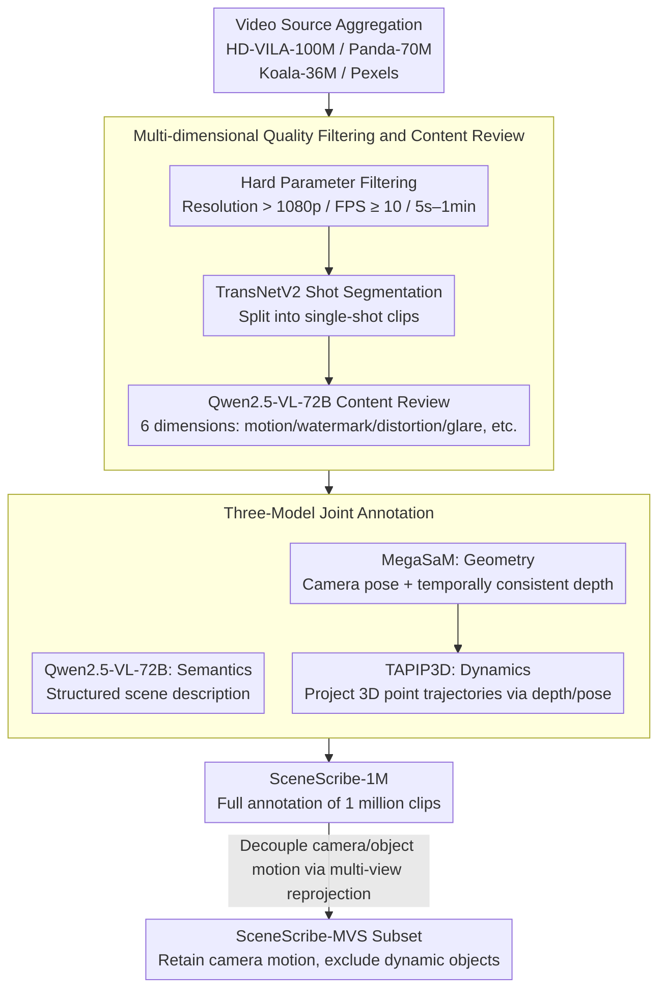

# SceneScribe-1M: A Large-Scale Video Dataset with Comprehensive Geometric and Semantic Annotations

**Conference**: CVPR 2026  
**arXiv**: [2604.07990](https://arxiv.org/abs/2604.07990)  
**Code**: [https://wangyunnan.github.io/SceneScribe-1M](https://wangyunnan.github.io/SceneScribe-1M)  
**Area**: 3D Vision / Video Understanding  
**Keywords**: Video Dataset, Geometric Annotation, Semantic Annotation, World Foundation Models, Depth Estimation

## TL;DR

Ours proposes SceneScribe-1M—a large-scale multimodal video dataset containing 1 million in-the-wild videos and over 4,000 hours. It provides comprehensive annotations, including detailed textual descriptions, precise camera parameters, consistent depth maps, and consistent 3D point trajectories, serving as a unified resource for 3D geometric perception and video generation tasks.

## Background & Motivation

1. **Background**: The integration of 3D geometric perception and video synthesis is a core requirement for building World Foundation Models (WFM). Existing datasets either focus on 3D understanding (e.g., RE10K, CO3Dv2) or video generation (e.g., Panda-70M, Koala-36M), lacking a unified resource that supports both directions.
2. **Limitations of Prior Work**: (A) 3D perception datasets: Synthetic data suffers from domain gaps, while real-world data annotation is constrained by computational overhead and the limitations of SfM/SLAM, resulting in small scales for dynamic scenes; (B) Video generation datasets: These provide rich semantic annotations but lack geometric annotations; (C) Concurrent works such as Sekai (~400 hours) and SpatialVID (lacking 3D point trajectories) are insufficient in scale or annotation completeness.
3. **Key Challenge**: WFMs need to simultaneously possess 3D geometric understanding and video generation capabilities, but there is a massive gap between the data scale and annotation types required for these two categories of tasks.
4. **Goal**: To construct a video dataset that is sufficiently large and comprehensively annotated to support 3D tasks such as depth estimation, scene reconstruction, and dynamic point tracking, alongside text/pose-to-video generation tasks.
5. **Key Insight**: Leverage powerful proprietary models (Qwen2.5-VL-72B for semantics, MegaSaM for geometry, and TAPIP3D for point trajectories) for large-scale parallel annotation on 1,000+ GPUs.
6. **Core Idea**: Simultaneously acquire structured text descriptions, camera poses, consistent depth maps, dynamic masks, and 3D point trajectories across 1 million open-domain videos through a meticulously designed screening and multi-model annotation pipeline.

## Method

### Overall Architecture

The data pipeline consists of three steps: (1) **Collection**—aggregating large-scale video sources from HD-VILA-100M, Panda-70M, Koala-36M, and Pexels; (2) **Preprocessing**—quality filtering (resolution > 1080p, FPS ≥ 10, duration 5s-1min), content review (using Qwen2.5-VL-72B to evaluate 6 dimensions), and temporal segmentation via TransNetV2; (3) **Annotation**—three specialized models annotate textual descriptions, geometric information, and 3D point trajectories respectively. The final output includes 1 million video clips with full annotations, along with a static subset, SceneScribe-MVS, filtered via multi-view reprojection.

### Key Designs

**1. Multi-dimensional Quality Filtering and Content Review: Hard parameters cannot block "clear but useless" videos**

Hard indicators like resolution, frame rate, and duration only guarantee that a video is "technically qualified," but they cannot block static images, watermarks, or clips blurred by strong light—videos that meet clarity standards but are worthless for learning 3D geometry. Ours first applies hard parameter filtering (resolution > 1080p, FPS ≥ 10, duration 5s–1min), followed by Qwen2.5-VL-72B as an automated reviewer. Custom Q&A templates covering motion intensity, watermarks, lens distortion, and glare are used to judge each clip; any negative hit results in exclusion. For non-continuous videos spanning multiple shots, TransNetV2 is first used to detect boundaries and split them into single-shot clips before re-screening. The benefit of using an MLLM for content review is broad coverage without heavy manual labor, enabling the large-scale removal of "technically qualified but content-invalid" videos.

**2. Three-Model Joint Annotation: No single model provides the full set of annotations required by WFM**

Since no off-the-box model can simultaneously output text, pose, depth, dynamic masks, and 3D trajectories, ours chains three specialized models. Qwen2.5-VL-72B handles semantics, generating structured scene descriptions (setting, subjects, actions); MegaSaM handles geometry by first estimating optical flow and uncertainty for motion probability maps, then using an improved DROID-SLAM with monocular depth priors for camera tracking, and finally optimizing for temporally consistent high-resolution depth; TAPIP3D handles dynamics by projecting 2D features into 3D world space via MegaSaM’s depth and pose, generating 3D point trajectories robust to long-term occlusion. This division of labor leverages their respective strengths: MegaSaM is more stable than DROID-SLAM and VGGT in dynamic scenes with limited parallax, while its lack of dynamic point tracking is compensated for by TAPIP3D. The pipeline runs in parallel on 1,000+ H20 GPUs, consuming approximately 150k GPU-hours.

**3. SceneScribe-MVS Subset: Decoupling camera motion and object motion to preserve diversity without dynamic clutter**

Multi-view 3D reconstruction favors static scenes, but filtering based on "overall motion magnitude" would discard high-quality clips where the camera moves while objects remain static—the exact data multi-view tasks require. Ours uses multi-view reprojection (Algorithm 1) to decouple these motions. For each frame, geometric and photometric consistency errors $e_{2d}, e_{3d}, e_{rgb}$ are calculated to generate a motion mask $M_{motion}$. Two object motion scores are defined: $s_1$ (aggregating the motion mask) and $s_2$ (average motion distance of point trajectories). Thresholds $\tau_4, \tau_5$ are then used to retain only scenes with static objects. Because the filtering criterion is "object motion" rather than "overall screen motion," camera diversity is fully preserved. Statistics show that the camera motion distribution of the MVS subset almost overlaps with the full set, while dynamic objects are significantly reduced.

### Loss & Training

This is a dataset paper and does not involve training new models. Downstream validation experiments utilize the default training configurations of the original models for each task.

## Key Experimental Results

### Main Results

Monocular Depth Estimation (MoGe model, average of 8 benchmarks):

| Setting | Rel ↓ | $\delta_1$ ↑ |
|------|-------|------|
| MoGe (w/o SceneScribe) - Scale-inv | 6.17 | 93.8 |
| MoGe (w SceneScribe) - Scale-inv | **6.14** | **94.0** |
| MoGe (w/o SceneScribe) - Affine-inv | 4.72 | 95.8 |
| MoGe (w SceneScribe) - Affine-inv | **4.68** | **95.9** |

Scene Reconstruction - VGGT (CO3Dv2 + ETH3D):

| Method | Pose AUC30 ↑ | Pose AUC15 ↑ |
|------|-------------|-------------|
| VGGT (w/o SceneScribe) | 89.5 | 83.4 |
| VGGT (w SceneScribe) | **89.9** | **83.8** |

4D Reconstruction - MonST3R (Sintel):

| Method | ATE ↓ | RPE trans ↓ | RPE rot ↓ |
|------|-------|------------|-----------|
| MonST3R (w/o SceneScribe) | 0.108 | 0.042 | 0.732 |
| MonST3R (w SceneScribe) | **0.099** | **0.038** | **0.685** |

Video Generation - AC3D (RealEstate10K):

| Method | TransErr ↓ | RotErr ↓ | FID ↓ | FVD ↓ | CLIP ↑ |
|------|-----------|---------|-------|-------|--------|
| AC3D (w/o SceneScribe) | 0.374 | 0.039 | 1.27 | 38.20 | 28.62 |
| AC3D (w SceneScribe) | **0.318** | **0.026** | **1.19** | **35.15** | **29.98** |

### Ablation Study

2D/3D Point Tracking:

| Task | Method | Key Metrics | Gain |
|------|------|---------|------|
| 2D (CoTracker3) | w/ SceneScribe | TAP-Vid $\delta_{avg}^{vis}$ Avg 77.4 | +0.8 |
| 3D (SpatialTrackerV2) | w/ SceneScribe | TAPVid-3D AJ Avg 23.5 | +0.25 |

### Key Findings

- SceneScribe-1M brings consistent performance improvements across all downstream tasks (depth estimation, scene reconstruction, 4D reconstruction, point tracking, video generation), verifying the annotation quality.
- Video generation tasks benefit the most (TransErr dropped from 0.374 to 0.318, a 15% reduction), suggesting that precise camera parameters are crucial for controllable video generation.
- MonST3R's ATE improved significantly (0.108 $\rightarrow$ 0.099), indicating that large-scale real-world dynamic scene data effectively compensates for the domain gaps in synthetic training data.
- The improvement for MoGe was smaller because the original TartanAir training set already has precise annotations, though SceneScribe’s real-world data still provides supplementary value.
- The motion decoupling sampling was successful: the camera motion distribution of SceneScribe-MVS is almost identical to the full set, while dynamic objects are significantly reduced.

## Highlights & Insights

- **Annotation Completeness is the Core Differentiator**: Simultaneously providing text descriptions, camera poses, depth maps, dynamic masks, and 3D point trajectories is unique among similar datasets, allowing one resource to serve both 3D perception and video generation.
- **Industrial-grade Annotation Pipeline**: 1,000+ GPUs parallelly annotating for 150k GPU-hours demonstrates a mature methodology for large-scale AI data engineering. Engineering contributions like modifying the MegaSaM library for multi-node parallel inference are noteworthy.
- **Motion Decoupling Philosophy**: The method of distinguishing camera motion from object motion via depth reprojection consistency is elegant and practical; it can be applied to any scenario requiring the separation of static/dynamic elements from mixed motion.
- The scale of 4,000+ hours is approximately 7 times larger than concurrent work Sekai (600+ hours) and includes 3D point trajectories that the latter lacks.

## Limitations & Future Work

- Annotation quality is limited by the capabilities of the models used—MegaSaM still degrades in areas with sparse features, and TAPIP3D has limited handling of long-term occlusions.
- Depth annotations are relative scale, lacking metric depth—limiting applications that require absolute depth.
- Video sources are primarily web-based, with limited coverage of industrial scenes (e.g., autonomous driving, robotics).
- Missing instance-level or panoptic segmentation labels, which restricts object-level understanding tasks.
- Future improvements: Introduce metric depth estimation models (e.g., UniDepth) for absolute depth; add semantic segmentation labels; extend collection to domain-specific videos (Autonomous Driving, Embodied AI).

## Related Work & Insights

- **vs SpatialVID**: SpatialVID offers 2 million videos but lacks 3D point trajectories; SceneScribe-1M provides more complete annotations (depth + pose + 3D trajectories + descriptions) for 1 million videos.
- **vs Sekai**: Sekai focuses on structured descriptions + depth + pose with a scale of ~400 hours; SceneScribe-1M is roughly 7x larger and provides additional 3D point trajectories.
- **vs PointOdyssey**: PointOdyssey is a synthetic dataset (159 scenes) providing GT depth and trajectories but suffers from domain gaps; SceneScribe-1M uses real-world videos where the scale and diversity far exceed synthetic counterparts despite non-GT annotations.
- This dataset can serve as a universal pre-training resource for multiple directions, acting as a catalyst for the development of World Foundation Models.

## Rating

- Novelty: ⭐⭐⭐ (Dataset innovation follows completeness and scale; methodology innovation is moderate)
- Experimental Thoroughness: ⭐⭐⭐⭐ (Comprehensive validation across 6 downstream tasks, though each task typically uses one model for validation)
- Writing Quality: ⭐⭐⭐⭐ (Clear structure, thorough tabular comparisons, and detailed statistical analysis)
- Value: ⭐⭐⭐⭐⭐ (Fills the gap for large-scale combined geometric and semantic annotated video datasets, providing significant impetus for WFM research)

<!-- RELATED:START -->

## Related Papers

- [\[CVPR 2026\] SpatialVID: A Large-Scale Video Dataset with Spatial Annotations](spatialvid_a_large-scale_video_dataset_with_spatial_annotations.md)
- [\[CVPR 2026\] OLATverse: A Large-scale Real-world Object Dataset with Precise Lighting Control](olatverse_a_large-scale_real-world_object_dataset_with_precise_lighting_control.md)
- [\[CVPR 2026\] Ego-1K: A Large-Scale Multiview Video Dataset for Egocentric Vision](ego-1k_--_a_large-scale_multiview_video_dataset_for_egocentric_vision.md)
- [\[CVPR 2026\] 3DReflecNet: A Large-Scale Dataset for 3D Reconstruction of Reflective, Transparent, and Low-Texture Objects](3dreflecnet_a_large-scale_dataset_for_3d_reconstruction_of_reflective_transparen.md)
- [\[CVPR 2026\] Reliev3R: Relieving Feed-forward 3D Reconstruction from Multi-View Geometric Annotations](reliev3r_relieving_feed-forward_3d_reconstruction_from_multi-view_geometric_annot.md)

<!-- RELATED:END -->
