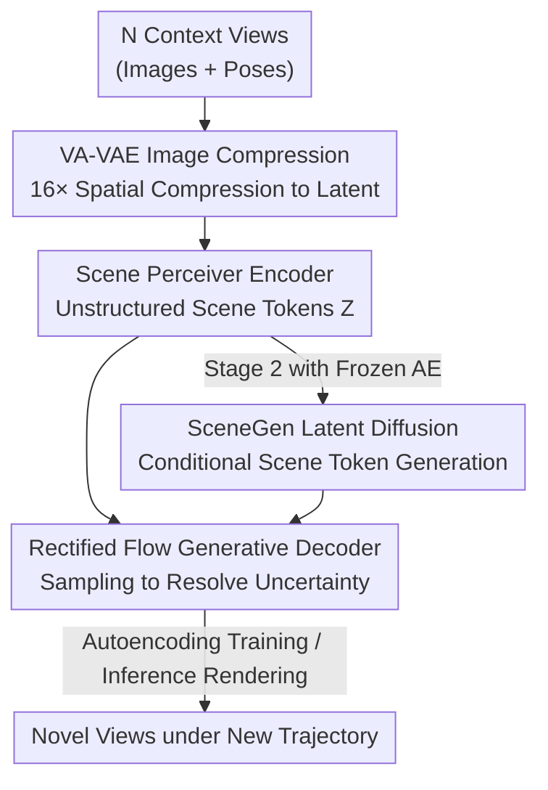

# SceneTok: A Compressed, Diffusable Token Space for 3D Scenes

**Conference**: CVPR 2026  
**Paper**: [CVF Open Access](https://openaccess.thecvf.com/content/CVPR2026/html/Asim_SceneTok_A_Compressed_Diffusable_Token_Space_for_3D_Scenes_CVPR_2026_paper.html)  
**Code**: [geometric-rl.mpi-inf.mpg.de/scenetok/](https://geometric-rl.mpi-inf.mpg.de/scenetok/) (Project Page)  
**Area**: 3D Vision  
**Keywords**: Scene Tokenizer, Unstructured Tokens, Rectified Flow Decoding, Latent Space Diffusion, Novel View Synthesis

## TL;DR
SceneTok compresses a set of multi-view images into a small set (approx. 1024 tokens, only tens of thousands of 32-bit floats) of **unstructured scene tokens** decoupled from spatial grids. It utilizes a lightweight rectified flow decoder for rendering from arbitrary trajectories and trains a diffusion transformer on this highly compressed latent space to achieve 3D scene generation within 5 seconds, completely decoupling rendering from generation.

## Background & Motivation
**Background**: Representing 3D scenes is a core problem in the era of large-scale generative models. Mainstream approaches follow two paths: one generates using explicit 3D structures (Voxels, 3D Gaussians, NeRF), while the other uses multi-view image/video diffusion models to generate target views directly in view space.

**Limitations of Prior Work**: Explicit 3D structures are limited by the scarcity of 3D data and cubic scaling costs for voxels, making large-scale training nearly infeasible. Video/multi-view diffusion in view space can leverage large-scale video data but results in massive models and requires specialized sampling strategies (history-guided, autoregressive, or anchored) to maintain consistency. Furthermore, rendering every new view requires an expensive generative pass, leading to significant computational waste. Generalizable reconstruction methods (e.g., LVSM, RayZer) encode images into latent spaces decoupled from grids, but they utilize high-dimensional tokens (3072 tokens, dimension $\ge512$) unsuitable for diffusion. Additionally, RayZer treats target views as input, causing information leakage and limiting it to view interpolation rather than true novel view synthesis.

**Key Challenge**: A representation must simultaneously satisfy three conflicting requirements: learnability from massive video data, a structural simplicity suitable for generative models, and high compression for scalability. Existing representations either fail to scale for generation (3D structures/high-dim latents) or tie rendering and generation together.

**Goal**: Create a 3D scene representation that provides high-fidelity reconstruction, allows true rendering from new trajectories, and is compact enough to be fed directly into diffusion models.

**Key Insight**: The authors draw inspiration from 1D unstructured tokenizers in image/video domains. Since 2D/3D patch tokens lack a natural order, they encode the scene into a set of **permutation-invariant, grid-decoupled** continuous tokens, splitting "rendering" and "generation" into two cascaded stages.

**Core Idea**: Use a two-stage autoencoder to compress the scene into a small set of unstructured tokens. Rendering is handled by a lightweight rectified flow decoder (resolving uncertainty through sampling), while generation is performed by a diffusion transformer trained on the token latent space. This allows scaling the generative model without affecting rendering speed.

## Method

### Overall Architecture
The core of SceneTok is an autoencoder (Fig. 2a): the encoder $\phi$ takes $N$ posed context views $(X_C, P_C)$ and outputs a set of $K$ continuous tokens $Z=\{z_i\}_{i=1}^K$ as the scene representation. The decoder $\psi$ takes $Z$ and a new camera trajectory $P_T$ to render $M$ novel views $X_T=\psi(Z,P_T)$. In the second stage (Fig. 2b), the autoencoder is frozen, and a diffusion transformer (SceneGen) is trained on token set $Z$ to enable scene generation conditioned on single/sparse images and anchor poses. The pipeline separates "compression—rendering—generation": rendering is completed in seconds via a lightweight decoder, while generation occurs in the compressed latent space.

### Key Designs

**1. Scene Perceiver Encoder: Compressing View Sets into Unstructured Tokens**
Existing latent representations are either too high-dimensional for diffusion or tied to grid structures. SceneTok first uses a frozen VA-VAE encoder to compress each image $x_i$ spatially by 16× into feature maps $f_i$, which are fed as $1\times1$ patch tokens into the Scene Perceiver's multi-view branch. In each block, camera poses $P_C$ are converted into ray maps $r_i=[o_i, d_i]$, modulating corresponding patch tokens via AdaLN, followed by multi-view attention and MLP. Another branch processes a set of **directly optimized scene queries** $Q=\{q_i\}_{i=1}^K$. Each block performs self-attention among queries and cross-attention to the multi-view branch, eventually projecting to a low dimension $d$ to obtain tokens $Z$. A key innovation is positional encoding: 3D RoPE, common in video encoders, introduces a "temporal order" bias. The authors use only **2D RoPE**, making the encoder invariant to view order, ensuring tokens can be rendered from any trajectory.

**2. Rectified Flow Generative Decoder: Gracefully Resolving Rendering Uncertainty**
Scene representations naturally lack information—either because views were never captured or high-frequency details were lost during compression. The authors frame rendering as **generative sampling** rather than deterministic regression. The decoder $\psi$ samples from the conditional distribution $p_\psi(x|Z)$; it samples from a narrow distribution for well-defined regions and reverts to pure generation for high-uncertainty areas. Specifically, using rectified flow: a DiT-style denoiser $\Psi$ iteratively denoises latent image patches for the new trajectory, with single-step $x_{t-\Delta t}=x_t-\Delta t\,\Psi(x_t,R,Z,t)$, conditioned on time step $t$, new ray map $R$, and tokens $Z$ (injected via cross-attention). The result passes through a frozen VideoDCAE decoder back to pixel space. Variance in rendering output correlates positively with token information density.

**3. Cascaded Two-Stage Paradigm: Decoupling Rendering and Generation**
View-space diffusion wastes computation by tying rendering and generation together. SceneTok freezes the autoencoder after training and trains SceneGen, a diffusion transformer, to model $p(Z|X_I,A)$. $X_I$ represents conditional images, and $A=\{a_i\}$ are camera anchors defining the scene's spatial extent. This also uses a rectified flow objective. This split is a win-win: generation runs on tens of thousands of floats rather than pixels, and scaling the generative model does not slow down rendering.

### Loss & Training
The VA-VAE encoder and VideoDCAE decoder are frozen, while the rest are trained end-to-end. The rectified flow matching objective predicts the vector field $v_t=\Psi(x_t,R,Z,t)$. The loss is the MSE between the ground truth flow $x_1-x_0$ and the predicted flow:
$$L(\psi)=\mathbb{E}_{t,x_1,x_0}\|(x_1-x_0)-v_t\|_2^2$$
where $x_t=tx_1+(1-t)x_0$, $x_1 \sim \mathcal{N}(0,I)$, and $x_0$ is the training latent target. SceneTok was trained on 4×A100 (40G) for 760K steps; SceneGen on 4×A100 (80G) for 1M steps.

## Key Experimental Results

### Main Results
Comparison of novel view synthesis quality on RealEstate10K (Repr. Size refers to the number of 32-bit floats):

| Setup | Method | Repr. Size | PSNR↑ | LPIPS↓ | rFVD↓ | rFID↓ |
|-------|--------|------------|-------|--------|-------|-------|
| 12 Views | DepthSplat (Explicit) | 46.40M | 21.55 | 0.202 | 204.52 | 21.35 |
| 12 Views | LVSM (Latent) | 1.57M | 21.25 | 0.262 | 211.66 | 26.40 |
| 12 Views | **Ours** | **32.76K** | **23.99** | **0.159** | **79.80** | **11.12** |
| 5 Views | LVSM | 1.57M | 25.74 | 0.140 | 111.14 | 13.37 |
| 5 Views | **Ours** | **32.76K** | **25.97** | **0.133** | **76.24** | **11.26** |

The representation size is 1–3 orders of magnitude smaller than explicit methods (32.76K vs 46.4M ≈ 1400×), while significantly leading in rFVD/rFID.

**Novel Trajectory Generalizability (TPS on DL3DV-140)**: SceneTok outperforms others significantly across R.Acc, T.Acc, and AUC thresholds. For example, AUC@30° reaches 0.593 compared to LVSM's 0.178, proving capability for true novel trajectory rendering.

**Scene Generation (Single View Condition)**:

| Method | gFID↓ | gFVD↓ | Inference(s)↓ |
|--------|-------|-------|---------------|
| DFM (NeRF Diff) | 52.64 | 566.71 | 630 |
| DFoT (Pixel Diff) | 35.40 | 220.36 | 146 |
| SEVA (Closed-source) | 17.69 | 133.00 | 1620 |
| **Ours** | 18.90 | 157.89 | **26 (11+15)** |

SceneGen metrics are comparable to large-scale multi-view models but are an order of magnitude faster, achieving total generation/rendering in 10-26s.

### Ablation Study
The paper performs "interpretative ablations" to analyze what tokens encode:

| Analysis | Action | Observed Phenomenon |
|----------|--------|---------------------|
| Depth Decoding | Fine-tune decoder for depth | Tokens contain implicit geometric cues for depth rendering |
| Masking Tokens | Randomly mask 0%→100% | Variance increases as tokens are removed (information loss) |
| Blocking Views | Use $n$ views ($n \in \{2,6,12\}$) | Variance decreases as $n$ increases; token-covered areas have lower variance |

### Key Findings
- Token information density correlates strongly with rendering variance: the decoder samples from narrow distributions in clear areas and reverts to pure generation in uncertain ones.
- Compressing the representation to 32.76K floats still allows SOTA reconstruction, which is the prerequisite for latent diffusion.
- SceneTok is slightly inferior to pixel-space diffusion (DFoT/SEVA) in high-frequency detail consistency but offers a significant speed advantage.

## Highlights & Insights
- **Permutation Invariance + 2D RoPE is the Key to Arbitrary Trajectories**: Replacing 3D RoPE with 2D RoPE removes temporal bias, freeing tokens from the input trajectory.
- **Decoupling Rendering and Generation as Independently Scalable Tasks**: Scaling generation models does not impact rendering speed, a paradigm shift for efficient 3D generation.
- **Transforming "Information Loss" into "Information Sampling" via Generative Decoders**: Uncertainty is modeled explicitly as an adaptive sampling feature per region.

## Limitations & Future Work
- High-frequency detail consistency remains a limitation, potentially improvable with better image compressors.
- Self-supervised rectified flow training lags behind depth-supervised methods (e.g., DepthSplat) in SSIM and absolute PSNR in some settings.
- Generation quality is slightly lower than closed-source models trained on much larger datasets (e.g., SEVA).

## Related Work & Insights
- **vs LVSM / RayZer (Latent Reconstruction)**: Compresses to much smaller sizes (tens of thousands vs millions of floats) and enables diffusion while allowing novel trajectory rendering.
- **vs DFM / DFoT / SEVA (View-space Generation)**: Avoids computation waste by decoupling rendering and generation, achieving 10x speedup.
- **vs 1D Image Tokenizers**: Adapts the "unstructured token" concept to 3D scenes, solving scalability bottlenecks of voxel-based structures.

## Rating
- Novelty: ⭐⭐⭐⭐⭐ 
- Experimental Thoroughness: ⭐⭐⭐⭐ 
- Writing Quality: ⭐⭐⭐⭐ 
- Value: ⭐⭐⭐⭐⭐ 

<!-- RELATED:START -->

<!-- Related papers would be listed here -->

<!-- RELATED:END -->

## Related Papers

- [\[CVPR 2026\] Aligning Text, Images and 3D Structure Token-by-Token](aligning_text_images_and_3d_structure_token-by-token.md)
- [\[CVPR 2026\] Space-Time Forecasting of Dynamic Scenes with Motion-aware Gaussian Grouping](space-time_forecasting_of_dynamic_scenes_with_motion-aware_gaussian_grouping.md)
- [\[ECCV 2024\] Compress3D: a Compressed Latent Space for 3D Generation from a Single Image](../../ECCV2024/3d_vision/compress3d_a_compressed_latent_space_for_3d_generation_from_a_single_image.md)
- [\[CVPR 2026\] PrITTI: Primitive-based Generation of Controllable and Editable 3D Semantic Urban Scenes](pritti_primitive-based_generation_of_controllable_and_editable_3d_semantic_urban.md)
- [\[CVPR 2026\] FreeScale: Scaling 3D Scenes via Certainty-Aware Free-View Generation](freescale_scaling_3d_scenes.md)

<!-- RELATED:END -->
