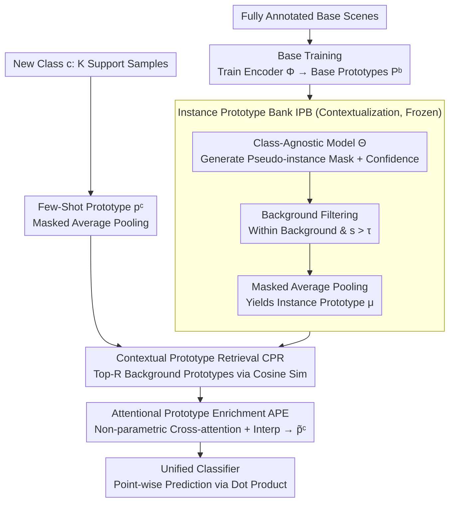

# SCOPE: Scene-Contextualized Incremental Few-Shot 3D Segmentation

**Conference**: CVPR 2026  
**arXiv**: [2603.06572](https://arxiv.org/abs/2603.06572)  
**Code**: None  
**Area**: 3D Vision / Point Cloud Semantic Segmentation  
**Keywords**: Incremental Few-Shot, 3D Point Cloud Segmentation, Prototype Enrichment, Background Mining, Class-Agnostic Segmentation

## TL;DR

SCOPE proposes a plug-and-play background-guided prototype enrichment framework that utilizes pseudo-instances from background regions in base training scenes to construct a prototype bank. During the incremental stage, few-shot prototypes are enhanced via retrieval and attention-based fusion, significantly improving new class IoU (up to +6.98%) on ScanNet/S3DIS without retraining the backbone or adding parameters, while maintaining low forgetting.

## Background & Motivation

**Background**: 3D point cloud semantic segmentation is fundamental for embodied perception tasks like robotics, autonomous driving, and AR/VR. Fully supervised methods (PointNet, PointNet++, DGCNN, Point Transformer, etc.) perform well with sufficient labels, but real-world deployment faces two constraints: (1) new categories emerge continuously as environments change; (2) only very few labels are available when new classes appear.

Existing paradigms have limitations:

- **Few-Shot Segmentation** (AttMPTI, etc.): Learns from few samples but cannot retain previously learned knowledge.
- **Generalized Few-Shot 3D Segmentation** (CAPL, GW): Recognizes both base and new classes simultaneously but only allows a single update and assumes prior knowledge of future categories.
- **Class-Incremental 3D Segmentation** (LwF, EWC, CLIMB-3D, GUA): Supports multiple updates but requires large-scale annotations and degrades severely in few-shot scenarios.
- **Incremental Few-Shot 3D Segmentation** (HIPO): The closest setting, yet performance remains lower than strong generalized few-shot baselines.

**Limitations of Prior Work**: Directly applying these methods to incremental few-shot scenarios is ineffective—incremental methods overfit in few-shot settings causing catastrophic forgetting, while few-shot methods lack multi-stage progression capabilities. **The key overlooked clue is that background regions in base training scenes often contain unlabeled object structures that likely correspond to future new categories.**

**Key Insight**: The authors observe that background regions are crudely compressed into a single label, preventing encoders from distinguishing object boundaries despite these areas containing rich geometric and semantic signals. The core idea of SCOPE is to use a class-agnostic segmentation model to mine high-confidence pseudo-instances from the background to build a reusable prototype bank. When new classes arrive, relevant background prototypes are retrieved and fused to enhance few-shot representations—without modifying the backbone, introducing extra parameters, or retraining.

## Method

### Overall Architecture

SCOPE addresses the "Incremental Few-Shot 3D Segmentation" setting: new categories appear incrementally with few annotations, where existing methods either suffer from forgetting or lack multi-stage support. Its key observation is that background areas in base training scenes contain many unlabeled structures likely to be future classes. SCOPE is designed as a plug-and-play three-stage framework: the base training stage trains an encoder $\Phi = \mathcal{H} \circ \Phi'$ (backbone + projection head) on annotated base classes and learns base prototypes $\mathbf{P}^b$; the scene contextualization stage uses a class-agnostic model to mine pseudo-instances from the background to build an Instance Prototype Bank (IPB); the incremental registration stage retrieves relevant background prototypes for each new class and performs attention-based fusion to obtain enhanced prototypes. The entire process requires no backbone changes, no learnable parameters, and no retraining, making it compatible with any prototype-based 3D segmentation method.

### Key Designs

**1. Instance Prototype Bank (IPB): Recovering and Storing Object Structures from the Background**

After base training, the encoder compresses all unknown regions into the background; extracting background features directly yields only coarse, non-discriminative embeddings. SCOPE uses an off-the-shelf class-agnostic segmentation model $\Theta$ (e.g., Mask3D) to generate pseudo-instance masks and confidence scores $\Theta(\mathbf{X}_i) = \{(\hat{\mathbf{M}}_{i,j}, s_{i,j})\}_{j=1}^{Q_i}$ for each base scene, retaining only masks within background regions with confidence above threshold $\tau$:

$$\mathbf{M}_i^{bg} = \{\hat{\mathbf{M}}_{i,j} \mid \hat{\mathbf{M}}_{i,j} \subseteq \mathbf{X}_i[y_i^b = -1],\; s_{i,j} > \tau\}$$

Each retained pseudo-mask produces an instance prototype $\mu_{i,j} \in \mathbb{R}^D$ via masked average pooling of point features. Aggregating these across all scenes forms the IPB: $\mathcal{P} = \bigcup_i \bigcup_j \{\mu_{i,j}\}$. The IPB is constructed once after base training and remains frozen; the class-agnostic model is used only offline, incurring no extra optimization or memory overhead.

**2. Contextual Prototype Retrieval (CPR): Retrieving Semantically Aligned Background Clues**

When a new class $c$ arrives in incremental stage $t$, an initial few-shot prototype $p^c$ is computed from $K$ support samples. CPR calculates the cosine similarity between $p^c$ and each background prototype $\mu_b$ in the IPB:

$$\sigma_b^c = \frac{(p^c)^\top \mu_b}{\|p^c\|_2 \|\mu_b\|_2}$$

The top-$R$ prototypes form a class-specific context pool $\mathcal{B}^c = \{\mu_r^c\}_{r=1}^R$. Since few-shot prototypes are unstable due to sparse samples, this step supplements them with aligned clues from similar structures in base background regions.

**3. Attentional Prototype Enrichment (APE): Selecting Useful Clues via Non-parametric Attention**

Not all retrieved background prototypes are useful; some contain noise or weak objectness. APE uses non-parametric cross-attention for selective fusion. After $\ell_2$ normalizing $p^c$ and retrieved prototypes, it uses $p^c$ as the query and background prototypes as key/value pairs for scaled dot-product cross-attention (without learnable projections) to compute weights and a weighted sum $h^c$. The final enhanced prototype is a linear interpolation:

$$\tilde{p}^c = \lambda \cdot p^c + (1 - \lambda) \cdot h^c, \quad \lambda \in [0, 1]$$

Non-parametric attention is used to avoid violating the "minimal adaptation" principle of few-shot learning, suppressing retrieval noise without requiring training. The final unified classifier $\tilde{\mathbf{P}}^{\leq t} = [\mathbf{P}^b, \ldots, \tilde{\mathbf{P}}^t]$ performs point-wise prediction.

### Loss & Training

The base stage follows standard supervised training for the backbone and prototypes. In incremental stages, the backbone is fully frozen, and prototypes are constructed/enhanced from the few-shot support set without fine-tuning. The class-agnostic model is discarded after offline processing, and both the IPB and APE mechanisms require no gradient updates.

## Key Experimental Results

### Main Results: ScanNet (IFS-PCS)

| Method | Conference | K=5 mIoU | K=5 mIoU-N | K=5 HM | K=5 mIoU-I | K=5 FPP↓ | K=1 mIoU | K=1 mIoU-N | K=1 HM |
|------|-------|----------|-----------|--------|-----------|---------|----------|-----------|--------|
| GW | ICCV'23 | 34.27 | 16.88 | 23.94 | 37.67 | 1.49 | 33.53 | 14.11 | 20.99 |
| CAPL | CVPR'22 | 31.73 | 14.75 | 21.36 | 34.55 | -0.65 | 30.48 | 10.38 | 16.28 |
| HIPO | CVPR'25 | 14.95 | 7.44 | 11.50 | 27.63 | 17.60 | 11.94 | 2.91 | 4.86 |
| **Ours** | — | **36.52** | **23.86** | **30.38** | **38.91** | **1.27** | **34.78** | **18.09** | **25.12** |

### Main Results: S3DIS (IFS-PCS)

| Method | Conference | K=5 mIoU | K=5 mIoU-N | K=5 HM | K=5 mIoU-I | K=5 FPP↓ | K=1 mIoU | K=1 mIoU-N | K=1 HM |
|------|-------|----------|-----------|--------|-----------|---------|----------|-----------|--------|
| GW | ICCV'23 | 57.71 | 39.42 | 51.29 | 63.69 | 0.04 | 51.73 | 26.62 | 39.02 |
| CAPL | CVPR'22 | 55.52 | 35.01 | 47.27 | 63.69 | 0.64 | 49.16 | 21.25 | 32.79 |
| HIPO | CVPR'25 | 27.73 | 18.36 | 24.76 | 42.01 | 35.96 | 23.34 | 16.34 | 21.25 |
| **Ours** | — | **59.41** | **43.03** | **54.25** | **65.24** | **-0.03** | **55.36** | **34.32** | **46.73** |

### Ablation Study (ScanNet, K=5)

| Variant | mIoU | mIoU-N | HM | mIoU-I | FPP↓ |
|------|------|--------|-----|--------|------|
| GW Baseline (Support only) | 34.27 | 16.88 | 23.94 | 37.67 | 1.49 |
| + CPR (Mean Aggregation) | 35.68 | 22.12 | 28.91 | 38.02 | 1.50 |
| + APE (Full Framework) | **36.52** | **23.86** | **30.38** | **38.91** | **1.27** |

### Key Findings

1. **Significant New Class Gain**: On ScanNet K=5, SCOPE improves mIoU-N by +6.98% and HM by +6.44% over the strong GW baseline.
2. **Low Forgetting**: FPP is only -0.03 on S3DIS (indicating slight improvement) and 1.27 on ScanNet, which is lower than most baselines.
3. **CPR is Critical**: CPR alone contributes +5.24 mIoU-N, while APE adds another +1.74.
4. **Pseudo vs. GT Masks**: Using ground truth masks for IPB (24.77 mIoU-N) only slightly outperforms pseudo masks (23.86), showing that confidence filtering and APE effectively handle noise.
5. **Zero Computational Overhead**: Incremental stage runtime is nearly identical to the GW baseline, and IPB storage is $< 1$MB.
6. **Robust Hyperparameters**: Performance is stable across ranges of $\tau, R, \lambda$, with optimal values at $\tau=0.8$ and $R=40$.

## Highlights & Insights

1. **Background as a Treasure**: The core insight is that background regions in base scenes contain structures of future classes, which are ignored by traditional methods. Mining these allows for transferable prototypes without future class knowledge.
2. **Plug-and-Play Design**: SCOPE requires no backbone modifications, no learnable parameters, and no additional training, making it highly practical for prototype-based segmentation.
3. **Smart Non-parametric Attention**: APE uses non-parametric cross-attention to selectively fuse information, avoiding trainable modules that might violate few-shot learning principles while suppressing retrieval noise.
4. **Clear Problem Formulation**: The paper systematically organizes the relationships between FS, GFS, CI, and IFS paradigms, filling a gap in the 3D domain.

## Limitations & Future Work

1. **Dependence on Class-Agnostic Model Quality**: IPB quality depends on models like Mask3D; while current impact is small, performance may degrade in non-indoor environments.
2. **Indoor Focus**: Validated only on ScanNet and S3DIS; outdoor generalization (e.g., autonomous driving) remains unexplored.
3. **Base Data Dependency for IPB**: Building the prototype bank requires traversing all base scenes, which might scale poorly with massive datasets.
4. **Simple Retrieval Strategy**: CPR relies on basic cosine similarity; graph-based or hierarchical retrieval could be more effective.
5. **Lack of New Class Interaction**: New classes are processed independently without modeling relationships between multiple incremental classes.
6. **Fixed $\lambda$**: The fusion weight is globally fixed; adaptive per-class fusion might be superior.

## Related Work & Insights

- **GW** (ICCV 2023): Strongest baseline for generalized few-shot 3D segmentation.
- **CAPL** (CVPR 2022): Introduces co-occurrence priors.
- **HIPO** (CVPR 2025): Hyperbolic prototypes for incremental few-shot 3D segmentation, the direct competitor.
- **Mask3D**: Used for offline pseudo-mask generation.
- **Insight**: Background mining can be generalized to 2D, video segmentation, and open-vocabulary tasks where unknown classes are hidden in the background.

## Rating

| Dimension | Score (1-10) | Explanation |
|------|:-----------:|------|
| Novelty | 7 | Background prototype mining is a novel insight; sub-modules are standard. |
| Technical Depth | 6 | Simple but effective; contribution lies in problem observation and design. |
| Experimental Thoroughness | 8 | Comprehensive datasets, shots, baselines, and ablations provided. |
| Writing Quality | 8 | Clear problem definition, well-organized experiments, and logical flow. |
| Value | 8 | Plug-and-play, zero overhead, and high practical utility. |
| **Comprehensive** | **7.5** | A solid work in incremental few-shot 3D segmentation with a novel perspective. |

<!-- RELATED:START -->

## Related Papers

- [\[CVPR 2026\] Few-Shot Incremental 3D Object Detection in Dynamic Indoor Environments](few-shot_incremental_3d_object_detection_in_dynamic_indoor_environments.md)
- [\[CVPR 2026\] OLATverse: A Large-scale Real-world Object Dataset with Precise Lighting Control](olatverse_a_large-scale_real-world_object_dataset_with_precise_lighting_control.md)
- [\[CVPR 2026\] PP-Brep: Few-Shot B-rep Classification with Hybrid Graph Representation](pp-brep_few-shot_b-rep_classification_with_hybrid_graph_representation.md)
- [\[CVPR 2026\] EmoTaG: Emotion-Aware Talking Head Synthesis on Gaussian Splatting with Few-Shot Personalization](emotag_emotion-aware_talking_head_synthesis_on_gaussian_splatting_with_few-shot_.md)
- [\[CVPR 2026\] Long-SCOPE: Fully Sparse Long-Range Cooperative 3D Perception](long_scope_fully_sparse_long_range_cooperative_3d_perception.md)

<!-- RELATED:END -->
