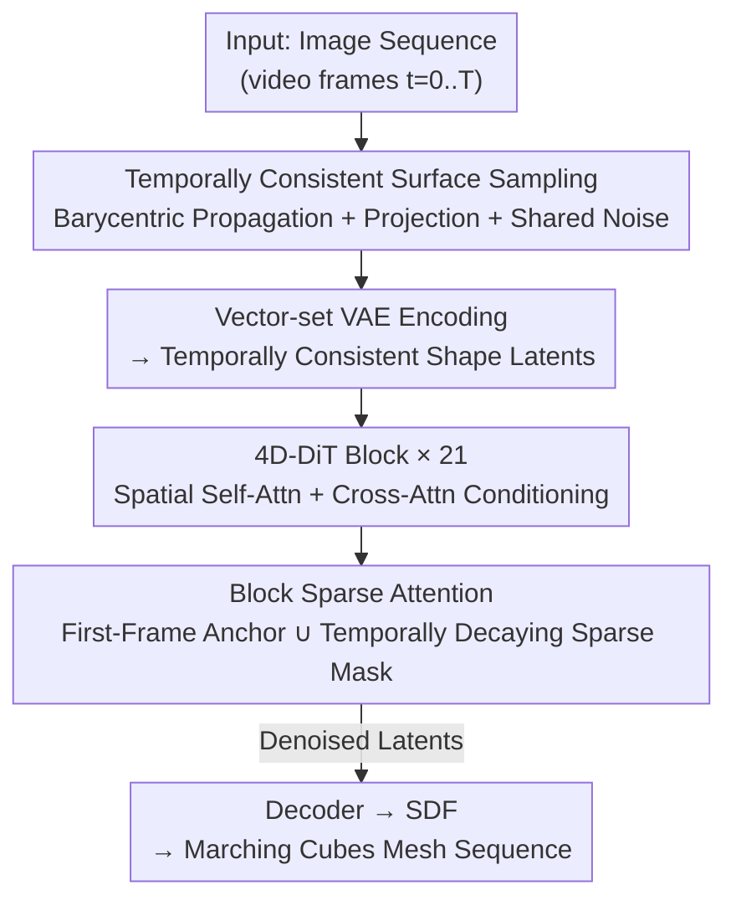

# Sculpt4D: Generating 4D Shapes via Sparse-Attention Diffusion Transformers

**Conference**: CVPR 2026  
**Paper**: [CVF Open Access](https://openaccess.thecvf.com/content/CVPR2026/html/Yin_Sculpt4D_Generating_4D_Shapes_via_Sparse-Attention_Diffusion_Transformers_CVPR_2026_paper.html)  
**Code**: Project Page https://visual-ai.github.io/sculpt4d (Code not explicitly open-sourced)  
**Area**: 3D Vision / 4D Generation / Diffusion Models  
**Keywords**: 4D shape generation, sparse attention, diffusion Transformer, temporal consistency, Hunyuan3D

## TL;DR
Sculpt4D natively extends a pre-trained 3D Diffusion Transformer (Hunyuan3D 2.1) into a 4D generation model: temporal attention modules are inserted into the DiT, and the expensive global spatio-temporal attention is replaced by a "first-frame anchor + temporal decay sparse mask" Block Sparse Attention. This reduces the total computational cost of the network by 56% while maintaining geometric quality and temporal consistency, generating temporally coherent 4D mesh sequences from videos.

## Background & Motivation

**Background**: Static 3D generation is highly mature, and large-scale Diffusion Transformers (such as Hunyuan3D) can generate complex geometry and textures with high fidelity from a single image. However, "4D generation"—generating dynamic 3D mesh sequences that deform over time from videos—remains a major challenge.

**Limitations of Prior Work**: Existing 4D methods all suffer from intrinsic drawbacks. Early Score Distillation Sampling (SDS)-based methods optimize per-instance, which is slow, unstable, and prone to the Janus problem. Two-stage approaches, which generate multi-view videos first and then reconstruct 4D, suffer from accumulated errors, where inconsistencies in the video stage directly lead to geometric flickering. Feedforward methods like L4GM rely on image representations, limiting geometric fidelity and generalizability. Frame-by-frame generation followed by post-processing (e.g., V2M4) requires complex, non-end-to-end temporal smoothing optimization. Geometry-vector-field-based methods (e.g., GVFD), which deform a canonical shape based on a reference frame, only look at a single frame and fail to capture geometric variations in subsequent frames. A commonality among these methods is that they treat the pre-trained 3D model as a **frozen black box** to "manage" rather than **extending** it at the architectural level.

**Key Challenge**: The most promising direction is to directly integrate temporal modeling into the DiT architecture and learn 4D dependencies end-to-end (concurrent work ShapeGen4D also takes this route). However, this immediately runs into a computational wall: performing full spatio-temporal attention on $T$ frames with $P$ spatial tokens per frame yields a complexity of $O((T\times P)^2)$, which scales quadratically and cannot scale to long sequences or high-fidelity 4D. Thus, a fundamental conflict arises between "native temporal modeling" and "computational affordability."

**Goal**: To reduce the computational complexity of native 4D DiTs to an affordable range without sacrificing generation fidelity and temporal consistency, while also alleviating the scarcity of 4D training data.

**Key Insight**: The authors observe two transferable priors: the concept of "attention sink/anchor" in large language models (using a global anchor to stabilize identity) and the principle in Radial Attention / FramePack where "spatio-temporal energy decays with temporal distance" (the correlation between distant frames is low, allowing sparsification). By **customizing these two principles for 4D motion modeling**, structured sparsity can be applied to the attention matrix.

**Core Idea**: Introducing a Block Sparse Attention to replace full spatio-temporal attention—where all frames are anchored to the first frame (preserving identity), and a "diagonally sparse mask with temporal decay" is used among other frames (preserving motion correspondence and pruning irrelevant token pairs). This reduces the computational cost of the network by 56% with almost no performance drop.

## Method

### Overall Architecture
Sculpt4D takes an image sequence (video frames) as input and outputs a temporally coherent sequence of 4D meshes. The entire pipeline consists of four steps: first, **temporally consistent surface sampling** converts the deforming mesh of each frame into standard point clouds with frame-to-frame correspondence, which are encoded into shape latents using a vector-set VAE. These latents are fed into 21 **4D-DiT blocks**, where image conditions are injected via cross-attention, and motion is modeled across frames via **Block Sparse Attention**. Finally, the decoder reconstructs the block meshes frame-by-frame from the denoised latents. Crucially, the VAE stage must ensure that the latent sequence itself does not flicker (otherwise, the DiT cannot learn temporal dynamics), and the DiT stage must ensure that temporal attention is both capable of capturing motion and computationally efficient.

### Key Designs

**1. Temporally Consistent Surface Sampling: Preventing VAE Latent Sequence Flickering from the Source**

To enable the DiT to learn smooth temporal dynamics, the input latent sequence must be temporally coherent. However, directly applying the static 3D VAE of Hunyuan3D to each frame generates **flickering latents**. The authors decompose this flickering into two independent sources and resolve them individually. First, the **inconsistent sampling of input point clouds on deforming surfaces**: although the original deforming meshes $\{M_t\}$ share topology, they are often not watertight. For robust training, watertight meshes $M'_t$ are generated using UDF meshes + Marching Cubes, but this step **destructs the original topology**, making the face/vertex structure of $M'_t$ and $M'_{t+1}$ completely unrelated, hence the $i$-th sampled point has no spatial correspondence across adjacent frames. The authors' solution is to first sample densely on the canonical rest pose $M_{rest}$ and store the persistent mapping of each point—face index $f_i$ and barycentric coordinates $b_i$. For any deformed frame $t$, this static mapping $\{(f_i,b_i)\}$ is applied to the original deforming mesh $M_t$ (which shares topology) to obtain a temporally consistent guided point set $P_{guide,t}$. Finally, these guided points are projected onto the surface of the clean, watertight mesh $M'_t$ (using k-NN to find the nearest face center and adopting its surface location and normal). The resulting $P'_t$ is both temporally coherent (via propagation) and resides on high-quality watertight surfaces (via projection).

Second, the **randomness in VAE reparameterization**. Even with consistent input point clouds, standard reparameterization $z_t = \mu_t + \sigma_t \cdot \epsilon_t$ samples noise $\epsilon_t$ independently for each frame, breaking temporal continuity. The authors modify this by sampling a **single noise vector $\epsilon_{seq}$ and broadcasting it to all frames**: $z_t = \mu_t + \sigma_t \cdot \epsilon_{seq}$. With shared noise, the dynamics of the latent sequence are driven entirely by deterministic changes in $\mu_t$ and $\sigma_t$, eliminating temporal randomness and yielding a coherent latent space suitable for 4D modeling. Additionally, sparse query points $Q_t$ are obtained via FPS only on the first frame ($Q_1$), and those in subsequent frames are tracked via propagation, ensuring that the query set is also temporally consistent.

**2. 4D-DiT block: Growing Temporal Capabilities on Pre-trained 3D DiT via "Spatio-Temporal Decoupling"**

Using the static DiT directly as a black box fails to learn motion. The authors modify the original DiT block into a **4D-DiT block**, explicitly decoupling spatial and temporal modeling. Inside the block, the original self-attention + cross-attention are first utilized to process each frame **independently** (capturing intra-frame spatial relations and injecting image conditioning), after which a new **temporal self-attention module is inserted to operate across frames** (modeling motion and temporal dependencies). To provide the network with explicit temporal order signals, a 1D Rotary Position Embedding (RoPE) is added to the queries/keys along the frame dimension in the temporal module. To ensure training stability, the output projection of this newly added temporal module is **zero-initialized**—allowing the network to smoothly learn temporal relationships from scratch without disrupting the strong spatial weights of the pre-trained model. The network stacks 21 such blocks, utilizing MoE and RMSNorm to stabilize and improve efficiency, and leveraging concat-based skip connections to guarantee feature propagation. Hunyuan3D is selected as the base precisely because its spatial priors, trained on large-scale datasets, are crucial for generalization under 4D data scarcity.

**3. Block Sparse Attention: First-Frame Anchor ∪ Temporally Decaying Diagonally Sparse Mask to Slash 56% Computation**

The cost of the temporal modules is the aforementioned $O((T\times P)^2)$ computational wall. The core contribution of this work is a block-level sparse mask designed based on two principles. First, the sequence is structured: the total length of temporal attention is $N_{total}=T\times P$. The $P$ spatial tokens of each frame are partitioned into $N_B=P/S_B$ blocks based on a fixed block size $S_B=128$. The $(T, N_B)$ elements are flattened into a block sequence of length $N_{blocks}=T\times N_B$, and attention is defined on a block-level mask $M\in\{0,1\}^{N_{blocks}\times N_{blocks}}$. To map the 1D block index back to 2D spatio-temporal coordinates: query $q=i\cdot N_B+u$ (frame $i$, block $u$), key $k=j\cdot N_B+v$ (frame $j$, block $v$).

The first principle is the **first-frame anchor**: the first frame $j=0$ is designated as a global anchor. All tokens of all frames can always attend to all tokens of the first frame, providing a stable reference to prevent identity/appearance drift in long sequences.
The second principle is the **temporally decaying sparse mask**: for $j>0$, a "distance-to-stride" function is introduced. Given a temporal distance $d=|i-j|$, a stride is retrieved from a predefined schedule $S=[1,1,2,4,8,16]$:

$$s(d) = S[\min(d, \mathrm{len}(S)-1)]$$

This stride defines a relative diagonal attention pattern: query block $u$ is only permitted to attend to key block $v$ when $(u \bmod s(d)) = (v \bmod s(d))$. Combining both principles, the final block mask is:

$$M_{i\cdot N_B+u,\; j\cdot N_B+v} = \begin{cases} 1, & j=0 \\ 1, & (u \bmod s(d)) = (v \bmod s(d)) \\ 0, & \text{otherwise} \end{cases}$$

This relative modulo pattern is more intelligent than a simple "take one every $s$ tokens" (i.e., $v \bmod s(d)=0$): it guarantees that block $u$ in distant frames **can always attend to its corresponding block $v=u$** (since $u \bmod s = u \bmod s$ is always true), thereby maintaining 1-to-1 spatial correspondence over time to track coherent motion, while allowing relative alignments like $u+1$ attending to $v+1$ to capture local relative motion and skipping a massive number of unrelated spatial pairs to reduce the computational density to $1/s$. In practice, the layout behaves as: close frames ($d$ is small, $s=1$) have modulo holds true always $\rightarrow$ dense attention to capture fine-grained local motion; distant frames ($d$ is large, $s>1$) have only $1/s$ of block pairs connected $\rightarrow$ sparse diagonal-band attention that saves computation while preserving correspondence. The entire scheme is executed efficiently via a Block Sparse Attention library, consuming only 35% of full attention PFLOPs per layer, with the computational advantage expanding further for longer sequences.

### Loss & Training
The training set consists of 13k 4D animated objects filtered from Objaverse. The data preprocessing follows the Hunyuan3D-2.1 framework: 24 views (512×512, camera poses sampled using a Hammersley sequence) are rendered for each frame as 2D visual conditions. Geometrically, 124,928 uniform points and 124,928 sharp edge points are sampled on the rest-pose mesh, and point-to-point consistency is maintained through barycentric coordinate propagation before projecting them onto watertight surfaces generated by flood-fill UDF. Finally, the sequence is normalized to $[-1,1]^3$ using the global bounding box of the entire animation. Image features are extracted using DINOv2 (518×518 input) after removing backgrounds, aligning scale and center across sequences, and pasting onto a white background. The network stacks 21 4D-DiT blocks with $S_B=128$. Training runs for 24K steps with a batch size of 32 (16 frames per sequence). The loss is calculated over 4,096 query points selected via FPS, taking approximately 3 days on 8×96GB GPUs.

## Key Experimental Results

### Main Results
Evaluation is performed on a holdout test set of 50 4D models from Objaverse. Metrics include Chamfer Distance (CD, lower is better), IoU (computed on an occupancy voxel grid, higher is better), and F-Score (higher is better). Comparisons are made against L4GM, V2M4, GVFD, along with two baseline references: Hunyuan3D (frame-by-frame 3D generation) and Hunyuan3D\* (frame-by-frame + shared noise). The evaluation protocol follows ShapeGen4D (but since its code is unavailable, its results are omitted).

| Method | Representation | Chamfer↓ | IoU↑ | F-Score↑ |
|------|------|----------|------|----------|
| Hunyuan3D | SDF | 0.1220 | 0.3125 | 0.2820 |
| Hunyuan3D\* | SDF | 0.1231 | 0.3176 | 0.2883 |
| L4GM | MV-3D GS | 0.1655 | - | 0.2033 |
| V2M4 | mesh+deform | 0.1268 | 0.3071 | 0.2909 |
| GVFD | 3D GS+deform | 0.4235 | - | 0.0717 |
| **Ours** | SDF | **0.1052** | **0.3381** | **0.3137** |

(For L4GM and GVFD, IoU is omitted because converting their Gaussian Splatting outputs to watertight meshes is difficult.) Sculpt4D leads comprehensively across all three metrics. Furthermore, generalization tests on real-world DAVIS videos demonstrate robust handling of unseen dynamics. For texturing, the model adopts the topology-consistent strategy of ShapeGen4D (global rigid registration + local ARAP optimization to align with the canonical topology), allowing the texture of the first frame to be seamlessly propagated throughout the sequence.

### Ablation Study
Using a 16-frame configuration, PFLOPs denote the 16-frame computational complexity.

| Configuration | Chamfer↓ | IoU↑ | F-Score↑ | PFLOPs |
|------|----------|------|----------|--------|
| w/o consistent sampling | 0.1128 | 0.3375 | 0.3380 | 186.3 |
| w/o shared noise | 0.1051 | 0.3396 | 0.3342 | 186.3 |
| w/o sharp edge sampling | 0.1005 | 0.3408 | 0.3369 | 186.3 |
| w/o attention sink (no first-frame anchor) | 0.0986 | 0.3442 | 0.3375 | 169.8 |
| Temporal attention (temporal only) | 0.2071 | 0.1972 | 0.1833 | 60.2 |
| Fixed stride (uniform sparse) | 0.1124 | 0.3298 | 0.3306 | 167.1 |
| Full attention (dense) | 0.0958 | 0.3466 | 0.3402 | 425.7 |
| **Ours** | 0.0972 | 0.3451 | 0.3383 | **186.3** |

### Key Findings
- **Sparse vs. Dense: Almost no performance drop, but saves over half the compute**: Ours (186.3 PFLOPs) and Full attention (425.7 PFLOPs) yield nearly identical results (CD 0.0972 vs. 0.0958), using only 35% of full attention PFLOPs per layer. This validates the effectiveness of Block Sparse Attention, and the advantage scales with longer sequences.
- **Spatio-Temporal Decoupling is Indispensable**: Replacing the spatio-temporal mechanism with "temporal attention only" causes a severe drop in performance (CD 0.2071, IoU 0.1972), indicating that frame-by-frame spatial modeling must be preserved.
- **Sparsity Pattern Must Be "Relative Diagonal" Rather Than "Fixed Uniform"**: Fixed stride (CD 0.1124) performs significantly worse than the proposed relative modulo design, proving the importance of maintaining 1-to-1 spatial correspondence for motion tracking.
- **First-Frame Anchor Stabilizes Identity**: Removing the attention sink slightly degrades the CD (0.0986), showing that the anchor helps maintain identity consistency in long sequences.
- **VAE-Side Temporal Consistency is Also Crucial**: Removing consistent sampling (CD 0.1128) is one of the most prominent degradation factors for geometry, proving that a non-flickering source is a prerequisite for 4D learning.

## Highlights & Insights
- **"Translating" Sparse Attention Principles from LLMs/Video to 4D Geometry Generation**: The concepts of attention sink (preserving identity) from StreamingLLM/Radial Attention and temporal decay density from FramePack are re-contextualized here. The key innovation is using a **relative diagonal modulo mask** to achieve decay—performing "downsampled connections" directly on the attention matrix instead of compressing or discarding tokens, thereby preserving spatio-temporal correspondence over time. This serves as an excellent example of deeply understanding a technique and adapting it specifically to a new domain.
- **Engineering Insights on "Solving Flickering at the Source"**: A hidden pitfall in 4D generation is the flickering of VAE latent sequences. The authors precisely attribute this to two independent sources (consistent sampling mismatch and reparameterization randomness) and resolve them with low-cost solutions (barycentric propagation and shared noise). This analytical approach of isolating and solving sub-problems is highly transferable.
- **Zero-Initialization + Decoupled Blocks** enable "growing 4D capabilities on top of pre-trained 3D DiT" in a stable and data-efficient manner. This is a concrete implementation of the "extend, don't just freeze" philosophy, which is applicable to other tasks that transition from 2D/3D pre-training to temporal/dynamic extensions.

## Limitations & Future Work
- **Dependency on Base Model**: The entire framework relies on Hunyuan3D 2.1, leaving its geometric performance ceiling and generalization capacity heavily dictated by the base.
- **Limited Scale of Training Data**: With only 13k Objaverse 4D objects, coverage of complex topological changes and strong non-rigid motions outside the training distribution remains questionable (despite qualitative generalization on DAVIS, quantitative metrics are missing).
- **Small Evaluation Set**: The main results are calculated on a holdout set of only 50 models, and the lack of open-source code for ShapeGen4D prevents direct quantitative comparison, necessitating cautious interpretation of comparative findings.
- **Texture Pipe is Post-processed, Not End-to-End**: Texturing relies on external ARAP registration + first-frame propagation instead of joint geometry-texture optimization.
- **Future Directions**: Making the sparse schedule $S$ learnable/adaptive (instead of manually predefined) and coupling the temporal stride dynamically with the magnitude of motion (denser steps for rapid motion).

## Related Work & Insights
- **vs. ShapeGen4D (Concurrent Work)**: Both methods take the route of embedding spatio-temporal attention into a 3D DiT for end-to-end 4D generation. The primary difference is that ShapeGen4D employs **full spatio-temporal attention**, hitting the $O((T\times P)^2)$ computational bottleneck, whereas Sculpt4D employs Block Sparse Attention to compress density to $1/s$, improving efficiency within the same conceptual framework.
- **vs. V2M4**: V2M4 treats the 3D model as a **frame-by-frame generator** and enforces smoothness through complex non-end-to-end post-processing. This work models temporal relationships natively end-to-end, yielding superior CD (0.1052 vs. 0.1268) and temporal consistency.
- **vs. GVFD**: GVFD generates a canonical shape and predicts a **deformation field**, looking only at a reference frame and failing to capture subsequent geometric evolutions (yielding a high CD of 0.4235). This work directly models frame-by-frame geometric evolution in the latent space.
- **vs. L4GM**: L4GM is feedforward and fast but is bound to **image representations**, which limits geometric fidelity (F-Score 0.2033). The SDF representation of Sculpt4D achieves noticeably higher geometric quality.
- **vs. SDS Approaches**: SDS-based approaches require no 4D data but run per-instance optimization, which is slow and prone to Janus artifacts. This work utilizes pre-trained 3D priors + 13k 4D data to perform feedforward generation, achieving both speed and stability.

## Rating
- Novelty: ⭐⭐⭐⭐ Translating sparse attention principles from LLMs/video into a relative diagonal mask for 4D is a solid transfer-based innovation rather than an entirely new paradigm.
- Experimental Thoroughness: ⭐⭐⭐⭐ Highly comprehensive with main results, seven ablation studies, and real-video generalization, but the test set is small and direct quantitative comparison with the concurrent ShapeGen4D is missing.
- Writing Quality: ⭐⭐⭐⭐ Clearly explains "why sparse, how sparse, and to what degree," with well-articulated formulations and intuitive explanations.
- Value: ⭐⭐⭐⭐ Provides a scalable and practical path for efficient, native 4D generation under data scarcity; the 56% reduction in computation has substantial practical value.

<!-- RELATED:START -->

## Related Papers

- [\[CVPR 2026\] Block-Sparse Global Attention for Efficient Multi-View Geometry Transformers](block-sparse_global_attention_for_efficient_multi-view_geometry_transformers.md)
- [\[CVPR 2026\] FlashVGGT: Efficient and Scalable Visual Geometry Transformers with Compressed Descriptor Attention](flashvggt_efficient_and_scalable_visual_geometry_transformers_with_compressed_descr.md)
- [\[CVPR 2026\] UniTEX: Universal High Fidelity Generative Texturing for 3D Shapes](unitex_universal_high_fidelity_generative_texturing_for_3d_shapes.md)
- [\[CVPR 2026\] SparseCam4D: Spatio-Temporally Consistent 4D Reconstruction from Sparse Cameras](sparsecam4d_spatio-temporally_consistent_4d_reconstruction_from_sparse_cameras.md)
- [\[CVPR 2026\] Residual Primitive Fitting of 3D Shapes with SuperFrusta](residual_primitive_fitting_of_3d_shapes_with_superfrusta.md)

<!-- RELATED:END -->
