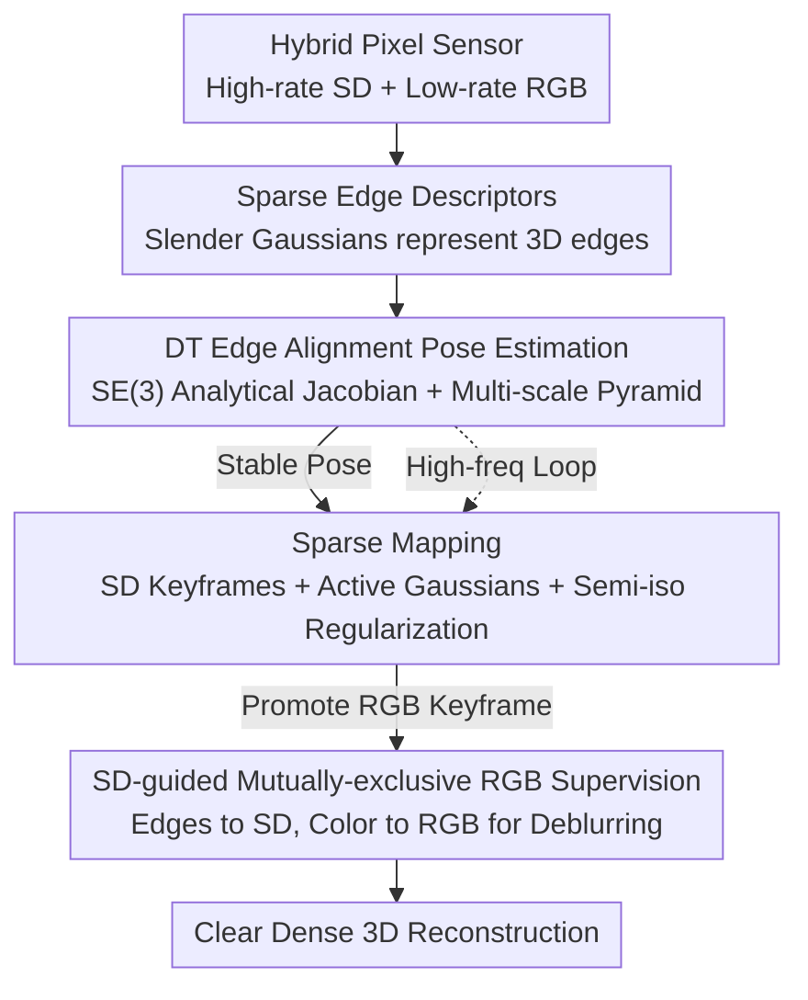

# SDGS: Spatial Difference Guided Gaussian Splatting for Simultaneous Localization and 3D Reconstruction

**Conference**: CVPR 2026  
**Paper**: [CVF Open Access](https://openaccess.thecvf.com/content/CVPR2026/html/Tian_SDGS_Spatial_Difference_Guided_Gaussian_Splatting_for_Simultaneous_Localization_and_CVPR_2026_paper.html)  
**Code**: To be confirmed  
**Area**: 3D Vision  
**Keywords**: Gaussian Splatting SLAM, Sparse Edge Descriptors, Distance Transform Pose Estimation, Hybrid Pixel Sensors, Motion Deblurring

## TL;DR
SDGS utilizes sparse edges (spatial difference) as descriptors, representing them as slender 3D Gaussian ellipsoids. It estimates 6-DoF poses online through distance transform alignment between rendered and input edges. By leveraging high-frame-rate differential signals from hybrid pixel sensors for mutually-exclusive supervisor deblurring, it achieves robust tracking and clear dense reconstruction even under extreme high-speed motion where traditional RGB methods fail.

## Background & Motivation
**Background**: 3D Gaussian Splatting (3DGS) enables photorealistic, real-time 3D reconstruction using explicit representation. However, original 3DGS operates offline, relying on SfM-precomputed camera poses, which introduces a latency between perception and reconstruction. Recent works have adapted 3DGS into online GS-SLAM without pose priors.

**Limitations of Prior Work**: Online GS-SLAM systems generally fall into two categories, both with significant drawbacks: (1) Hybrid frameworks combining traditional SLAM modules (e.g., ORB-SLAM / ICP) with 3DGS. These introduce descriptors other than Gaussians, causing a misalignment between tracking and mapping optimization objectives and decoupling Gaussians from tracking, which limits reconstruction fidelity. (2) Pure 3DGS systems that minimize photometric loss on dense pixels and backpropagate poses through massive Gaussian points, resulting in heavy computational and memory overhead that hinders real-time performance. Fundamentally, while offline pipelines use curated high-quality images, online systems cannot control input quality and must handle non-ideal factors like motion blur and lighting variations.

**Key Challenge**: Achieving a balance between robust tracking, representation efficiency, and high-fidelity appearance in online scenarios is difficult. Dense photometric tracking is expensive and sensitive to blur, while sparse methods struggle to recover high-fidelity RGB. This originates from the inherent limitations of traditional imaging mechanisms and dense descriptors.

**Goal**: To build an online 3DGS system capable of simultaneous 6-DoF localization and dense reconstruction without pose priors, maintaining stability under high-speed motion and motion blur.

**Key Insight**: The authors observe that new **hybrid pixel sensors** (such as Tianmouc) can simultaneously provide low-frame-rate RGB (texture/luminance) and high-frame-rate, sparse differential signals (geometric features) within a single sensor, with both accurately synchronized. Edge information is naturally suited for approximation by slender Gaussian ellipsoids and provides stronger structural cues than point descriptors.

**Core Idea**: Use sparse edges (spatial difference) as core descriptors represented by slender Gaussians in a "sketch-then-paint" paradigm. Agile and robust tracking/sparse mapping are performed using edges and distance transforms, followed by promoting keyframes for dense RGB reconstruction once poses are stable.

## Method

### Overall Architecture
SDGS follows a two-stage "sketch-then-paint" paradigm (Fig. 2). The frontend tracking process maintains a sparse Gaussian map for each frame using high-frequency SD inputs to estimate poses via edge alignment. The backend mapping process asynchronously optimizes SD Gaussians (high-frequency updates) and RGB Gaussians (low-frequency updates) within a sliding window. Specifically, sparse edge descriptors $I_\text{SD}$ are obtained from the differential channels of the hybrid pixel sensor (or first-order differences of RGB), and these 3D edges are represented by slender Gaussians. During tracking, rendered SD edges are aligned with the distance transform (DT) of observed edges, and poses are optimized on $SE(3)$ using analytical Jacobians. Once poses stabilize, RGB keyframes are promoted, utilizing DT for frequency-aware Gaussian initialization and SD-guided **mutually-exclusive supervision** to suppress motion blur and reconstruct clear dense scenes.

### Key Designs

**1. Sparse Edge Descriptors + Slender Gaussian Representation: Trading Dense Pixels for Edge Geometry**

To address the high cost and blur sensitivity of dense photometric tracking in pure 3DGS-SLAM, the authors use first-order **spatial difference** (SD) as descriptors: $\widehat{SD}(\mathbf{x})=I(\mathbf{x})-I(\mathbf{x}+\mathbf{s})$. Thresholding magnitude yields binary sparse edge maps $I_\text{SD}(\mathbf{x})=\mathbf{1}\{|\widehat{SD}(\mathbf{x})|>\tau\}$. This is naturally robust to high-speed/HDR scenes and can be derived from RGB or hardware channels. These 3D edges are represented by **intentionally elongated anisotropic Gaussians**, whose 2D projections $\Sigma_I$ naturally align with and cover local edge structures. Since these Gaussians only provide geometric support, their Spherical Harmonic (SH) coefficients are **fixed and not optimized**; linearization errors are managed by densification constraints on scale. Compared to point descriptors, slender Gaussians provide stronger structural cues and significantly reduce the resources needed for edge representation.

**2. Distance Transform Edge Alignment for Pose Estimation: Converting Sparse Edges into Continuous Potential Fields**

Direct correspondence matching with sparse edges is difficult to converge. The authors introduce **Distance Transform** (DT): $DT(\mathbf{x})=\min_{\mathbf{v}\in S} d(\mathbf{x},\mathbf{v})$, which transforms sparse edge sets into a continuous "potential field." This eliminates the need for explicit correspondences, as predicted edges are pulled toward observed ones by minimizing DT values at rendered pixels. The tracking loss is $\mathcal{L}_\text{tracking}=\|\,I(\mathcal{G}_\text{SD},T_{CW})\odot DT(I_\text{SD})\,\|_1$, where every rendered positive response is penalized by its Euclidean distance to the nearest observed edge. Poses are updated on $SE(3)$ using **analytical Jacobians** via exponential mapping (manifold derivatives of projection centers and covariances w.r.t. $T_{CW}$ are in Eq. 8), optimized stably with Adam. This DT form is more robust to "unreconstructed regions" than direct photometric optimization, which is crucial for stability during high-speed motion. It also incorporates a **multi-scale image pyramid** to expand the convergence basin and **visibility/covisibility filtering** to prune occluded Gaussians. In stereo hybrid pixel setups, sub-pixel disparity is converted to depth via epipolar pyramid LK search. The paper reports that DT alignment accelerates pose optimization by approximately 2× compared to existing methods.

**3. Sparse Mapping: Maintaining a Clean Sparse Map via Active Gaussians and Semi-isotropic Regularization**

Online mapping must resolve two conflicts: SD inputs cannot see through occlusions, and simple non-edge masks leave large unsupervised areas, leading to geometric degradation. A sliding window strategy manages SD keyframes (added when translation exceeds a threshold or visible Gaussian IoU is too low). New Gaussians are sampled only in edge regions **not covered by the existing map**, initialized with the principal axis along the tangent. All visible Gaussians in the window are marked as **active Gaussians** $\mathcal{G}_A$, and only they participate in mapping. Combined with periodic opacity resets, Gaussians not marked as active receive no supervision and are pruned as zero-contribution, maintaining sparsity. To prevent Gaussians from degrading into pathological thin shapes along the line of sight, a **semi-isotropic regularization** $\mathcal{L}_\text{semi-iso}$ is introduced: it forces only the closest pair among the three scale axes to be equal (taking the $\min$ of the three pairwise differences). This preserves one free axis for edge orientation while ensuring permutation invariance. The total sparse mapping loss is $\mathcal{L}=\lambda_\text{sd}\mathcal{L}_\text{sd}+\lambda_\text{si}\mathcal{L}_\text{semi-iso}$, where $\mathcal{L}_\text{sd}=\|I(\mathcal{G}_A,T_{CW})-I_\text{SD}\|_1$.

**4. SD-guided Mutually-exclusive RGB Supervision: Reconstructing Clear Edges from Blurry RGB**

Once poses are stable, RGB keyframes are promoted for dense reconstruction. However, RGB streams often suffer from motion or defocus blur. The authors use hardware SD as a prior for **mutually-exclusive supervision**: pixels are split into two groups using the SD gate $M_\text{SD}=\mathbf{1}\{|\widehat{SD}|\ge\tau\}$. Strong gradient regions are constrained by SD (ensuring sharp structures), while the complementary regions $M_\text{RGB}=1-M_\text{SD}$ are constrained by RGB photometric consistency (propagating color). This eliminates supervision ambiguity between "sharp gradients vs. blurry RGB observations." The SD rendering on the RGB side is calculated on a chessboard sampling grid $SD_\text{render}(\mathbf{u})=\mathcal{C}(Y_d)(\mathbf{u})-\mathcal{C}(Y_d)(\mathbf{u}+\mathbf{s})$, and the loss is $\mathcal{L}_\text{sd}^\text{rgb}=\|(\mathcal{Q}_{b,\theta}(k\cdot SD_\text{render})-\widehat{SD})\odot M_\text{SD}\|_1$, where $\mathcal{Q}_{b,\theta}$ is a hardware-consistent quantizer with bit-depth $b$ and dead-zone threshold $\theta$ (using STE for backprop), and $k$ aligns scales. Sharp structures are recovered by SD constraints, while color propagates from neighboring RGB regions. The authors note that mutual exclusivity primarily sharpens edges; low-texture non-edge regions are supervised only by RGB photometry, meaning some blur may remain.

### Loss & Training
The system splits tracking and mapping into two asynchronous sub-processes: tracking estimates the pose for each frame (frontend, high-rate SD map maintenance); mapping jointly optimizes SD and RGB Gaussians in a sliding window (backend, SD high-frequency, RGB low-frequency). The sparse mapping objective is $\mathcal{L}=\lambda_\text{sd}\mathcal{L}_\text{sd}+\lambda_\text{si}\mathcal{L}_\text{semi-iso}$. The dense RGB mapping objective is $\mathcal{L}=\lambda_\text{sd}^\text{rgb}\mathcal{L}_\text{sd}^\text{rgb}+\lambda_\text{rgb}\mathcal{L}_\text{rgb}$. Adam is the default for pose optimization, though second-order Gauss–Newton/LM is reported as an experimental alternative.

## Key Experimental Results

### Main Results
**stereo-Tianmouc Tracking Accuracy (RMSE ATE [cm], lower is better; fail = tracking lost)**:

| Method | Input | slow | fast | extreme | Average |
|------|------|------|------|---------|---------|
| MonoGS–RGBD | RGB | 3.32 | 24.52 | fail | — |
| WildGS-SLAM* | RGB | 2.01 | 8.21 | 8.62 | 6.28 |
| SEGS-SLAM* | RGB | 6.69 | 19.30 | 19.06 | 15.02 |
| SEGS-SLAM* | SD | 3.30 | 4.64 | 15.37 | 7.77 |
| **Ours** | SD | 4.21 | 5.89 | **3.91** | **4.67** |

Performance is comparable at low speeds, but **Ours is the only one that does not fail under high-speed/extreme motion**. In the "extreme" column, only SDGS achieves 3.91cm, while other RGB methods mostly fail or suffer from accumulated error and blur.

**TUM RGB-D Generalization (Edges extracted via RGB first-order difference, RMSE ATE [cm])**:

| Method | fr1/desk | fr2/xyz | fr3/office | Average |
|------|----------|---------|-----------|---------|
| MonoGS–RGBD | 1.45 | 1.23 | 1.75 | 1.48 |
| **Ours** | 1.64 | 0.54 | 4.15 | 2.11 |

On standard RGB systems, accuracy is slightly lower than dense baselines but comes with a massive boost in efficiency, proving generalization to standard RGB cameras.

**Deblurring (SD-Replica room0, refined after 10k steps)**: SDGS outperforms MonoGS-RGBD across PSNR/SSIM/LPIPS (24.11/0.737/0.379 vs 22.51/0.702/0.394). PSNR for single-view deblurring improves from 27.78 (blurry input) to 31.15.

### Ablation Study
Ablation of Image Pyramid (Pyr.) and Semi-isotropic Loss (Semi-iso) on TUM-RGBD, RMSE ATE [cm]:

| Configuration | fr1/desk | fr2/xyz | fr3/office | Average |
|------|----------|---------|-----------|---------|
| w/o Pyr., w/o Semi-iso | 5.04 | 0.97 | 7.40 | 4.47 |
| w/ Pyr., w/o Semi-iso | 3.29 | 1.01 | 3.00 | 2.43 |
| w/o Pyr., w/ Semi-iso | 2.90 | 0.54 | 7.09 | 3.51 |
| **w/ Pyr., w/ Semi-iso** | 1.64 | 0.54 | 4.15 | **2.11** |

### Key Findings
- **Pyramid contributes most**: In long sequences like fr3/office, the pyramid reduces error from 7.40→3.00cm, significantly expanding the convergence basin.
- **Semi-isotropic loss is effective for sharp edge scenes but not universal**: It benefits scenes like fr1/desk and fr2/xyz with clear edges, but slightly degrades accuracy in fr3/office where smooth spherical objects create pseudo-edges in space.
- **Extremely Sparse**: Only ∼2k Gaussians are used per tracking iteration (vs. ∼9–12k for MonoGS and 2690k for SplaTAM). Minimal Gaussian overlap directly translates to speed, achieving the highest frame rate among compared methods (4.29 total FPS on fr2/xyz).
- Using the LM second-order optimizer reaches 8.61 FPS and 1.13cm ATE on fr2/xyz, but requires faster backend optimization to maintain accuracy.

### Performance and Efficiency
On TUM-RGBD, SDGS requires only ∼2k Gaussians and ∼3.1ms per tracking iteration. Total FPS leads significantly (e.g., fr2/xyz 4.29 vs. MonoGS 2.40 vs. SplaTAM 0.07), while maintaining competitive tracking accuracy.

## Highlights & Insights
- **The "Sketch-then-Paint" paradigm aligns with hardware**: Using sparse edges for agile tracking and RGB for coloring perfectly matches the complementary "fast differential channel + slow RGB channel" design of hybrid pixel sensors, achieving hardware-software co-design.
- **Converting sparse edges into continuous potential fields via DT** is key to stable pose optimization for sparse descriptors. DT provides a differentiable alignment target and is more robust to unreconstructed areas than photometric methods.
- **Mutually-exclusive supervision** explicitly separates which signal supervises which pixels (edges to SD, color to RGB), cleanly eliminating ambiguity between blurry RGB and sharp gradients. This is transferable to any deblurring task with auxiliary sharp signals.
- The use of **slender Gaussians with fixed SH** for geometric support is a lightweight and effective "geometry-appearance decoupling" trick.

## Limitations & Future Work
- The authors admit that mutually-exclusive supervision mainly sharpens edges; **low-texture non-edge regions** rely only on RGB photometry, so blur may persist.
- Semi-isotropic loss can create spatial pseudo-edges in scenes with many smooth spherical objects, indicating scene dependency.
- Accuracy on standard RGB (TUM) is slightly lower than the dense baseline MonoGS; superior accuracy is mainly shown in the high-speed/blur regime.
- Full advantages depend on the hybrid pixel sensor (Tianmouc), and stereo configurations require precise calibration and synchronization. Slender Gaussian linearization errors are only mitigated by densification constraints; the authors suggest exploring better solutions.
- ⚠️ No code link is provided; some hyperparameters like loss weights and threshold $\tau$ are not fully detailed in the text.

## Related Work & Insights
- **vs MonoGS / SplaTAM / Gaussian-SLAM (Pure 3DGS-SLAM)**: These perform photometric tracking on dense pixels with high overhead and blur sensitivity. SDGS is robust under extreme motion using ∼2k sparse edge Gaussians and DT alignment.
- **vs ORB-SLAM+3DGS / ICP-SLAM Hybrid Frameworks (e.g., SEGS-SLAM)**: These use non-Gaussian descriptors, leading to misaligned tracking/mapping objectives. SDGS uses the Gaussians themselves (slender edge Gaussians) for tracking.
- **vs Event Camera GS-SLAM**: Single-event methods struggle with high-fidelity RGB; event+RGB-D fusion is costly and calibration-sensitive. SDGS uses synchronized complementary signals from a hybrid sensor to balance robust tracking and appearance.

## Rating
- Novelty: ⭐⭐⭐⭐ Integrated sparse SD edges, slender Gaussians, DT alignment, and hybrid sensors into a consistent online SLAM system.
- Experimental Thoroughness: ⭐⭐⭐⭐ Covered synthetic, real-world, and TUM datasets for tracking, deblurring, and efficiency; though deblurring scenes are limited.
- Writing Quality: ⭐⭐⭐⭐ Clear explanations of formulas and pipeline; effective "sketch-then-paint" analogy; some hyperparameter/code details missing.
- Value: ⭐⭐⭐⭐ Provides a sparse, efficient, and robust route for online GS-SLAM under non-ideal (high-speed/blur) conditions.

<!-- RELATED:START -->

## Related Papers

- [\[CVPR 2026\] Prune Wisely, Reconstruct Sharply: Compact 3D Gaussian Splatting via Adaptive Pruning and Difference-of-Gaussian Primitives](prune_wisely_reconstruct_sharply_compact_3d_gaussian_splatting_via_adaptive_prun.md)
- [\[CVPR 2026\] P2GS: Physical Prior-guided Gaussian Splatting for Photometrically Consistent Urban Reconstruction](p2gs_physical_prior-guided_gaussian_splatting_for_photometrically_consistent_urb.md)
- [\[CVPR 2026\] ULF-Loc: Unbiased Landmark Feature for Robust Visual Localization with 3D Gaussian Splatting](ulf-loc_unbiased_landmark_feature_for_robust_visual_localization_with_3d_gaussia.md)
- [\[CVPR 2026\] LangRef3DGS: Natural Language-Guided 3D Referential Segmentation from Partial Observations via 3D Gaussian Splatting](langref3dgs_natural_language-guided_3d_referential_segmentation_from_partial_obs.md)
- [\[CVPR 2026\] Towards Visual Query Localization in the 3D World](towards_visual_query_localization_in_the_3d_world.md)

<!-- RELATED:END -->
