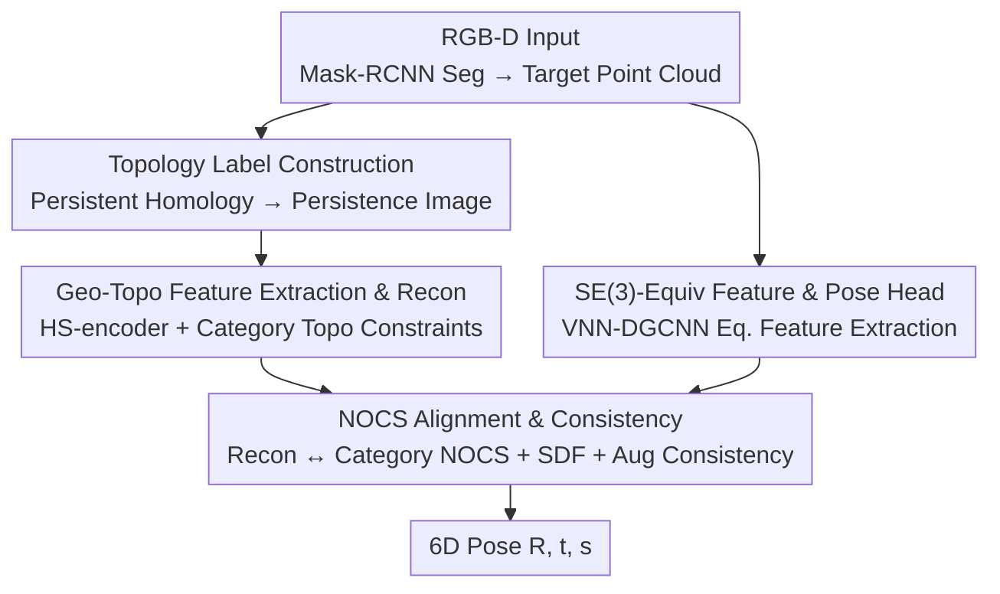

# SE(3)-Equivariance with Geometric and Topological Guidance for Category-Level Object Pose Estimation

**Conference**: CVPR 2026  
**Paper**: [CVF Open Access](https://openaccess.thecvf.com/content/CVPR2026/html/Yu_SE3-Equivariance_with_Geometric_and_Topological_Guidance_for_Category-Level_Object_Pose_CVPR_2026_paper.html)  
**Code**: Not mentioned  
**Area**: 3D Vision  
**Keywords**: Category-level pose estimation, SE(3)-equivariant, Persistent homology, Point cloud reconstruction, Robotic grasping

## TL;DR
SEGPose is a depth-only (point cloud) category-level 6D object pose estimation method. It is the first to simultaneously introduce geometric features, topological features, and SE(3)-equivariance into pose estimation: persistent homology generates topological labels to guide point cloud reconstruction, while Vector Neuron Networks extract SE(3)-equivariant features to guide the pose prediction head. It outperforms all similar depth-based methods on REAL275 / CAMERA25 and approaches the performance of most RGB-D methods.

## Background & Motivation
**Background**: Category-level 6D pose estimation (predicting rotation $R\in SO(3)$, translation $t\in\mathbb{R}^3$, and scale $s\in\mathbb{R}^3$) does not rely on object CAD models and can generalize to unseen objects within the same category. It is a critical capability for robotic grasping, autonomous driving, and AR. Current mainstream methods (e.g., SGPA, CatFormer, AG-Pose, SpotPose) rely heavily on the fusion of RGB and point cloud features.

**Limitations of Prior Work**: On one hand, RGB textures become blurred in dark or low-light environments, causing RGB-D fusion methods to fail. While depth-only methods (SAR-Net, GPV-Pose, HS-Pose, etc.) are unaffected by lighting, they focus **almost exclusively on geometric features**, ignoring topological and graph structure information present in point clouds. Objects in the same category often share similar topological structures, which are beneficial for both reconstruction and pose estimation. On the other hand, in scenarios like robotic grasping, objects move and camera viewpoints change; point clouds change accordingly, and the pose should transform synchronously (SE(3)-equivariance: any 3D rotation/translation of the input point cloud results in the same transformation of the output pose). However, most methods fail to exploit this property.

**Key Challenge**: Depth-only methods often focus solely on geometric features for simplicity, discarding topological structures and SE(3)-equivariance—two inherently available types of information that could significantly enhance robustness. A few methods using topology (e.g., TG-Pose) completely ignore SE(3)-equivariance. These two types of information have never been modeled simultaneously.

**Goal**: Using only depth information (RGB is used only for segmentation), this work aims to utilize geometry, topology, and SE(3)-equivariance to enhance the accuracy and cross-view robustness of category-level pose estimation.

**Key Insight**: Topological information lacks supervisable labels. The authors use persistent homology to encode the topological structure of point clouds into persistence diagrams, which are then transformed into differentiable persistence images to serve as labels. SE(3)-equivariance is obtained through a Vector Neuron Network (VNN), an inherently equivariant backbone.

**Core Idea**: Replace "pose regression based solely on geometric features" with "topology-guided reconstruction + SE(3)-equivariant-guided pose head," ensuring that reconstruction is both geometrically accurate and topologically correct, while the pose transforms synchronously with the viewpoint.

## Method

### Overall Architecture
SEGPose is a category-level pose estimation pipeline with pure point cloud input. First, Mask-RCNN is used on RGB-D to segment the target mask, and the depth map is cropped to obtain the target object point cloud $P_o\in\mathbb{R}^ {N_o\times3}$. Subsequently, the HS-encoder extracts geometric features and predicts topological features under topological label supervision; both guide the 3D reconstruction of the point cloud. In parallel, an SE(3)-equivariant encoding module (VNN-DGCNN) extracts equivariant features, which are fed into an SE(3)-equivariant-guided pose estimation head to predict $R, t, s$. Finally, the reconstructed point cloud is transformed into the NOCS space using the predicted pose and aligned with the category NOCS point cloud for refinement.

### Key Designs

**1. Topological Label Construction: Creating a Differentiable Supervision Signal for Point Cloud Topology**

While geometric features can be constrained by object models or NOCS clouds, topological information lacks ready-made labels for supervision, and direct prediction is prone to model collapse. The authors use persistent homology to encode point cloud structure into persistence diagrams: first, an alpha complex is used to construct 1D and 2D topological features of the point cloud, obtaining birth-death coordinates $D_1, D_2$. Then, a linear transformation $T(x,y)=(x,y-x)$ is applied to convert these into "birth-persistence" coordinates. To integrate discrete birth-death points into network training, the persistence image approach is adopted: a regular Gaussian kernel $N(p\mid\bar p,\sigma^2)=\frac{1}{2\pi\sigma^2}e^{-\frac{(x-\bar x)^2+(y-\bar y)^2}{2\sigma^2}}$ is applied to each point to turn discrete points into a continuous distribution. A weight $w=\frac{y-x}{t}$ (where $t$ is the maximum persistence value in the diagram) is used to emphasize key structures with long persistence, resulting in a persistence surface $S_{D^*}(p)=\sum_{\bar p}w(\bar p)N(p\mid\bar p,\sigma^2)$. Finally, the surface is partitioned into $M\times M$ patches, and a double integral $V(S_{D^*})_n=\iint_{S_n}D^*(x,y)\,dy\,dx$ is performed for each patch to obtain a finite-dimensional vector. These are concatenated into persistence images $I_1, I_2$ as topological labels. The value of this step is quantifying "shape topology" into a differentiable image label, allowing the network to learn topology as it learns geometry. ⚠️ Refer to the original paper for detailed formulas.

**2. Geo-Topo Feature Extraction & Reconstruction: Safeguarding Reconstruction Quality with Topological and Category Constraints**

Point clouds reconstructed solely based on geometry may have the correct shape but incorrect structure. SEGPose uses an HS-encoder to extract point cloud features $F$, and a Transformer-based graph module analyzes relationships between points to obtain topological features $F_{topo}$. Combined with adaptive max pooling and MLPs, the 1D/2D persistence images are predicted. **Two layers of topological constraints** are applied: first, the predicted persistence images are aligned with the point cloud topological labels obtained in Design 1 (using MAE: $L_{pt}=L_{pt1}(I_1,\hat I_1)+L_{pt2}(I_2,\hat I_2)$). However, single-view point clouds are noisy, and the labels themselves might be inaccurate. Therefore, a **category topological constraint** is introduced—objects of the same category share similar structures. $L_{ct}=\alpha_1 L_{ct1}+\alpha_2 L_{ct2}$ pulls the prediction toward the category-level structure. An adaptive balancing factor $\alpha=e^{-2L_{pt*}}$ ensures that if the point cloud constraint is more accurate, the category constraint is weaker, preventing bias from outliers. Finally, $I_1, I_2$ generate topological features $F_{t1}, F_{t2}$, and a multi-layer MLP reconstructor predicts the reconstructed point cloud $P_{recon}$ under joint geometric and topological constraints.

**3. SE(3)-Equivariant Features and Pose Estimation Head: Synchronizing Pose with Viewpoint Changes**

Since geometric features are not inherently equivariant, a Vector Neuron Network (VNN) is used as the backbone. The input point cloud $P_o$ passes through VNN-DGCNN layers to extract equivariant features (VNN uses vector representations to capture spatial information, providing inherent equivariance to 3D transformations; DGCNN handles graph features). Output from all layers is concatenated to obtain fused equivariant features $F_{fuse}$. VNN-Linear then produces $F_{adj}$, which is multiplied element-wise with $F_{fuse}$ to get $F_{se}$. Simultaneously, $F_{fuse}$ + MLP is used to predict shape weights to fine-tune the point cloud into $P_{adj}$. $P_{adj}$ and $F_{se}$ are concatenated and passed through an MLP to obtain the final equivariant features $F_{SE}$. The pose head then uses the equivariant features to **guide** the point cloud geometric features: $F$ (adjusted by 1D Conv) and the equivariant features (adjusted by VNN-Linear) are concatenated into $F_{se1}$, and a Sigmoid generates weights $W_1$ to modulate the point cloud features, resulting in $V_1$. After layer-wise iteration, an MLP predicts rotation components $R_r, R_b$, translation $t$, and scale $s$. Rotation $R$ is synthesized via Gram-Schmidt from $R_r, R_b$. Consequently, the predicted pose transforms synchronously with input rotation/translation, enhancing stability across views.

**4. NOCS Alignment and Consistency: Refinement and Robust Training without Extra Branches**

Finally, the reconstructed point cloud is moved from geometric space to NOCS space using the predicted pose and aligned with the category NOCS point cloud. This allows for correcting pose errors **without an additional prediction branch** and remains robust to intra-class shape variations without requiring CAD models. Alignment is measured using Density Chamfer Distance ($L_{alig}$). Additionally, two auxiliary constraints enhance robustness: (a) A cosine similarity feature consistency $L_F=1-\frac{F_{orig}F_o}{\lVert F_{orig}\rVert\lVert F_o\rVert}$ is applied between the original point cloud $P_{orig}$ and the augmented input $P_o$. Combined with the reconstruction loss $L_{rec}$, this ensures feature stability under random occlusion. (b) Inspired by GPV-Pose's bbox-pose consistency, and since both pose and bounding boxes are SE(3)-equivariant, an SDF-based bbox-pose consistency is proposed: points are classified as outside (SDF>0), on-surface (=0), or inside (<0) according to the bounding box, and an L1 loss $L_{sdf}$ constrains the predicted SDF relative to the ground truth. The total loss is $L=L_{basic}+\lambda_3 L_{pt}+L_{ct}+L_{alig}+\lambda_4(L_F+L_{rec})+\lambda_5 L_{sdf}$, where $L_{basic}=\lambda_1 L_{pose}+\lambda_2 L_{sym}$.

### Loss & Training
The point cloud consists of 1024 points, with a batch size of 24. Targeted by an initial learning rate of 1e-4 with cosine decay, the model is trained on a single RTX 3090. Weights are set to $\lambda_1=8, \lambda_2=1, \lambda_3=4, \lambda_4=0.1, \lambda_5=2$, and $\beta_1=0.5, \beta_2=1$. Data augmentation includes scale variation, random cropping, and point cloud dropout.

## Key Experimental Results

### Main Results
The datasets used are REAL275 (4,300 training / 2,750 testing real images) and CAMERA25 (synthetic objects in real scenes, 300K images / 25K evaluation). Both include six categories: bottle, bowl, camera, can, laptop, and mug. Metrics include 3D IoU (thresholds 0.5/0.75) and joint rotation-translation accuracy (mAP) at $5^\circ 2cm / 5^\circ 5cm / 10^\circ 2cm / 10^\circ 5cm$. The following table shows key comparisons on REAL275 (D = Depth-only, RGB-D = Color + Depth):

| Method | Type | IoU75 | 5°2cm | 5°5cm | 10°5cm | FPS |
|------|------|-------|-------|-------|--------|-----|
| HS-Pose | D | 74.7 | 46.5 | 55.2 | 82.7 | 50.0 |
| TG-Pose | D | 76.2 | 49.8 | 59.0 | 86.6 | 50.0 |
| HRC-Pose | D | 77.8 | 49.8 | 58.6 | 85.4 | - |
| **SEGPose (Ours)** | D | **78.3** | **51.8** | **61.1** | **87.1** | 45.8 |
| SpotPose | RGB-D | 81.2 | 59.7 | 64.8 | 88.2 | - |

SEGPose achieves the best performance among all depth-only methods and outperforms most RGB-D methods, trailing only behind SpotPose, which uses richer RGB-D information for point cloud reconstruction/keypoints. However, SEGPose is faster (45.8 FPS), making it more suitable for real-time grasping. Visually, its pose capture for complex categories like cameras and mugs is significantly superior to HS-Pose.

### Ablation Study
Module ablation on REAL275 (Table 2(A), IoU75 / 5°2cm / 5°5cm):

| Configuration | IoU75 | 5°2cm | 5°5cm | Description |
|------|-------|-------|-------|------|
| Geometric only (only $L_{basic}$) | 71.6 | 43.8 | 51.1 | Topology and SE(3) removed |
| + Topology guidance (No SE(3)) | 75.3 | 46.5 | 54.2 | Topological reconstruction added back |
| + SE(3) (No Topology) | 74.6 | 45.2 | 53.4 | Equivariant pose head added back |
| Full SEGPose | **78.3** | **51.8** | **61.1** | Geo + Topo + SE(3) |

### Key Findings
- **Topology and SE(3) are complementary and indispensable**: While adding either module individually improves the 5°2cm metric from 43.8 to ~45–46, only the combination reaches 51.8. This jump exceeds the sum of individual improvements, suggesting that geometric, topological, and equivariant information model distinct structural cues.
- **Topological gains slightly outweigh SE(3) gains**: On 5°5cm, +Topology (54.2) > +SE(3) (53.4), confirming the value of "intra-category shared topological structure" for reconstruction quality.
- **Good speed-accuracy trade-off**: Using depth only allows SEGPose to remain close to RGB-D SOTA while achieving 45.8 FPS. It is more reliable than RGB-D methods in low-light scenarios.

## Highlights & Insights
- **Converting persistent homology into differentiable labels**: Using persistence images + double integrals turns discrete topological "birth-death points" into supervision signals, preventing the collapse caused by direct topology regression. This "topology to differentiable label" approach is transferable to any point cloud task lacking topological supervision.
- **Adaptive weight $\alpha=e^{-2L_{pt}}$ for category constraints is clever**: The more accurate the point cloud constraint, the weaker the category constraint. This naturally prevents noisy single-view labels from misleading the network—an elegant solution for "unreliable labels."
- **SE(3)-equivariance as "guidance" rather than "replacement"**: Equivariant features do not directly output the pose; instead, they modulate geometric features (via layer-wise Sigmoid weights). This enjoys equivariant robustness while retaining geometric discriminative power.
- **NOCS alignment as refinement without extra branches**: Orienting the reconstructed cloud in NOCS space for alignment implements pose correction, eliminating the need for an extra refinement network.

## Limitations & Future Work
- Accuracy still lags behind RGB-D SOTA (SpotPose) in well-lit scenarios where texture/keypoint information is abundant. Advantage lies primarily in low light and real-time performance.
- Topological labels depend on persistent homology calculations. The construction of the alpha complex / persistence image may be sensitive to hyperparameters ($\sigma$, number of patches $M$). The paper does not provide a full sensitivity analysis. ⚠️ Refer to the original paper.
- Validated only on 6 common household categories. Topological stability for thin-walled, transparent, or strongly symmetric objects remains unknown.
- Future directions: Integrating lightweight RGB cues in low light or extending topological constraints to fine-grained part levels might further close the gap with RGB-D methods.

## Related Work & Insights
- **vs HS-Pose / GPV-Pose (Pure depth geometry)**: These use only geometric features for pose regression. SEGPose introduces topological labels to guide reconstruction and an SE(3)-equivariant pose head, improving the 5°2cm metric from 46.5 to 51.8 on REAL275 by utilizing overlooked structural information.
- **vs TG-Pose (Topology without equivariance)**: TG-Pose introduces topology but ignores SE(3)-equivariance. SEGPose models both for the first time, achieving 51.8 vs 49.8 on the 5°2cm metric.
- **vs SpotPose (RGB-D SOTA)**: SpotPose achieves higher accuracy through more precise point cloud reconstruction/keypoints via RGB-D. However, SEGPose is independent of RGB, robust to low light, and faster, making their positioning complementary rather than directly competitive.

## Rating
- Novelty: ⭐⭐⭐⭐⭐ First to combine geometry, topology, and SE(3)-equivariance for category-level pose estimation; innovative differentiable topological label design.
- Experimental Thoroughness: ⭐⭐⭐⭐ Dual datasets + detailed module/loss ablation + real-robot grasping; however, lacks topological hyperparameter sensitivity analysis and category range is limited.
- Writing Quality: ⭐⭐⭐⭐ Clear motivation and complete formulas, though some notation (e.g., $F_{se1}$, alignment terms) is densely packed.
- Value: ⭐⭐⭐⭐ Practical for low-light/real-time grasping; the "topology to differentiable label" approach is highly reusable.

<!-- RELATED:START -->

## Related Papers

- [\[CVPR 2026\] ComPose: A Unified Completion-Pose Framework for Robust Category-Level Object Pose Estimation](compose_a_unified_completion-pose_framework_for_robust_category-level_object_pos.md)
- [\[CVPR 2026\] SCAPO: Self-Supervised Category-Level Articulated Pose Estimation from a Single 3D Observation](scapo_self-supervised_category-level_articulated_pose_estimation_from_a_single_3.md)
- [\[CVPR 2026\] DICArt: Advancing Category-level Articulated Object Pose Estimation in Discrete State-Spaces](dicart_advancing_category-level_articulated_object_pose_estimation_in_discrete_s.md)
- [\[ICCV 2025\] Unified Category-Level Object Detection and Pose Estimation from RGB Images using 3D Prototypes](../../ICCV2025/3d_vision/unified_category-level_object_detection_and_pose_estimation_from_rgb_images_usin.md)
- [\[CVPR 2026\] Breaking the 3D Dataset Bottleneck: Fast Scalable Generation of Aligned 3D Assets from Scratch for Category 6D Pose Estimation and Robotic Grasping](breaking_the_3d_dataset_bottleneck_fast_scalable_generation_of_aligned_3d_assets.md)

<!-- RELATED:END -->
