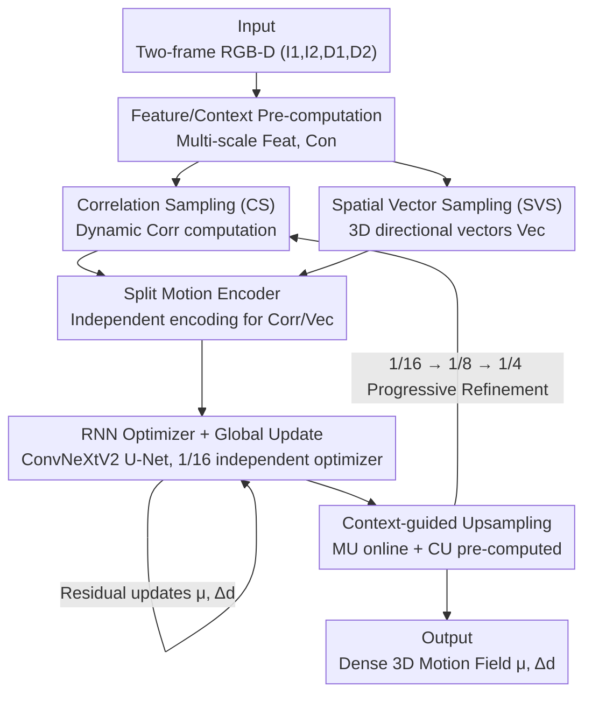

# SEA-Flow3D: Simplified, Efficient, and Accurate Scene Flow via Spatial Vector Sampling and Multi-scale Refinement

**Conference**: CVPR 2026  
**Paper**: [CVF Open Access](https://openaccess.thecvf.com/content/CVPR2026/html/Ling_SEA-Flow3D_Simplified_Efficient_and_Accurate_Scene_Flow_via_Spatial_Vector_CVPR_2026_paper.html)  
**Code**: https://github.com/HanLingsgjk/SEAFLOW3D  
**Area**: 3D Vision / Scene Flow Estimation  
**Keywords**: Scene Flow, RGB-D, Spatial Vector Sampling, Multi-scale Iterative Optimization, RAFT  

## TL;DR
SEA-Flow3D integrates a "3D directional vector between matching point pairs" (Spatial Vector Sampling) into the correlation sampling of a RAFT-style dense scene flow framework. This allows the iterative optimizer to continuously perceive depth and geometric directions beyond 2D correlation. Combined with a lightweight ConvNeXtV2 RNN optimizer and a coarse-to-fine multi-scale structure, it sets new accuracy records on KITTI (SF-all 3.55) and Sintel (Final 2.04) while compressing inference time to 60–72 ms.

## Background & Motivation
**Background**: With the availability of affordable and reliable depth estimation, RGB-D dense scene flow has become mainstream. Representative methods like RAFT-3D concatenate RGB and depth as inputs to a 2D network, predicting pixel-wise 3D motion (2D optical flow $\mu$ + disparity change $\Delta d$) through iterative refinement of a correlation volume. Another path involves point cloud methods (e.g., FlowNet3D, CamLiRAFT) that establish correspondences directly in 3D space. While these utilize geometric priors effectively, they often produce sparse outputs and struggle with high-resolution dense estimation.

**Limitations of Prior Work**: Although dense RGB-D methods use depth as input, depth information is typically only utilized at the "entry" stage—subsequent iterative refinements occur entirely within the 2D feature or correlation space. Consequently, the optimizer only sees 2D feature correlations during each lookup, failing to perceive the 3D direction or disparity offset between matching pairs. Geometric priors are not propagated into the iterative process, leading to inaccurate 3D motion recovery in complex or non-rigid scenes. Furthermore, methods like RAFT-3D and MS-RAFT-3D compensate by stacking heavy rigid optimization layers, increasing model weight and slowing speed (MS-RAFT-3D takes 1710 ms on Sintel).

**Key Challenge**: Propagating 3D structural priors throughout the optimization process usually requires heavy 3D convolutions or point cloud architectures. Conversely, prioritizing speed and simplicity often necessitates reverting to 2D correlation spaces, which discards geometry. There is a fundamental trade-off between accuracy (requiring geometry) and efficiency (requiring lightweight design).

**Core Idea**: Instead of migrating the entire network to 3D, calculate the "3D directional vector" between matching point pairs within the same neighborhood of each correlation sampling. By pairing these with correlation values and feeding them to the optimizer, the model injects continuous geometric guidance into the iterative process with minimal overhead—replacing expensive 3D convolutions or point cloud branches with lightweight directional cues.

## Method

### Overall Architecture
The input consists of two consecutive RGB-D frames (images $I_1, I_2$ + disparity maps $D_1, D_2$), and the output is a dense 3D motion field composed of 2D optical flow $\mu$ and disparity change $\Delta d$. The entire network follows a coarse-to-fine multi-scale iterative framework: it first resolves large global displacements at a 1/16 scale, then progressively upsamples and refines at 1/8 and 1/4 scales. Each stage repeats three steps: "Sampling $\rightarrow$ Iterative Refinement $\rightarrow$ Upsampling."

On the feature side, two types of pre-calculations are performed: the feature encoder $F$ extracts multi-scale visual features from $(I_1, I_2)$ at 1/4, 1/8, and 1/16 scales, while the context encoder $C$ processes the concatenation of $(I_1, I_2, D_1, D_2)$ to produce context features at 1/2, 1/4, 1/8, and 1/16 scales (the 1/2 scale is reserved for final upsampling). During each sampling phase, two components are computed dynamically: the standard correlation field $\mathrm{Corr} = \mathrm{Sample}(\mathrm{Feat}_1, \mathrm{Feat}_2, \mu)$ (using a dynamic CUDA operator to save memory compared to the 4D cost volume in RAFT) and the spatial vector $\mathrm{Vec} = \mathrm{SVS}(D_1, D_2, \mu)$. These elements correspond one-to-one and are fed into the RNN optimizer to iteratively update $\mu$ and $\Delta d$. After refinement, an upsampling module propagates the results to the next finer scale. Key structural changes include adding SVS directional vectors, replacing GRU with a lightweight ConvNeXtV2 RNN (with a dedicated global optimizer for the 1/16 scale), decoupling directional and correlation feature encoding, and using pre-computed context masks for cheap upsampling.

### Key Designs

**1. Spatial Vector Sampling (SVS): Attaching a 3D Directional Vector to Every Sample**

This is the core contribution addressing the limitation where depth is used only once and geometry is invisible during iteration. SVS performs sampling in a "disparity-augmented 2D projection field" rather than complex 3D space. Under a pinhole camera model, a triplet $(u, v, D)$ (pixel coordinates + disparity) uniquely determines a 3D point, thus implicitly carrying full 3D geometric information. This representation is naturally compatible with the prediction targets $\mu$ and $\Delta d$, significantly simplifying the pipeline. Specifically, given the second-frame projection field $P_2 = (u, v, D_2)$ and the current flow estimate $\mu = (\mu_x, \mu_y)$, each pixel $p = (x, y)$ in the first frame is mapped to $p' = (x + \mu_x, y + \mu_y)$ in the second frame. A window $N_{p'} = \{p' + \delta \mid \delta_x, \delta_y \in [-r_d, r_d] \cap \mathbb{Z}\}$ is opened around $p'$ with the same radius as the correlation radius $r_f$ (setting $r_d = r_f$ ensures a strict one-to-one correspondence between spatial and correlation samples). For each neighbor $q$ in the window, the directional vector relative to pixel $p$ in the first frame (with disparity $D_1(p)$) is calculated as:

$$\mathrm{Vec}(p, q) = \big( u(q) - x, \;\; v(q) - y, \;\; D_2(q) - D_1(p) \big)^\top.$$

Stacking the $(2r_d + 1)^2$ neighbors yields a tensor $\mathrm{Vec} \in \mathbb{R}^{H \times W \times (2r_d + 1)^2 \times 3}$. Each element corresponds to a correlation value in $\mathrm{Corr}$. Consequently, during each lookup, the optimizer perceives not only "where correlation is high" (2D) but also "which 3D direction to move and the disparity difference" (the first two dimensions represent image plane offsets, the third represents cross-frame disparity difference). This process requires no 3D convolutions or point cloud architectures, incurring almost zero extra cost while propagating geometric guidance throughout all iterations. SVS reduced KITTI DC-out from 34.53 to 27.81 and Sintel from 58.59 to 31.55, with the most significant gains in depth motion estimation.

**2. RNN Optimizer + 1/16 Scale Independent Global Update: ConvNeXtV2 instead of GRU**

To address the small receptive field and slow convergence of RAFT-style GRU optimizers, this work adopts the approach of SEA-RAFT, replacing traditional GRU blocks with a lightweight U-Net constructed from ConvNeXtV2 blocks (two layers with $\times 2$ downsampling + residual connections) as an RNN-style optimizer. The convolutional design provides a larger receptive field and richer context, making each update step more effective and achieving higher accuracy with fewer iterations—this alone reduced KITTI Fl-all from 5.36 to 3.66. During each iteration, $\mathrm{Corr}$, $\mathrm{Vec}$, and current estimates $(\mu, \Delta d)$ are encoded into motion features $M$, then the hidden state $h' = \mathrm{RNN}(h, M, C)$ is updated. Finally, a two-layer CNN Head3D regresses residuals $\mu_{res}, \Delta d_{res}$. Furthermore, the authors observed that the coarsest 1/16 scale is responsible for "global initialization" and requires aggressive large-range updates, while subsequent scales focus increasingly on localized refinement. Since a single shared optimizer struggles with these conflicting dynamics, a dedicated optimizer with a larger sampling radius $r$ is used for the 1/16 scale to specifically strengthen global updates and stabilize initialization.

**3. Split Motion Encoder: Decoupling Directional and Correlation Features**

This design mitigates a side effect of SVS. The authors observed that directly feeding SVS 3D directional cues into the motion encoder improved disparity change estimation but slightly degraded optical flow accuracy—the additional directional info expanded the input dimension, and the original RAFT-style encoder lacked the capacity to decouple "motion" and "geometry" representations. The solution is to provide independent convolutional branches for correlation and spatial vector features, followed by ConvNeXtV2 modules for refinement of flow and depth branches respectively. This decoupling restored Fl-all from 3.91 to 3.71 while further reducing DC-out from 27.81 to 27.17, verifying that split encoding for feature decoupling is effective.

**4. Context-guided Upsampling (CU): Cheap Multi-scale Upsampling via Pre-computed Masks**

Restoring dense motion fields to full resolution in multi-scale frameworks is challenging: RAFT’s learned upsampling depends on hidden state regression at a fixed scale, unsuitable for hierarchical updates; MS-RAFT uses bilinear interpolation which is fast but loses accuracy; CCMR refines at 1/2 scale but is too expensive. The finest refinement scale in this work is 1/4. To bridge scale gaps, the authors pre-compute a set of context-guided masks $CU_{\{2, 4, 8\}}$ for fixed $\times 2$ transitions between adjacent scales. Each mask is generated by two convolutions on the corresponding context features $\mathrm{Con}_{\{2, 4, 8\}}$. The first $\times 2$ upsampling within the current refined scale still uses a dynamic mask $MU$ regressed from $h'$. Since CU is independent of iterative refinement and computed only once, it incurs minimal overhead while strengthening supervision at lower scales and providing consistent upsampling across all scales. Adding CU reduced Fl-all from 3.71 to 3.28.

### Loss & Training
The training goal jointly supervises optical flow $\mu$ and disparity change $\Delta d$ across all iterations and scales using a RAFT-style exponentially decayed weighting:

$$L_{total} = \sum_{i=1}^{N} \gamma^{N-i} \Big( \lVert \mu_i - \mu_{gt} \rVert_1 + \lVert \Delta d_i - \Delta d_{gt} \rVert_1 \Big),$$

with a decay factor $\gamma = 0.8$. The total iterations $N = N_1 + N_2 + N_3$ are distributed across 1/16, 1/8, and 1/4 scales ($N_1=2, N_2=4, N_3=3$). The sampling radii are $r_f = r_d = 6$ at the 1/16 scale and 4 for others. On KITTI, the model was pre-trained for 200K steps on a Driving+vkitti mixture and fine-tuned for 100K steps on KITTI+Driving+vkitti. For Sintel, it followed the CamLiRAFT pipeline, training on FlyingThings and evaluating without fine-tuning.

## Key Experimental Results

### Main Results
KITTI Scene Flow Benchmark (Values are outlier rate %, lower is better; +G uses GA-Net depth, +M uses MonSter depth):

| Method | D1-all | D2-all | Fl-all | SF-all |
| :--- | :--- | :--- | :--- | :--- |
| RAFT-3D | 1.81 | 3.67 | 4.29 | 5.77 |
| CamLiRAFT | 1.81 | 2.94 | 2.96 | 4.26 |
| MS-RAFT-3D | 1.59 | 2.68 | 2.98 | 4.04 |
| **SEA-Flow3D+G** | 1.81 | 2.91 | **2.89** | **4.17** |
| **SEA-Flow3D+M** | **1.42** | **2.18** | **2.53** | **3.55** |

With the same depth input (+G), SF-all 4.17 already outperforms CamLiRAFT/MS-RAFT-3D. With stronger depth (+M), SF-all further drops to 3.55, demonstrating that better depth allows the method to extract more 3D structural priors.

Sintel (No fine-tuning, timed on RTX 4090):

| Method | Input | Time/ms | Clean | Final |
| :--- | :--- | :--- | :--- | :--- |
| CamLiRAFT | RGB+P | 130 | 1.27 | 2.38 |
| RAFT-3D | RGB+D | 138 | 1.75 | 2.91 |
| MS-RAFT-3D | RGB+D | 1710 | 1.06 | 2.22 |
| **SEA-Flow3D** | RGB+D | **72** | **1.04** | **2.04** |

Accuracy (Final 2.04) and speed (72 ms) both surpass MS-RAFT-3D (2.22 / 1710 ms), achieving approx. 24$\times$ speedup.

### Ablation Study
Ablation starting from a simplified MS-RAFT baseline (A) to the full model (E); DC-epe/DC-out are newly introduced disparity change error/outlier metrics:

| ID | Configuration | KITTI Fl-all | KITTI DC-out | Sintel Fl-all | Sintel DC-out |
| :--- | :--- | :--- | :--- | :--- | :--- |
| A | baseline | 5.36 | 48.97 | 5.95 | 56.32 |
| B | +RNN Optimizer | 3.66 | 34.53 | 5.83 | 58.59 |
| C | +SVS | 3.91 | 27.81 | 6.13 | 31.55 |
| D | +Split Encoder | 3.71 | 27.17 | 6.01 | 28.56 |
| E | +CU (Full) | **3.28** | 27.67 | **5.09** | 27.79 |

### Key Findings
- **SVS focuses on depth motion**: From B $\rightarrow$ C, optical flow accuracy (Fl-all) slightly increased, but DC-out dropped from 34.53/58.59 to 27.81/31.55 on KITTI/Sintel, proving that explicit 3D directional vectors precisely fill the "disparity change/depth motion" gap.
- **Split encoder fixes SVS side effects**: SVS slightly harms flow (C's Fl-all 3.91 is higher than B's). Split encoding (D) fixes it to 3.71 while continuing to lower DC-out, confirming that directional info can pollute the flow feature space and needs decoupling.
- **RNN Optimizer benefits large-displacement rigid scenes**: Significant gains in KITTI (large-scale, mostly rigid) but less gap with GRU in Sintel (fine-grained, non-rigid), indicating that the U-Net optimizer primarily benefits scenes requiring large-range spatial perception.
- **Efficiency Breakdown**: Including feature preprocessing (~7.5 ms), the model takes ~60 ms on 384$\times$1248; sampling time is negligible (0.5–0.7 ms per scale), with the main cost in the Update stage.

## Highlights & Insights
- **Sampling 3D geometry in a 2D projection field is ingenious**: Utilizing $(u,v,D)$ as a unique 3D point allows compressing 3D directional cues back into a 2D sampling grid. This avoids 3D convolution/point cloud overhead while ensuring strict one-to-one correspondence between directional and correlation samples. This "injection without up-dimensioning" is transferable to any RAFT-style iterative framework.
- **Treating global initialization and local refinement as distinct optimization dynamics**: Identifying that coarse scales need aggressive steps while fine scales need conservative ones led to the use of a dedicated large-radius optimizer for the coarsest scale—a simple yet effective engineering insight for stability.
- **Decoupling when encountering side effects**: Interpreting the degradation in flow as insufficient encoder capacity to decouple motion and geometry led to split encoding, a clean causal solution.
- **Handling non-rigidity without rigid optimization**: Compared to the rigid layers in RAFT-3D/MS-RAFT-3D, SVS provides point-wise geometric directions rather than rigid body assumptions, making it more robust in Sintel’s non-rigid, motion-blurred, or low-light scenes.

## Limitations & Future Work
- **Strong dependence on input depth/disparity quality**: The method’s core is "leveraging good depth for 3D priors." The gain from +G to +M confirms this; however, SVS directional vectors might be polluted by depth noise, and robustness in such cases remains to be thoroughly validated.
- **Operation in disparity/projection space**: SVS uses disparity rather than true metric 3D, questioning its adaptation to wide-baseline or purely monocular scenes without reliable disparity.
- **Evaluation bias toward autonomous driving/synthetic data**: Primary results are on KITTI and Sintel. Real-world evidence is limited to qualitative generalization (Fig. 6), lacking large-scale quantitative evaluation on real non-rigid scenes.
- **Potential improvements**: Changing SVS fixed-window sampling to learnable/adaptive radii; upgrading directional vectors from "neighborhood offsets" to geometric terms with confidence weights to mitigate depth noise.

## Related Work & Insights
- **vs RAFT-3D / MS-RAFT-3D**: These use depth only at the input, with iterative refinement in 2D correlation space and stacked rigid optimization layers. Ours propagates geometry via sampling, removes rigid assumptions, and achieves higher accuracy with a ~24$\times$ speedup on Sintel.
- **vs CamLiRAFT / CamLiFlow (Point Cloud route)**: These rely on point cloud sampling for continuous geometry, yielding good results but sparse and slower outputs. SEA-Flow3D achieves similar geometric gains within a dense 2D framework, maintaining dense high-resolution outputs (Sintel Final 2.04 vs 2.38, 72 ms vs 130 ms).
- **vs SEA-RAFT / IGEV-Stereo**: Borrows the ConvNeXtV2 U-Net RNN design from SEA-RAFT and the idea of "encoding geometry into the cost volume" from IGEV, but concretizes geometry injection as "paired 3D directional vectors in correlation sampling," which is more direct and lightweight.

## Rating
- Novelty: ⭐⭐⭐⭐ The "sampling 3D directions in a 2D grid" approach is clean and practical, though the overall structure is a geometric enhancement of RAFT rather than a paradigm shift.
- Experimental Thoroughness: ⭐⭐⭐⭐ SOTA on KITTI and Sintel, clear module-wise ablation, and timing breakdown; however, quantitative real-world non-rigid testing is limited.
- Writing Quality: ⭐⭐⭐⭐ Clear motivation-contradiction-method chain; math and figures are well-coordinated.
- Value: ⭐⭐⭐⭐ A win-win for accuracy and efficiency. The plug-and-play SVS concept is transferable, offering high utility for autonomous driving and embodied scene flow.

<!-- RELATED:START -->

## Related Papers

- [\[CVPR 2026\] MetroGS: Efficient and Stable Reconstruction of Geometrically Accurate High-Fidelity Large-Scale Scenes](metrogs_efficient_and_stable_reconstruction_of_geometrically_accurate_high-fidel.md)
- [\[CVPR 2026\] Fast SceneScript: Fast and Accurate Language-Based 3D Scene Understanding via Multi-Token Prediction](fast_scenescript_fast_and_accurate_language-based_3d_scene_understanding_via_mul.md)
- [\[CVPR 2026\] AMB3R: Accurate Feed-forward Metric-scale 3D Reconstruction with Backend](amb3r_accurate_feed-forward_metric-scale_3d_reconstruction_with_backend.md)
- [\[CVPR 2026\] SpatialVID: A Large-Scale Video Dataset with Spatial Annotations](spatialvid_a_large-scale_video_dataset_with_spatial_annotations.md)
- [\[CVPR 2026\] ARES: Unifying Asymmetric RGB-Event Stereo for Probabilistic Scene Flow Estimation](ares_unifying_asymmetric_rgb-event_stereo_for_probabilistic_scene_flow_estimatio.md)

<!-- RELATED:END -->
