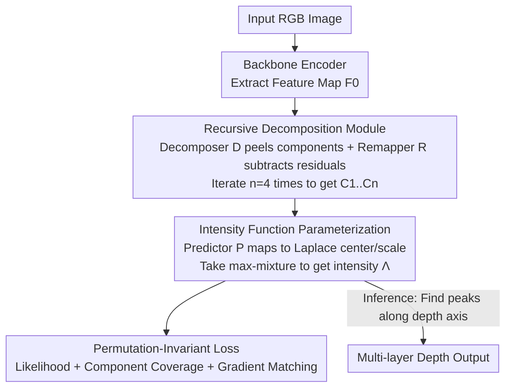

# SeeGroup: Multi-Layer Depth Estimation of Transparent Surfaces via Self-Determined Grouping

**Conference**: CVPR 2026  
**Paper**: [CVF Open Access](https://openaccess.thecvf.com/content/CVPR2026/html/Wen_SeeGroup_Multi-Layer_Depth_Estimation_of_Transparent_Surfaces_via_Self-Determined_Grouping_CVPR_2026_paper.html)  
**Code**: TBD  
**Area**: 3D Vision  
**Keywords**: Multi-layer depth estimation, transparent objects, self-determined grouping, intensity function, permutation-invariant loss

## TL;DR
SeeGroup models multi-layer depths of transparent objects as an "intensity function" along the depth axis. By utilizing a recursive decomposition module, the model adaptively decides how to group depth layers, combined with a permutation-invariant likelihood loss. It improves quaternary relative depth accuracy from 61.34% to 70.09% on the LayeredDepth real-world benchmark.

## Background & Motivation

**Background**: Monocular depth estimation has evolved significantly (e.g., MiDaS, Depth Anything with strong pre-trained backbones and large-scale multi-dataset training), enabling robust zero-shot generalization in conventional scenes. However, these methods typically output only **one** depth map, assuming each camera ray hits exactly one surface.

**Limitations of Prior Work**: Transparent objects (glass bottles, glass doors, plastic containers) inherently violate this assumption—a camera ray passes through both the transparent surface and the background behind it, mapping one pixel to **multiple** depth values along the ray direction. Existing approaches either treat transparent objects as opaque (targeting only the first layer), or ignore the transparent surface to predict only the background geometry, both resulting in information loss. In practical perception systems, robots need to see both the transparent surface (to avoid collisions) and the background (to interact with objects).

**Key Challenge**: The primary difficulty in multi-layer depth estimation is not "predicting how many layers," but rather "how to organize several depth values per pixel into multiple depth maps." Prior work like LayeredDepth utilized **depth-order** grouping (the $i$-th map collects the $i$-th depth at each pixel), which works for "foreground glass + natural background" but fails with overlapping transparent planes. In such cases, the first map might merge the entire foreground plane with non-overlapping regions of the background plane, while the second map only contains the overlap, causing geometric and semantic discontinuities within each map.

**Goal**: To make the grouping strategy no longer pre-fixed, but instead adaptive to the input scene or specific image regions—where some areas may suit depth-order while others favor object-centric grouping.

**Key Insight**: The authors found that "optimal grouping is highly scene-dependent." Consequently, the model is designed to **self-determine** the permutation of depth values for each pixel during inference without forcing a strict order; sorting is performed only when needed for evaluation. To make this "self-determined order" feasible, the key is designing a loss that is **invariant to the permutation of depth values within a pixel**.

**Core Idea**: Ours models the multi-layer geometry of each pixel as an intensity function (max-mixture of Laplace components) along the depth axis. A recursive decomposition module iteratively extracts layer components from features, and the model is trained with a permutation-invariant likelihood loss, allowing the grouping strategy to be learned entirely by the model.

## Method

### Overall Architecture
Given an RGB image of resolution $H\times W$, the goal is to predict a sequence of increasing depths $D(p)=\{d_1,\dots,d_m\}$ for each pixel $p$, where $m$ varies by pixel. The SeeGroup pipeline is as follows: a backbone encoder extracts the feature map $F_0$; a **recursive decomposition module** iteratively splits $F_0$ into components $\{C_1,\dots,C_n\}$, each responsible for a group of dominant depth layers; a predictor $P$ maps each component into a Laplace distribution center $d_i$ and scale $b_i$; all Laplace components are combined via "max" to obtain the per-pixel **intensity function** $\Lambda$; during training, a **permutation-invariant likelihood loss** is used for optimization, and during inference, multi-layer depths are obtained by finding peaks along the depth axis in $\Lambda$. The "grouping" is entirely self-determined as the loss imposes no specific layer order.

### Key Designs

**1. Recursive Decomposition Module: Empowering the model to peel features into depth groups**

Features $F_0$ in transparent regions are mixtures of multiple surface features, making direct multi-layer regression difficult. The authors use a recursive decomposition module to "peel" this mixture iteratively. The module consists of a decomposer $D$ and a remapper $R$. In step $i$, the decomposer extracts a component from the residual feature $C_i = D(F_{i-1})$, which intuitively isolates the most dominant depth layer group. The remapper then projects $C_i$ back into the feature space as $F'_{i-1}=R(C_i)$, which is subtracted to focus on the remaining content:

$$C_i = D(F_{i-1}), \qquad F_i = F_{i-1} - \eta_i \cdot R(C_i)$$

where the rescaling factor $\eta_i = \frac{\lVert F_{i-1}\rVert_2}{\lVert F'_{i-1}\rVert_2}$ ensures the scale of $F_i$ remains comparable to $F_{i-1}$. Critically, "how to peel and what to peel" is learned by the model, and the components are **order-independent** (due to the permutation-invariant loss), serving as the vehicle for "self-determined grouping." The number of iterations is fixed to $n=4$.

**2. Intensity Function Parameterization: Laplace max-mixture along the depth axis to express multi-layers and uncertainty**

Using L1 loss to directly regress depth values in transparent regions often forces the model to rely on dataset priors rather than visual evidence for disambiguation. Instead, ours models per-pixel geometry as an intensity function $\Lambda:\mathbb{R}_+\to\mathbb{R}_{\ge 0}$, where $\Lambda(x)$ represents the "likelihood of observing a surface at depth $x$." Each component $C_i$ contributes a Laplace-shaped intensity:

$$L_i(x) = \frac{1}{2 b_i}\exp\!\left(-\frac{\lvert x - d_i\rvert}{b_i}\right), \qquad \Lambda = \max_{i=1}^{n} L_i$$

Note the use of a **max**-mixture instead of a standard weighted sum $\sum_i w_i L_i$. This ensures that at any depth $x$, only the most dominant component contributes to $\Lambda(x)$, locally suppressing minor components and encouraging them to specialize in different depth intervals. This prevents them from collapsing into a single broad peak. The resulting per-pixel distribution is a multi-modal curve where each peak corresponds to a depth layer, naturally encoding uncertainty.

**3. Permutation-Invariant Loss: Likelihood and component coverage for bi-directional matching**

To enable "self-determined order," the loss must not depend on fixed permutations. Treating $\Lambda$ as a generalization of probability density, the likelihood of observing a set of ground-truth depths $\{d_1,\dots,d_m\}$ is proportional to the product of intensities $\prod_{i=1}^m \Lambda(d_i)$. Since multiplication is commutative, this objective is **inherently permutation-invariant**. In log-space for stability:

$$L_{int} = -\sum_{i=1}^{m}\log\max_{j=1}^{n} L_j(d_i)$$

However, this is a one-sided target: it encourages high intensity at ground-truth depths but doesn't penalize "extra" components. Thus, a **component coverage loss** $L_{cov} = -\sum_{j=1}^{n}\log\max_{i=1}^{m} L_j(d_i)$ is added, which finds the best ground-truth match for each predicted component $L_j$. If $L_j$ aligns with at least one ground truth, the penalty is small; if it is far from all, it is suppressed. Combined with a gradient matching loss $L_{gm}$, the total loss is $L = \lambda_{int} L_{int} + \lambda_{cov} L_{cov} + \lambda_{gm} L_{gm}$.

### Loss & Training
The model is trained on the LayeredDepth-Syn synthetic dataset (procedurally generated via infinigen-indoors, 14,800 training + 500 validation images). The feature extractor is initialized with Depth Anything V2's metric-depth checkpoint (DINOv2-ViT-L). Training uses AdamW with an initial learning rate of $1\times10^{-5}$ on 4×L40 GPUs, with a batch size of 4 for 250k steps in a scale-invariant manner. $\lambda_{int}, \lambda_{cov}, \lambda_{gm}$ are set to 1.0, 0.1, and 1.0 respectively. Peak detection during inference suppresses near-duplicates within a 0.02 depth difference.

## Key Experimental Results

### Main Results
**Zero-shot** evaluation is conducted on the LayeredDepth real-world benchmark (1,500 images, 14.2M relative depth tuples). Metrics include tuple-level accuracy for Pairs (P), Triplets (T), and Quaternaries (Q)—where Quaternary (Q) is the most informative. The table below shows results for the "All" subset:

| Method | Q ↑ | T ↑ | P ↑ |
|------|------|------|------|
| Multi-head (NeWCRFs) | 25.32 | 41.65 | 63.95 |
| Recurrent (NeWCRFs) | 23.77 | 40.70 | 62.26 |
| Multi-head (DA v2) (Shared Backbone) | 61.34 | 70.57 | 82.56 |
| **SeeGroup (Ours)** | **70.09** | **74.88** | **82.62** |

SeeGroup outperforms baselines in 14 out of 15 metrics, improving Quaternary accuracy from 61.34% to 70.09% compared to the Multi-head (DA v2) baseline using the same monocular backbone.

### Ablation Study
On the LayeredDepth validation set (Quaternary accuracy Q for "All" subset):

| Dimension | Configuration | Q ↑ | Note |
|------|------|------|------|
| Intensity Param. | Weighted Mixture | 56.12 | Weighted sum mixture |
| Intensity Param. | Sorted Mixture | 52.68 | Enforced sorting mixture |
| Intensity Param. | **Max-Mixture (Ours)** | **69.03** | Max mixture |
| Loss | L1 | 42.49 | Pure regression |
| Loss | L1 + GM | 46.67 | With gradient matching |
| Loss | Int + GM | 68.36 | Likelihood + gradient matching |
| Loss | **Int + Cov + GM (Ours)**| **69.03** | Bi-directional likelihood |

### Key Findings
- **"Max" in intensity parameterization is core**: Replacing max-mixture with weighted sum or enforced sorting drops Q accuracy significantly (from 69.03% to 56.12% / 52.68%), validating that "local dominance" is crucial to avoid component collapse.
- **Likelihood loss over L1 is a qualitative leap**: Pure L1 regression (42.49) is much lower than intensity likelihood (68.36), proving that optimizing permutation-invariant likelihood is the primary source of gain.
- ⚠️ Architecture ablation reveals that while Multi-head (73.04) slightly leads on "All" Q vs. Recursive Decomposition RD (71.50), RD significantly outperforms in the deep Layer 5 subset (66.14 vs. 39.64), highlighting RD's advantage in complex, multi-layered transparent structures.

## Highlights & Insights
- **Handing grouping over to the model**: Instead of pre-defining depth or object order, letting the model learn its own grouping is a fundamental reformulation that addresses why prior methods fail on overlapping transparent surfaces.
- **Permutation-invariant likelihood as a foundation**: Utilizing the commutativity of $\prod \Lambda(d_i)$ to achieve order-independence is a clean approach applicable to any unordered set prediction task.
- **Max-mixture vs. Weighted sum**: This simple design choice prevents components from collapsing into a single peak through "local winner-takes-all" behavior, a useful trick for distribution modeling.
- Modeling multi-layer geometry as a continuous intensity function naturally captures ambiguity in transparent regions more elegantly than regressing discrete values.

## Limitations & Future Work
- Training relies entirely on the synthetic LayeredDepth-Syn dataset; although zero-shot performance is strong, the synthetic-to-real gap may still limit performance in extreme material or lighting conditions.
- The number of iterations $n$ is fixed at 4, potentially insufficient for highly complex scenarios with more than 4 layers; adaptive iteration counts are a possible improvement.
- ⚠️ Inference depends on a fixed 0.02 threshold for peak suppression, which might be sensitive to depth scale across different datasets.
- Architecture ablations suggest RD might not outperform Multi-head on shallow/simple tuples; balancing shallow and deep layer performance remains a future challenge.

## Related Work & Insights
- **vs. LayeredDepth [46] Depth-Order Grouping**: LayeredDepth fixes map $i$ to the $i$-th depth, which causes semantic/geometric discontinuities in maps during transparent overlaps. Ours allows self-determined grouping via permutation-invariant loss for better coherence.
- **vs. Single-layer Transparency Methods**: Those methods either inpaint transparent regions or predict only one depth layer, failing to resolve the multi-value ambiguity per pixel. Ours recovers multiple levels.
- **vs. Background-only Prediction [34, 40]**: Prior works often ignore the transparent surface itself or assume it is a simple plane; ours recovers both surface and background without planar constraints.

## Rating
- Novelty: ⭐⭐⭐⭐⭐ Formulating multi-layer grouping as a self-determined task with permutation-invariant loss provides significant insight.
- Experimental Thoroughness: ⭐⭐⭐⭐ Strong SOTA results and detailed ablations, though evaluation is limited to the single LayeredDepth real benchmark.
- Writing Quality: ⭐⭐⭐⭐ Clear reasoning behind max-mixture and coverage loss designs.
- Value: ⭐⭐⭐⭐ Directly beneficial for robotics and navigation involving transparent objects; the methodology is highly transferable.

<!-- RELATED:START -->

## Related Papers

- [\[ICCV 2025\] Seeing and Seeing Through the Glass: Real and Synthetic Data for Multi-Layer Depth Estimation](../../ICCV2025/3d_vision/seeing_and_seeing_through_the_glass_real_and_synthetic_data_for_multi-layer_dept.md)
- [\[CVPR 2026\] RoSAMDepth: Robust Self-supervised Depth Estimation Leveraging Segment Anything Model](rosamdepth_robust_self-supervised_depth_estimation_leveraging_segment_anything_m.md)
- [\[CVPR 2026\] Depth Any Panoramas: A Foundation Model for Panoramic Depth Estimation](depth_any_panoramas_a_foundation_model_for_panoramic_depth_estimation.md)
- [\[CVPR 2026\] MD2E: Modeling Depth-to-Edge Cues for Monocular Metric Depth Estimation](md2e_modeling_depth-to-edge_cues_for_monocular_metric_depth_estimation.md)
- [\[CVPR 2026\] Depth Hypothesis Guided Iterative Refinement for Event-Image Monocular Depth Estimation](depth_hypothesis_guided_iterative_refinement_for_event-image_monocular_depth_est.md)

<!-- RELATED:END -->
