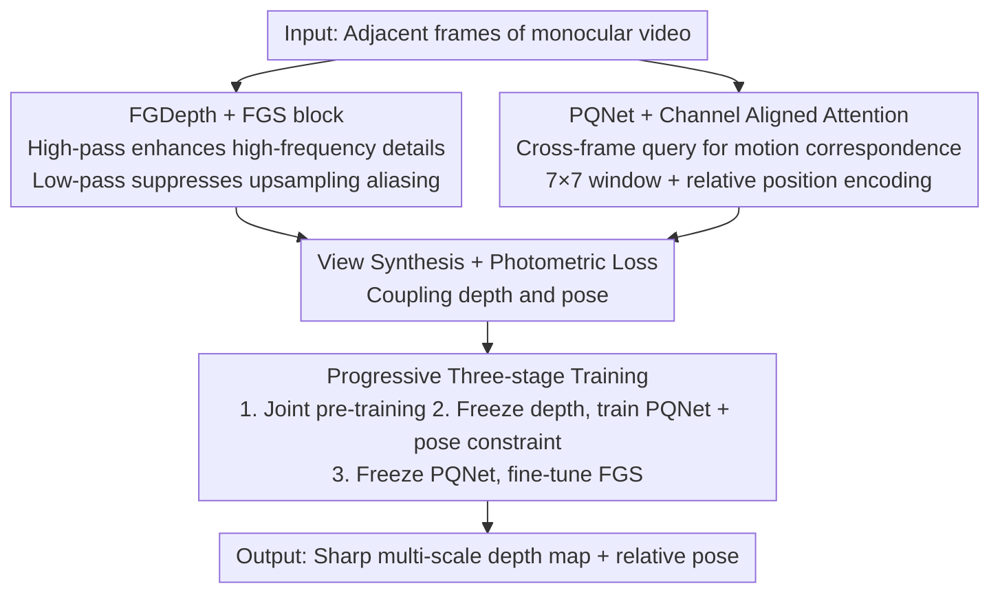

# Seeing Depth Through Frequency and Motion: A Progressive Training Paradigm for Monocular Depth Estimation

**Conference**: CVPR 2026  
**Paper**: [CVF Open Access](https://openaccess.thecvf.com/content/CVPR2026/html/Li_Seeing_Depth_Through_Frequency_and_Motion_A_Progressive_Training_Paradigm_CVPR_2026_paper.html)  
**Code**: https://github.com/ACoTAI/FGDepth  
**Area**: 3D Vision  
**Keywords**: Self-supervised monocular depth, frequency aliasing, frequency-guided sampling, pose estimation, progressive training

## TL;DR
Addressing the issues where blurred boundaries stem from downsampling frequency aliasing and PoseNets lack sufficient cross-frame motion modeling, this paper proposes the plug-and-play Frequency-Guided Sampling (FGS) module to preserve high-frequency details and the PoseQuery Network (PQNet) using channel-aligned attention for cross-frame motion modeling. Combined with a progressive three-stage decoupled training paradigm to maximize the complementarity between depth and pose, the method achieves a 4.1% reduction in Sq Rel compared to a strong baseline on KITTI.

## Background & Motivation

**Background**: Self-supervised monocular depth estimation (MDE) utilizes unlabeled monocular videos with image reconstruction as the supervisory signal, avoiding reliance on large-scale annotations and holding significant value for autonomous driving and AR. Recent progress has been driven by minimum reprojection losses, stronger architectures (Transformers, cost volumes), and multi-frame inference.

**Limitations of Prior Work**: Existing methods remain weak at recovering **fine-grained structures** (especially object boundaries and thin structures like poles), manifesting as "boundary bleeding" artifacts and loss of fine details. The authors attribute this to two factors: ① Downsampling operations in encoders-decoders introduce **frequency aliasing**—per the Nyquist-Shannon sampling theorem, high-frequency components (critical for edges and textures) are folded into low-frequency bands, making them unrecoverable during upsampling; ② Existing PoseNets typically fuse adjacent frames early in the network, limiting the ability to model cross-frame geometric correspondences.

**Key Challenge**: Depth and pose networks are inherently **complementary**—accurate poses can enhance depth prediction and vice versa—yet conventional practices employ **single-stage joint training**, leaving this complementarity largely unexploited and leading to training instability.

**Goal**: Design a depth network capable of preserving high-frequency structural details and a robust pose network for modeling cross-frame motion, paired with a training paradigm that fully releases their complementarity.

**Key Insight**: Approaching from a signal processing perspective—since boundary blurring is essentially frequency aliasing from downsampling, frequency-specific branching should be handled explicitly during sampling. Since pose assists depth, the two networks should be decoupled and optimized iteratively rather than simultaneously.

**Core Idea**: Use plug-and-play Frequency-Guided Sampling (FGS) with dual paths to enhance high frequencies and suppress aliasing; utilize PoseQuery with channel-aligned attention for cross-frame motion querying; and employ progressive three-stage training (equivalent to Block Coordinate Descent, BCD) for decoupled optimization of depth and pose.

## Method

### Overall Architecture
The framework consists of two core components and a training strategy: **FGDepth** (a frequency-aware depth network with FGS blocks embedded in the decoder) and **PQNet** (a pose network with channel-aligned attention). Input consists of adjacent frames from monocular video. FGDepth produces sharp depth maps, while PQNet estimates relative poses between frames, coupled via self-supervised photometric loss through view synthesis. Crucially, training is not a single joint process but a **progressive three-stage** strategy: initial joint pre-training, then freezing the depth network to train PQNet (with pose constraints), and finally freezing PQNet to fine-tune the FGS-equipped FGDepth, gradually releasing the complementary advantages of both networks.

### Key Designs

**1. Frequency-Guided Sampling (FGS) Block: Countering Downsampling Aliasing with Dual-path Frequency Processing**

While downsampling compresses features, it reduces spatial resolution and damages boundary sharpness and depth continuity. Based on the Nyquist-Shannon theorem, the authors attribute this to high-frequency detail aliasing into low frequencies. The FGS block is a plug-and-play, architecture-agnostic module that can be embedded into various encoder-decoder or Transformer depth networks, containing two complementary paths: ① The **high-pass enhancement path** recovers and re-injects lost high-frequency details from encoder features; ② The **low-pass filter path** suppresses aliasing artifacts during decoder upsampling. The high-frequency enhancement is formulated as:

$$w_{LP} = \mathrm{softmax}(\mathrm{Conv}_{3\times3}(F_{lr})), \quad w_{HP} = \mathbb{I} - w_{LP}, \quad F'_{hr} = w_{HP}\cdot F_{hr} + F_{hr}$$

where $F_{hr}, F_{lr}$ are high/low-resolution features, $w_{LP}$ is an adaptive low-pass kernel, and $\mathbb{I}$ is the identity kernel. The final frequency-guided reconstruction is a spectrum compensation mechanism—combining the "high-frequency compensation term $w_{HP}\cdot F_{hr}+F_{hr}$" and the "band-limited base $(w_{LP}\cdot F_{lr})\!\uparrow$ (upsampled)":

$$\hat{F}_{hr} = \underbrace{w_{HP}\cdot F_{hr} + F_{hr}}_{\text{High-frequency compensation}} + \underbrace{(w_{LP}\cdot F_{lr})\!\uparrow}_{\text{Band-limited base}}$$

This preserves low-frequency structural semantics while recovering fine structures like edges and textures. Compared to methods relying on Global Fourier Transforms, FGS addresses aliasing via efficient spatial domain filtering with lower latency. The FGDepth decoder uses FGS blocks before each upsampling step, with multi-scale heads outputting 1/8, 1/4, 1/2, and full-resolution depth maps.

**2. PQNet and Channel Aligned Attention (CAA): Modeling Fine-grained Motion via Cross-frame Querying**

Existing PoseNets fuse frames early, making it difficult to establish geometric correspondences. PQNet utilizes Channel Aligned Attention (CAA) for fine-grained spatial alignment between consecutive frames. A shared Pose Stem extracts features $f_t, f_s$ for target and source frames. The PoseQuery layer uses target frame features as queries to align the source frame:

$$Q_t = \mathrm{Proj}(f_t; W_Q), \quad K_s, V_s = \mathrm{Proj}(f_s; W_K, W_V), \quad \mathrm{CAA}_{t\to s} = \mathrm{Softmax}\!\left(\frac{Q_t K_s^T}{\sqrt{d}} + B_E\right)V_s$$

where $B_E$ is a learnable relative spatial position encoding. All projections are **channel-shared** to ensure semantic consistency. Self-attention $SA_t, SA_s$ is calculated in parallel, and fusion is performed using lightweight channel attention: $f_{t\to s} = \mathrm{CAFuse}([SA_t, \mathrm{CAA}_{t\to s}, SA_s])$. To reduce complexity, features are partitioned into non-overlapping $7\times7$ windows where CAA and SA are computed before being reassembled and fed into the Pose Trunk for refinement and the Pose Head for relative pose regression.

**3. Progressive Three-stage Decoupled Training: Exhausting Complementarity**

The authors observe that more accurate poses improve depth and vice versa, leading to a decoupled optimization strategy. **Stage One** follows standard self-supervised MDE: using view synthesis from source $I_s$ to target $I_t$ as a proxy task, minimizing photometric loss $L_p = (1-\alpha)\lvert I_t - \hat{I}_{s\to t}\rvert + \alpha\frac{1-\mathrm{SSIM}(I_t,\hat{I}_{s\to t})}{2}$. **Stage Two** freezes the pre-trained depth network to train PQNet alone, adding an **inverse pose constraint** based on the $SE(3)$ Lie group—forcing forward/backward poses between adjacent frames to be approximately inverse:

$$L_{pose} = \lVert R_{t\to s} R_{s\to t} - I\rVert_1 + \lVert R_{s\to t}\, t_{t\to s} + t_{s\to t}\rVert_2$$

Rotation uses L1 for noise robustness, while translation uses L2 to encourage smooth regression. **Stage Three** replaces upsampling blocks in the depth network with FGS blocks, using other pre-trained parameters for initialization. PQNet is frozen while only modules involving FGS are trained, focusing on recovering edges/textures from high-frequency cues. Theoretically, this decoupled optimization corresponds to **non-convex inexact Block Coordinate Descent (BCD)**, ensuring stable convergence.

### Loss & Training
Photometric loss (including SSIM) is used throughout. Stage Two adds the $SE(3)$ inverse pose loss. Experiments are conducted on the KITTI Eigen split (39,810 training triplets, 4,424 validation, 697 test). Inputs are resized to $640\times192$. Hyperparameters follow the MonoViT baseline, using 2×RTX 3090 and PyTorch 1.9.0.

## Key Experimental Results

### Main Results
KITTI Eigen split ($640\times192$) monocular training setting, with standard median scaling:

| Method | Abs Rel ↓ | Sq Rel ↓ | RMSE ↓ | δ<1.25 ↑ |
|------|-----------|----------|--------|----------|
| Monodepth2 [10] | 0.115 | 0.903 | 4.863 | 0.877 |
| MonoViT [39] (Baseline) | 0.099 | 0.708 | 4.372 | 0.900 |
| GeoDepth [31] | 0.100 | 0.694 | 4.381 | 0.897 |
| Gao et al. [8] | 0.097 | 0.692 | 4.373 | 0.900 |
| **FGDepth (Ours)** | **0.096** | **0.679** | **4.303** | **0.902** |

FGDepth achieves SOTA performance across all metrics, reducing Sq Rel by 4.1% (0.708→0.679) and RMSE by 1.6% compared to the MonoViT baseline. In **zero-shot** generalization on Make3D, it achieves Sq Rel 2.627 / RMSE 6.500 / Abs Rel 0.283, outperforming all self-supervised methods.

### Ablation Study
Ablation of components and training strategies on KITTI (progressive addition of components under joint training, followed by comparison of training paradigms using the full model):

| Dimension | Configuration | Abs Rel ↓ | Sq Rel ↓ | RMSE ↓ |
|------|------|-----------|----------|--------|
| Component | Baseline (Joint) | 0.102 | 0.727 | 4.428 |
| Component | + FGDepth | 0.098 | 0.712 | 4.363 |
| Component | + PQNet | 0.099 | 0.723 | 4.399 |
| Component | + Both | 0.098 | 0.704 | 4.338 |
| Training | Batch (Alter per batch) | 0.117 | 0.819 | 4.448 |
| Training | Epoch (Alter per epoch) | 0.098 | 0.710 | 4.381 |
| Training | **Stage (Ours Three-stage)** | **0.096** | **0.679** | **4.303** |

### Key Findings
- **Pose networks facilitate depth**: Adding PQNet alone reduced depth Abs Rel from 0.102 to 0.099, confirming the hypothesis that accurate poses back-propagate benefits to depth through joint optimization.
- **Training paradigm is a critical variable**: Using the same FGDepth+PQNet, alternating per batch (Batch, similar to GANs) performed worst (Sq Rel 0.819) as frequent alternation disrupted learning dynamics. Alternating per epoch (Epoch, 0.710) was better but remained inferior to joint training. The progressive three-stage strategy (Stage, 0.679) was significantly optimal, reducing Sq Rel by 3.55% over standard joint training.
- **FGS block gains for thin structures**: Without FGS, predictions were overly smooth with blurred contours; with FGS, thin/complex structures like poles, pedestrians, and vegetation were significantly sharper, showing a more balanced high-frequency response.

## Highlights & Insights
- **Re-diagnosing "Boundary Blurring" via Nyquist-Shannon**: Attributing a phenomenon previously viewed as a capacity or loss issue to frequency aliasing provides a clear, actionable signal processing perspective.
- **Plug-and-play FGS Block**: The dual-path (High-pass enhancement + Low-pass aliasing suppression) design is backbone-agnostic and serves as a reusable "anti-aliasing sampling" component.
- **Mapping Three-stage Training to BCD**: Providing a theoretical anchor (Block Coordinate Descent) explains why decoupled alternation is more stable than joint training and identifies the granularity of alternation as the key to convergence.
- **SE(3) Reciprocal Pose Constraint**: Using the geometric prior that forward and backward poses should be inverse serves as a physically interpretable regulator that enhances temporal consistency.

## Limitations & Future Work
- Evaluation is limited to KITTI (driving) and Make3D; generalization to indoor or handheld scenarios with large motion/weak texture remains unproven.
- While stable, the three-stage training extends the pipeline (Joint → Freeze Depth/Train Pose → Freeze Pose/Train FGS), increasing engineering complexity and scheduling costs compared to joint training.
- Detailed mathematical derivations for BCD convergence are provided in the supplementary material; the main text provides only the conclusion.
- FGS relies on $3\times3$ convolutions for adaptive kernels; its robustness in extreme high-frequency textures or motion-blurred scenes requires further analysis.

## Related Work & Insights
- **vs MonoViT [39] (Baseline)**: Using the same backbone, this work leverages FGS anti-aliasing, PQNet motion modeling, and three-stage training to suppress Sq Rel from 0.708 to 0.679, primarily winning on boundary sharpness.
- **vs Fourier Domain Methods [13]/[4]**: Such methods rely on global frequency transforms or high-frequency photometric losses, which are computationally heavy; FGS uses spatial domain filtering for lower latency.
- **vs Multi-stage Training (Uncertainty [19], Consistency [18])**: Earlier works often ignored reliable motion cues; this work explicitly integrates "accurate pose feeds depth" into a three-stage decoupling with BCD theoretical support.

## Rating
- Novelty: ⭐⭐⭐⭐ Combination of aliasing diagnosis, FGS dual-path sampling, and three-stage BCD training is novel, though individual components have precedents.
- Experimental Thoroughness: ⭐⭐⭐⭐ Solid results on KITTI SOTA and Make3D zero-shot, though the dataset scope is limited to driving.
- Writing Quality: ⭐⭐⭐⭐ Clear motivation from sampling theorem to BCD; ablation comparisons (Batch/Epoch/Stage) are highly persuasive.
- Value: ⭐⭐⭐⭐ FGS is plug-and-play with direct value for boundary accuracy in autonomous driving; training paradigm insights are transferable.

<!-- RELATED:START -->

## Related Papers

- [\[CVPR 2026\] DepthFocus: Controllable Depth Estimation for See-Through Scenes](depthfocus_controllable_depth_estimation_for_see-through_scenes.md)
- [\[CVPR 2026\] MD2E: Modeling Depth-to-Edge Cues for Monocular Metric Depth Estimation](md2e_modeling_depth-to-edge_cues_for_monocular_metric_depth_estimation.md)
- [\[CVPR 2026\] Depth Hypothesis Guided Iterative Refinement for Event-Image Monocular Depth Estimation](depth_hypothesis_guided_iterative_refinement_for_event-image_monocular_depth_est.md)
- [\[ICCV 2025\] Depth AnyEvent: A Cross-Modal Distillation Paradigm for Event-Based Monocular Depth Estimation](../../ICCV2025/3d_vision/depth_anyevent_a_cross-modal_distillation_paradigm_for_event-based_monocular_dep.md)
- [\[CVPR 2026\] Iris: Integrating Language into Diffusion-based Monocular Depth Estimation](iris_integrating_language_into_diffusion-based_monocular_depth_estimation.md)

<!-- RELATED:END -->
