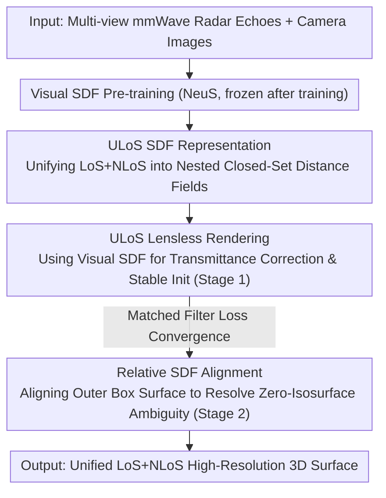

# Seeing through boxes: Non-Line-of-Sight 3D Reconstruction from Radar Signals

**Conference**: CVPR 2026  
**Paper**: [CVF Open Access](https://openaccess.thecvf.com/content/CVPR2026/html/Lu_Seeing_through_boxes_Non-Line-of-Sight_3D_Reconstruction_from_Radar_Signals_CVPR_2026_paper.html)  
**Code**: To be confirmed  
**Area**: 3D Vision  
**Keywords**: Non-line-of-sight reconstruction, RF/Radar imaging, Neural implicit surfaces, Signed Distance Field (SDF), Visual priors  

## TL;DR
Addressing the issues of high reconstruction noise, training instability, and surface position ambiguity when millimeter-wave (mmWave) radar "sees through boxes to reconstruct interior objects," this paper proposes GeRaF 2.0. It unifies line-of-sight (LoS) geometry outside the box and non-line-of-sight (NLoS) geometry inside into a Unified LoS (ULoS) Signed Distance Field. By using a visually pre-trained SDF for stable initialization and employing two-stage training with Relative SDF alignment to lock the surface precisely on the zero-isosurface, it achieves a new Prev. SOTA in RF-based 3D reconstruction.

## Background & Motivation

**Background**: Radio Frequency (RF) signals can penetrate occlusions such as cardboard boxes and fabrics, making them one of the few sensing modalities capable of "seeing hidden objects." This is highly valuable for applications like robotic grasping of items inside boxes and smart home perception of occluded areas. Recent approaches have adapted neural implicit reconstruction (similar to NeRF/NeuS) to the RF domain, using a differentiable physical rendering model to fit radar echoes and continuously represent scene geometry.

**Limitations of Prior Work**: RF is a "lensless imaging" modality—each antenna receives echoes from the entire scene, resulting in extremely low spatial resolution and high noise. Furthermore, surfaces like metal exhibit specular reflection, leading to large missing surface areas. The authors' previous work, GeRaF, handled occlusions crudely by cropping the occluder (the box) from the radar map and treating it as non-existent. However, the assumption that "signals passing through the box wall are entirely unaffected" is incorrect, as signals undergo partial reflection and attenuation.

**Key Challenge**: Ignoring LoS box-wall geometry leads to three cascading problems: (1) Visible reflections from the box wall "leak" into the hidden region, manifesting as noise (e.g., the "rabbit" model in the paper develops a strange "hat" due to the box); (2) Training is unstable, as different box shapes/sizes alter the optimization surface, sometimes preventing convergence; (3) Surface ambiguity occurs because box geometry affects signal intensity reaching the NLoS region, making it impossible to normalize signals and determine the true zero-isosurface of the SDF (reconstructed surfaces may shift by several centimeters). In contrast, pure visual reconstruction is stable and accurate but cannot see inside boxes.

**Goal**: Can stable and accurate visible information from outside the box be used to guide low-resolution, high-noise invisible RF reconstruction inside the box?

**Key Insight**: The authors observe a critical fact—in the free space outside the box (LoS region), the SDF trained via vision and the distance field trained via RF should yield identical values. This provides a natural interface to "inject" visual priors into the RF neural field.

**Core Idea**: Unify LoS and NLoS into a single Signed Distance Field (ULoS SDF). Use a visually pre-trained SDF to provide initialization and rendering correction for RF reconstruction, followed by two-stage training and Relative SDF alignment to lock the zero-isosurface precisely.

## Method

### Overall Architecture
The input to GeRaF 2.0 consists of multi-view echoes collected by a 77 GHz mmWave radar mounted on a robotic arm, along with multi-view camera images of the same scene. The output is a unified high-resolution 3D surface covering both LoS (box walls) and NLoS (interior objects). The pipeline first reconstructs and freezes the exterior surface using pure vision. This stable visual SDF is then treated as a physical prior throughout the RF reconstruction. Finally, optimization proceeds in two stages: Stage 1 allows RF reconstruction to converge stably under the guidance of the visual prior, and Stage 2 uses Relative SDF alignment to resolve surface position ambiguity, snapping the surface to the $SDF=0$ position.

### Key Designs

**1. ULoS Unified SDF: Transforming "Inside/Outside" Binary Semantics into Nested Closed Sets for Multi-layer Penetration**

Visual SDFs use signs to strictly distinguish the interior and exterior of an object. However, RF signals treat a box wall as "semi-transparent," making traditional "inside/outside" concepts fail for multi-layer structures. This paper models the scene as a series of nested, closed, and compact sets $M_n \subset \mathrm{int}(M_{n-1}) \subset \cdots \subset \mathrm{int}(M_1) \subset \mathrm{int}(\Omega_{\mathrm{ULoS}})$, defining the ULoS SDF $f_r$ accordingly. The sign is determined by "RF interaction strength" rather than geometric interior: high interaction regions (cardboard, metal) are assigned negative values, while weak interaction regions (air) are positive. The distance for each region is the minimum Euclidean distance to its two nearest boundaries: $f(\mathbf{x}) = \mathrm{sign}(f(\mathbf{x}))\min(d(\mathbf{x},\partial M_i),\, d(\mathbf{x},\partial M_{i+1}))$. This preserves geometric continuity while providing a physically meaningful sign for each medium layer, enabling a single neural field to optimize box walls and internal objects consistently and suppressing artifacts caused by LoS reflection leaks.

**2. ULoS Lensless Rendering: Visual Pre-trained SDF for Transmittance Correction and Stable Initialization**

In lensless rendering, cumulative transmittance $T(u')$ along a ray requires correcting sigmoid-SDF values at scene boundaries: $T(u') = T(u) - \Phi_s(f(\mathbf{x}(u_s))) + \Phi_s(f(\mathbf{x}(u'_s)))$. These correction terms are computationally expensive, often discarded in backpropagation, and suffer from significant bias during initialization, leading to severe transmittance distortion—critical in NLoS scenarios where signal visibility is already poor. Utilizing the observation that in the exterior region $R_{0,1}$, the visual SDF and RF ULoS SDF are identical $f_v(\mathbf{x}) = f_r(\mathbf{x})$, the authors use the well-converged visual pre-trained SDF for transmittance correction and stable initialization of the ULoS SDF. This replaces reliance on the unreliable, currently training RF model, resulting in faster convergence and more consistent reconstruction.

**3. Relative SDF Alignment + Two-Stage Training: Locking "Surface Ambiguity" to the Correct Zero-Isosurface**

Even with the above steps, the reconstructed surface may deviate globally from the SDF zero-isosurface because radar signal intensity cannot be pre-normalized to $[0,1]$ like RGB. Reflectivity, predicted signal power, and the SDF zero-isosurface are intertwined, preventing the network from uniquely determining the correct surface. The authors introduce the Relative SDF (RSDF) $g_r$, which differs from the true SDF only by an unknown constant, meaning gradients are identical everywhere: $\nabla f = \nabla g$. The paper proves that if two scalar field gradients are equal everywhere and their values match on a closed surface $S$, they are identical across the entire connected domain. Thus, aligning the RSDF to the visual SDF on a reference closed surface outside the box (the outer box surface $\partial M_1$) propagates the alignment to the interior. The alignment loss is defined as $\mathcal{L}_{\mathrm{RSDF}} = \mathbb{E}_{\mathbf{x}\in\partial M_1}[\,|g_r(\mathbf{x}) - f_v(\mathbf{x})|\,]$, implemented as supervision of expected depth along the primary ray: $d = \int_0^\infty u\,\rho(u)\,T(u)\,du$. Training is split into two stages: Stage 1 freezes the reflectivity network (output fixed at 1.0) and uses a Matched Filter loss $\mathcal{L}=\mathcal{L}_{\mathrm{MF}}+\lambda_{\mathrm{GRAD}}\mathcal{L}_{\mathrm{GRAD}}$ (including Eikonal regularization) to stabilize geometry. Stage 2 unfreezes all networks and adds RSDF alignment $\mathcal{L}=\mathcal{L}_{\mathrm{MF}}+\lambda_{\mathrm{GRAD}}\mathcal{L}_{\mathrm{GRAD}}+\lambda_{\mathrm{RSDF}}\mathcal{L}_{\mathrm{RSDF}}$, leveraging the stable initialization from Stage 1.

### Loss & Training
Two-stage optimization: Stage 1 objective is $\mathcal{L}_{\mathrm{MF}} + \lambda_{\mathrm{GRAD}}\mathcal{L}_{\mathrm{GRAD}}$, where the Matched Filter loss (calculated between predicted and ground-truth MF power distributions) suppresses noise and the Eikonal term ensures a valid SDF. Stage 2 adds $\lambda_{\mathrm{RSDF}}\mathcal{L}_{\mathrm{RSDF}}$ for surface alignment. Training runs for 100,000 iterations over approximately 48 hours on a single NVIDIA H100.

## Key Experimental Results

The dataset was collected using a Franka Research 3 robotic arm and a TI AWR1843BOOST radar. Objects were placed on a 360° turntable with frames captured every 10°. Ground truth was obtained via Scaniverse scanning. Quantitative metrics include F1-Score (threshold $\tau=0.015$) and Chamfer Distance (mm), with the box cropped from the point cloud during evaluation.

### Main Results
Three baseline categories were compared: pure visual NeuS, Matched Filter (MF) imaging, and the predecessor NLoS reconstruction GeRaF. The table below summarizes differences in the requirement for manual surface layer selection $g_r$, which reflects whether surface ambiguity is resolved:

| Method | Modality | 360° Hidden Reconstruction | Surface Zero-Isosurface $g_r$ |
|------|------|----------------------|--------------------|
| NeuS | Visual | No (Cannot see inside) | Automatic $g_r=0$ |
| Matched Filter | RF Point Cloud | Coarse, requires thresholding | Manual selection required |
| GeRaF (Prev. SOTA) | RF | Yes, but with artifacts | Manual selection required (5–95 mm offset) |
| GeRaF 2.0 Stage 1 | RF + Visual | Yes, clean | Manual selection still required |
| GeRaF 2.0 Stage 2 | RF + Visual | Yes, clean and detailed | Automatic $g_r=0$ (All objects) |

Key difference: Stage 2 of GeRaF 2.0 benefits from RSDF alignment, allowing precise surface extraction directly at the SDF zero-isosurface. This achievement—eliminating manual thresholding while preserving details like elephant tusks, rooster combs, antlers, and spherical tops—is beyond the capability of all baselines.

### Ablation Study
Ablation was conducted on the RSDF alignment weight $\lambda_{\mathrm{RSDF}}$:

| Configuration | Surface relative to Zero-Isosurface | Description |
|------|------------------|------|
| Stage 1 (No Alignment) | Significant Offset | Surface globally deviates from SDF zero-isosurface |
| $\lambda_{\mathrm{RSDF}}=0$ | Significant Offset | Equivalent to no alignment; ambiguity remains |
| $\lambda_{\mathrm{RSDF}}=0.5$ | Gradual Convergence | Surface moves toward the correct zero-isosurface |
| $\lambda_{\mathrm{RSDF}}=1.0$ | Locked at $g_r=0$ | Ambiguity resolved; surface is correct |

### Key Findings
- RSDF alignment is the critical switch for solving "surface ambiguity": as $\lambda_{\mathrm{RSDF}}$ increases from 0 to 1.0, the surface moves from a large offset to the correct zero-isosurface, validating the proposition that alignment on an exterior reference surface propagates interiorly.
- Robustness: Reconstruction geometry shows almost no degradation when the box is filled with bubble wrap (extra scattering layers). In nested dual-box scenarios, the SDF clearly distinguishes concentric walls and internal objects.
- Role of visual prior: Its primary contribution is "stability"—it rescues RF training from non-convergence and noise leakage, making the detail recovery in Stage 2 possible.

## Highlights & Insights
- **Using "Stable LoS Vision" to save "Noisy NLoS RF"**: The method exploits the physical fact that both SDFs match in the LoS region, treating the visual prior as an initialization and rendering correction interface rather than simple feature concatenation.
- **Mathematizing surface ambiguity as a provable propagation problem**: Aligning RSDF on a single exterior reference surface ensures global identity. This is simplified to depth supervision along primary rays, making it both stable and efficient.
- **Redefining Signed Semantics**: Changing the SDF sign from "geometric interior" to "RF interaction strength" is a key step for multi-layer penetration, applicable to other penetrative modalities like Terahertz or Ultrasound.

## Limitations & Future Work
- Limited evaluation scale: Tested on a single radar hardware setup with turntable acquisition and Scaniverse ground truth. Large-scale or outdoor validation is missing.
- Interior surfaces degrade under nested layers or high-scattering fillers, indicating an upper bound for complex occlusions.
- Dependence on available multi-view visual reconstruction (NeuS) for priors; if the exterior is hard to reconstruct (specular/transparent boxes), the prior fails.
- High training cost (48 hours / 100k iterations on H100), far from real-time robotic perception.

## Related Work & Insights
- **vs GeRaF (Prev. SOTA)**: The predecessor cropped occluders and treated LoS/NLoS equally, leading to reflection leaks and surface offsets. Ours explicitly models occlusion interaction via Unified ULoS SDF and RSDF alignment.
- **vs mmNorm**: mmNorm estimates normal fields for NLoS reconstruction but is limited to single-view (front) and still crops occlusions. Ours performs 360° reconstruction using exterior geometry.
- **vs Pure Visual NeuS/NeRF**: Visual methods are stable but cannot see through occlusions; Ours grafts visual stability onto RF penetration.
- **vs RadarSim/Radar-Visual Fusion**: Most existing fusion focuses on autonomous driving detection or LoS geometry synthesis. Ours uses joint observation specifically for NLoS high-resolution reconstruction.

## Rating
- Novelty: ⭐⭐⭐⭐⭐ First work to use visual LoS modalities to enhance RF NLoS high-resolution reconstruction, mathematizing surface ambiguity as a provable alignment problem.
- Experimental Thoroughness: ⭐⭐⭐☆☆ Qualitative results and ablations are solid, but quantitative tables for individual objects are missing from the summary, and the hardware/scene diversity is limited.
- Writing Quality: ⭐⭐⭐⭐☆ Clear physical modeling and proposition derivation. The framework progression is logical.
- Value: ⭐⭐⭐⭐☆ Establishes a paradigm of "visual priors stabilizing RF" for neural implicit reconstruction in penetrative sensing.

<!-- RELATED:START -->

## Related Papers

- [\[CVPR 2026\] X-band Radar Non-Line-of-Sight Imaging](x-band_radar_non-line-of-sight_imaging.md)
- [\[CVPR 2026\] DENALI: A Dataset Enabling Non-Line-of-Sight Spatial Reasoning with Low-Cost LiDARs](denali_a_dataset_enabling_non-line-of-sight_spatial_reasoning_with_low-cost_lida.md)
- [\[CVPR 2026\] Seeing Depth Through Frequency and Motion: A Progressive Training Paradigm for Monocular Depth Estimation](seeing_depth_through_frequency_and_motion_a_progressive_training_paradigm_for_mo.md)
- [\[CVPR 2026\] Seeing through Light and Darkness: Sensor-Physics Grounded Deblurring HDR NeRF from Single-Exposure Images and Events](seeing_through_light_and_darkness_sensor-physics_grounded_deblurring_hdr_nerf_fr.md)
- [\[CVPR 2026\] LocateAnything3D: Vision-Language 3D Detection with Chain-of-Sight](locateanything3d_vision-language_3d_detection_with_chain-of-sight.md)

<!-- RELATED:END -->
