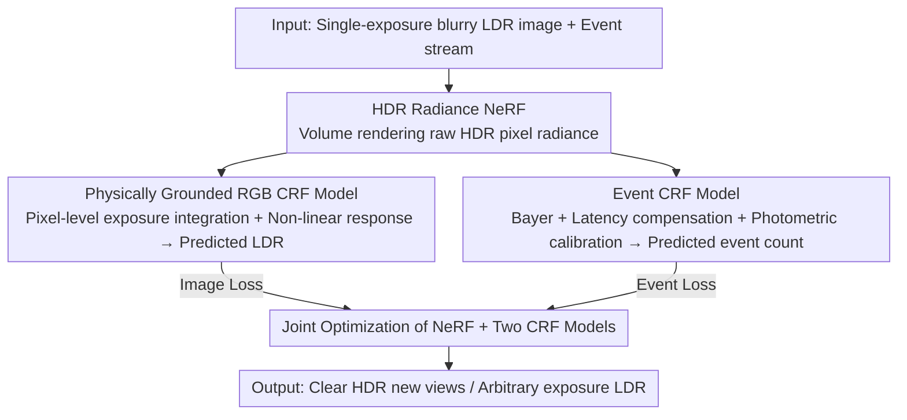

# Seeing through Light and Darkness: Sensor-Physics Grounded Deblurring HDR NeRF from Single-Exposure Images and Events

**Conference**: CVPR 2026  
**Paper**: [CVF Open Access](https://openaccess.thecvf.com/content/CVPR2026/html/Qi_Seeing_through_Light_and_Darkness_Sensor-Physics_Grounded_Deblurring_HDR_NeRF_CVPR_2026_paper.html)  
**Code**: https://github.com/iCVTEAM/See-NeRF  
**Area**: 3D Vision  
**Keywords**: NeRF, High Dynamic Range, Deblurring New View Synthesis, Event Camera, Camera Response Function  

## TL;DR
To address the mismatch between sensor output and physical radiance when reconstructing clear High Dynamic Range (HDR) 3D representations from "single-exposure blurry Low Dynamic Range (LDR) images + event streams," this paper proposes See-NeRF. It directly represents the scene's true HDR radiance using NeRF and explicitly models the "physical radiance → sensor measurement" process through a pixel-level RGB CRF model and a latency-aware, photometrically calibrated event CRF model. The three components are jointly optimized to achieve SOTA deblurring and HDR new-view synthesis results under extreme lighting conditions.

## Background & Motivation

**Background**: NeRF / 3DGS can achieve high-fidelity New View Synthesis (NVS) with ideal clear LDR image inputs. However, real-world outdoor images often suffer from two simultaneous issues: extreme lighting (coexistence of highlights and shadows) and camera motion blur. The root cause is the loss of information in blurred, compressed 8-bit LDR images (overexposure saturation at 255, underexposure clipping at 0).

**Limitations of Prior Work**: Image-based methods rely on multi-exposure LDR for dynamic range and modeling camera motion for deblurring, but these require cumbersome multi-exposure shooting or fail under severe long-exposure blur. Event cameras are a strong complement—they record brightness changes asynchronously in the logarithmic domain, naturally preserving high temporal resolution (compensating for temporal blur) and high dynamic range (compensating for spatial radiance differences). Recently, works using "Events + RGB" (ERGB) for deblurring NVS have emerged, with EvHDR-NeRF being the first to introduce events into single-exposure HDR deblurring NeRF.

**Key Challenge**: However, these ERGB methods lack a critical component—they are not grounded in the mismatch between "sensor output vs. physical scene radiance." EvHDR-NeRF largely follows the tone-mapping strategy of HDR-NeRF, directly applying the Camera Response Function (CRF) to 3D points and crudely extending it to the event setting without considering the event generation mechanism. This results in rendered outputs that do not align with supervision signals derived from input images and events, weakening geometry and appearance learning (leading to color shifts and residual blur).

**Goal**: In an ERGB setting, explicitly model how "scene radiance transforms into sensor measurements through device-specific processes"—exposure time integration plus non-linear CRF for RGB cameras; contrast thresholds, latency effects, and photometric quantization for event cameras.

**Key Insight**: The authors argue that physically consistent 3D representation learning cannot simply repurpose image-based frameworks. Instead, NeRF should focus on learning the true radiance of the scene in the HDR domain, while two differentiable CRF models "translate" this radiance into respective sensor measurements to align predictions with supervision.

**Core Idea**: A joint optimization of an HDR radiance NeRF, a physically grounded RGB CRF model, and a latency-aware, photometrically calibrated event CRF model. This uses events to compensate for scene dynamics and learns clear HDR 3D representations from single-exposure blurry LDR inputs.

## Method

### Overall Architecture
The input to See-NeRF is a single-exposure blurry LDR image and the corresponding event stream; the output is clear HDR new-view images (and LDR images at arbitrary exposures). The core mechanism is decoupling "reconstructing 3D geometry/radiance" from "simulating sensor imaging." The NeRF network $F_\theta$ is responsible only for learning the true radiance $\mathbf{e}$ and density $\sigma$ in the HDR domain. Volume rendering simulates HDR scene rays hitting sensor pixels to obtain raw HDR pixel radiance. Subsequently, two CRF models translate this raw radiance into LDR pixel values for the RGB camera and event counts for the event camera. NeRF and the two CRF models are then jointly optimized using image and event losses.

### Key Designs

**1. HDR Domain Radiance NeRF Representation: Learning True Radiance instead of Camera-Processed LDR**

Original NeRF learns camera-processed LDR radiance, which "hard-codes" sensor non-linear response and dynamic range compression into the 3D representation, making it impossible to recover HDR and clear geometry. In this work, the NeRF $F_\theta$ directly outputs the true radiance $\mathbf{e}$ and density $\sigma$ of 3D points in extreme lighting scenes: $(\mathbf{e}, \sigma) = F_\theta(\gamma_o(\mathbf{o}), \gamma_d(\mathbf{d}))$. Volume rendering then simulates potential clear HDR radiance $E(x,y,p(t)) = \sum_i T_i(1-\exp(-\sigma_i\delta_i))\mathbf{e}_i$ hitting pixel $(x,y)$ under camera pose $p(t)$. NeRF only cares about "how bright the scene actually is," leaving the "dirty work" of sensor measurement to the CRF models, which is the prerequisite for the grounded framework.

**2. Physically Grounded Pixel-level RGB CRF Model: Applying CRF after Volume Rendering and at the Pixel Level**

Methods like HDR-NeRF apply tone-mapping CRFs directly to the radiance $\mathbf{e}$ of each 3D point, which does not match real imaging—real cameras integrate radiance over an exposure interval before passing it through a non-linear CRF. This work follows the physical process: first, sample $b+1$ time points within the exposure interval $[t_{\text{start}}, t_{\text{end}}]$ and synthesize the raw HDR pixel value $\hat{\mathcal{I}}_{\text{HDR}}(x,y) = \sum_{i=0}^{b} w_i E_i(x,y,p(t_i))$ (incorporating a more physical blur synthesis). Then, use one MLP $f_{\text{crf}}$ per of the three channels to fit the CRF in the log domain to get the predicted LDR: $\hat{\mathcal{I}}_{\text{LDR}}(x,y) = f_{\text{crf}}(\ln(\hat{\mathcal{I}}_{\text{HDR}}(x,y)\,\Delta t_{\text{exp}}))$. Placing the CRF at the pixel level after volume rendering allows $f_{\text{crf}}$ to focus on non-linear tone mapping without interference from linear volume rendering, while NeRF focuses on density and radiance—this decoupling is why it significantly outperforms 3D point-level CRFs.

**3. Latency-aware, Photometrically Calibrated Event CRF Model: Correcting the Ideal Event Model for Real Sensors**

The ideal event model counts crossings of log-brightness thresholds $B(t_1,t_2,x,y) = \text{floor}((\ln L(t_2) - \ln L(t_1))/\Theta)$. However, real events exhibit significant latency in dark regions, and fixed thresholds $\Theta$ lead to a lower bound on measurable changes, causing radiance estimation errors. The Event CRF model corrects this in three steps: (a) **Bayer Pattern Adaptation**—feeding three-channel scene radiance into an RGGB Bayer array to obtain pixel radiance $E_{\text{ev}}$ for the event sensor; (b) **Time Latency Compensation**—latency depends on pixel radiance; an MLP $f_{\text{ev}}$ estimates the latency coefficient $\epsilon_i = f_{\text{ev}}(E_{\text{ev}}(\cdot))$, and 2nd-order low-pass filtering synthesizes delayed radiance $L^i_{\text{lp}} = (1-\epsilon_i)L^{i-1}_{\text{lp}} + \epsilon_i E_{\text{ev}}(p(t_i))$ for the event model $\hat{B}'$; (c) **Photometric Quantization Calibration**—since event acquisition is uncertain when brightness changes are below the threshold, and sampling points may not align with timestamps, $h(\cdot)$ is used to estimate and subtract an offset: $\hat{B}(t_i,t_{i+1}) = \hat{B}'(t_i,t_{i+1}) - h(B(t_i,t_{i+1}))$. Together, these bridge the gap between "physical radiance dynamics → real event generation."

### Loss & Training
Image loss $\mathcal{L}_{\text{ldr}} = \sum_{(x,y)}\|\hat{\mathcal{I}}_{\text{LDR}} - \mathcal{I}_{\text{LDR}}\|_2^2$ and event loss $\mathcal{L}_{\text{evs}} = \sum_{(x,y)}\sum_i \|\hat{B}(t_i,t_{i+1}) - B(t_i,t_{i+1})\|_2^2$ jointly supervise the NeRF and the two CRF models. Total loss $\mathcal{L} = \lambda\mathcal{L}_{\text{evs}} + \mathcal{L}_{\text{ldr}}$ with $\lambda=0.005$. Intra-exposure sampling points $b=4$ (a trade-off between performance and training time). Both coarse and fine networks are optimized. At test time, Eq.(6) produces clear HDR images, and Eq.(7) produces LDR images at arbitrary exposures.

## Key Experimental Results

Experiments used a self-built synthetic dataset (8 Blender scenes from HDR-NeRF, generated blurry images and events using Blender + v2e), a real dataset (5 extreme lighting scenes, captured by handheld DAVIS 346 event camera), and the public Real-World-Challenge dataset for deblurring evaluation. Metrics include PSNR / SSIM / LPIPS; for HDR tasks, both generated and ground truth HDR are tone-mapped to the LDR domain for evaluation.

### Main Results (HDR NVS, PSNR↑/SSIM↑/LPIPS↓)
See-NeRF leads significantly on both synthetic and real data. On real data HDR, it even outperforms the reference method HDR-NeRFref which uses multi-exposure inputs:

| Data/Task | Metric | EvHDR-NeRF (Runner-up) | See-NeRF | Gain |
|-----------|------|--------------------|----------|------|
| Synth HDR | PSNR | 21.73 | 24.13 | +2.40 |
| Synth HDR | LPIPS | .3446 | .1916 | Better |
| Real HDR | PSNR | 19.00 | 26.49 | +7.49 |
| Real HDR | LPIPS | .2612 | .1638 | Better |
| Synth New Exp | PSNR | 24.37 | 27.57 | +3.20 |

It also achieves the best results on the public Real-World-Challenge deblurring NVS:

| Method | PSNR↑ | SSIM↑ | LPIPS↓ |
|------|-------|-------|--------|
| DP-NeRF (Best RGB) | 28.85 | .9226 | .3015 |
| E3NeRF (Best ERGB) | 31.40 | .9464 | .2000 |
| EvHDR-NeRF | 27.19 | .8960 | .3731 |
| **See-NeRF** | **32.70** | **.9564** | **.1574** |

### Ablation Study (HDR / Deblurring, Key Configurations)
| Config | Change | Real HDR PSNR↑ | Real-Challenge LPIPS↓ |
|------|------|----------------|------------------------|
| See-NeRF (Full) | — | Best | .1574 |
| See-NeRF3D | RGB CRF to 3D point CRF | 24.95 | .1634 |
| See-NeRFNoEM | Event CRF to naive model | 25.87 | .1686 |
| See-NeRFEvD | Event CRF to EvDeblur-NeRF eCRF | 16.43 | .2776 |
| See-NeRFNoEv | Remove event input | 19.84 | .2425 |

### Key Findings
- **Event inputs are critical for HDR and deblurring**: Removing events (NoEv) drops Real HDR PSNR from 26+ to 19.84, and the CRF curve deviates significantly from the ground truth. This validates that "spatial differences of events extend dynamic range, and temporal differences estimate potential clear radiance."
- **Pixel-level RGB CRF is superior to 3D point CRF**: Replacing the pixel-level CRF with the 3D point CRF used in HDR-NeRF (See-NeRF3D) degrades both HDR and deblurring performance, showing the value of placing the CRF after volume rendering.
- **Event CRF refinements provide subtle but necessary gains**: Replacing it with a naive model (NoEM) or other eCRFs (EvD, where PSNR plummeted to 16.43) worsens CRF alignment, proving latency compensation and photometric calibration are vital for events in dark regions or near thresholds.

## Highlights & Insights
- **Sensor physics as a first-class citizen**: Instead of forcing NeRF to learn both geometry and camera response, this work explicitly separates "Radiance → RGB measurement" and "Radiance → Event measurement" into two differentiable pipelines. This decoupling allows NeRF to focus on true radiance and CRF to focus on non-linear response, ensuring supervision matches the physical process.
- **Minor change, Major gain (Pixel-level vs. Point-level CRF)**: Moving the CRF from 3D points to pixels after volume rendering seems like a detail, but it prevents interference between tone mapping and linear volume rendering, acting as a key performance differentiator.
- **Event CRF "Trilogy" (Bayer + Latency + Calibration)**: These components can be transferred to other event-image fusion tasks (HDR video, event deblurring), providing a reusable template for making event supervision physically credible.

## Limitations & Future Work
- Dependency on event camera hardware and paired acquisition; the real data scale is small (5 scenes), and camera poses for handheld data rely on event-guided COLMAP, where pose errors could propagate.
- Intra-exposure sampling $b=4$ and $\lambda=0.005$ are trade-offs; sensitivity to hyperparameters in different dynamic range scenes is largely moved to the supplementary material.
- Based on NeRF rather than 3DGS, so rendering/training speed is not a primary focus, and real-time performance is questionable.
- The photometric quantization calibration in the event CRF uses an $h(\cdot)$ function for offset estimation, which is detailed in the supplementary material, making the threshold for replication relatively high.

## Related Work & Insights
- **vs. EvHDR-NeRF**: Both use single-exposure images + events for HDR deblurring NeRF. However, EvHDR-NeRF uses point-level CRFs and ignores event generation mechanisms; See-NeRF's explicit physical modeling results in a huge Real HDR PSNR lead (19.00 → 26.49).
- **vs. HDR-NeRF / HDR-GS (Multi-exposure RGB)**: These rely on multi-exposure inputs and point-level tone mapping, which is cumbersome and physically mismatched. See-NeRF requires only single exposure + events and uses pixel-level CRF.
- **vs. E3NeRF / E2NeRF (ERGB deblurring)**: These methods do deblurring but not HDR, nor do they model sensor mismatch. See-NeRF still outperforms the strongest E3NeRF on deblurring (32.70 vs 31.40), showing physical grounding benefits pure deblurring too.
- **vs. Cascaded solutions (EDI deblurring + HDRev reconstruction + NeRF)**: Cascaded solutions suffer from bottlenecks in sub-modules and error accumulation; See-NeRF's end-to-end joint optimization avoids these losses.

## Rating
- Novelty: ⭐⭐⭐⭐☆ First to explicitly model dual sensor physical mismatch (RGB and events) for deblurring HDR NeRF; pixel-level CRF + event CRF trilogy are solid new designs.
- Experimental Thoroughness: ⭐⭐⭐⭐☆ Covers synthetic, real, and public datasets with thorough ablations and CRF analysis; real data scene count is slightly low.
- Writing Quality: ⭐⭐⭐⭐☆ Derivations from imaging physics are clear, motivations align well with designs, and logic is consistent.
- Value: ⭐⭐⭐⭐☆ Provides a viable paradigm for high-quality 3D reconstruction under outdoor extreme lighting and motion blur; code and data are open-sourced with good potential for reuse.

<!-- RELATED:START -->

## Related Papers

- [\[ECCV 2024\] Deblur e-NeRF: NeRF from Motion-Blurred Events under High-speed or Low-light Conditions](../../ECCV2024/3d_vision/deblur_e-nerf_nerf_from_motion-blurred_events_under_high-speed_or_low-light_cond.md)
- [\[CVPR 2026\] Seeing through boxes: Non-Line-of-Sight 3D Reconstruction from Radar Signals](seeing_through_boxes_non-line-of-sight_3d_reconstruction_from_radar_signals.md)
- [\[CVPR 2026\] Seeing Depth Through Frequency and Motion: A Progressive Training Paradigm for Monocular Depth Estimation](seeing_depth_through_frequency_and_motion_a_progressive_training_paradigm_for_mo.md)
- [\[CVPR 2026\] AERGS-SLAM: Auto-Exposure-Robust Stereo 3D Gaussian Splatting SLAM](aergs-slam_auto-exposure-robust_stereo_3d_gaussian_splatting_slam.md)
- [\[CVPR 2026\] eRetinexGS: Retinex Modeling for Low-Light Scene Enhancement via Event Streams and 3D Gaussian Splatting](eretinexgs_retinex_modeling_for_low-light_scene_enhancement_via_event_streams_an.md)

<!-- RELATED:END -->
