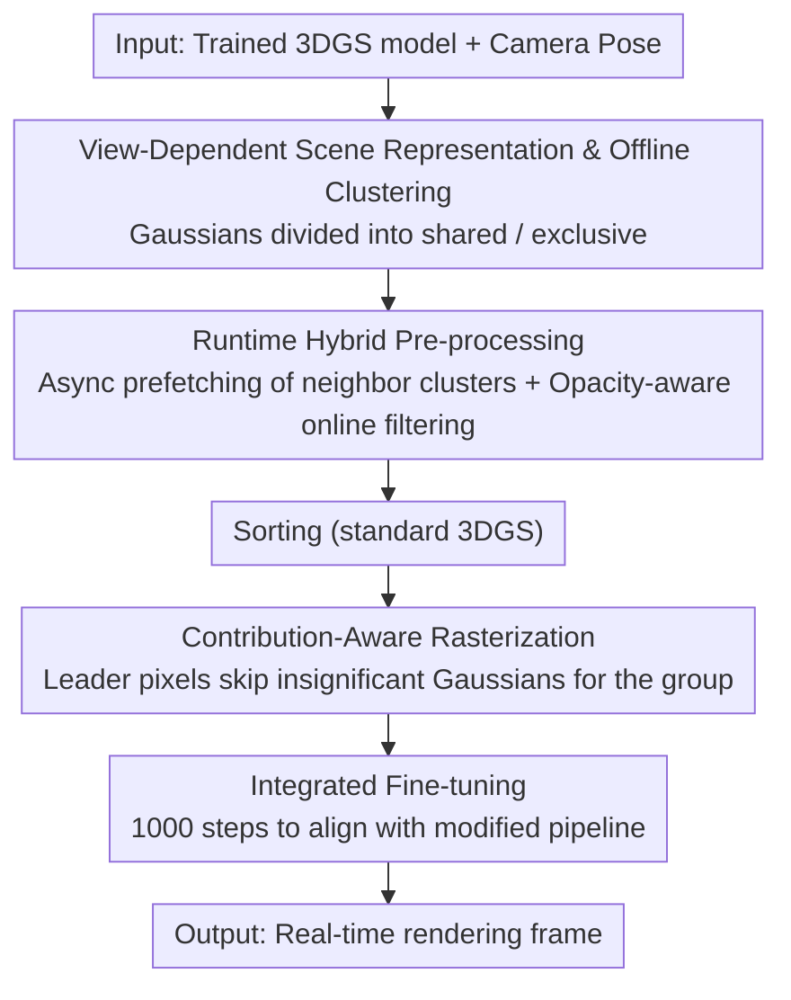

# Seele: A Unified Acceleration Framework for Real-Time Gaussian Splatting on Mobile Devices

**Conference**: CVPR 2026  
**Paper**: [CVF Open Access](https://openaccess.thecvf.com/content/CVPR2026/html/Zhu_Seele_A_Unified_Acceleration_Framework_for_Real-Time_Gaussian_Splatting_on_CVPR_2026_paper.html)  
**Code**: Project Page http://seele-project.netlify.app (Code to be open-sourced after publication)  
**Area**: 3D Vision  
**Keywords**: 3D Gaussian Splatting, real-time rendering, mobile acceleration, rasterization optimization, GPU parallelism

## TL;DR
SEELE is a mobile-oriented 3DGS rendering acceleration framework that reduces the number of rendered Gaussians through "view-dependent scene representation + online filtering + asynchronous prefetching" and concentrates computing power on a few Gaussians that truly affect pixels via "contribution-aware rasterization." It is plug-and-play across four mainstream 3DGS algorithms, achieving up to 6.3× speedup and 39.1% runtime model reduction, with rendering quality often slightly improved.

## Background & Motivation
**Background**: 3D Gaussian Splatting (3DGS) has become a primary rendering technology for real-time applications such as autonomous driving and AR/VR. However, these scenarios typically run on resource-constrained mobile platforms. The paper highlights a stark reality: the computing power of the flagship automotive module Nvidia AGX Orin is only 3.4% of the A100 workstation. On this platform, the original 3DGS barely reaches 20 FPS on real-world datasets, far from the 90 FPS required for VR.

**Limitations of Prior Work**: The authors categorize the bottlenecks of 3DGS on mobile devices into three parts: high computational intensity (traversing thousands of Gaussians per pixel), inefficient rendering (all Gaussians processed through the same pipeline regardless of importance), and memory pressure (difficulty hosting all Gaussians simultaneously as model scale increases). Previous works address these partially: pruning/quantization (CompactGS, LightGaussian) trades quality for efficiency; offline compression (CompactGS, EAGLES) introduces runtime decoding overhead; and AABB/OBB online filtering only reduces the number of Gaussians entering rasterization without addressing the imbalances within rasterization itself.

**Key Challenge**: All Gaussians are treated "equally," but empirical measurements reveal that for each pixel, only 1.5% of Gaussians contribute to 99% of the final color (Fig. 4). A unified pipeline wastes significant computing power on low-contribution Gaussians, which is the root cause of poor real-time performance on low-end GPUs. Furthermore, rendering a specific viewpoint does not require loading all Gaussians into VRAM.

**Goal**: To push mobile 3DGS to real-time performance by simultaneously alleviating inefficiencies in computation, rendering, and memory, without hardware modifications and with only minimal adjustments to existing 3DGS pipelines.

**Key Insight**: Addressing structural redundancies in "view correlation" and "contribution imbalance"—the former suggesting that different viewpoints depend on different Gaussian subsets, and the latter showing that pixel colors are determined by a very small number of Gaussians.

**Core Idea**: Off-line clustering of Gaussians into "shared/exclusive" categories based on views, runtime fetching of relevant clusters refined by opacity-aware filtering, and dynamic allocation of computing power during rasterization to skip insignificant Gaussian blending.

## Method

### Overall Architecture
SEELE does not modify the training process of 3DGS; instead, it intervenes in the "pre-processing" and "rasterization" phases. The workflow follows two paths: **Offline**, the trained 3DGS model is converted into a "view-dependent scene representation" (Gaussians clustered into shared across views and exclusive to specific clusters), followed by a lightweight integrated fine-tuning to recover quality. **Runtime**, adjacent clusters are asynchronously prefetched based on camera pose, opacity-aware online filtering removes false-intersection Gaussians, and "contribution-aware rasterization" dynamically skips calculations based on Gaussian contributions. In the original three-step pipeline (pre-processing → sorting → rasterization), sorting remains unchanged, while pre-processing is replaced by "hybrid pre-processing" and rasterization by "contribution-aware rasterization."

### Key Designs

**1. View-Dependent Scene Representation and Offline Clustering: Eliminating unnecessary Gaussians beforehand**

To address the bottleneck where all Gaussians reside in VRAM with high computational intensity, the key observation is that neighboring views reuse similar Gaussians, while distant views share very few. In the offline phase, camera poses are randomly sampled and clustered by weighted similarity of "position + orientation"—specifically, normalizing camera position $\vec{x}$ and viewing direction $\vec{v}$ into a vector $(\vec{x}, \beta\vec{v})$ (where $\beta$ balances position and orientation, $\beta=1$ for Gaussian clustering). For each cluster, the Top-$k$ ($k=32$) Gaussians contributing to cumulative transmittance $\Gamma_i\alpha_i$ per pixel are identified as primary contributors. The union of Top contributors across all clusters is designated as **shared Gaussians** (always in VRAM), while others are **exclusive Gaussians** for specific clusters. At rendering time, only the nearest cluster and its $M-1$ neighbors ($M$ empirically set to 3–4) are loaded. This reverses the old "load all then prune" approach, ensuring VRAM only holds what the current view actually needs, reducing runtime model size by approximately 39.1%.

**2. Runtime Hybrid Pre-processing: Online Filtering + Async Prefetching for precision without stuttering**

Offline clustering alone is insufficient; many Gaussians entering each tile are false positives (within the frustum but not actually intersecting). The authors integrate opacity into the standard $3\sigma$ envelope intersection test: since Gaussians with $\alpha_i$ below a threshold $\alpha_\theta=\tfrac{1}{255}$ are skipped, the intersection condition is rewritten as $(p-x_i')^T\Sigma_i'^{-1}(p-x_i') = \min(2\ln\tfrac{o_i}{\alpha_\theta}, 9)$. Factoring in opacity allows for more granular online filtering. Conversely, on-demand loading of Gaussian clusters introduces overhead that might cause frame drops. The authors use a dedicated GPU stream for **asynchronous prefetching** of future clusters—linearly extrapolating camera poses to predict the next frame and overlapping prefetching with current frame rendering. This allows the 39.1% memory reduction while adding <6% total latency.

**3. Contribution-Aware Rasterization: Directing compute power to contribution while eliminating warp divergence**

This is the core strike against "treating all Gaussians equally." Based on the observation that 1.5% of Gaussians determine 99% of pixel values, the algorithm groups every $h\times w$ pixels into a block $P$ ($h=w=2$). In each iteration, only the **leader pixel** (the first pixel) in the group calculates the opacity $\alpha$ for the current Gaussian. If $\alpha<\alpha_\theta$, the entire group skips the blending for this Gaussian (Algo. 1). Importantly, this fits GPU architecture perfectly: a group of pixels maps to a warp. Instead of threads within a warp "stalling" while others process irrelevant Gaussians (warp divergence), the leader unifiedly decides to skip or compute, ensuring all threads move together. Unlike pruning or quantization, this does not reduce the model but **dynamically redistributes computing power** during rendering, resulting in negligible quality loss (PSNR change $\approx 0.03$).

**4. Integrated Fine-tuning: Correcting deviations from pipeline modifications at minimal cost**

Hybrid pre-processing and contribution-aware rasterization both modify the rendering pipeline, which might harm view consistency across frames. Since these components do not participate in backpropagation, they can be integrated into existing training without modifying gradient calculations. After standard 3DGS training and conversion to the view-dependent representation, the model is fine-tuned for an additional 1000 steps with $L_{total} = L_{3DGS} + \gamma\, L_{consistency}$, where consistency is measured using the F​LIP score over 7 frames, with $\gamma=0.1$. This lightweight step allows SEELE to maintain or even improve rendering quality.

### Loss & Training
The primary training objective is $L_{total} = L_{3DGS} + 0.1\, L_{consistency}$. The consistency term is based on F​LIP (7 frames) perceptual difference metrics, penalizing inconsistencies caused by pipeline changes. With only 1000 fine-tuning steps and acceleration techniques being non-differentiable, the intrusion into original training is nearly zero.

## Key Experimental Results

> Metric Legend: **FPS** (Rendering frame rate, higher is better); **#Inst.** (Instruction count from Nsight Compute in $10^6$, lower is more efficient); **Mem.** (Runtime VRAM used by Gaussians in MB); **F​LIP1 / F​LIP7** (1-frame / 7-frame view consistency error, lower is better); PSNR/SSIM/LPIPS (Standard quality metrics).

### Main Results
When applied to four mainstream 3DGS algorithms across three datasets (Mip-NeRF360 / Tanks&Temples / Deep Blending), SEELE generally improves quality while significantly increasing efficiency (avg. PSNR +0.28 dB, SSIM +0.004):

| Algorithm / Dataset | PSNR↑ | FPS↑ | #Inst.(10⁶)↓ | Mem.(MB)↓ |
|--------|------|------|----------|------|
| 3DGS @ Mip-NeRF360 | 27.46 | 20.79 | 2168.68 | 710.6 |
| **Ours (SEELE + 3DGS)** | **27.72** | **59.67** | **778.25** | **380.9** |
| 3DGS @ Tanks&Temples | 23.75 | 41.97 | 1034.37 | 430.9 |
| **Ours (SEELE + 3DGS)** | **24.02** | **127.80** | **356.15** | **207.6** |
| MiniSplatting @ Mip-NeRF360 | 27.23 | 71.31 | 797.96 | 145.7 |
| **Ours (SEELE + MiniSplatting)** | **27.70** | **131.62** | **436.41** | **106.5** |
| LightGaussian @ Mip-NeRF360 | 27.44 | 30.89 | 1533.50 | 59.4 |
| **Ours (SEELE + LightGaussian)** | **27.56** | **76.36** | **589.85** | **39.1** |

Average speedups by algorithm: 3DGS 3.2×, MiniSplatting 1.8×, LightGaussian 2.7×, AdR-Gaussian 1.7× (maximum overall 6.3×). 3DGS benefits most due to its denser Gaussians and higher view-related redundancy. SEELE also improves view consistency, e.g., reducing 3DGS F​LIP7 from 0.0466 to 0.0292.

### Ablation Study
Effective across hardware, including low-power Orin NX and workstation A6000. **Lower-end GPUs show more significant acceleration** (greater benefits as resources become scarcer):

| Config | PSNR↑ | FPS↑ | Mem.(MB)↓ | Description |
|------|------|------|------|------|
| 3DGS (Baseline) | 27.46 | 20.79 | 710.6 | Mip-NeRF360 |
| +Opti. | 27.46 | 21.75 | 710.6 | Low-level code optimization, ~1.1× |
| +Opti.+HP | 27.70 | 46.15 | 380.9 | Hybrid Pre-processing, additional ~2.8× |
| +Opti.+CR | 27.50 | 30.10 | 710.6 | Contribution-Aware Rasterization, additional ~1.3× |
| **SEELE (Full)** | **27.72** | **59.67** | **380.9** | Overall ~3.2× |

### Key Findings
- **Hybrid Pre-processing (HP) is the primary speedup source**: HP alone contributes ~2.8× speedup and accounts for the entire 39.1% memory reduction. Combined with fine-tuning, it improves PSNR by 0.23 dB on average.
- **Contribution-Aware Rasterization (CR) has near-zero quality loss**: Contributes ~1.3× speedup with only a 0.03 change in PSNR, validating the hypothesis that low-contribution Gaussians can be skipped.
- **CR may increase instruction count but still boosts speed**: Parallelism gains from reduced warp divergence outweigh the overhead of additional instructions, indicating bottlenecks are in execution efficiency rather than raw instruction volume.
- **Orthogonal and Additive**: All four algorithms (including the already-pruned MiniSplatting) achieved further speedups, proving SEELE's redundancy sources (view correlation + contribution imbalance) are complementary to existing compression.

## Highlights & Insights
- **Quantification of "Contribution Imbalance"**: Measuring that 1.5% of Gaussians determine 99% of pixels turns an intuition into an actionable compute allocation strategy, which is more targeted than general pruning.
- **Alignment with GPU Execution Models**: Designing leader pixels to decide for the group simultaneously implements "skip-calculation" and "warp divergence elimination." This alignment of algorithm to hardware throughput is a clever insight applicable to other tile/warp-based rendering.
- **Shared/Exclusive Partitioning + Async Prefetching**: Turning "VRAM only loads current view needs" into a prefetchable pipeline avoids on-demand stalls. This approach is applicable to any point-cloud or voxel rendering where viewpoints change continuously.
- **Zero-Intrusive Integration**: Since core speedup components do not affect backpropagation, the 1000-step fine-tuning makes the framework very deployment-friendly for industry.

## Limitations & Future Work
- **Dependency on Camera Path Predictability**: Async prefetching uses linear extrapolation. In cases of sudden or irregular motion, prefetching may fail, a worst-case scenario not fully discussed.
- **Offline Clustering Hyperparameters**: Cluster count $N$, neighbor count $M$, Top-$k$, and balance factor $\beta$ all require manual setting. Cross-scene robustness and adaptive settings are not deeply explored (some sensitivity analysis is relegated to the supplementary material).
- **Marginal Quality Gains**: The average PSNR +0.28 dB is characterized as "no loss or slight gain." The core value is efficiency; memory gains also drop to 23.2% on already sparse models like MiniSplatting.
- **Future Directions**: Making clustering/prefetching adaptive to scene content or training jointly with neural compression could help maintain high acceleration ratios on even sparser models.

## Related Work & Insights
- **vs CompactGS / EAGLES (Offline Compression)**: These compress models via vector quantization/encoding but add runtime decoding overhead. SEELE modifies compute allocation in the pipeline with zero additional runtime decoding.
- **vs LightGaussian / Pruning (Significance Score)**: Pruning trades quality for efficiency while maintaining a unified pipeline. SEELE skips calculations dynamically during rendering without deleting Gaussians, allowing it to be stacked on top of pruned models.
- **vs FlashGS / Balanced3DGS (Rasterization Optimization)**: FlashGS overlaps data fetching with rasterization via software pipelining; Balanced3DGS balances workloads offline. Both treat Gaussians equally. SEELE uniquely allocates compute power based on "contribution imbalance."
- **vs AABB/OBB Online Filtering**: While these reduce the number of Gaussians entering rasterization, SEELE refines this with opacity-aware intersection tests and directly modifies the rasterization stage itself.

## Rating
- Novelty: ⭐⭐⭐⭐ Both "contribution-aware" and "view-dependent" perspectives target overlooked structural redundancies in 3DGS. The alignment of CR with the GPU warp model is particularly clever.
- Experimental Thoroughness: ⭐⭐⭐⭐ Solid matrix evaluation across 4 algorithms × 3 datasets × 3 GPUs. Ablation clearly separates the three contributions.
- Writing Quality: ⭐⭐⭐⭐ The three-bottleneck classification is clear, and the method maps closely to motivations. Figures 4 and 5 strongly support the arguments.
- Value: ⭐⭐⭐⭐ Plug-and-play, zero-intrusive, and more beneficial for low-end hardware. Directly practical for real-time mobile 3DGS deployment.

<!-- RELATED:START -->

## Related Papers

- [\[ICLR 2026\] Mobile-GS: Real-time Gaussian Splatting for Mobile Devices](../../ICLR2026/3d_vision/mobile-gs_real-time_gaussian_splatting_for_mobile_devices.md)
- [\[CVPR 2026\] SketchFaceGS: Real-Time Sketch-Driven Face Editing and Generation with Gaussian Splatting](sketchfacegs_real-time_sketch-driven_face_editing_and_generation_with_gaussian_s.md)
- [\[CVPR 2026\] Urban-GS: A Unified 3D Gaussian Splatting Framework for Compact and High-Fidelity Aerial-to-Street Reconstruction](urban-gs_a_unified_3d_gaussian_splatting_framework_for_compact_and_high-fidelity.md)
- [\[CVPR 2026\] MLLMSplat: A 2D MLLM-Powered Framework for 3D Gaussian Splatting Understanding, Generation, and Editing](mllmsplat_a_2d_mllm-powered_framework_for_3d_gaussian_splatting_understanding_ge.md)
- [\[CVPR 2026\] Changes in Real Time: Online Scene Change Detection with Multi-View Fusion](changes_in_real_time_online_scene_change_detection_with_multi-view_fusion.md)

<!-- RELATED:END -->
