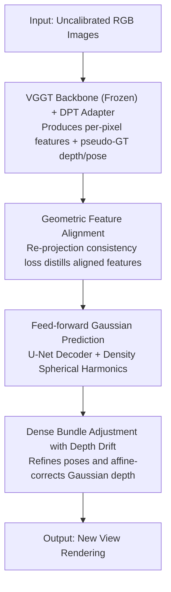

# Selfi: Self-improving Reconstruction Engine via 3D Geometric Feature Alignment

**Conference**: CVPR 2026  
**Paper**: [CVF Open Access](https://openaccess.thecvf.com/content/CVPR2026/html/Deng_Selfi_Self-improving_Reconstruction_Engine_via_3D_Geometric_Feature_Alignment_CVPR_2026_paper.html)  
**Code**: Project Page https://denghilbert.github.io/selfi  
**Area**: 3D Vision  
**Keywords**: New View Synthesis, 3D Vision Foundation Models, Feature Alignment, Gaussian Splatting, Pose-free Reconstruction

## TL;DR
Selfi freezes 3D Vision Foundation Models (VFMs) like VGGT as a backbone and trains only a lightweight feature adapter. By using the depth and pose output by VGGT itself as pseudo-labels and distilling features into a "geometrically aligned" space through re-projection consistency loss, it transforms a foundation model not originally designed for high-fidelity rendering into a SOTA engine for pose-free New View Synthesis (NVS) and camera pose estimation, achieving zero 3D ground truth supervision throughout the process.

## Background & Motivation
**Background**: Traditional New View Synthesis (NVS) relies on known camera parameters or running Structure-from-Motion (SfM) first (detecting keypoints → matching → solving for cameras) before optimizing scene representations. Feed-forward NVS removes per-scene optimization by directly predicting 3D primitives in one forward pass, yet most still assume calibrated cameras.

**Limitations of Prior Work**: The pipeline decoupling SfM and scene representation is computationally heavy and fragile—NVS quality depends highly on SfM pose accuracy, and quality drops sharply if calibration is inaccurate or fails. Recent 3D Vision Foundation Models (VFMs, e.g., DUSt3R, VGGT) can predict poses, depth, and 3D structure from uncalibrated images in one pass, bypassing SfM; however, directly decoding VFM features into 3D Gaussians for NVS results in rendering quality significantly behind optimization-based methods.

**Key Challenge**: The authors argue that while VFM features are strong for the geometric prediction tasks they were trained on, they are **not explicitly optimized for cross-view geometric consistency**, which is key for high-fidelity NVS. In other words, the VFM feature space "understands 3D but is not sufficiently aligned."

**Goal**: To transform a pre-trained VFM into a SOTA-level NVS and pose estimation engine without introducing any 3D ground truth labels or modifying the VFM backbone.

**Key Insight**: Since VFMs can output reasonably reliable depth and cameras, their **own outputs can be used as dense self-supervised signals** to learn a geometrically aligned new feature space—hence the name "self-improving."

**Core Idea**: Freeze VGGT and train a lightweight feature adapter. Build correspondences by "re-projecting query points from one view to other views," and force features at corresponding positions to be similar. This results in an aligned feature space containing both semantics and 3D proximity, which is then fed into Gaussian prediction heads and bundle adjustment to refine rendering and poses in a closed loop.

## Method

### Overall Architecture
Selfi is a self-improving pipeline that "aligns features first, then predicts Gaussians feed-forwardly, and finally closes the loop with bundle adjustment." The input is a set of uncalibrated RGB images: first, the frozen VGGT backbone + DPT adapter produces per-pixel features, using VGGT's self-annotated depth/camera as pseudo-ground truth. Re-projection consistency loss distills these into a geometrically aligned space; aligned features are then fed into a U-Net decoder to predict 3D Gaussian parameters (including a key density spherical harmonic) for rendering new views; meanwhile, robust correspondences established by the aligned features are used for dense Bundle Adjustment (BA) to refine initial poses. Pose corrections are fed back to Gaussian positions via "depth drift" affine correction, achieving higher quality final rendering. Between the three contribution nodes (feature alignment, Gaussian prediction, and BA with depth drift), VGGT+DPT serves only as a backbone scaffold.

### Key Designs

**1. Geometric Feature Alignment: Learning a cross-view consistent feature space using VFM's own output as pseudo-labels**

Addressing the "VFM features are not explicitly geometrically consistent" pain point, the authors take the VGGT backbone and aggregator and attach a DPT adapter $F_i = \mathrm{DPT}_{adapter}(T_i)$ (taking four layers of intermediate tokens, outputting per-pixel $C=24$ dimensional features). The training objective is to make features of "3D spatially neighboring" positions similar. Given a query point $n$ in source frame $s$ and a target frame $t$, the feature cosine similarity map $S^n(u,v)=\frac{F_s^n\cdot F_t(u,v)}{\|F_s^n\|\|F_t(u,v)\|}$ is calculated. A softmax with temperature $\tau$ yields weights $w^n$, and the **predicted correspondence** $\hat{p}_t^n=\sum_{u,v} w^n(u,v)[u,v]$ is obtained by a weighted average of target coordinates. The **pseudo-ground truth correspondence** is provided by VGGT: source pixels are back-projected to 3D using depth $D_s^n$, transformed to the target coordinate system, and projected back to 2D to get $p_t^n$. A hard visibility map $V_t^n$ handles occlusion by comparing back-projected z-coordinates with the target depth map. The alignment loss is the visibility-weighted correspondence error $L_{align}=\frac{1}{TN}\sum_t\sum_n V_t^n\|\hat{p}_t^n - p_t^n\|_2^2$. Features learned this way encode both semantic content and 3D proximity without any camera labels or 3D supervision beyond VFM outputs.

**2. Feed-forward Gaussian Prediction & Density SH: Decoding aligned features into renderable Gaussians and countering geometric noise with density SH**

With the aligned feature maps, the DPT adapter is frozen, and a new U-Net decoder is trained: $F_s^{dec}=\mathrm{U\text{-}Net}(\mathrm{cat}(F_s, I_s))$. It outputs quat $q_s$, scale $s_s$, color $c_s$, opacity $\sigma_s$, and depth residual $\Delta D_s$. Gaussian centers are back-projected via $\mu_s=(D_s+\Delta D_s)\pi_K^{-1}p_s$. A key modification is: in addition to color using spherical harmonics (SH) for view-dependent effects, **density $\sigma_s$ also uses SH** instead of a single scalar. The motivation is specific: VGGT's geometric predictions are inaccurate in low-confidence regions; view-dependent density acts as a "learned confidence measure." For a specific rendering view, it makes unreliable Gaussians nearly transparent, overcoming occlusions and misalignments, and allowing for pruning of low-confidence Gaussians to increase speed. The Gaussian head is trained solely with RGB reconstruction loss $L_{RGB}=\frac{1}{T}\sum_t\|\hat{I}_t - I_t\|$.

**3. Dense Bundle Adjustment with Depth Drift: Refining poses with aligned features and consistently propagating pose corrections back to Gaussians**

Robust correspondences from aligned features allow the use of a fast-converging classical BA to refine VGGT's initial poses, which is more efficient than post-optimizing both cameras and Gaussians. However, a pitfall exists: BA changes sparse 3D point positions related to 2D correspondences. If only the poses are changed without moving the dense Gaussians, rendering becomes misaligned (Fig. 4a). The authors observe that depth changes caused by BA are primarily **linear** (Fig. 4c). They estimate an affine transformation $\phi(\cdot)$ from sparse BA points and apply it to all dense depths: $\mu_s'=\phi(D_s+\Delta D_s)\pi_{K'}^{-1}p_s$. The scale is also adjusted proportionally $s_s'=\frac{\phi(D_s+\Delta D_s)}{D_s+\Delta D_s}s_s$. This simple "depth drift" correction bridges the geometric gap, ensuring that BA pose improvements translate into NVS quality gains—ablations show that without this correction, BA actually causes performance drops.

### Loss & Training
Two-stage training: ① Feature alignment stage uses only the alignment loss $L_{align}$, sampling 11 frames on DL3DV (middle frame as source, others as targets), randomly sampling 4096 query points, training DPT + AdamW for 150K steps (approx. 2 days on 128 H100s); ② Gaussian head stage uses RGB reconstruction loss $L_{RGB}$, joint training on DL3DV + RealEstate10K (6 source frames + 5 target frames between them), also 150K steps for approx. 1.5 days. Visibility threshold $\alpha=0.05$, softmax temperature $\tau=100$, implemented in JAX.

## Key Experimental Results

> Metrics: PSNR/SSIM/LPIPS are standard rendering quality metrics; **AUC@N** is the area under the curve for camera pose estimation accuracy (threshold N degrees, higher is better). All NVS evaluations are conducted on held-out scenes from RealEstate10K and DL3DV.

### Main Results
Across different sequence lengths, Selfi comprehensively outperforms feed-forward pose-free baselines (AnySplat, WorldMirror, Flare). For short sequences, it even approaches per-scene optimized 3DGS initialized with GT poses + SfM (as an upper bound):

| Dataset / Input Frames | Method | PSNR↑ | SSIM↑ | LPIPS↓ |
|--------|------|------|------|------|
| DL3DV / 6 frames | 3DGS (GT Pose, Upper Bound) | 25.63 | 0.8376 | 0.1985 |
| DL3DV / 6 frames | AnySplat | 18.84 | 0.5665 | 0.2949 |
| DL3DV / 6 frames | WorldMirror | 21.76 | 0.7389 | 0.2162 |
| DL3DV / 6 frames | **Ours** | **24.94** | **0.8442** | **0.1566** |
| RE10K / 6 frames | WorldMirror | 25.54 | 0.8691 | 0.1502 |
| RE10K / 6 frames | **Ours** | **28.34** | **0.9021** | **0.1206** |

Under the two-view protocol of PixelSplat, Selfi achieves the best SSIM and LPIPS among all methods (including those requiring GT poses):

| Method | Type | PSNR↑ | SSIM↑ | LPIPS↓ |
|------|------|------|------|------|
| DepthSplat | Requires Pose | 27.47 | 0.889 | 0.114 |
| ReSplat | Requires Pose | 29.72 | 0.911 | 0.100 |
| NoPoSplat | Pose-free | 26.82 | 0.880 | 0.125 |
| **Ours** | Pose-free | 29.01 | **0.942** | **0.053** |

### Ablation Study
Stepwise addition on DL3DV (Tab. 6):

| Configuration | PSNR↑ | SSIM↑ | LPIPS↓ | Note |
|------|------|------|------|------|
| Baseline (Original VGGT traits) | 22.53 | 0.759 | 0.240 | - |
| + Feature Alignment | 23.29 | 0.792 | 0.210 | Aligned features alone provide +0.76 dB |
| + Alignment + RGB SH | 23.70 | 0.801 | 0.207 | View-dependent color |
| + Alignment + RGB & Density SH | 24.67 | 0.835 | 0.169 | Density SH is the largest contributor |
| + BA (No Depth Drift) | 24.61 | 0.833 | 0.164 | Replacing poses directly causes drop |
| + BA + Depth Drift | 24.88 | 0.844 | 0.157 | Truly benefits only after correction |

In pose estimation (10 frames), Selfi's AUC@3 reaches 0.867, better than VGGT+BA's 0.835; more importantly, at 100 frames, while Co-Tracker fails due to OOM, Selfi remains stable.

### Key Findings
- **Geometric feature alignment is the foundation**: Merely replacing original VGGT features with aligned features (with the same Gaussian head training) significantly improves NVS, validating the hypothesis that "VFM features lack geometric consistency."
- **Density SH is the design with the highest single-point gain**: From 23.70 → 24.67 (PSNR +0.97), it acts as a "learned confidence," suppressing pose/depth noise by making Gaussians far from the target view transparent.
- **BA must be paired with depth drift**: Directly injecting new poses causes NVS performance to drop (24.67 → 24.61). Adding affine depth correction makes it surpass the baseline to 24.88—indicating poses and dense Gaussians must be updated consistently.
- **Feed-forward methods generally degrade as frame count increases**, but Selfi degrades the slowest and can zero-shot transfer to MipNeRF360 / Tanks&Temples for BA evaluation.

## Highlights & Insights
- **"Using the model's own output as dense pseudo-labels"**: Converting VGGT's depth/pose into re-projection correspondence supervision is a clean paradigm for transforming foundation models via self-supervision, bypassing 3D ground truth labels.
- **Density on SH = Learned Confidence**: Extending view-dependency from color to density allows the model to automatically "distrust" Gaussians from distant views, solving occlusion, misalignment, and pruning simultaneously.
- **SOTA via frozen backbone and small heads**: Training costs are concentrated on lightweight adapters/decoders, suggesting that VFMs already contain sufficient 3D priors, only lacking the "alignment" step.
- **Depth drift closes the gap between BA and rendering with linear affine**: Observing that BA depth changes are approximately linear and using an affine transformation to batch-correct dense Gaussians is simple yet critical.

## Limitations & Future Work
- **Slightly lower PSNR in two-view cases**: Attributed to exposure differences between inputs and the model being trained for multi-view NVS; robustness decreases with only two frames (though SSIM/LPIPS remain optimal).
- **Strong dependence on VGGT quality**: The entire self-supervision signal comes from VGGT's depth/pose; if the backbone predicts incorrectly in a certain scene type, pseudo-labels will misguide alignment.
- **High training compute threshold**: 128 H100s for 3.5 days across two stages constitutes a high reproduction cost.
- **Future Directions**: Explicitly modeling uncertainty with density confidence or extending alignment loss to temporal/dynamic scenes may further enhance robustness under sparse views and long sequences.

## Related Work & Insights
- **vs AnySplat / WorldMirror**: These directly decode VFM feature tokens into Gaussians without alignment, resulting in significantly lower quality; Selfi's "align-then-decode" approach yields 3–6 dB higher PSNR on 6-frame DL3DV.
- **vs NoPoSplat / Flare**: Comparing pose-free feed-forward approaches, Selfi's aligned features + BA loop achieves the best SSIM/LPIPS in the field.
- **vs Feat2GS**: Feat2GS uses NVS as a proxy task to probe VFM representation space but directly reuses its features; Selfi proactively learns a geometrically aligned space and proves this space can benefit pose refinement.
- **vs LVSM / RayZer**: These regress pixels directly without 3D representation; Selfi uses per-pixel Gaussian parameterization, retaining an explicit 3D scene.
- **vs CoTracker**: Selfi’s aligned feature matching is superior in pose accuracy and can scale to >40 images where CoTracker fails due to OOM.

## Rating
- Novelty: ⭐⭐⭐⭐⭐ Using VFM's own output to learn aligned features is a clean, generalizable paradigm. Density SH and Depth Drift are both clever designs.
- Experimental Thoroughness: ⭐⭐⭐⭐ Comprehensive evaluation across sequence length, overlap, two-view, and pose estimation. Ablation clearly decouples each design.
- Writing Quality: ⭐⭐⭐⭐⭐ Logical loop of motivation-hypothesis-method-validation. Visuals (Fig. 2/4/6) effectively support abstract concepts like feature alignment.
- Value: ⭐⭐⭐⭐ Transforms foundation models into pose-free SOTA NVS engines with zero 3D labels; highly meaningful for practical uncalibrated reconstruction, though training costs are high.

<!-- RELATED:START -->

## Related Papers

- [\[CVPR 2026\] PatchAlign3D: Local Feature Alignment for Dense 3D Shape Understanding](patchalign3d_local_feature_alignment_for_dense_3d_shape_understanding.md)
- [\[CVPR 2026\] Cross-Instance Gaussian Splatting Registration via Geometry-Aware Feature-Guided Alignment](cross-instance_gaussian_splatting_registration_via_geometry-aware_feature-guided.md)
- [\[CVPR 2026\] GaussFusion: Improving 3D Reconstruction in the Wild with A Geometry-Informed Video Generator](gaussfusion_improving_3d_reconstruction_in_the_wild_with_a_geometry-informed_vid.md)
- [\[CVPR 2026\] Complet4R: Geometric Complete 4D Reconstruction](complet4r_geometric_complete_4d_reconstruction.md)
- [\[CVPR 2026\] GeoFree-CoSeg: Unsupervised Point Cloud-Image Cross-Modal Co-Segmentation Without Geometric Alignment](geofree-coseg_unsupervised_point_cloud-image_cross-modal_co-segmentation_without.md)

<!-- RELATED:END -->
