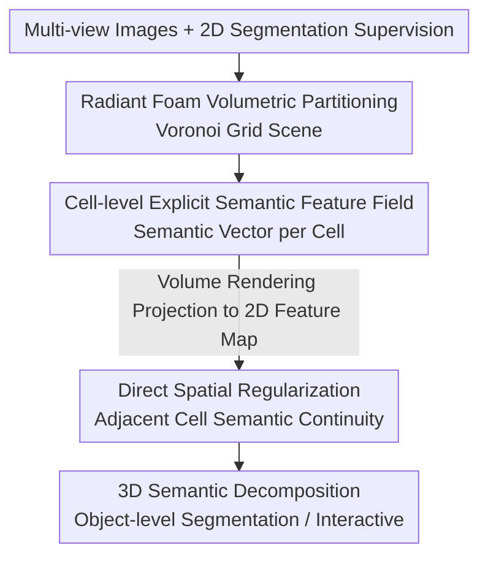

# Semantic Foam: Unifying Spatial and Semantic Scene Decomposition

**Conference**: CVPR 2026 (Highlight)  
**arXiv**: [2604.26262](https://arxiv.org/abs/2604.26262)  
**Code**: None (Project page only)  
**Area**: 3D Vision / Scene Representation / 3D Semantic Decomposition  
**Keywords**: Radiant Foam, Voronoi Grids, 3D Gaussian Splatting, Semantic Feature Fields, Scene Decomposition

> ⚠️ This paper is a CVPR 2026 Highlight. As of the time of writing, the arXiv cache only provides the abstract (HTML full text not rendered, 16MB PDF not downloaded). Specific mechanisms in the "Method" section beyond the abstract (source of supervision, form of regularization, losses, etc.) are reasonable inferences based on Radiant Foam / 3DGS segmentation literature and have been marked accordingly with **⚠️ Subject to the original text**.

## TL;DR
The recently proposed Radiant Foam (a differentiable radiance field representation based on Voronoi grids) is extended to semantic decomposition tasks. By explicitly attaching a set of semantic features to each Voronoi cell and leveraging the natural spatial adjacency of the grid for direct spatial regularization, the method avoids occlusion and cross-view inconsistent supervision artifacts common in point-based representations, achieving or exceeding SOTA results in object-level segmentation like Gaussian Grouping and SAGA.

## Background & Motivation
**Background**: Modern scene reconstruction methods, represented by 3D Gaussian Splatting (3DGS), can synthesize photo-realistic novel-view images at real-time speeds and have become one of the mainstream representations for neural rendering.

**Limitations of Prior Work**: Despite high rendering quality, such representations are limited in interactive graphics applications—they are difficult to "edit or manipulate" compared to human-authored traditional 3D assets. Supporting interaction requires the first step of **semantic decomposition** (deconstructing a "cloud of Gaussians" into objects that can be individually selected, moved, or deleted). Existing works (e.g., Gaussian Grouping, SAGA) attempt to layer semantic decomposition onto 3DGS, but **segmentation quality and cross-view consistency** remain significant challenges.

**Key Challenge**: Point-based/unstructured representations like 3DGS lack explicit spatial structure—each Gaussian floats independently without knowledge of its neighbors. Consequently, when objects are occluded in certain views or when 2D supervision from different views is contradictory, semantic labels "leak," "blur," or "flicker" in 3D space because there is no natural structure to constrain that "spatially adjacent elements should have continuous semantics."

**Goal**: Split into two sub-problems—(1) Find an underlying representation with **inherent spatial structure** so semantics can be "anchored to the structure" rather than floating in a point cloud; (2) Utilize this structure to provide **direct spatial regularization** to suppress artifacts from occlusion and inconsistent supervision.

**Key Insight**: The authors noted that the recent **Radiant Foam** uses **Voronoi grids** to represent radiance fields—the scene is partitioned into a set of Voronoi cells with clear adjacency relationships, essentially an **explicit spatial volumetric decomposition**. This provides the "spatial structure" missing in 3DGS.

**Core Idea**: Explicitly parameterize a **semantic feature field on each Voronoi cell** of Radiant Foam, unifying "spatial partitioning" and "semantic partitioning" within the same grid. Since the structure is explicit, direct spatial regularization between adjacent cells can be applied to fundamentally avoid inconsistent artifacts of point-based representations.

## Method

### Overall Architecture
Semantic Foam uses the geometry/appearance representation of Radiant Foam as a base and attaches an additional **explicit semantic feature vector** at the **cell-level of its Voronoi grid**, allowing the same volumetric partitioning to carry both "spatial decomposition" and "semantic decomposition." Overall, the system can be understood as: multi-view images first reconstruct a Voronoi grid scene via Radiant Foam → each cell is assigned a learnable semantic feature → the same volume rendering pipeline used for appearance projects these features into 2D feature maps for 2D segmentation supervision → crucially, because cells are explicit and adjacent, **direct spatial regularization is performed on the 3D grid** to ensure semantic continuity between adjacent cells, smoothing out artifacts caused by occlusion and cross-view inconsistency → finally, a 3D scene capable of object-level selection/decomposition is obtained.

⚠️ The following flow follows the "explicit cell features + direct spatial regularization" described in the abstract, but the specific implementation of each module (supervision signals, rendering method, regularization terms) is inferred, **⚠️ subject to the original text**.

### Key Designs

**1. Attaching Semantics to Voronoi Cells: Using Explicit Spatial Partitioning to Replace Scattered Points**

The pain point addressed is that point-based representations "lack spatial structure, and semantics float in the point cloud." Semantic Foam does not create a separate semantic field from scratch but **reuses the Voronoi grid already partitioned by Radiant Foam**: the scene is divided into Voronoi cells, each defined by a site, with clear adjacency topology. The authors explicitly parameterize a semantic feature vector $f_i$ at the **cell level** (one set of features per cell). Thus, "where the space is cut" and "where the semantics are cut" use the **same partitioning**—this is the literal meaning of "Unifying Spatial and Semantic" in the title. Compared to binding semantic features to independent Gaussians, the explicit grid allows each semantic unit to know its spatial neighbors, providing a structural handle for subsequent regularization. ⚠️ Details on feature dimensions or learnable site positions are subject to the original text.

**2. Direct Spatial Regularization: Using Grid Adjacency to Suppress Occlusion/Inconsistency Artifacts**

This is the most core design, relying on the "explicit structure," targeting the long-standing problem in point-based methods like Gaussian Grouping and SAGA—label leakage due to occlusion and conflicting supervision from different views. Since Voronoi cells are explicit and **adjacency relationships are known**, the authors can directly constrain in 3D space that "the semantic features of adjacent cells should be continuous/similar," formulated as a smoothness constraint on adjacent cell pairs $(i,j)$ like $\sum_{(i,j)\in\mathcal{N}} w_{ij}\,\lVert f_i - f_j \rVert$ (⚠️ exact form subject to the original text). This regularization **acts directly on the representation itself** rather than solely relying on 2D supervision backpropagation—point-based methods cannot do this because they lack an inherent spatial adjacency graph. The effect is that even if supervision is missing or contradictory in some views, the 3D semantic field is "held up" by spatial consistency, avoiding artifacts like floating mislabels or fragmented boundaries.

**3. Shared Volumetric Rendering and Interfacing with 2D Segmentation Supervision**

⚠️ This point is an inference (the abstract does not explicitly state the source of supervision), **subject to the original text**. To train cell semantic features, 3D semantics need to be projected back to 2D for comparison with supervision: following Radiant Foam's volume rendering, the semantic features of cells intersected by a ray are accumulated by weights into 2D semantic/feature maps, which are then supervised by 2D segmentation from images (e.g., SAM-like masks or SAGA-style feature contrastive targets). Since semantics reuse the rendering path consistent with appearance, geometry/appearance and semantics are naturally aligned in space, avoiding misalignments between separate geometry and semantic paths.

> ⚠️ **Consistency between Framework and Key Designs**: In the framework diagram, "Radiant Foam Volumetric Partitioning" serves as the base scaffold (reusing prior work, not a new contribution of this paper). The true contributions of this paper are concentrated in Design 1 (cell-level explicit semantic field) and Design 2 (direct spatial regularization); Design 3 is the supervision interface required for training.

### Loss & Training
⚠️ The abstract does not provide loss details. The following is a reasonable inference, **subject to the original text**: The total loss is approximately a weighted sum of "2D semantic supervision terms (segmentation/feature contrastive loss) + spatial regularization terms (adjacent cell semantic smoothing)." It may also retain the original photometric reconstruction terms of Radiant Foam to maintain geometry/appearance. The spatial regularization weight is a key hyperparameter; if too small, it cannot suppress artifacts, and if too large, it blurs object boundaries.

## Key Experimental Results

> ⚠️ Only the abstract is available, and specific numerical tables have not been obtained. The following table organizes **qualitative comparisons** based on the abstract's conclusions, with numerical values left blank to be filled by the original text.

### Main Results (Object-level Segmentation, Qualitative Conclusions)

| Comparison Target | Task | Ours (Semantic Foam) | Remarks |
|-------------------|------|----------------------|---------|
| Gaussian Grouping | Object-level 3D Segmentation | comparable or superior | Abstract explicitly claims to meet/exceed ⚠️ specific metrics subject to original text |
| SAGA | Object-level 3D Segmentation | comparable or superior | Same as above |

### Ablation Study

⚠️ The abstract does not provide ablation data. The following are **expected** ablation dimensions based on the method design (values TBD):

| Configuration | Key Metrics | Description |
|---------------|-------------|-------------|
| Full model | — | Complete model (cell semantic field + spatial regularization) |
| w/o Spatial Regularization | Expected Decrease | Occlusion/cross-view inconsistency artifacts should return after removing direct spatial regularization |
| w/o Explicit Cell Structure | Expected Decrease | Degenerates to point-based semantics, losing the handle for adjacency regularization |

### Key Findings
- ⚠️ Subject to the original text: According to the method logic, **direct spatial regularization** should be the module contributing most to performance—it is the core increment of this paper relative to 3DGS point-based methods.
- The abstract emphasizes advantages in scenes with **severe occlusion / cross-view supervision inconsistency**, which is exactly where point-based representations fail and explicit grid regularization can provide a safety net.

## Highlights & Insights
- **"Change the Base" rather than "Add a Patch"**: Previous 3DGS semantic decomposition layered semantics onto unstructured point clouds post-hoc. This paper switches directly to Radiant Foam, which has inherent spatial partitioning, making spatial structure a natural source of semantic consistency—a clever "choose the right representation, and the problem becomes simple" approach.
- **Explicit Adjacency = Direct 3D Regularization**: Many 3DGS segmentation methods can only rely on 2D supervision to indirectly constrain 3D. Because this paper has a Voronoi adjacency graph, it can **directly constrain** semantic smoothness in 3D. This capability is transferable to any neural representation with an explicit grid/partitioning (e.g., for 3D editing or boundary consistency in physical simulations).
- **Unifying Space and Semantics in One Partition**: Reusing "geometric partitioning" for "semantic partitioning" eliminates the risk of misalignment between two separate representations, resulting in a clean engineering/representation design.

## Limitations & Future Work
- ⚠️ Strongly dependent on **Radiant Foam**, a relatively new underlying representation. Its reconstruction quality, speed, and range of applicability directly determine the upper bound of Semantic Foam; the migration cost for the ecosystem still dominated by 3DGS is high.
- The abstract does not provide numerical data, and the wording **comparable or superior** is conservative, suggesting it might only match rather than significantly exceed performance on certain metrics—specific strengths/weaknesses require the original tables.
- The strength of spatial regularization involves a trade-off between "suppressing artifacts" and "maintaining sharp object boundaries." Excessive regularization might blur small objects or thin structures (author's inference).
- No open-source code (only a Project page), making reproduction difficult.

## Related Work & Insights
- **vs Gaussian Grouping**: Gaussian Grouping learns an identity/grouping feature for each Gaussian in 3DGS, supervised by 2D masks. This paper switches to a Voronoi grid, attaches semantics to **explicit cells**, and enables **direct spatial regularization**. The difference lies in "whether there is a ready-made spatial adjacency structure to constrain 3D semantic continuity"—this is why the paper claims to be more stable in occlusion/inconsistency scenarios.
- **vs SAGA**: SAGA distills the segmentation capability of SAM into a 3DGS feature field, also point-based and relying on feature contrast. The increment of this paper is the structured regularization brought by the **explicit volumetric partitioning** of the underlying representation, rather than the segmentation supervision signal itself.
- **vs Radiant Foam (Base)**: Radiant Foam solves "high-quality differentiable radiance field reconstruction using Voronoi grids." This paper is its downstream expansion, extending the representation from **geometry/appearance** to **semantic decomposition** tasks.

## Rating
> ⚠️ Based on the abstract only; subject to calibration against the full text.

- Novelty: ⭐⭐⭐⭐ Coupling semantic decomposition with Voronoi grid representations and using explicit adjacency for direct spatial regularization is a fresh and self-consistent perspective; however, it belongs to an "existing new representation + semantic extension" type of compositional innovation.
- Experimental Thoroughness: ⭐⭐⭐ ⚠️ The abstract only gives qualitative conclusions (comparable or superior); thoroughness cannot be verified, currently conservative.
- Writing Quality: ⭐⭐⭐⭐ The problem-contradiction-solution chain in the abstract is clear, and the CVPR Highlight status supports the quality of expression.
- Value: ⭐⭐⭐⭐ Directly addresses the real pain point of 3DGS-like representations being "hard to interact with / hard to decompose," which is meaningful for interactive neural scene assets.

<!-- RELATED:START -->

| Paper | Key Connection |
|-------|----------------|
| Radiant Foam (CVPR 2024) | Underlying base representation |
| Gaussian Grouping (CVPR 2024) | Main baseline for comparison |
| SAGA (CVPR 2023/2024) | Contrastive feature-based baseline |

<!-- RELATED:END -->

## Related Papers

- [\[CVPR 2026\] Learning Spatial-Temporal Consistency for 3D Semantic Scene Completion](learning_spatial-temporal_consistency_for_3d_semantic_scene_completion.md)
- [\[CVPR 2026\] AdaSFormer: Adaptive Serialized Transformers for Monocular Semantic Scene Completion from Indoor Environments](adasformer_adaptive_serialized_transformers_for_monocular_semantic_scene_complet.md)
- [\[CVPR 2026\] EmbodiedSplat: Online Feed-Forward Semantic 3DGS for Open-Vocabulary 3D Scene Understanding](embodiedsplat_online_feed-forward_semantic_3dgs_for_open-vocabulary_3d_scene_und.md)
- [\[ICCV 2025\] Disentangling Instance and Scene Contexts for 3D Semantic Scene Completion](../../ICCV2025/3d_vision/disentangling_instance_and_scene_contexts_for_3d_semantic_scene_completion.md)
- [\[CVPR 2026\] PointGS: Semantic-Consistent Unsupervised 3D Point Cloud Segmentation with 3D Gaussian Splatting](pointgs_semantic-consistent_unsupervised_3d_point_cloud_segmentation_with_3d_gau.md)

<!-- RELATED:END -->
