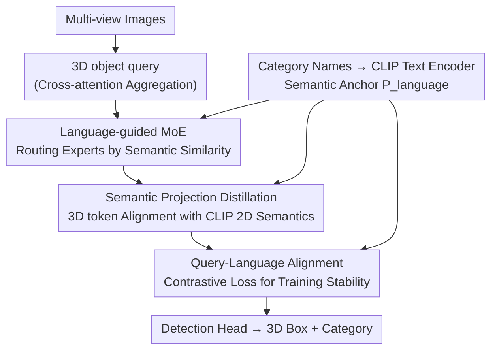

# SemLT3D: Semantic-Guided Expert Distillation for Camera-only Long-Tailed 3D Object Detection

**Conference**: CVPR 2026  
**arXiv**: [2604.18476](https://arxiv.org/abs/2604.18476)  
**Code**: None  
**Area**: 3D Vision / Autonomous Driving / Long-Tailed Learning  
**Keywords**: Camera-only 3D detection, Long-tailed distribution, Language-guided MoE, CLIP distillation, nuScenes

## TL;DR
Addressing the "rare but safety-critical" categories (children, emergency vehicles, strollers) in camera-only multi-view 3D detection characterized by extreme data scarcity, intra-class diversity, and inter-class ambiguity, SemLT3D leverages language/visual priors from CLIP for two purposes—routing 3D queries to experts based on semantic similarity (Language-guided MoE) and distilling 2D semantics from CLIP into 3D tokens (Semantic Projection Distillation). As a plug-and-play module for StreamPETR/Far3D, it significantly improves tail-class mAP and overall mAP/NDS under the 18-class nuScenes setting.

## Background & Motivation

**Background**: Due to low deployment costs and scalability, camera-only 3D detection has become a powerful alternative to LiDAR. The mainstream approach follows the query-based paradigm (e.g., PETR, StreamPETR, Far3D): initializing a set of 3D object queries, aggregating visual information from multi-view images to form 3D tokens, and decoding positions and categories via detection heads.

**Limitations of Prior Work**: Existing methods predominantly focus on overall mAP/NDS while neglecting the natural long-tailed (Zipfian) distribution of driving data. Head classes like "car" and "adult" are abundant, whereas tail classes like "child," "emergency vehicle," "stroller," and "debris" are extremely scarce. Critically, these rare classes carry the highest safety risks—missing a child or an emergency vehicle can be catastrophic. Furthermore, the standard nuScenes protocol collapses categories like children, police, and strollers into a single "pedestrian" class, obscuring vital safety distinctions.

**Key Challenge**: Learning tail classes is difficult not just because of the "few samples." Two inherent challenges coexist—**intra-class diversity**: massive visual variance within a tail class (e.g., "debris" can be trash cans, ladders, or scattered cargo); and **inter-class ambiguity**: high visual overlap between semantically similar classes (e.g., police in vests vs. construction workers, or police cars vs. regular cars). A single unified model is inevitably dominated by head classes during optimization, leaving tail classes with insufficient supervision.

**Goal**: Mitigate data scarcity, intra-class diversity, and inter-class ambiguity simultaneously without introducing LiDAR or increasing overall model complexity.

**Key Insight**: The authors draw from mature 2D long-tail experiences but note that 2D resampling/reweighting is limited by the lack of representation in the samples themselves. Directly porting CLIP or external data to 3D yields a significant domain gap. The key observation is that **semantic priors (language embeddings + CLIP visual features) can bypass the "sample count" bottleneck to directly enrich the representation space for tail classes**.

**Core Idea**: Use language semantics to "organize" expert routing (allowing semantically similar classes to share experts for specialization) while aligning and distilling CLIP's 2D semantics into 3D tokens, leveraging semantic structured learning for tail-class discriminative power.

## Method

### Overall Architecture
SemLT3D does not redesign the detector but acts as a plug-and-play module for query-based detectors (StreamPETR on nuScenes, Far3D on AV2). The backbone pipeline remains: multi-view images $\rightarrow$ 3D object queries aggregating visual info via cross-attention $\rightarrow$ detection head decoding 3D boxes and classes. SemLT3D inserts three semantic-driven components into the query refinement stage: (1) **Language-guided MoE (LMoE)** replacing the FFN in transformer blocks to route queries by semantic similarity; (2) **Semantic Projection Distillation (SPD)** injecting CLIP's 2D vision-language priors into 3D tokens; (3) **Query-Language Alignment** using contrastive loss to stabilize training. All three share CLIP text embeddings $P^{\text{language}}$ as semantic anchors.

### Key Designs

**1. Language-guided Mixture-of-Experts (LMoE): Routing via Semantic Similarity**

To address intra-class diversity, a unified FFN performs the same transformation on all queries, causing the heterogeneous appearance of tail classes to be overwhelmed by head-class optimization. LMoE replaces the FFN with a "Router + $M$ light experts + 1 shared expert" structure, allowing each expert to specialize in a group of semantically related categories, thereby reducing inter-class interference.

The innovation lies in the **routing signal design**. Standard LLM MoE layers in DETR-style detectors often result in "uniform routing" without meaningful semantic specialization. Instead of feeding high-dimensional query features to the router, the authors project 3D queries $Q\in\mathbb{R}^{k\times D}$ to the language space as $\hat{Q}=\mathrm{Linear}(Q)$. They then use the **similarity vector between queries and category name embeddings** $S^{l}=\mathrm{sim}(\hat{Q},P^{\text{language}})\in\mathbb{R}^{k\times n}$ as the router input. This ensures semantically similar queries are naturally assigned to the same expert—for instance, "human-like" targets like adults, police, and debris cluster together due to spatial and postural similarities.

Routing weights $W=\mathrm{Softmax}(R)$, where $R=\mathrm{Router}(S^{l})$; each query aggregates top-$k$ experts while passing through a shared expert $E^s$ to retain general knowledge:
$$y^{e}=\sum_{i\in\mathcal{T}}W_{i}E^{R}_{i}(Q),\qquad \bar{Q}=y^{e}+E^{s}(Q)$$
An auxiliary balance loss $\mathcal{L}_{\text{balance}}=M\cdot\sum_{i=1}^{M}\mathcal{F}_i\cdot\mathcal{P}_i$ prevents expert idling.

**2. Semantic Projection Distillation (SPD): CLIP as a Vision-Semantic Teacher**

To combat inter-class ambiguity and data scarcity, SPD distills CLIP's vision-language priors into 3D object tokens. CLIP can distinguish subtle context differences (e.g., standing on a street corner vs. a construction site) that distinguish police from construction workers.

The module aligns the 3D token $\bar{Q}$ to a camera-aligned representation $Q_c=\mathrm{Linear}(\bar{Q})\odot\mathrm{Linear}(E)\in\mathbb{R}^{C\times k\times d}$ using extrinsic parameters $E$. After Hungarian matching, matched GT 3D boxes are projected onto 2D images, and cropped regions are fed into the CLIP image encoder to obtain $P^{\text{visual}}_g$. The **student distribution** is the similarity between $Q^c_g$ and language anchors $S^s_g=\mathrm{sim}(Q^c_g,P^{\text{language}})$, while the **teacher distribution** is the similarity between CLIP visual features and language anchors $S^t_g=\mathrm{sim}(P^{\text{visual}}_g,P^{\text{language}})$. KL divergence is used for distillation:
$$\mathcal{L}_{\mathrm{KD}}=\frac{1}{G}\sum_{g=1}^{G}\mathcal{L}_{\mathrm{KL}}(S^s_g,S^t_g)$$
By distilling the "similarity distribution in language space," the 2D discriminative structure of the teacher is transferred to the 3D student.

**3. Query-Language Alignment: Stabilizing Training**

Since both LMoE and SPD depend on the quality of the query's projection into the language space, an explicit contrastive loss is added. It uses the dot-product similarity between queries and language embeddings as classification logits, supervised by focal loss:
$$\mathcal{L}_{\text{contrast}}=\mathcal{L}_{\text{Focal}}(\mathrm{sim}(\hat{Q},P_{\text{language}}),T)$$
This acts as an auxiliary loss in each decoder layer to ensure stable convergence.

### Loss & Training
Total Loss = Baseline Loss + $\mathcal{L}_{\text{contrast}}$ (weight 1.0) + $\mathcal{L}_{\mathrm{KD}}$ (weight 0.5) + $\mathcal{L}_{\text{balance}}$ (weight 0.01). The distillation teacher is CLIP-B/16. Training follows the StreamPETR settings for 60 epochs on nuScenes.

## Key Experimental Results

### Main Results
On nuScenes val set, extended to an 18-class long-tail setting:

| Dataset | Backbone | Metric | Ours | StreamPETR baseline | Gain |
|--------|----------|------|------|----------|------|
| nuScenes | ResNet-50 | mAP | 29.59 | 26.97 | +2.62 |
| nuScenes | ResNet-50 | NDS | 40.94 | 38.19 | +2.75 |
| nuScenes | ResNet-101 | mAP | 31.12 | 30.16 | +0.96 |
| nuScenes | ResNet-101 | NDS | 42.79 | 41.17 | +1.62 |
| AV2 | VoV-99 | mAP | 25.9 | 24.4 (Far3D) | +1.5 |

mAP Breakdown by Long-tail groups (Many/Medium/Few):

| Method | Modality | All | Many | Medium | Few |
|------|------|-----|------|--------|-----|
| StreamPETR | Camera | 26.97 | 53.32 | 28.53 | 3.22 |
| Ours | Camera | 29.59 | 50.92 | 34.55 | 6.03 |
| Ours* (ViT) | Camera | 41.1 | 62.08 | 40.62 | 20.77 |

Relative to baseline: Medium +6.02, Few +2.81. With a ViT backbone, the camera-only Few mAP exceeds multi-modal BEVFusion by +10.17.

### Ablation Study
Component-wise additions (nuScenes val):

| Configuration | mAP | NDS | Many | Medium | Few |
|------|-----|-----|------|--------|-----|
| baseline | 26.97 | 38.19 | 53.32 | 28.53 | 3.22 |
| + SPD only | 28.30 | 39.13 | 49.6 | 32.1 | 5.82 |
| + vanilla MoE | 26.37 | 37.47 | 51.48 | 30.73 | 0.32 |
| + Semantic-guided routing | 27.50 | 37.59 | 51.7 | 32.16 | 2.25 |
| + Full SemLT3D | 29.59 | 40.94 | 50.92 | 34.56 | 6.03 |

### Key Findings
- **Vanilla MoE is harmful**: Without semantic routing, Few mAP plummeted to 0.32. Semantic guidance is the key driver for MoE effectiveness in long-tail scenarios.
- **SPD is individually potent**: Adding SPD alone raised Few mAP from 3.22 to 5.82, showing the value of CLIP visual priors.
- **Expert Configuration**: 4 experts with top-$k=2$ achieved the best balance (29.59 mAP). 
- **t-SNE Insights**: SemLT3D forms tighter, more separable clusters for categories like adult/child/construction worker.

## Highlights & Insights
- **Bypassing the sample bottleneck**: Instead of data augmentation, SemLT3D uses CLIP's semantic space to enrich tail-class representations—a strategy transferable to various long-tail tasks.
- **Language similarity as routing signal**: Changing the router input from high-dimensional features to query-category similarity vectors transforms the MoE from "uniform" to "semantically specialized."
- **Distilling similarity distributions**: Aligning the "similarity structure" across categories is more stable than direct feature regression.

## Limitations & Future Work
- **Absolute accuracy**: Camera-only Few mAP (6.03) remains low without heavy backbones.
- **Head class trade-off**: A slight performance drop in the "car" category was observed.
- **CLIP semantic dependency**: The method relies on the quality of CLIP category name embeddings; ambiguous category naming may limit the prior's effectiveness.

## Related Work & Insights
- **vs. LiDAR-based Long-tail**: Unlike methods requiring LiDAR or complex multi-stage pipelines, SemLT3D remains camera-only and single-stage.
- **vs. Standard MoE**: LLM-style MoEs tend towards uniform distribution in DETR; this work redefines the routing signal via language similarity.

## Rating
- Novelty: ⭐⭐⭐⭐ First focus on camera-only 3D long-tail with language-guided MoE.
- Experimental Thoroughness: ⭐⭐⭐⭐ Extensive ablations and multi-dataset evaluations.
- Writing Quality: ⭐⭐⭐⭐ Clear motivation and component explanations.
- Value: ⭐⭐⭐⭐ Practical for safety-critical autonomous driving applications.

<!-- RELATED:START -->

## Related Papers

- [\[CVPR 2026\] Towards Intrinsic-Aware Monocular 3D Object Detection](towards_intrinsic-aware_monocular_3d_object_detection.md)
- [\[CVPR 2026\] MonoSAOD: Monocular 3D Object Detection with Sparsely Annotated Label](monosaod_monocular_3d_object_detection_with_sparsely_annotated_label.md)
- [\[CVPR 2026\] Unleashing the Power of Chain-of-Prediction for Monocular 3D Object Detection](unleashing_the_power_of_chain-of-prediction_for_monocular_3d_object_detection.md)
- [\[CVPR 2026\] Zoo3D: Zero-Shot 3D Object Detection at Scene Level](zoo3d_zero-shot_3d_object_detection_at_scene_level.md)
- [\[CVPR 2026\] Long-SCOPE: Fully Sparse Long-Range Cooperative 3D Perception](long_scope_fully_sparse_long_range_cooperative_3d_perception.md)

<!-- RELATED:END -->
## Related Papers

- [\[CVPR 2026\] Towards Intrinsic-Aware Monocular 3D Object Detection](towards_intrinsic-aware_monocular_3d_object_detection.md)
- [\[CVPR 2026\] MonoSAOD: Monocular 3D Object Detection with Sparsely Annotated Label](monosaod_monocular_3d_object_detection_with_sparsely_annotated_label.md)
- [\[CVPR 2026\] Unleashing the Power of Chain-of-Prediction for Monocular 3D Object Detection](unleashing_the_power_of_chain-of-prediction_for_monocular_3d_object_detection.md)
- [\[CVPR 2026\] Zoo3D: Zero-Shot 3D Object Detection at Scene Level](zoo3d_zero-shot_3d_object_detection_at_scene_level.md)
- [\[CVPR 2026\] Long-SCOPE: Fully Sparse Long-Range Cooperative 3D Perception](long_scope_fully_sparse_long_range_cooperative_3d_perception.md)

<!-- RELATED:END -->
