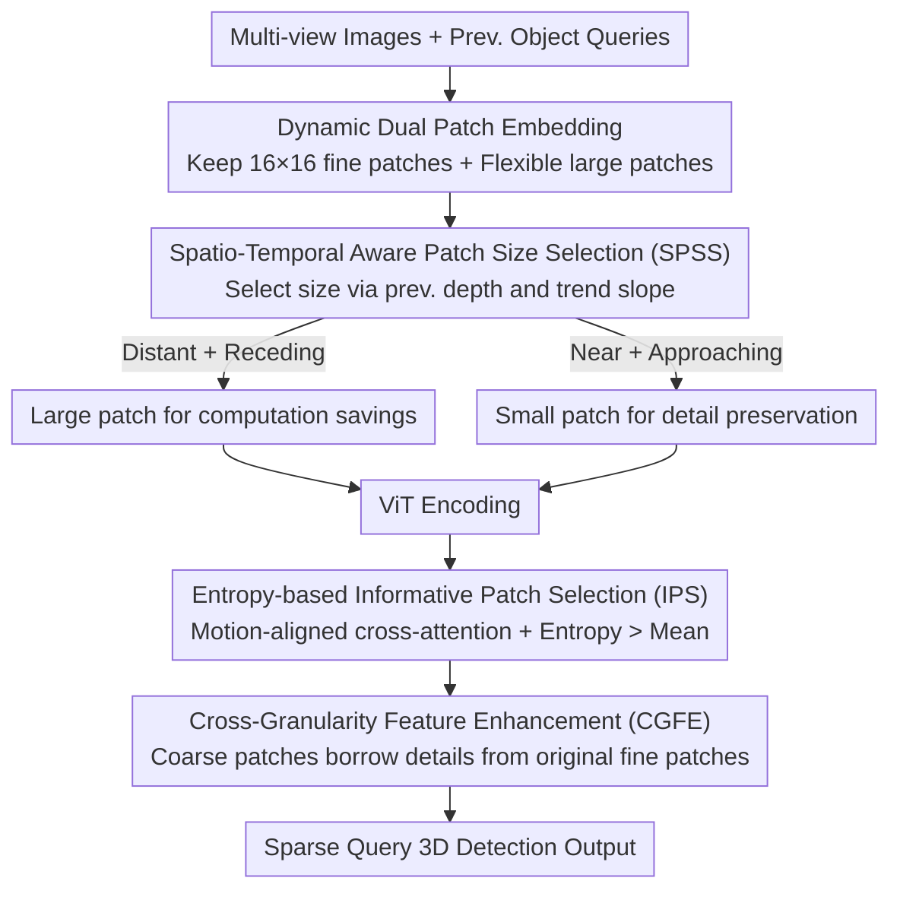

# SEPatch3D: Revisiting Token Compression for Accelerating ViT-based Sparse Multi-View 3D Object Detectors

**Conference**: CVPR 2026  
**arXiv**: [2604.14563](https://arxiv.org/abs/2604.14563)  
**Code**: [github.com/Mingqj/SEPatch3D](https://github.com/Mingqj/SEPatch3D)  
**Area**: 3D Vision  
**Keywords**: 3D object detection, token compression, patch size selection, multi-view detection, ViT acceleration

## TL;DR

Ours proposes SEPatch3D, which achieves a 57% inference acceleration in ViT-based sparse multi-view 3D detection while maintaining comparable accuracy through spatio-temporal aware dynamic patch size selection and an entropy-based informative patch enhancement mechanism.

## Background & Motivation

**Background**: ViT-based sparse query-style multi-view 3D detectors (e.g., StreamPETR) exhibit excellent performance but suffer from high inference latency.  
**Limitations of Prior Work**: Existing token compression strategies have several drawbacks: (1) token pruning may discard informative background regions critical for learning hard negative samples; (2) irregular aggregation in token merging disrupts contextual consistency; (3) simply increasing patch size beyond a threshold (e.g., >18) leads to performance degradation due to the loss of fine-grained semantic cues.  
**Key Insight**: Instead of pruning or merging, increasing patch sizes can reduce computation if fine-grained information is selectively preserved for semantically critical regions.

## Method

### Overall Architecture

SEPatch3D addresses the high inference latency of ViT-based sparse multi-view 3D detectors by focusing on dynamic patch size adjustment rather than conventional pruning or merging. The framework consists of two stages: first, dynamic dual patch embedding where the SPSS module adaptively selects the patch size for each frame based on spatio-temporal cues; second, selective cross-granularity feature enhancement where the IPS module identifies informative patches and the CGFE module restores details to these coarse patches using corresponding fine-grained patches.

### Key Designs

**1. Spatio-Temporal Aware Patch Size Selection (SPSS): Deciding current patch size based on object proximity in the previous frame**

Increasing patch size saves computation, but exceeding a threshold (e.g., >18) results in a loss of fine-grained semantics and accuracy drops. SPSS adapts the patch size to the scene by utilizing the average depth $\bar{D}^{T-1}$ and the change in depth trend slope $\Delta S^{T-1}$ from the previous frame's object queries. Distant objects or those moving away trigger large patches for efficiency, while near or approaching objects trigger small patches to preserve details. Other cases maintain the previous setting to ensure temporal stability, avoiding abrupt changes between frames.

**2. Entropy-based Informative Patch Selection (IPS): Identifying detail-worthy regions via information entropy**

To restore details, the system must identify which patches require it; fixed Top-K selection cannot adapt to scenes of varying complexity. IPS first enhances patch features through cross-attention with motion-aligned historical queries, then calculates the information entropy of L2-normalized features. Patches with entropy values exceeding the scene mean are selected as informative regions. Using "exceeding the mean" as an adaptive threshold instead of a fixed Top-K allows the selection count to match scene complexity.

**3. Cross-Granularity Feature Enhancement (CGFE): Borrowing details from original fine patches for coarse patches**

Selected coarse-grained patches lack detail if used directly. CGFE treats these coarse patches as queries and the original fine-grained patches from the corresponding regions as keys/values. Details are injected via position-encoding-enhanced cross-attention, while residual connections preserve the global structure. Informative patches often represent texture-rich areas or edges where coarse patches lose the most information, allowing this step to maintain detection accuracy despite significant acceleration.

### Loss & Training

Ours inherits the detection loss from StreamPETR and utilizes end-to-end training. The dual patch embedding maintains original 16×16 small patches as fine-grained feature references, while flexible large patches are used for efficient inference.

## Key Experimental Results

### Main Results

| Method | Backbone | NDS(%) | mAP(%) | Inference Time |
|------|------|--------|--------|---------|
| StreamPETR (patch=16) | ViT | Baseline | Baseline | Baseline |
| ToC3D-faster | ViT | Slightly Lower | Slightly Lower | Accelerated |
| SEPatch3D-faster | ViT | **Comparable** | **Comparable** | **-57%** |

On nuScenes, the method achieves 57% inference acceleration with less than 1 point of performance loss, performing 20% faster than ToC3D-faster. Effectiveness is also validated on Argoverse 2.

### Ablation Study

- The joint depth-trend decision in SPSS outperforms using depth or trend alone.
- The adaptive entropy threshold is superior to fixed Top-K selection.
- CGFE cross-granularity enhancement is critical for maintaining detection accuracy.

### Key Findings

- Performance begins to decline when patch size exceeds 18, but selective enhancement extends acceleration gains.
- Informative patches typically correspond to texture-rich or edge regions, which suffer most from coarse-grained quantization.
- Spatio-temporal aware selection effectively avoids sudden patch size fluctuations between consecutive frames.

## Highlights & Insights

- The concept of "increasing patch size + selective enhancement" is a novel alternative to "pruning/merging" for 3D detection.
- The cross-layer interaction design, where detection queries guide backbone compression, is highly effective.
- Unlike the foreground-oriented pruning in ToC3D, this approach retains background information valuable for learning difficult negative samples.

## Limitations & Future Work

- The predefined patch pairs ($P_s$, $P_l$) and the depth threshold $\theta$ require manual tuning.
- Fine-grained patches still require initial computation (though they do not pass through all ViT blocks).
- Validation is limited to the StreamPETR baseline; generalization to other sparse detectors has not been tested.

## Related Work & Insights

- The dynamic patch size selection concept can be extended to other ViT applications requiring an efficiency-accuracy balance.
- The paradigm of spatio-temporal queries guiding backbone computation breaks the tradition of unidirectional information flow.
- Cross-granularity enhancement is applicable to multi-scale representation learning.

## Rating

7/10 — Clear motivation, practical methodology, significant acceleration, and high utility for autonomous driving scenarios.

<!-- RELATED:START -->

## Related Papers

- [\[CVPR 2026\] Revisiting Token Compression for Accelerating ViT-based Sparse Multi-View 3D Object Detectors](revisiting_token_compression_for_accelerating_vit-based_sparse_multi-view_3d_obj.md)
- [\[CVPR 2026\] OLATverse: A Large-scale Real-world Object Dataset with Precise Lighting Control](olatverse_a_large-scale_real-world_object_dataset_with_precise_lighting_control.md)
- [\[CVPR 2026\] Revisiting Pose Sensitivity in Splat-based Computed Tomography under Sparse-view Reconstruction](revisiting_pose_sensitivity_in_splat-based_computed_tomography_under_sparse-view.md)
- [\[CVPR 2026\] Aligning Text, Images and 3D Structure Token-by-Token](aligning_text_images_and_3d_structure_token-by-token.md)
- [\[CVPR 2026\] Block-Sparse Global Attention for Efficient Multi-View Geometry Transformers](block-sparse_global_attention_for_efficient_multi-view_geometry_transformers.md)

<!-- RELATED:END -->
