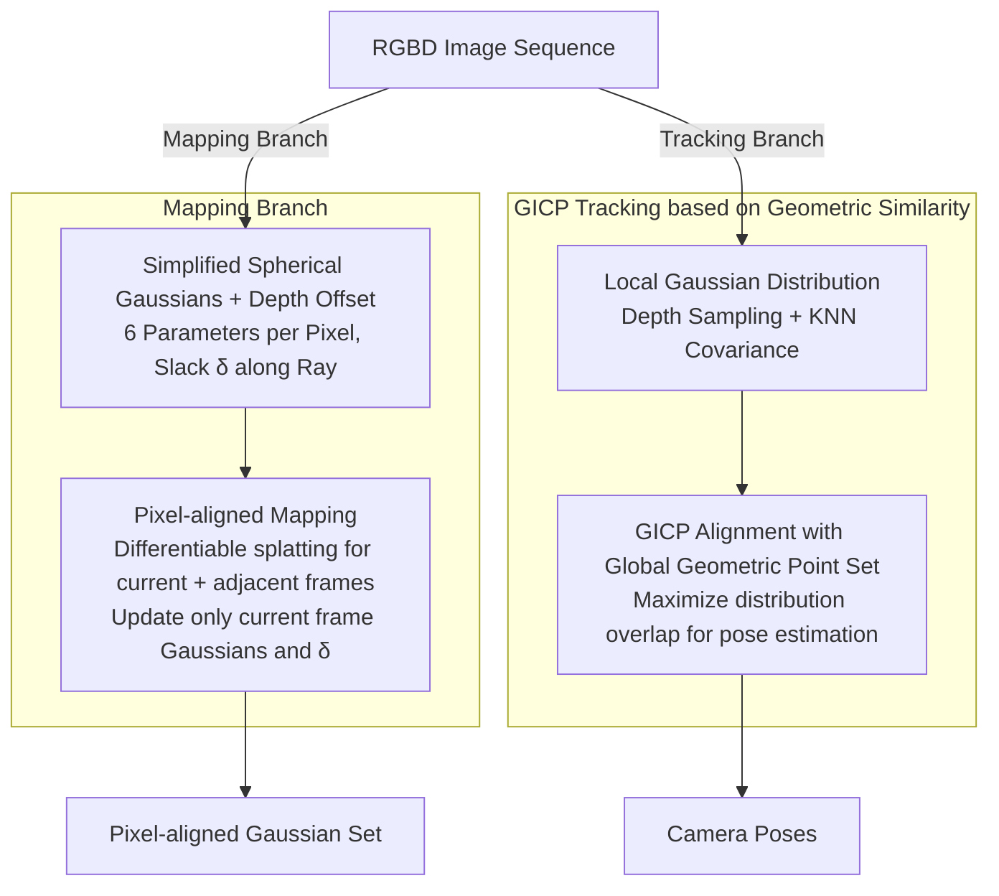

# SGAD-SLAM: Splatting Gaussians at Adjusted Depth for Better Radiance Fields in RGBD SLAM

**Conference**: CVPR 2026  
**arXiv**: [2603.21055](https://arxiv.org/abs/2603.21055)  
**Code**: [https://machineperceptionlab.github.io/SGAD-SLAM-Project](https://machineperceptionlab.github.io/SGAD-SLAM-Project)  
**Area**: 3D Vision  
**Keywords**: 3DGS, RGBD SLAM, Pixel-aligned Gaussians, Depth Offset, Generalized ICP

## TL;DR
The authors propose SGAD-SLAM, which utilizes a pixel-aligned simplified Gaussian representation and allows Gaussians to adjust depth offsets along the ray to improve rendering quality and scalability. A GICP tracking strategy based on geometric similarity is introduced to accelerate camera pose estimation, outperforming state-of-the-art methods on Replica, TUM, ScanNet, and ScanNet++.

## Background & Motivation

1.  **Background**: 3DGS has become the mainstream radiance field representation in RGBD SLAM as an alternative to NeRF, significantly improving rendering efficiency through differentiable splatting operations. Current 3DGS-SLAM methods are divided into two categories based on Gaussian movement: (a) Global free 3D Gaussians — flexible but requiring all Gaussians to be maintained in GPU memory, making it difficult to scale to large scenes; (b) View-bound Gaussians (e.g., VTGS-SLAM) — strictly anchored at fixed depth points, scalable but limiting rendering quality.
2.  **Limitations of Prior Work**: Global Gaussian methods suffer from insufficient GPU memory in large scenes. View-bound Gaussian methods have limited rendering quality because Gaussian positions are fixed to the observed depth, failing to adapt to depth noise and geometric inaccuracies. Regarding tracking, rendering-based tracking (optimizing rendering error) is inefficient.
3.  **Key Challenge**: The trade-off between scalability and rendering quality — pixel alignment saves memory but sacrifices quality due to fixed positions; free movement improves quality but incurs high memory overhead.
4.  **Goal**: (1) Design a Gaussian representation that is both scalable and high-quality; (2) achieve camera pose estimation faster than rendering-based tracking.
5.  **Key Insight**: Allow pixel-aligned Gaussians to make limited adjustments (depth offsets) along the ray direction, combining the scalability of pixel alignment with the rendering flexibility of position adjustment. Tracking uses 3D geometric alignment instead of 2D rendering optimization.
6.  **Core Idea**: Pixel-aligned Gaussians + learnable depth offset = scalable and high-quality radiance field + GICP geometric tracking = fast and precise localization.

## Method

### Overall Architecture
SGAD-SLAM addresses the long-standing dilemma in 3DGS-SLAM between scalability and high rendering quality. Freely moving global Gaussians render well but must reside in VRAM, which is unsustainable for large scenes. View-bound Gaussians locked to observed depths save VRAM but are hindered by depth noise. The system resolves this by splitting mapping and tracking into two parallel branches. The Mapping branch processes frame-by-frame: it initializes a set of pixel-aligned simplified Gaussians for each depth map, allowing each Gaussian a small degree of learnable depth slack along the ray. Differentiable splatting is then used to render back to the current and adjacent frames, learning Gaussian attributes and depth offsets via rendering error. The Tracking branch bypasses rendering and maintains a global 3D geometric point set to characterize the scene structure. For each incoming frame, the local Gaussian distribution of current depths is aligned to this global distribution, estimating the camera pose through the alignment process. The input is an RGBD image sequence, and the output is a collection of pixel-aligned Gaussians and camera poses.

### Key Designs

**1. Simplified Spherical Gaussians + Depth Offset: Maintaining rendering quality with minimal parameters**

The restricted rendering of view-bound Gaussians stems from positions being hard-coded to observed depth points, which cannot self-correct when depth is noisy. This method slims down the Gaussians to the extreme: each Gaussian retains only 6 parameters—color ($\mathbb{R}^3$), a single variance for radius ($\mathbb{R}^1$), opacity ($\mathbb{R}^1$), and depth offset ($\mathbb{R}^1$). Standard 3DGS parameters like 4D rotation, 3D position, and two extra variances are removed, reducing parameters from 59 to 6 (approx. 10x). Positions are no longer stored separately but are determined by the ray from the camera center to the pixel; the only degree of freedom is the depth offset $\delta_i$, making the 3D position $\tilde{D}_i = |D_i + \delta_i|$. This scalar is crucial: Gaussians remain pixel-aligned without local densification, but allowing small movements along the ray enables the per-pixel adaptive position tuning to boost rendering quality even under tight constraints—retaining the memory benefits of pixel alignment while recovering the flexibility lost in fixed-depth schemes.

**2. Pixel-aligned Mapping: Local fitting per frame to offload memory pressure**

The scalability bottleneck of global free Gaussians is the requirement to keep the entire scene's Gaussians in GPU memory for optimization. This method switches to frame-by-frame mapping: each frame initializes a set of pixel-aligned Gaussians $G_i = \{g_i^j\}_{j=1}^J$, which are rendered into the current and several adjacent frames via differentiable splatting to minimize the rendering error:

$$\min_{G_i, \delta_i} \sum_k \left(\rho \|V_k - V_k'\|_1 + \tau L_S + \sigma U_k \|D_k - D_k'\|_1\right)$$

Optimization only affects the current frame's Gaussians and depth offsets $\delta_i$; neighboring Gaussians are fixed. This ensures cross-frame consistency through neighbor constraints without updating everything simultaneously. Missing depth regions are filled using interpolation or rendering from adjacent Gaussians. Consequently, each frame only fits itself and a few neighbors, avoiding the need to keep the full scene in VRAM and improving scalability for large scenes.

**3. GICP Tracking based on Geometric Similarity: Replacing slow rendering-based tracking with 3D geometric alignment**

Mainstream 3DGS-SLAM estimates poses by optimizing rendering errors, which requires repeated rendering and iteration per frame. This tracking branch uses pure 3D geometric alignment. It uniformly samples 3D points from the current depth map and calculates covariance matrices using KNN neighborhoods, resulting in a set of local Gaussian distributions $T_i$. Simultaneously, it maintains a global Gaussian point set $T$ representing the scanned scene geometry. Pose estimation is achieved via Generalized ICP (GICP) by aligning $T_i$ to $T$, maximizing the overlap between the two sets of distributions. Point-to-plane distances are used for correspondences (normals derived via SVD), followed by scale normalization to eliminate depth range discrepancies across frames. This approach is fast—GICP is highly parallelizable compared to 2D rendering optimization—and it is robust to noisy depth data by modeling local geometry with Gaussian distributions rather than raw points, all without relying on pre-trained priors like NetVLAD.

### Loss & Training
- Mapping Loss: L1 RGB loss + SSIM loss + masked L1 depth loss.
- Tracking Initialization: Default constant velocity assumption; optional rendering-based initialization (using rendering error from the previous frame to estimate pose) for textureless or high-motion scenes.
- Global Geometric Point Set $T$ Update: Incremental addition of non-overlapping Gaussians after tracking each frame.

## Key Experimental Results

### Main Results - Rendering Quality

| Dataset | Metric | SGAD-SLAM | VTGS-SLAM | Gaussian-SLAM | SplaTAM |
|--------|------|-----------|-----------|---------------|---------|
| Replica | PSNR↑ | **44.87** | 43.34 | 42.08 | 34.11 |
| Replica | SSIM↑ | **0.998** | 0.996 | 0.996 | 0.970 |
| TUM | PSNR↑ | **38.60** | 30.20 | 25.05 | 22.80 |
| TUM | SSIM↑ | **0.997** | 0.972 | 0.929 | 0.893 |
| ScanNet | PSNR↑ | **42.31** | 31.10 | 27.70 | 19.14 |

### Main Results - Tracking Accuracy (ATE RMSE [cm]↓)

| Dataset | SGAD-SLAM | GS-ICP SLAM | VTGS-SLAM | LoopSplat* | CG-SLAM* |
|--------|-----------|-------------|-----------|------------|----------|
| Replica Avg | **0.16** | **0.16** | 0.28 | 0.26 | 0.27 |
| TUM Avg | **2.0** | 2.4 | 2.6 | 2.3 | **2.0** |
| ScanNet Avg | 7.9 | - | 11.3 | **7.7** | 8.1 |
| ScanNet++ Avg | **0.59** | - | 1.6 | 2.05 | - |

### Main Results - Reconstruction Quality (Replica)

| Metric | SGAD-SLAM | VTGS-SLAM | Point-SLAM | Loopy-SLAM* |
|------|-----------|-----------|------------|-------------|
| Depth L1 [cm]↓ | **0.30** | 0.51 | 0.44 | 0.35 |
| F1 [%]↑ | **90.9** | 90.4 | 89.8 | 90.8 |

### Key Findings
- **Crucial Role of Depth Offset**: Pixel-aligned Gaussians + depth offset outperform both global free and fixed-depth Gaussians even under restricted conditions (simplified models, limited movement, no densification).
- **Significant Rendering Gains on TUM and ScanNet**: PSNR on TUM increased from a second-best 30.20 to 38.60 (+8.4 dB), and on ScanNet from 31.10 to 42.31 (+11.2 dB), showing that depth offset is particularly effective for real-world scenes.
- **No Pre-trained Priors for Tracking**: Without relying on pre-trained models like NetVLAD for loop closure, GICP geometric alignment achieves accuracy comparable to or better than methods using pre-trained priors.
- **Importance of Rendering Initialization for ScanNet++**: Without initialization, ATE on ScanNet++ rises from 0.59 to 6.5, indicating rendering-based initialization is necessary for high-motion/textureless scenes.

## Highlights & Insights
- The **"Pixel-aligned + Depth offset" compromise** is elegant: it combines the memory scalability of pixel alignment (no need for a global Gaussian pool) with the rendering flexibility of free Gaussians (limited adjustment along rays). This "constrained yet adjustable" design is widely applicable.
- **Geometric Tracking vs. Rendering Tracking**: Modeling local geometry with 3D Gaussian distributions and using GICP alignment is not only faster but also more robust on noisy real-world data, offering a distinct technical route from mainstream rendering-based tracking.
- **Extreme Gaussian Compression**: Reducing parameters from 59 to 6 (approx. 10x) proves that in SLAM scenarios, a few carefully designed parameters are sufficient to match or exceed full-parameter performance when constraints are well-defined.

## Limitations & Future Work
- The depth offset is a 1D adjustment along the ray, making it unable to handle scenes requiring lateral shifts (e.g., systematic depth sensor biases).
- The continuous growth of the global geometric point set $T$ may lead to memory issues in extremely large scenes, requiring a point set pruning strategy.
- Current experiments are primarily conducted in indoor scenes; performance in outdoor/open environments remains unverified.
- Depth map sampling for GICP tracking in textureless regions might lack distinctive geometric features.

## Related Work & Insights
- **vs VTGS-SLAM**: VTGS-SLAM Gaussians are strictly anchored and immobile; this work breaks that limitation with depth offsets, achieving significantly better rendering quality (+8.4 dB on TUM) using similarly simplified Gaussians.
- **vs GS-ICP SLAM**: Both use ICP-like tracking, but this work models local geometry with Gaussian distributions instead of raw points, achieving similar tracking accuracy on Replica while significantly leading in rendering.
- **vs SplaTAM/Gaussian-SLAM**: These methods utilize global free Gaussians with high storage costs and slow convergence; the pixel-aligned strategy used here achieves better rendering while maintaining scalability.

## Rating
- Novelty: ⭐⭐⭐⭐ The combination of depth offset and pixel alignment is simple and effective; the geometric tracking strategy is novel.
- Experimental Thoroughness: ⭐⭐⭐⭐⭐ 4 datasets, multiple metrics (rendering/tracking/reconstruction), and rich comparisons.
- Writing Quality: ⭐⭐⭐⭐ Clear structure, intuitive diagrams, and detailed method descriptions.
- Value: ⭐⭐⭐⭐ Sets a new SOTA for 3DGS SLAM with massive improvements on real-world data.

<!-- RELATED:START -->

## Related Papers

- [\[CVPR 2026\] Unblur-SLAM: Dense Neural SLAM for Blurry Inputs](unblur-slam_dense_neural_slam_for_blurry_inputs.md)
- [\[CVPR 2026\] ODGS-SLAM: Omnidirectional Gaussian Splatting SLAM](odgs-slam_omnidirectional_gaussian_splatting_slam.md)
- [\[CVPR 2026\] Flow4DGS-SLAM: Optical Flow-Guided 4D Gaussian Splatting SLAM](flow4dgs-slam_optical_flow-guided_4d_gaussian_splatting_slam.md)
- [\[CVPR 2026\] AERGS-SLAM: Auto-Exposure-Robust Stereo 3D Gaussian Splatting SLAM](aergs-slam_auto-exposure-robust_stereo_3d_gaussian_splatting_slam.md)
- [\[CVPR 2026\] SCE-SLAM: Scale-Consistent Monocular SLAM via Scene Coordinate Embeddings](sce-slam_scale-consistent_monocular_slam_via_scene_coordinate_embeddings.md)

<!-- RELATED:END -->
