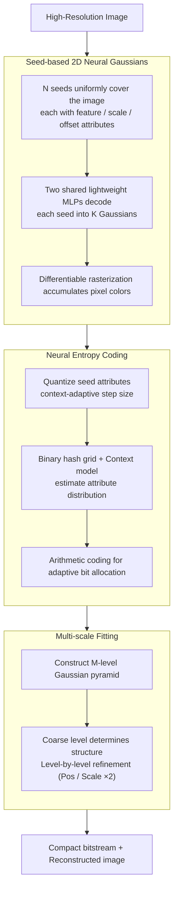

# SGI: Structured 2D Gaussians for Efficient and Compact Large Image Representation

**Conference**: CVPR 2026  
**arXiv**: [2603.07789](https://arxiv.org/abs/2603.07789)  
**Code**: None  
**Area**: 3D Vision  
**Keywords**: 2D Gaussian Splatting, image representation, neural compression, entropy coding, multi-scale optimization  

## TL;DR

SGI proposes a seed-based structured 2D Gaussian representation framework. By organizing unstructured Gaussian primitives into seed-driven neural Gaussians, combined with context-guided entropy coding and multi-scale optimization strategies, it achieves up to a 7.5× compression ratio and 6.5× optimization acceleration for high-resolution image representation while maintaining or even improving reconstruction fidelity.

## Background & Motivation

**Background**: As an emerging image representation technology, 2D Gaussian Splatting enables efficient rendering on low-end devices. However, scaling it to high-resolution images requires the independent optimization and storage of millions of unstructured Gaussian primitives, leading to two core bottlenecks:

1. **Parameter Redundancy**: Existing methods (e.g., GaussianImage, LIG) optimize each Gaussian independently, failing to exploit spatial locality—where adjacent pixels often share similar colors, textures, and structures—resulting in significant redundant parameters between neighboring primitives.
2. **Optimization Overhead**: Independent optimization of millions of Gaussian primitives at high resolutions converges slowly, especially when quantization-aware fine-tuning is introduced for compression.

**Limitations of Prior Work**:
- INR methods (SIREN, I-NGP) require extensive MLP forward passes, leading to high computational costs.
- 3D anchor-based methods (Scaffold-GS, HAC) do not achieve the same compression gains when directly applied to 2D image modeling, as 2D Gaussians already lack parameters like opacity, limiting potential storage savings.
- LIG's Level-of-Gaussian only uses a subset of Gaussians for residual fitting rather than global optimization.

## Method

### Overall Architecture

SGI addresses two major pain points in representing high-resolution images with 2D Gaussian Splatting: parameter redundancy and optimization overhead caused by independent optimization/storage of millions of unstructured primitives. The core idea is to reorganize "unstructured Gaussian primitives" into "seed-driven structured Gaussians," further augmented by two layers of compression and acceleration: Seed-based 2D Neural Gaussians decompose the image into multi-scale local spaces where each seed predicts a set of Gaussians via a lightweight MLP; Neural Entropy Coding utilizes a binary hash grid and context models to estimate seed attribute distributions for adaptive bit allocation; and Multi-scale Fitting utilizes a Gaussian pyramid for coarse-to-fine optimization to accelerate convergence.

### Key Designs

**1. Seed-based 2D Neural Gaussians: Implicitly encoding spatial redundancy using few seeds + shared MLPs**

Adjacent pixels often exhibit similar colors, textures, and structures, yet existing methods optimize Gaussians independently, ignoring spatial locality. SGI predefines $N$ seeds distributed uniformly across the image. Each seed at position $\boldsymbol{x_a} \in \mathbb{R}^2$ is associated with a set of attributes $\mathcal{A} = \{\boldsymbol{f_a} \in \mathbb{R}^D, \boldsymbol{s_o} \in \mathbb{R}^2, \boldsymbol{s_a} \in \mathbb{R}^2, \boldsymbol{\delta} \in \mathbb{R}^{K \times 2}\}$:

| Symbol | Dimension | Meaning |
|------|------|------|
| $\boldsymbol{f_a}$ | $\mathbb{R}^D$ | Seed feature vector encoding local region information |
| $\boldsymbol{s_o}$ | $\mathbb{R}^2$ | Offset scaling factor controlling spatial range of associated Gaussians |
| $\boldsymbol{s_a}$ | $\mathbb{R}^2$ | Scale factor adjusting the final scale of Gaussians |
| $\boldsymbol{\delta}$ | $\mathbb{R}^{K \times 2}$ | Learned offsets for $K$ associated Gaussians |

The position of each of the $K$ Gaussians per seed is derived from the seed position plus scaled offsets: $\{\boldsymbol{\mu}^{(k)}\}_{k=0}^{K-1} = \boldsymbol{x_a} + \{\boldsymbol{\delta}^{(k)}\}_{k=0}^{K-1} \cdot \boldsymbol{s_o}$. Attributes are decoded from $\boldsymbol{f_a}$ by two shared lightweight MLPs—$\text{MLP}_c$ outputs opacity-weighted color coefficients $\mathbf{c'} \in \mathbb{R}^3$, and $\text{MLP}_\Sigma$ outputs a base scale $\boldsymbol{s_{\text{base}}}$ and rotation angle $\theta$. The final scale is $\boldsymbol{s} = \boldsymbol{s_{\text{base}}} \cdot \boldsymbol{s_a}$, and the covariance is constructed via the positive definite decomposition $\boldsymbol{\Sigma} = \mathbf{R}\mathbf{S}\mathbf{S}^\top\mathbf{R}^\top$ (where $\mathbf{R}(\theta)$ is a 2D rotation matrix and $\mathbf{S}$ is a diagonal scale matrix). Pixel color is the accumulation of all contributing Gaussians $\boldsymbol{C} = \sum_{i \in I} \mathbf{c'}_i G_i(\mathbf{x})$, where $G(\mathbf{x}) = \exp\left(-\frac{1}{2}(\mathbf{x}-\boldsymbol{\mu})^\top \boldsymbol{\Sigma}^{-1}(\mathbf{x}-\boldsymbol{\mu})\right)$. Consequently, each Gaussian only requires 8 parameters (Position 2 + Covariance 3 + Weighted Color 3), while substantial spatial redundancy is implicitly absorbed by seed features and shared MLPs, significantly reducing the number of independent parameters.

**2. Neural Entropy Coding: Exploiting structural regularity for bit savings**

Relying solely on seed structures yields only about 3% storage savings compared to pure 2D Gaussian methods (like LIG). Thus, SGI's compression core performs entropy coding on top of the seed structure. Quantization involves adding noise during training and rounding during inference:

$$\hat{\boldsymbol{f}}_j^{(i)} = \begin{cases} \boldsymbol{f}_j^{(i)} + \mathcal{U}(-\frac{1}{2}, \frac{1}{2}) \cdot q_j^{(i)} & \text{Training} \\ \text{Round}(\boldsymbol{f}_j^{(i)} / q_j^{(i)}) \cdot q_j^{(i)} & \text{Inference} \end{cases}$$

The quantization step size $q_j^{(i)} = Q_j \times (1 + \tanh(r_j^{(i)}))$ is adaptively predicted by a context model. For probability modeling, a learnable binary hash grid $\mathcal{H}$ captures spatial consistency of seeds. A context model $\text{MLP}_p$ estimates Gaussian parameters $\{\mu_j^{(i)}, \sigma_j^{(i)}, r_j^{(i)}\}_{j=0}^{3} = \text{MLP}_p(\mathcal{H}(\boldsymbol{x}_a^{(i)}))$ for each attribute component. Attribute probabilities are obtained by integrating the Gaussian distribution over quantization intervals, driving arithmetic coding for adaptive bit allocation. Ablations show this step is the primary driver of compression (dropping FGF2 storage from 104.08MB at $\lambda=0$ to 16.33MB at $\lambda=0.001$).

**3. Multi-scale Fitting Strategy: Accelerating convergence with Gaussian pyramids**

Directly optimizing seed parameters at high resolutions is slow and difficult to converge. SGI constructs an $M$-level Gaussian pyramid $\{I_0=I, I_1, \ldots, I_{M-1}\}$ (downsampled by 2× per level). Optimization starts from the coarsest level $l=M-1$ for seeds and MLPs, then transfers results to the next level (multiplying position and scale by 2 to adapt to doubled resolution), iterating until the finest level $l=0$. The coarse levels define the general structure, while fine levels only require local refinement, significantly improving optimization time and convergence speed.

### Loss & Training

The total loss combines reconstruction fidelity and bit consumption regularization:

$$L = L_{\text{img}} + \frac{\lambda}{N \cdot d_\mathcal{A}}(L_{\text{entropy}} + L_{\text{hash}})$$

Where $L_{\text{img}}$ is the L1 loss between the rendered and target images, $L_{\text{entropy}}$ is the information entropy loss of seed attributes (driving the probability model toward compact distributions), $L_{\text{hash}}$ is the upper bound on bit consumption for the binary hash grid, the rate-distortion tradeoff $\lambda = 0.001$, and $d_\mathcal{A} = D + 4 + 2K$ is the total attribute dimension per seed.

## Experiments

### Experimental Settings

- **Datasets**: FGF2 (4 satellite images, ~51MP), ICB (2 natural images, 27.7/39.1MP), STimage (3 pathology images, ~76MP)
- **Metrics**: PSNR, SSIM, LPIPS, Optimization Time (min), Model Size (MB)
- **SGI Settings**: Low bitrate (3.5M Gaussians) and High bitrate (10M Gaussians)

### Main Results

| Method | FGF2 PSNR↑ | FGF2 Size(MB)↓ | FGF2 Time(min)↓ | ICB PSNR↑ | ICB Size(MB)↓ | ICB Time(min)↓ |
|------|-----------|----------------|-----------------|----------|--------------|----------------|
| SIREN | 22.05 | 15.79 | 649.71 | 27.62 | 15.79 | 363.34 |
| I-NGP | 28.55 | 21.07 | 72.32 | 33.09 | 21.07 | 48.11 |
| HAC | 25.15 | 16.78 | 261.69 | 34.47 | 13.52 | 270.57 |
| GaussianImage | 27.30 | 23.37 | 322.17 | 31.09 | 23.37 | 282.61 |
| **SGI (low)** | **31.24** | **16.33** | **48.43** | **35.27** | **12.30** | **44.75** |
| 3DGS | 34.93 | 787.73 | 642.85 | 37.52 | 787.73 | 515.99 |
| Scaffold-GS | 28.25 | 112.61 | 248.83 | 35.76 | 105.81 | 162.11 |
| LIG | 32.10 | 106.81 | 87.56 | 36.40 | 106.81 | 68.73 |
| **SGI (high)** | **36.27** | **41.74** | **97.75** | **39.09** | **32.15** | **86.11** |

### Ablation Study

**Ablation on number of Gaussians per seed $K$**:

| $K$ | FGF2 PSNR↑ | FGF2 Size(MB)↓ | ICB PSNR↑ | ICB Size(MB)↓ |
|-----|-----------|----------------|----------|--------------|
| 5 | 31.29 | 18.48 | 35.03 | 13.64 |
| **10** | **31.24** | **16.33** | **35.27** | **12.30** |
| 15 | 30.61 | 15.32 | 34.88 | 11.48 |
| 20 | 30.62 | 14.83 | 34.57 | 10.87 |

Larger $K$ yields a more compact model but slightly lower fidelity; $K=10$ is the optimal tradeoff.

**Key Findings**:

1. **Entropy Coding is the Core of Compression**: Without entropy coding ($\lambda=0$), FGF2 storage is 104.08MB; with $\lambda=0.001$, it drops to 16.33MB (6.4× reduction). Seed structure alone only reduces storage by 3%, meaning entropy coding provides the vast majority of compression gains.
2. **Multi-scale Fitting Accelerates Signficantly**: With $M=3$ pyramid levels, optimization time drops from 71.59 minutes ($M=1$) to 48.43 minutes (32% speedup), while PSNR improves from 30.58 to 31.24 dB.
3. **Storage Breakdown**: Seed features $\boldsymbol{f_a}$ account for 48% of total storage, offsets $\boldsymbol{\delta}$ account for 35%, while the hash grid and MLPs account for only ~1%, representing minimal overhead.
4. **Low Bitrate Advantage**: In low bpp regions, SGI significantly outperforms JPEG (achieving 26.09 dB at 0.245 bpp on ICB vs. JPEG's 22.77 dB at 0.296 bpp).

## Highlights & Insights

- **First Structured 2D Gaussian Representation**: Adapts the anchor-based concepts from the 3D domain to 2D images and uses entropy coding to overcome the limited compression gains typically seen in 2D scenarios.
- **Superior Compression Efficiency**: Achieves 7.5× compression compared to LIG and 1.6× compared to quantized GaussianImage.
- **High Optimization Efficiency**: Multi-scale fitting strategy achieves 1.6~6.5× acceleration without sacrificing reconstruction quality.
- **Low-end Device Friendly**: Fast rendering based on differentiable rasterization allows handling 76MP images on a single 24GB A10 GPU.

## Limitations & Future Work

- Large images still require tens of minutes for optimization (per-image optimization paradigm), making it unsuitable for real-time encoding scenarios.
- Each image requires an independently optimized model, lacking generalization capabilities across different images.
- Currently only validated on static images; not yet extended to video or dynamic scenes.
- Under high bitrate settings, storage remains in the 30-40MB range, offering no absolute advantage over learned image codecs like VVC or AV1.

## Rating ⭐⭐⭐⭐

A solid and systematic work that organically combines seed structures, entropy coding, and multi-scale optimization to achieve significant improvements in storage, speed, and quality for large-scale image representation tasks. The experiments are comprehensive and the ablations are thorough. However, the per-image optimization paradigm and lack of generalization remain inherent limitations.

<!-- RELATED:START -->

## Related Papers

- [\[AAAI 2026\] GaussianImage++: Boosted Image Representation and Compression with 2D Gaussian Splatting](../../AAAI2026/3d_vision/gaussianimage_boosted_image_representation_and_compression_with_2d_gaussian_spla.md)
- [\[CVPR 2026\] SwiftTailor: Efficient 3D Garment Generation with Geometry Image Representation](swifttailor_efficient_3d_garment_generation_with_geometry_image_representation.md)
- [\[CVPR 2026\] Improving Human Image Animation via Semantic Representation Alignment](improving_human_image_animation_via_semantic_representation_alignment.md)
- [\[CVPR 2026\] TokenHand: Discrete Token Representation for Efficient Hand Mesh Reconstruction](tokenhand_discrete_token_representation_for_efficient_hand_mesh_reconstruction.md)
- [\[ECCV 2024\] GaussianImage: 1000 FPS Image Representation and Compression by 2D Gaussian Splatting](../../ECCV2024/3d_vision/gaussianimage_1000_fps_image_representation_and_compression_by_2d_gaussian_splat.md)

<!-- RELATED:END -->
