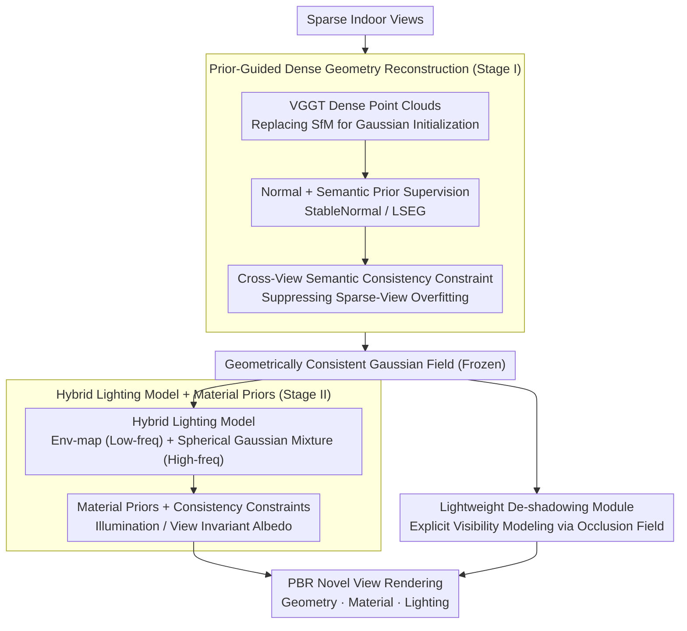

# SGS-Intrinsic: Semantic-Invariant Gaussian Splatting for Sparse-View Indoor Inverse Rendering

**Conference**: CVPR 2026  
**arXiv**: [2603.27516](https://arxiv.org/abs/2603.27516)  
**Code**: [https://github.com/GrumpySloths/SGS_Intrinsic.github.io](https://github.com/GrumpySloths/SGS_Intrinsic.github.io)  
**Area**: 3D Vision  
**Keywords**: Inverse Rendering, Sparse-View, Gaussian Splatting, Material Decomposition, Indoor Scenes

## TL;DR

SGS-Intrinsic proposes a two-stage indoor inverse rendering framework. The first stage utilizes semantic and geometric priors to construct a dense, geometrically consistent Gaussian field, while the second stage combines a hybrid lighting model and material priors for material-illumination decomposition, incorporating a de-shadowing module to prevent shadow baking into the albedo.

## Background & Motivation

Sparse-view indoor inverse rendering is an extremely ill-posed problem characterized by sparse supervision signals, complex indoor lighting (near-field + high-frequency), and strong material-illumination coupling. Existing methods either perform geometric reconstruction without material decomposition, assume distant light sources (unsuitable for indoors), or fail to function under sparse-view conditions.

**Three Major Challenges**: (1) Unreliable Gaussian geometry reconstruction under sparse views; (2) Difficulty in modeling indoor near-field high-frequency illumination; (3) Cast shadows are prone to being incorrectly baked into material properties.

## Method

### Overall Architecture

Indoor inverse rendering requires simultaneous estimation of geometry, material, and lighting from a few photographs. Sparse views push this inherently ill-posed problem to its limit due to insufficient supervision and the entanglement of material and lighting. The core strategy of SGS-Intrinsic is to decouple the task into two stages: "stabilize geometry first, then decompose materials," rather than pursuing an end-to-end approach. In Stage I, instead of relying on sparse point clouds from SfM, dense scene point clouds from VGGT are used for Gaussian initialization, supplemented by normal and semantic priors to cultivate a geometrically reliable Gaussian field. In Stage II, inverse rendering is performed on this fixed geometry: a hybrid lighting model captures both far-field environment light and near-field high-frequency light, while material priors from diffusion models "extract" materials from illumination. Finally, a de-shadowing module is integrated to prevent the common ambiguity of "interpreting shadows as material color."

### Key Designs

**1. Prior-Guided Dense Geometry Reconstruction: Using Pre-trained Models to Compensate for Missing Supervision**

In sparse views, geometry is the first to fail—traditional SfM recovers only scattered points with limited images, providing insufficient support for subsequent Gaussian optimization. Inaccurate geometry makes material decomposition impossible. SGS-Intrinsic replaces SfM with VGGT to provide dense scene layout point clouds as the starting point for Gaussian initialization. To further solidify the Gaussian field, the paper introduces two pre-trained priors: StableNormal provides normal supervision $\mathcal{L}_{normal} = 1 - \hat{n}^T n_m$ to align Gaussian orientations with true surface normals, and LSEG provides semantic supervision. Addressing the tendency of sparse views to overfit to training perspectives, a semantic consistency constraint is added between training views and virtual novel views. The principle that "semantics should not drift with the viewpoint" serves as a virtually free prior to drive geometry toward better generalization.

**2. Hybrid Lighting Model + Material Priors: Frequency-Split Illumination Modeling and Diffusion Priors to Break Ambiguity**

Indoor lighting is challenging because it contains both large-scale, slowly varying ambient light and near-field high-frequency components like windows or lamps. Single lighting representations either blur details or suffer from high computational costs. The paper adopts a divide-and-conquer strategy: an environment map captures distant low-frequency light, while a Spherical Gaussian Mixture (SGM) approximates near-field high-frequency illumination. Combined, they form a complete incident light field. To resolve the inherent ambiguity between material and lighting (e.g., is a surface dark due to its material or lack of light?), the method leverages material priors learned from diffusion models as consistency constraints across views and lighting conditions. This forces the optimizer to produce an "illumination-invariant and view-invariant" material solution, fundamentally weakening the material-lighting coupling.

**3. Lightweight De-shadowing Module: Explicitly Attributing Cast Shadows to Occlusion**

Indoor scenes are dense with cast shadows. Without intervention, an optimizer often takes the path of least resistance by assuming "the material here is just dark," resulting in shadows being baked into the albedo. SGS-Intrinsic adds a lightweight de-shadowing model to explicitly model visibility, attributing darkness in shadow regions to "occlusion hindering light" rather than the material itself. Working alongside the material consistency constraint, the de-shadowing module peels away the "fake material" layer of shadows, while the consistency constraint ensures that the revealed material provides the same albedo in both lit and shadowed areas.

### Loss & Training

The training objective for Stage I consists of RGB reconstruction loss + normal loss + semantic consistency loss to stabilize geometry. Stage II optimizes PBR rendering loss + material consistency loss + de-shadowing regularization on the frozen geometry to separate lighting from material.

## Key Experimental Results

### Main Results

| Method | Interiorverse NVS PSNR | Albedo Accuracy | Description |
|------|----------------------|-------------|------|
| GeoSplat | Lower | Lower | Insufficient geometry |
| IRGS | Moderate | Moderate | Limited lighting model |
| **Ours** | **Optimal** | **Optimal** | Comprehensive lead |

The method demonstrates leading performance across all novel view synthesis and inverse rendering metrics on benchmark datasets.

### Ablation Study

| Configuration | NVS Quality | Material Decomposition | Description |
|------|---------|---------|------|
| W/O Prior Guidance | Significant Decrease | Poor | Unreliable geometry affects downstream tasks |
| W/O Hybrid Lighting | — | Decrease | Insufficient near-field lighting modeling |
| W/O De-shadowing | — | Shadow Baking | Albedo contaminated by shadows |
| Full Model | Optimal | Optimal | All components are necessary |

### Key Findings

- Dense initialization provided by VGGT is the critical foundation for success in sparse views—accurate geometry is the prerequisite for accurate inverse rendering.
- The de-shadowing module significantly improves albedo estimation quality; shadow baking is a primary source of material estimation error in indoor scenes.
- Semantic consistency constraints effectively prevent overfitting under sparse-view conditions.

## Highlights & Insights

- **Rationality of Two-Stage Decoupling**: A clear dependency exists between geometry and material decomposition—establishing geometry before decomposing materials is more stable than joint end-to-end optimization.
- **De-shadowing as an Independent Module**: Explicitly modeling shadows rather than letting the optimizer handle them implicitly is a simple yet critical design choice.
- **Pre-trained Models as Prior Sources**: The combination of pre-trained models such as StableNormal, LSEG, and VGGT demonstrates how rich priors can compensate for data scarcity in sparse views.

## Limitations & Future Work

- Dependency on multiple pre-trained models (VGGT, StableNormal, LSEG, Diffusion models) leads to high system complexity.
- Limited capability in handling non-Lambertian materials such as mirrors or glass.
- Efficiency of two-stage training is lower than end-to-end solutions.
- Future work could explore reducing dependency on multiple prior models or unifying them into a single architecture.

## Related Work & Insights

- **vs GeoSplat/IRGS**: Compared to other 3DGS inverse rendering methods, SGS-Intrinsic achieves better results through stronger priors and a dedicated de-shadowing module.
- **vs NeRF-based Inverse Rendering**: The explicit representation of 3DGS allows for more direct decoupling of PBR attributes.
- **vs Single-Image Inverse Rendering**: Multi-view methods naturally possess 3D consistency, though sparse views introduce significant challenges.

## Rating

- Novelty: ⭐⭐⭐⭐ Solid design across modules with valuable de-shadowing insights, though overall a combination of existing techniques.
- Experimental Thoroughness: ⭐⭐⭐⭐ Comprehensive benchmark comparisons and clear ablations.
- Writing Quality: ⭐⭐⭐⭐ Systematic and clear description of the methodology.
- Value: ⭐⭐⭐⭐ Direct value for indoor AR/VR applications.

<!-- RELATED:START -->

## Related Papers

- [\[CVPR 2026\] Intrinsic Geometry-Appearance Consistency Optimization for Sparse-View Gaussian Splatting](intrinsic_geometry-appearance_consistency_optimization_for_sparse-view_gaussian_.md)
- [\[ICLR 2026\] RadioGS: Radiometrically Consistent Gaussian Surfels for Inverse Rendering](../../ICLR2026/3d_vision/radiogs_radiometric_gaussian_surfels.md)
- [\[CVPR 2025\] IRIS: Inverse Rendering of Indoor Scenes from Low Dynamic Range Images](../../CVPR2025/3d_vision/iris_inverse_rendering_of_indoor_scenes_from_low_dynamic_range_images.md)
- [\[ICCV 2025\] GeoSplatting: Towards Geometry Guided Gaussian Splatting for Physically-based Inverse Rendering](../../ICCV2025/3d_vision/geosplatting_towards_geometry_guided_gaussian_splatting_for_physically-based_inv.md)
- [\[CVPR 2026\] Intrinsic Image Fusion for Multi-View 3D Material Reconstruction](intrinsic_image_fusion_for_multi-view_3d_material_reconstruction.md)

<!-- RELATED:END -->
