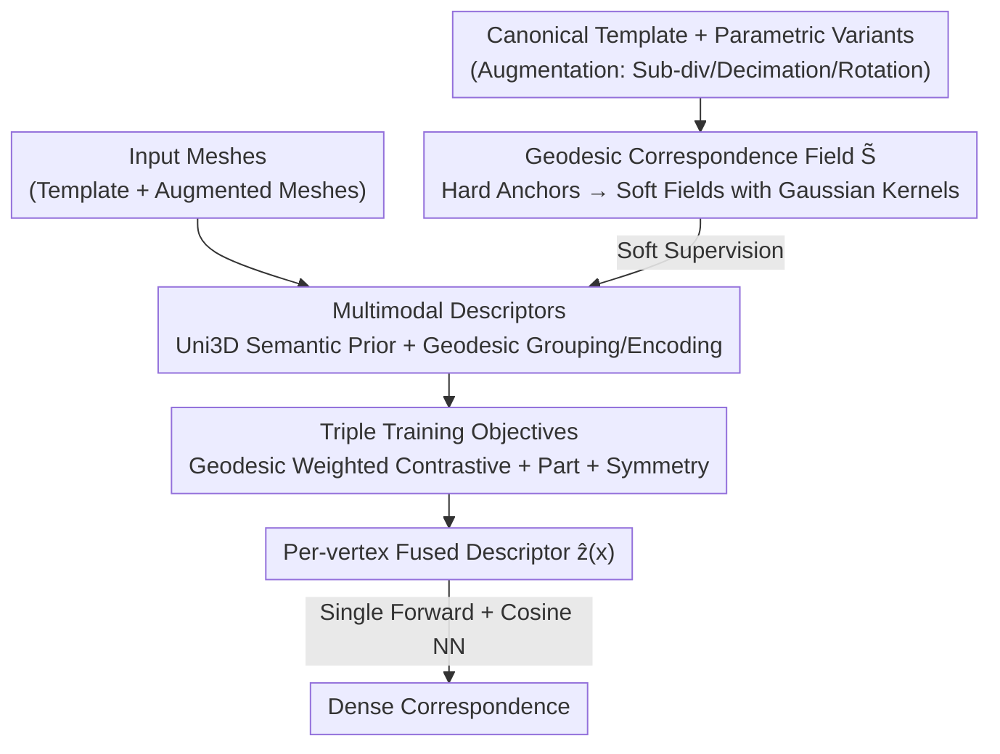

# SGSoft: Learning Fused Semantic-Geometric Features for 3D Shape Correspondence via Template-Guided Soft Signals

**Conference**: CVPR 2026  
**Paper**: [CVF Open Access](https://openaccess.thecvf.com/content/CVPR2026/html/Yoon_SGSoft_Learning_Fused_Semantic_Geometric_Features_for_3D_Shape_Correspondence_via_CVPR_2026_paper.html)  
**Code**: None  
**Area**: 3D Vision  
**Keywords**: 3D Dense Correspondence, Geodesic, Multimodal Descriptors, Template Supervision, Symmetry Disambiguation

## TL;DR
SGSoft reformulates the task of "finding dense point correspondences between deforming 3D shapes" as "aligning geodesic probability fields on a canonical template." It utilizes this topologically invariant soft supervision signal to train per-vertex descriptors that fuse geometric, semantic, and spatial cues. During inference, a single forward pass followed by nearest neighbor retrieval yields correspondences without requiring pre-alignment, pair-wise optimization, or post-refinement, reducing the per-pair latency to 1.7 seconds while maintaining high accuracy.

## Background & Motivation
**Background**: Dense correspondence between deforming 3D shapes is a fundamental capability for tasks such as motion retargeting, rigging/texture transfer, and shape interpolation. Mainstream approaches are categorized into four types: explicit deformation-based methods (ICP, ARAP, neural deformation fields), functional map-based methods (linear operators in the spectral domain), methods leveraging large-scale 2D vision models via multi-view projection, and hybrid methods combining these paradigms.

**Limitations of Prior Work**: Each category has inherent flaws. Deformation methods achieve high accuracy but require pair-wise optimization, are sensitive to initialization, and scale poorly. Functional maps provide global consistency but lose fine-grained geometric/semantic details due to spectral abstraction, making it difficult to distinguish symmetric or adjacent parts. 2D distillation methods possess strong semantic priors but suffer from occlusion, sparse viewpoints, and textureless surfaces in rendering supervision, while diffusion priors are computationally expensive and not real-time. Hybrid methods mitigate individual weaknesses but still rely on alignment, post-refinement, or re-optimization.

**Key Challenge**: Existing methods are forced to trade off between **generalization, geometric fidelity, and efficiency**. The reliance on "remedial steps" like pre-alignment or pair-wise optimization stems from unstable training supervision—hard anchor supervision collapses when remeshing or large non-isometric deformations occur, as vertex topology and indices are disrupted.

**Goal**: Solve both generalization and efficiency within a unified forward framework, eliminating all remedial steps.

**Key Insight**: The authors exploit two intrinsic properties of surface geometry: (I1) Geodesic distances are invariant to deformation and characterize intrinsic relationships between surface points; (I2) Geodesic probability fields defined on a template remain locally smooth and robust to mesh perturbations. Thus, "finding correspondence" is transformed into "aligning geodesic probability fields in a canonical intrinsic space."

**Core Idea**: Replace discrete hard anchors with continuous geodesic correspondence fields ($\tilde{S}$) on a template as the supervision signal to train dense descriptors that fuse geometric, semantic, and spatial cues into a single representation.

## Method

### Overall Architecture
SGSoft addresses the problem of "inputting a pair of deforming meshes and outputting point-wise dense correspondences." The approach involves: first, offline construction of a geodesic probability field $\tilde{S}$ on a canonical template as supervision; then, using this supervision to map vertices of each input mesh into a shared "multimodal intrinsic space," learning per-vertex descriptors that are both semantically discriminative and geometrically consistent. During inference, each mesh undergoes a single forward pass to obtain normalized descriptors, and correspondences are extracted via cosine nearest neighbor retrieval in the descriptor space. The entire pipeline involves no pre-alignment, pair-wise optimization, post-refinement, multi-view rendering, or candidate filtering.

### Key Designs

**1. Geodesic Correspondence Field $\tilde{S}$: Replacing Fragile Hard Anchors with Topologically Invariant Soft Fields**

The limitation is clear: hard anchor supervision is destroyed by remeshing and large deformations because anchor points mismatch when vertex indices change. The authors first define vertex-level hard anchor pairs between a canonical template and its parametric variants (e.g., SMPL). They apply augmentations such as subdivision, decimation, and random rotation, backtracing along the augmentation chain to ensure each augmented vertex $x_i$ consistently maps to a template vertex $t_{h(i)}$ with a matching part label $\ell_\text{aug}$. Each hard anchor is then "lifted" into a continuous geodesic field on the template:

$$\tilde{S}_{i,v} = \exp\!\left(-\frac{d_\mathrm{geo}(t_{h(i)}, t_v)^2}{\sigma^2}\right)$$

where $d_\mathrm{geo}(\cdot,\cdot)$ is the geodesic distance and $\sigma$ controls locality. This Gaussian kernel centered at $t_{h(i)}$ assigns high weights to geodesic neighbors and exponential decay to distant points. Consequently, $\tilde{S}$ is a smooth field defined in the template space, invariant to deformation and discretization. The authors also use adaptive modulation based on vertex density and semantic part consistency to obtain sparser, more efficient soft fields, weighting by local curvature to emphasize structurally significant regions like joints and faces. Compared to hard anchors, this relaxes "point-to-point" discrete constraints into "continuous probability over a neighborhood," preventing supervision from breaking under topological changes.

**2. Multimodal Descriptors under Geodesic Supervision: Fusing Uni3D Semantic Priors with Intrinsic Geometry**

$\tilde{S}$ alone provides geometry but lacks the fine-grained semantics and high-level spatial understanding needed to distinguish left/right or front/back. The authors initialize descriptors with the pre-trained 3D foundation model Uni3D to inject semantic priors, then weave in geometry via three steps. First, **Geodesic Grouping and Propagation**: the mesh is partitioned into $N$ geodesic patches using Farthest Point Sampling (FPS). For each center $c_g$, the $M$ nearest vertices are selected: $\mathcal{N}(c_g) = \operatorname{TopM}_{x_i}(-d_\mathrm{geo}(x_i, c_g))$. Patch embeddings $z_g$ are propagated back to each vertex via geodesic weighted interpolation: $z(x_i) = \frac{\sum_{g} w_{ig} z_g}{\sum_{g} w_{ig}}$, where $w_{ig} = \frac{1}{d_\mathrm{geo}(x_i, c_g)^p + \epsilon}$. This transmits local geometric context to vertices while preventing feature leakage into adjacent parts. Second, **Geodesic Feature Encoding**: a pairwise geodesic distance matrix $D_\mathrm{geo}(i,j) = d_\mathrm{geo}(c_i, c_j)$ is computed for the centers, vectorized as $v_\mathrm{geo}$, and passed through a Transformer encoder to obtain a global geodesic embedding $g_\mathrm{geo} = \mathrm{Encoder}(v_\mathrm{geo})$, capturing high-order intrinsic dependencies. Third, **Semantic Prior Fusion**: patch-level semantic embeddings $f_\mathrm{sem}(c_g)$ from Uni3D are concatenated with global geodesic features and passed through a fusion module: $z_g = \Gamma([f_\mathrm{sem}(c_g) \| g_\mathrm{geo}])$. The final descriptors are obtained through geodesic un-grouping. This combination yields descriptors that are both semantically discriminative and geometrically consistent locally and globally.

**3. Triple Training Objectives: Geodesic Weighted Contrastive + Part + Symmetry**

A single loss cannot support "geometric robustness + semantic discrimination + symmetry disambiguation." The core is the **Geodesic Field Weighted Contrastive Loss**, modifying standard InfoNCE to use $\tilde{S}$ as weights:

$$\mathcal{L}_\text{soft} = -\frac{1}{M}\sum_{i,v} \tilde{S}_{i,v} \log \frac{\exp(\mathbf{A}_{i,v}/\tau)}{\sum_u \exp(\mathbf{A}_{i,u}/\tau)}$$

where $\mathbf{A}$ is the cosine similarity between augmented and template descriptors. It weights correspondences by geodesic proximity, emphasizing geometrically consistent matches and smoothing the embedding space along the intrinsic surface manifold. This is supplemented by a **Part Classification Loss** $\mathcal{L}_\text{part}$ (cross-entropy with label smoothing on part segmentation logits for both augmented and template sides to provide coarse semantic alignment) and a **Symmetry Loss** $\mathcal{L}_\text{sym} = \frac{1}{M}\sum_{i,v} \mathcal{M}_\text{sym}(i,v)\,\mathbf{A}_{i,v}$ (using a binary mask $\mathcal{M}_\text{sym}$ to identify symmetric part pairs and penalize similarity between mirror regions, suppressing "leakage" between left/right limbs). The total objective is $\mathcal{L}_\text{total} = \lambda_\text{soft}\mathcal{L}_\text{soft} + \lambda_\text{part}\mathcal{L}_\text{part} + \lambda_\text{sym}\mathcal{L}_\text{sym}$.

### Loss & Training
Training utilizes AdamW with curriculum learning, gradually increasing difficulty under the joint triple loss. During inference, a pair of meshes each undergoes a single forward pass to produce normalized per-vertex descriptors $\hat{z}(x)$. Dense correspondences are determined via nearest neighbor search based on cosine similarity: $\mathrm{corr}(x_i) = \arg\max_{t_v} \hat{z}_\text{src}(x_i)^\top \hat{z}_\text{tgt}(t_v)$. The entire process is purely feed-forward.

## Key Experimental Results

### Main Results
Evaluated on FAUST / SCAPE / SHREC19 (remeshed variants for pose and discretization robustness) and DT4D-Intra / DT4D-Inter (zero-shot cross-domain including dynamic and non-human objects). Metric is average geodesic error (lower is better); efficiency is measured as wall-clock time per pair (RTX A6000).

| Category / Method | FAUST | SCAPE | SHREC19 | DT4D-Intra | DT4D-Inter | Avg Error | Time (s) |
|------|------|------|------|------|------|------|------|
| Deformation NJF | 5.9 | 11.7 | 9.6 | 43.4 | 32.8 | 20.68 | 4.2 |
| 2D Distill Diff3f | 16.3 | 18.2 | 20.6 | 20.6 | 30.3 | 21.20 | 628.9 |
| Hybrid DenoisingFM | 1.9 | 2.4 | 4.2 | 5.5 | 16.8 | 6.16 | 37.0 |
| Hybrid DiffuMatch | 1.9 | 4.4 | 3.9 | 1.8 | 8.6 | 4.12 | 142.8 |
| **SGSoft (Ours)** | 2.5 | 2.9 | 4.0 | 8.1 | **8.3** | 5.16 | **1.7** |

On near-isometric benchmarks, SGSoft (2.5 / 2.9 / 4.0) approaches the strongest models like DenoisingFM and DiffuMatch but is entirely feed-forward without post-refinement. On cross-domain DT4D-Inter, it achieves the lowest error (8.3), whereas NJF, Diff3f, and DenoisingFM degrade significantly on non-human domains. While DiffuMatch is strong on DT4D-Intra due to pair-wise optimization, it drops on Inter, indicating that SGSoft's cross-category generalization is more stable. Regarding efficiency, 1.7s per pair is over an order of magnitude faster than refinement-based baselines, making it the only method capable of near real-time single forward correspondence.

### Ablation Study
Ablation on SCAPE / SHREC19 / DT4D-Inter (average geodesic error %, lower is better):

| Configuration | SCAPE | SHREC19 | DT4D-Inter | Description |
|------|------|------|------|------|
| w/o $\tilde{S}$ (Hard Anchors InfoNCE) | 3.7 | 6.6 | 10.7 | Loss of continuous topological consistency |
| w/o $\tilde{S}$ Contrastive (MSE Regression) | 18.4 | 17.9 | 21.2 | Collapse; contrastive optimization is key |
| w/o Geodesic Grouping/Un-grouping | 4.0 | 6.4 | 10.4 | Semantic leakage between adjacent parts |
| w/o Geodesic Encoding | 3.3 | 4.9 | 9.3 | Weakened intrinsic consistency |
| w/o Symmetry Loss | 7.8 | 8.2 | 15.6 | Increased mirror part confusion |
| **Full (SGSoft)** | **2.9** | **4.0** | **8.3** | Complete model |

### Key Findings
- **Geodesic weighted contrastive loss is critical**: Replacing it with direct MSE regression caused the SCAPE error to jump from 2.9 to 18.4, proving that contrastive learning under a geodesic field (rather than regression) is key to learning geometrically separable embeddings.
- **Symmetry loss benefits cross-domain tasks most**: Without it, the DT4D-Inter error nearly doubled (8.3 to 15.6), confirming that symmetry disambiguation is particularly important for non-human objects with large structural variances.
- **Descriptors faithfully encode local geometry**: Analysis within a $K=50$ geodesic neighborhood shows feature similarity has a strong negative correlation with geodesic distance (Pearson -0.81 on template, -0.77 on benchmarks), following the structure of $\tilde{S}$ supervision.
- Learned descriptors transfer well to downstream tasks like semantic segmentation and deformation transfer, and remain robust to changes in underlying 3D representation formats.

## Highlights & Insights
- **Reformulating "correspondence" as "aligning geodesic probability fields"**: This represents a clever shift in framework—hard anchors are fragile due to their discrete nature, whereas soft geodesic fields are naturally invariant to remeshing and deformation, eliminating instability at the source.
- **Combining soft supervision with contrastive learning**: The ablation shows the real effect comes from the combination of "soft field as weights + InfoNCE contrastive" (switching to MSE leads to collapse). This insight is transferable to any task requiring discriminative embeddings with continuous similarity priors.
- **Balancing semantics with foundation models and space with intrinsic geometry**: Uni3D provides semantic priors while the geodesic field handles geometric/spatial disambiguation. The clear division of labor is a clean example of the "foundation model + task-specific geometric structure" paradigm.

## Limitations & Future Work
- The method relies heavily on "canonical templates + parametric variants" to generate hard anchors and geodesic fields. The paper does not fully address how to construct supervision for categories without existing parametric templates (e.g., general objects with arbitrary topology). ⚠️ Many training data construction details are deferred to the supplementary material.
- The semantic upper bound of the descriptors is constrained by the representation capability of the Uni3D backbone; performance with weaker backbones was not compared.
- Although SOTA in cross-domain, the absolute error on DT4D-Inter (8.3) remains significantly higher than near-isometric human benchmarks (2–4), leaving room for improvement in extreme non-human or strong topological difference scenarios.
- 1.7s per pair is faster than baselines but still distant from "real-time" for interactive applications (millisecond range), where the bottleneck lies in the forward pass and nearest neighbor search rather than optimization.

## Related Work & Insights
- **vs Deformation-based (NJF / ICP / ARAP)**: These rely on pair-wise explicit alignment, are sensitive to initialization, and are non-scalable. SGSoft performs a one-time nearest neighbor retrieval in the intrinsic descriptor space, offering better generalization and efficiency (NJF error 43.4 vs SGSoft 8.1 on DT4D-Intra).
- **vs Functional Maps / Hybrid (DenoisingFM / DiffuMatch)**: These are accurate but lose detail via spectral abstraction and require post-refinement or pair-wise optimization (37–143s per pair). SGSoft maintains fine-grained details while reducing latency to 1.7s and outperforming them in cross-domain DT4D-Inter.
- **vs 2D Distillation (Diff3f)**: Diff3f injects semantics via multi-view rendering and back-projection, which is hindered by occlusion and sparse views and is extremely slow (628.9s per pair). SGSoft uses Uni3D to extract semantics directly from point clouds, avoiding rendering ambiguities and achieving a speedup of two orders of magnitude.

## Rating
- Novelty: ⭐⭐⭐⭐⭐ Reformulating dense correspondence as template geodesic field alignment with soft contrastive learning is genuinely innovative.
- Experimental Thoroughness: ⭐⭐⭐⭐ Comprehensive evaluation across five benchmarks with ablation and correlation analysis, though cross-backbone and non-template category experiments are missing.
- Writing Quality: ⭐⭐⭐⭐ Clear logic from motivation to experiment with standard formulas; some key details are relegated to the supplement.
- Value: ⭐⭐⭐⭐⭐ Significantly improves correspondence speed (by an order of magnitude) while maintaining accuracy and transferability, offering high practical deployment value.

<!-- RELATED:START -->

## Related Papers

- [\[CVPR 2026\] Best Segmentation Buddies for Image-Shape Correspondence](best_segmentation_buddies_for_image-shape_correspondence.md)
- [\[CVPR 2026\] Image-Guided Geometric Stylization of 3D Meshes](image-guided_geometric_stylization_of_3d_meshes.md)
- [\[ICML 2026\] Geometry-Guided Modeling of Foundation Features Enables Generalizable Object Shape Deformation Learning](../../ICML2026/3d_vision/geometry-guided_modeling_of_foundation_features_enables_generalizable_object_sha.md)
- [\[ICCV 2025\] Image-Guided Shape-from-Template Using Mesh Inextensibility Constraints](../../ICCV2025/3d_vision/image-guided_shape-from-template_using_mesh_inextensibility_constraints.md)
- [\[CVPR 2026\] Registration-Free Learnable Multi-View Capture of Faces in Dense Semantic Correspondence](registration-free_learnable_multi-view_capture_of_faces_in_dense_semantic_corres.md)

<!-- RELATED:END -->
## Related Papers

- [\[CVPR 2026\] Best Segmentation Buddies for Image-Shape Correspondence](best_segmentation_buddies_for_image-shape_correspondence.md)
- [\[ICML 2026\] Geometry-Guided Modeling of Foundation Features Enables Generalizable Object Shape Deformation Learning](../../ICML2026/3d_vision/geometry-guided_modeling_of_foundation_features_enables_generalizable_object_sha.md)
- [\[ICCV 2025\] Image-Guided Shape-from-Template Using Mesh Inextensibility Constraints](../../ICCV2025/3d_vision/image-guided_shape-from-template_using_mesh_inextensibility_constraints.md)
- [\[CVPR 2026\] Registration-Free Learnable Multi-View Capture of Faces in Dense Semantic Correspondence](registration-free_learnable_multi-view_capture_of_faces_in_dense_semantic_corres.md)
- [\[CVPR 2026\] MARCO: Navigating the Unseen Space of Semantic Correspondence](marco_semantic_correspondence.md)

<!-- RELATED:END -->
