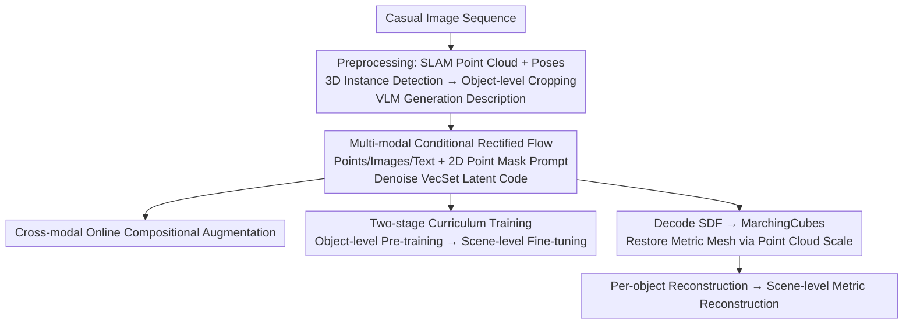

# ShapeR: Robust Conditional 3D Shape Generation from Casual Captures

**Conference**: CVPR 2026  
**Paper**: [CVF Open Access](https://openaccess.thecvf.com/content/CVPR2026/html/Siddiqui_ShapeR_Robust_Conditional_3D_Shape_Generation_from_Casual_Captures_CVPR_2026_paper.html)  
**Code**: facebookresearch.github.io/ShapeR (Project page, committed to open-sourcing code/weights/datasets)  
**Area**: 3D Vision  
**Keywords**: 3D Shape Generation, Rectified Flow, Multi-modal Conditioning, Casual Capture Reconstruction, Curriculum Learning

## TL;DR
ShapeR converts casual image sequences through SLAM + 3D detection + VLM description into a three-way multi-modal condition: "sparse point clouds + multi-view posed images + text." These are fed into a FLUX-style rectified flow Transformer to denoise VecSet latent codes. It generates metric-accurate, complete single-object meshes in real-world occluded/cluttered scenes, achieving a 2.7× improvement in Chamfer Distance over the SOTA.

## Background & Motivation
**Background**: Object-level 3D shape generation has recently achieved impressive results using native 3D diffusion models (TripoSG, Hunyuan3D-2.0, Direct3D-S2, etc.), which can generate high-fidelity meshes from clean, segmented, and unoccluded inputs. Scene-level reconstruction (NeRF, 3DGS, feed-forward MVS) reconstructs the entire scene as a single surface.

**Limitations of Prior Work**: Both paths fail in "casual capture" scenarios. Generative models rely on clean segmented inputs, whereas real-world captures are full of occlusions, cluttered backgrounds, sensor noise, low resolution, motion blur, and poor viewpoints. Segmentation itself is difficult—even interactive segmentation with SAM2 often fails, and noisy masks cause generative quality to plummet. Scene-level feed-forward methods reconstruct the scene as a single surface, leaving objects in occluded regions permanently incomplete or lacking back surfaces.

**Key Challenge**: High-fidelity generation requires "clean, complete, and well-segmented" ideal inputs, which casual captures naturally do not provide. Simultaneously, pure image-based methods lack metric anchoring, making it impossible to recover real-world scales from a single view. There is a fundamental gap between ideal input assumptions and real-world capture conditions.

**Goal**: For casual capture sequences, achieve (1) complete, high-fidelity, and metric-consistent mesh generation for each object; (2) no reliance on explicit 2D segmentation; and (3) robustness to occlusion, clutter, and noise.

**Key Insight**: The authors observe that sparse SLAM point clouds provide a geometric signal aggregated across the entire sequence that is complementary to images. Furthermore, 3D instance points can implicitly "identify" which object to reconstruct, thereby bypassing error-prone explicit segmentation.

**Core Idea**: Use a multi-modal condition of "sparse metric point clouds + posed multi-view images + machine-generated text" to drive a rectified flow generative model. This is combined with cross-modal online augmentation and two-stage curriculum training to transition the generative model from "ideal inputs" to "casual captures."

## Method

### Overall Architecture
ShapeR is an **object-centric** generative reconstruction pipeline: it takes a casual sequence of posed images as input and outputs a complete metric mesh for each detected object in the scene. Pre-processing uses off-the-shelf visual-inertial SLAM to obtain sparse point clouds and camera poses, followed by 3D instance detection on the point cloud and images to box each object. For each object, sparse points, several representative frames, 2D projected point masks on these frames, and a VLM-generated text description are extracted. This multi-modal condition is fed into a FLUX-style dual-stream/single-stream denoising Transformer, which rectifies Gaussian noise onto the 3D VAE (Dora/VecSet) latent manifold. After decoding the SDF, meshes are extracted via marching cubes and restored to the metric coordinate system based on the real scale of the object's point cloud. Running this independently for each detected object yields a metric reconstruction of the entire scene.

### Key Designs

**1. Multi-modal Conditional Rectified Flow: Bypassing Explicit Segmentation via Complementary Signals**

To address the pain points of "error-prone segmentation and lack of metric scale," ShapeR formulates shape generation as a rectified flow process. Within the 3D VAE latent space of a Dora variant (VecSet), the denoising Transformer $f_\theta$ rectifies Gaussian noise $z_1 \sim \mathcal{N}(0,I)$ toward the target latent $z_0$. The training objective is to regress the ground-truth transport velocity: $\mathcal{L}_{FM} = \mathbb{E}_{t,z_t,C}\big[\|f_\theta(z_t,t,C)-(z_0-z_1)\|_2^2\big]$. The condition $C=\{C_{pts}, C_{img}, C_{txt}\}$ is encoded via three paths: SLAM points are downsampled into tokens using a sparse 3D ResNet; images use a frozen DINOv2 for feature extraction, concatenated with Plücker ray encodings for camera poses; text uses frozen T5 + CLIP text encoders. The architecture leverages the dual-stream/single-stream design of FLUX.1. Crucially, it **does not use any segmentation masks**—the target object is implicitly identified via 3D point tokens and 2D projected point masks, which is why it remains robust in cluttered scenes.

**2. 2D Point Mask Prompting: Embedding Object Identity into Image Features**

This is the core mechanism for implicit segmentation. The 3D points of each object are projected onto its corresponding frames to form a binary point mask $M_i$, approximating the object's contour in that view. This mask is processed by a 2D convolutional extractor and concatenated with DINO and Plücker tokens. This allows DINO image features to "know" which object to focus on, significantly reducing confusion with adjacent objects in cluttered scenes. Ablations show that removing this (w/o Point Mask Prompting) degrades CD from 2.375 to 2.568 and F1 from 0.722 to 0.701, confirming its contribution to clean identification.

**3. Cross-modal Online Compositional Augmentation: Adapting "Ideal Inputs" to "Casual Captures"**

Since object-level datasets are too clean to transfer to real-world captures, ShapeR applies online compositional augmentation across all modalities in the data loader. For images: background synthesis, occlusion overlays, visibility fogging, resolution degradation, and photometric perturbations are applied. For SLAM points: partial trajectory simulation, multiple point drop strategies, Gaussian noise, and point occlusions are used. These augmentations combine online to produce nearly infinite unique training samples. Ablations show that removing point augmentation (CD 3.276) or image augmentation (CD 3.397) significantly degrades performance compared to the full model (2.375).

**4. Two-stage Curriculum Training: From Universal Priors to Scene Complexity**

As a category-agnostic model, ShapeR must learn priors across a wide range of categories. The first stage trains on over $600,000$ artist-created multi-category object meshes (isolated objects), using heavy augmentation to compensate for the "studio" setup limitations. The second stage fine-tunes on scene-cropped objects from Aria Synthetic Environments, which introduces real occlusions, object interactions, and SLAM noise patterns—combinations that single-object datasets cannot cover. Removing the second stage (w/o Two-Stage Training) results in CD dropping from 2.375 to 3.053.

### Loss & Training
The 3D VAE is trained with SDF regression + KL regularization: $\mathcal{L}_{VAE} = \|s-s_{GT}\|_2^2 + \beta\,\mathcal{L}_{KL}(q(z|S)\,\|\,\mathcal{N}(0,I))$, where points are sampled uniformly and near surfaces to capture geometry. The flow model is trained with the FM loss. During inference, the pipeline detects 3D bounding boxes, uses SAM2 to remove outlier points within boxes, selects up to 16 frames, and uses the midpoint method to integrate the flow: $z_{t-\Delta t}=z_t+\Delta t\,f_\theta(z_t,t,C_i)$. Finally, marching cubes and rescaling based on point cloud scale are performed.

## Key Experimental Results

### Main Results
On the self-built **ShapeR Evaluation Dataset** (7 cluttered real scenes, 178 objects with ground-truth geometry), ShapeR is compared against 9 SOTA methods. Metrics: Chamfer $\ell_2$ Distance (CD↓), Normal Consistency (NC↑), F-score@1% (F1↑).

| Method | Input Type | CD↓ ×10² | NC↑ | F1↑ |
|:---|:---|:---|:---|:---|
| EFM3D | Posed MV → 3D | 13.82 | 0.614 | 0.276 |
| FoundationStereo (TSDF fusion) | Posed MV → 3D | 6.483 | 0.677 | 0.435 |
| LIRM | Posed MV → 3D | 8.047 | 0.683 | 0.384 |
| DP-Recon | Posed MV → 3D | 8.364 | 0.661 | 0.436 |
| **Ours (ShapeR)** | Multi-modal | **2.375** | **0.810** | **0.722** |

ShapeR (2.375) improves by approximately 2.7× in CD over the best baseline, FoundationStereo (6.483). A user preference study (660 responses vs. image-to-3D models) shows:

| Baseline | ShapeR Win Rate↑ |
|:---|:---|
| TripoSG | 86.67% |
| Amodal3R | 86.11% |
| Direct3D-S2 | 88.33% |
| Hunyuan3D-2.0 | 81.11% |

Note: Baseline image-to-3D models were given manually selected clear views and interactive SAM2 segmentation, while ShapeR ran fully automatically.

### Ablation Study

| Configuration | CD↓ ×10² | NC↑ | F1↑ |
|:---|:---|:---|:---|
| Full model (ShapeR) | 2.375 | 0.810 | 0.722 |
| w/o SLAM Points | 4.514 | 0.765 | 0.486 |
| w/o Point Augmentation | 3.276 | 0.805 | 0.667 |
| w/o Image Augmentation | 3.397 | 0.778 | 0.649 |
| w/o Two Stage Training | 3.053 | 0.801 | 0.689 |
| w/o Point Mask Prompting | 2.568 | 0.813 | 0.701 |

### Key Findings
- **SLAM points are the most critical modality**: Removing them nearly doubles the CD, confirming that point clouds provide complementary geometric signals aggregated across sequences.
- **Augmentation > Mask Dependency**: Without image augmentation, the model relies on explicit segmentation; when masks are noisy, performance collapses.
- **2D Point Mask Prompting prevents identity confusion**: It prevents the model from merging adjacent objects into the reconstruction.

## Highlights & Insights
- **Implicit Segmentation is the differentiator**: While others struggle with error-prone 2D masks, ShapeR hands the "identification" task to 3D instance points + 2D projections, avoiding the primary failure mode of casual captures: mask noise.
- **Point Cloud as a Metric Anchor**: Sparse SLAM points provide both geometry and real-world scale, solving the metric scale ambiguity inherent in pure image-based generation.
- **Online Compositional Augmentation ≈ Infinite Data**: Degrading clean meshes into "casual capture" samples during training is a cost-effective way to approximate real-world noise distributions.

## Limitations & Future Work
- **Reliance on Multiple Off-the-shelf Modules**: SLAM, 3D detection, VLM, and SAM2 are all pre-requisites. Failure in any step (e.g., missed detection) cascades into the final reconstruction.
- **Dependency on Specific Hardware Stacks**: Point clouds depend on Project Aria's VI-SLAM. Whether this generalizes to standard smartphones without calibrated IMUs remains to be fully explored.
- **Evaluation Scale**: A set of 178 objects across 7 scenes is realistic but small; further large-scale verification for statistical significance is needed.

## Related Work & Insights
- **vs. Image-to-3D (TripoSG / Hunyuan3D-2.0)**: These excel on clean, segmented, near-frontal views but lack metric scale and rely on manual segmentation. ShapeR is automatic and handles clutter.
- **vs. Scene-level Fusion (EFM3D / FoundationStereo)**: These reconstruct scenes as single surfaces, leaving back-sides of objects hollow; ShapeR generates complete object-level geometry.
- **vs. Image-Scene Layout (MIDI3D / SceneGen)**: These often struggle with object scale and placement in cluttered scenes; ShapeR's per-object metric reconstruction ensures more consistent layouts.

## Rating
- Novelty: ⭐⭐⭐⭐ Clever combination of multi-modal conditions and implicit 3D identification.
- Experimental Thoroughness: ⭐⭐⭐⭐ Robust real-world evaluation, though the scale is somewhat limited.
- Writing Quality: ⭐⭐⭐⭐ Clear motivation and pipeline explanation.
- Value: ⭐⭐⭐⭐⭐ High practical value for moving 3D generation toward real-world application.

<!-- RELATED:START -->

## Related Papers

- [\[CVPR 2026\] FHAvatar: Fast and High-Fidelity Reconstruction of Face-and-Hair Composable 3D Head Avatar from Few Casual Captures](fhavatar_fast_and_high-fidelity_reconstruction_of_face-and-hair_composable_3d_he.md)
- [\[CVPR 2026\] Nestwork: Conditional 3D Furnished House Layout Generation through Latent Heterogeneous Graph Diffusion](nestwork_conditional_3d_furnished_house_layout_generation_through_latent_heterog.md)
- [\[CVPR 2026\] RI-Mamba: Rotation-Invariant Mamba for Robust Text-to-Shape Retrieval](ri-mamba_rotation-invariant_mamba_for_robust_text-to-shape_retrieval.md)
- [\[ICCV 2025\] LongSplat: Robust Unposed 3D Gaussian Splatting for Casual Long Videos](../../ICCV2025/3d_vision/longsplat_robust_unposed_3d_gaussian_splatting_for_casual_long_videos.md)
- [\[CVPR 2026\] From Feature Learning to Spectral Basis Learning: A Unifying and Flexible Framework for Efficient and Robust Shape Matching](from_feature_learning_to_spectral_basis_learning_a_unifying_and_flexible_framewo.md)

<!-- RELATED:END -->
