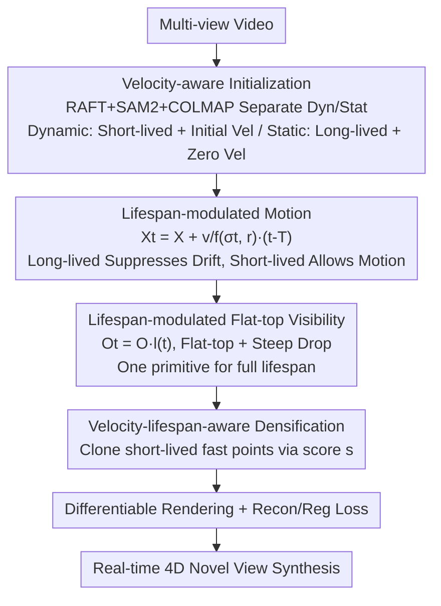

# SharpTimeGS: Sharp and Stable Dynamic Gaussian Splatting via Lifespan Modulation

**Conference**: CVPR 2026  
**Paper**: [CVF Open Access](https://openaccess.thecvf.com/content/CVPR2026/html/Liao_SharpTimeGS_Sharp_and_Stable_Dynamic_Gaussian_Splatting_via_Lifespan_Modulation_CVPR_2026_paper.html)  
**Code**: https://liaozhanfeng.github.io/SharpTimeGS (Project Page)  
**Area**: 3D Vision  
**Keywords**: Dynamic Gaussian Splatting, 4D Reconstruction, Lifespan Modeling, Novel View Synthesis, Static-Dynamic Balance

## TL;DR
SharpTimeGS assigns a learnable "lifespan" parameter to each 4D Gaussian primitive, transforming temporal visibility from Gaussian decay to a "flat-top" profile and modulating motion magnitude. This ensures that long-lived static points experience minimal drift while short-lived dynamic points retain full motion. Combined with lifespan-velocity-aware densification and velocity-aware initialization, it accurately reconstructs both static backgrounds and rapid dynamics in a unified representation, achieving SOTA results with 4K@100FPS real-time rendering.

## Background & Motivation
**Background**: 3DGS represents scenes as explicit Gaussian primitives, enabling real-time high-fidelity rendering. Extending it to dynamic scenes follows two paths: canonical space deformation (learning a deformation field to warp a static representation per frame) and motion-based methods (4DGS, 4DRotorGS, STGS, FreeTimeGS, which directly model primitive motion over time).

**Limitations of Prior Work**: Existing "temporal visibility" and "motion" formulations ignore the fundamental differences between static and dynamic points. ① Regarding temporal visibility, standard Gaussian curves model opacity decay, causing long-lived primitives to fade gradually—representing a flat, time-invariant visibility requires stacking multiple overlapping Gaussians (redundant densification). ② Regarding motion modeling, static points must learn zero velocity to remain stable; however, optimization rarely reaches absolute zero. Even minute residual velocities accumulate over time, leading to visible spatial drift and flickering.

**Key Challenge**: Using a single "behavior-agnostic" unified formula to model all points, while clean and consistent for optimization, entangles static and dynamic behaviors. A single representation struggles to faithfully express both: long-lived static structures need to be "frozen," while short-lived dynamic ones need to "move freely."

**Goal**: To achieve long-term stable static structures and sharp short-term dynamic motion simultaneously without breaking the unified representation, while avoiding redundant densification and static drift.

**Key Insight**: The authors observe that both the motion characteristics and temporal visibility of a primitive are strongly correlated with its "lifespan." Consequently, lifespan is introduced as a learnable per-primitive attribute to modulate both opacity and motion formulas directly.

**Core Idea**: Integrate "flat-top visibility + motion modulation" into 4D Gaussians using lifespan parameters. This automatically suppresses displacement for long-lived points and preserves motion for short-lived ones, decoupling static-dynamic entanglement at the representation level.

## Method

### Overall Architecture
Given multi-view video as input, the goal is to reconstruct a temporally continuous 4D representation for novel view synthesis. The SharpTimeGS pipeline consists of three synergistic components: **velocity-aware initialization** sets physically plausible position, velocity, and lifespan priors for dynamic/static regions; the **lifespan-modulated 4D Gaussian representation** uses a unified lifespan parameter $(\sigma_t, r)$ to modulate both motion magnitude and temporal visibility (flat-top profile); **velocity-lifespan-aware densification** allocates more capacity to fast dynamic regions during optimization. All three components revolve around the "lifespan" attribute to ensure stability and sharpness in a unified 4D Gaussian space.

### Key Designs

**1. Lifespan-modulated Motion: "Freezing" Static Points and "Releasing" Dynamic Points**

To address the issue where static points accumulate residual motion drift, the authors adaptatively scale motion magnitude by lifespan: $X_t = X + \dfrac{v}{f(\sigma_t, r)}(t-T)$, where $f(\sigma_t, r) = 1.0 + \max\!\big(1.0,\,(\sigma_t + r)^2\big)$. Here, $\sigma_t$ is the lifespan variance (controlling the fading speed) and $r$ is the temporal radius (where the primitive is fully active). For static regions, where $\sigma_t + r$ is large → $f \to \infty$ → $v/f \to 0$, effectively freezing the position regardless of whether $v$ converges to zero. For short-lived dynamic regions, $f$ remains small, allowing large motion magnitudes to track rapid changes. Both $\sigma_t$ and $r$ are learned per primitive, allowing the model to determine temporal behavior automatically. This decoupling of "motion magnitude" and "temporal duration" is the key to balancing stability and sharpness.

**2. Lifespan-modulated Flat-top Visibility: One Primitive for a Full Lifespan**

To solve the redundancy caused by using Gaussian curves to approximate long lifespans, the temporal profile of opacity is changed to a **flat-top**: $O_t = O \cdot l(t)$, where

$$l(t) = \begin{cases} \exp\!\left(-\left(\dfrac{|t-T|-r}{\sigma_t}\right)^2\right), & |t-T| > r,\\[4pt] 1, & |t-T| \le r. \end{cases}$$

Visibility remains constant at 1 within radius $r$ (flat-top) and drops steeply via Gaussian decay outside $r$. Static primitives use a large $r$ to maintain stable, time-invariant visibility with one Gaussian. Dynamic primitives use small $r$ and $\sigma_t$ for quick fading. Reusing $r$ from the motion formula allows a single primitive to capture its entire lifespan without "motion trails," yielding clearer temporal boundaries. Colors are calculated via Spherical Harmonics $C_t = \sum_{l}\sum_{m} C_{lm} Y_{lm}(d(X_t))$ at the shifted position $X_t$, then rendered as 3D Gaussians.

**3. Velocity-lifespan-aware Densification: Focus on Fast Dynamic Regions**

Fast dynamic regions are often represented by short-lived, high-velocity primitives that receive fewer effective gradient updates compared to long-lived ones, leading to blurring. The authors design an adaptive densification scheme based on motion and temporal duration. Training is split into two phases: the first 1/3 iterations use AbsGS (mean and absolute mean image gradients) to expand the count until the scene is covered, then the total count $N$ is fixed. In the second phase, low-opacity primitives are removed and replaced by clones from primitives with high scores $s$:

$$s = \lambda_e E + \lambda_o O + \lambda_l\left(1 - \exp\!\left(-\dfrac{\|v\| + 1}{f(\sigma_t, r)}\right)\right).$$

$E$ is the accumulated rendering error, $O$ is the opacity, and the final term prioritizes primitives with "large motion + short lifespan." By replacing low-opacity points with clones of high-score points, the representation capacity is shifted toward transient fast motion while keeping static regions compact.

**4. Velocity-aware Initialization: A Better Starting Point for Optimization**

To stabilize 4D Gaussian optimization in dynamic scenes, regions are initialized separately. **Dynamic regions**: RAFT optical flow identifies moving points → SAM2 generates full object masks → COLMAP reconstructs per-frame point clouds under mask constraints → KNN matches across frames to set initial velocity $v_{init}$. Temporal anchor $T$ is the current frame, $v$ is $v_{init}$, $\sigma_t$ covers $\approx$3 frames, and $r$ starts at $10^{-6}$. **Static regions**: COLMAP reconstructs the first frame to initialize long-lived primitives with $v=0$, $T$ at the sequence midpoint, $\sigma_t$ covering $\approx$3x sequence length, and $r=10^{-6}$. This prior significantly stabilizes training.

### Loss & Training
The total loss is $\mathcal{L} = \mathcal{L}_{recon} + \mathcal{L}_{reg} + \mathcal{L}_e$. The reconstruction term is $\mathcal{L}_{recon} = \lambda_1 \mathcal{L}_1 + \lambda_s \mathcal{L}_s(\text{SSIM}) + \lambda_p \mathcal{L}_p(\text{Perceptual})$, with weights $\{0.8, 0.2, 0.01\}$. Regularization $\mathcal{L}_{reg} = \lambda_{scale}\mathcal{L}_{scale} + \lambda_{opacity}\mathcal{L}_{opacity} + \lambda_n\mathcal{L}_n + \lambda_t\mathcal{L}_t$: $\mathcal{L}_{scale}$ flattens Gaussians; $\mathcal{L}_n$ enforces single-view normal/depth consistency; $\mathcal{L}_t = \frac{1}{N}\sum \frac{1}{\sqrt{-2\log(o_{th})}\,\sigma_t^2 + r}$ encourages extending lifespans to reuse primitives; $\mathcal{L}_{opacity}$ stabilizes convergence in the second phase. $\mathcal{L}_e$ is an auxiliary densification term.

## Key Experimental Results

### Main Results
Evaluated on Neural3DV, ENeRF-Outdoor, and SelfCap benchmarks using PSNR↑, SSIM²↑, and LPIPS↓.

| Method | Neural3DV PSNR↑ | ENeRF-Outdoor PSNR↑ | SelfCap PSNR↑ |
|------|------|------|------|
| Deformable-3DGS | 31.15 | 24.26 | 25.85 |
| Ex4DGS | 32.11 | 24.89 | 24.96 |
| 4DGS | 32.01 | 24.82 | 25.86 |
| STGS | 32.05 | 24.93 | 24.77 |
| FreeTimeGS | 33.19 | 25.36 | 27.50 |
| **Ours** | **33.57** | **25.82** | **28.14** |

SharpTimeGS achieves state-of-the-art results across all benchmarks. On SelfCap, Ours reaches PSNR 28.14 / SSIM² 0.960 / LPIPS 0.192 compared to FreeTimeGS's 27.50 / 0.951 / 0.201. On ENeRF-Outdoor, SSIM² improves from 0.846 to 0.872.

### Ablation Study
Ablation on the "Partial" SelfCap dataset:

| Configuration | PSNR↑ | SSIM²↑ | LPIPS↓ | Note |
|------|------|------|------|------|
| full model | 27.36 | 0.947 | 0.244 | Full model |
| w/o our representation | 25.96 | 0.907 | 0.299 | Reversion to 4DGS coupled representation |
| w/o lifespan r | 26.76 | 0.927 | 0.321 | Removal of lifespan radius r |
| w/o our densification | 26.82 | 0.919 | 0.317 | Reversion to 4DGS densification |
| w/o our initialization | 26.83 | 0.927 | 0.297 | No velocity-aware initialization |

### Key Findings
- **4D Representation (Decoupled Motion/Appearance) has the highest impact**: Reverting to the coupled 4DGS representation drops PSNR from 27.36 to 25.96, introducing artifacts in fast-moving structures (hair, spokes) and backgrounds.
- **Flat-top visibility reduces temporal aliasing**: Standard Gaussian visibility creates temporal blur on dynamic details and over-smooths long-lived structures; flat-top boundaries yield sharper dynamics and cleaner backgrounds.
- **Densification balances static and dynamic optimization**: Standard 4DGS densification ignores lifespan, leading to under-fitting in dynamic regions. The proposed $s$-score successfully reallocates capacity to short-lived fast points.
- **Static-dynamic trade-off in baselines**: 4DGS fails to converge on fast contents (ball, watermelon) due to coupling; STGS suffers from high-dimensional optimization issues; FreeTimeGS neglects lifespan dependency, causing background jitter and dynamic under-convergence.

## Highlights & Insights
- **"Lifespan" as a multi-purpose key**: A single set of parameters $(\sigma_t, r)$ manages motion magnitude, temporal visibility, and densification scores. This physical intuition elegantly links decoupling, flat-top visibility, and capacity allocation.
- **Flat-top visibility cures redundant densification**: Changing the bell curve to a flat-top allows a single primitive to represent a duration of constant visibility, naturally resulting in a shaper render and more compact representation.
- **Elegant static freezing**: Instead of forcing velocity to zero via strong regularization, the term $v/f(\sigma_t, r)$ naturally suppresses displacement as lifespan increases, effectively bypassing the difficulty of optimizing for absolute zero velocity.

## Limitations & Future Work
- **Initialization dependency**: The pipeline relies on RAFT + SAM2 + COLMAP. Errors in dynamic masks or SfM can propagate to the initial velocity and static-dynamic separation priors.
- **Parameterization of lifespan**: The empirical form of $f(\sigma_t, r)$ has some overlap between $\sigma_t$ and $r$. Potential for further simplification exists.
- **Benchmarks**: While tested on multi-view benchmarks, its performance on monocular or sparse-view dynamic scenes remains to be fully explored.
- **Data-driven priors**: Integrating data-driven lifespan learning or modeling initialization uncertainty could improve robustness to complex motions.

## Related Work & Insights
- **vs FreeTimeGS**: Both use linear velocity, but FreeTimeGS lacks unified static-dynamic treatment, leading to background jitter (walls/books) and blurred fast motion. SharpTimeGS outperforms it across all metrics.
- **vs 4DGS / 4DRotorGS**: These methods couple geometry with velocity, making fast motion difficult to converge. SharpTimeGS yields sharper results by decoupling motion from appearance.
- **vs STGS**: STGS uses high-order polynomial motion and angular velocity, which are harder to optimize. SharpTimeGS's simpler lifespan-modulated linear motion is more stable.
- **vs Deformable-3DGS**: Deformation-based methods struggle with large motions and temporal consistency. This work models motion directly in 3D space, providing better quality and efficiency.

## Rating
- Novelty: ⭐⭐⭐⭐⭐ Decoupling motion/visibility via "lifespan" is a clean and effective insight.
- Experimental Thoroughness: ⭐⭐⭐⭐ SOTA across three benchmarks with detailed ablations.
- Writing Quality: ⭐⭐⭐⭐ Clear motivation and derivations; diagrams are intuitive.
- Value: ⭐⭐⭐⭐ 4K@100FPS real-time performance with SOTA quality; highly practical for dynamic NVS.

<!-- RELATED:START -->

## Related Papers

- [\[CVPR 2026\] Learning Explicit Continuous Motion Representation for Dynamic Gaussian Splatting from Monocular Videos](learning_explicit_continuous_motion_representation_for_dynamic_gaussian_splattin.md)
- [\[CVPR 2026\] $L^{2}DGS$: Low-Light Dynamic Gaussian Splatting](l2dgs_low-light_dynamic_gaussian_splatting.md)
- [\[CVPR 2026\] MotionScale: Reconstructing Appearance, Geometry, and Motion of Dynamic Scenes with Scalable 4D Gaussian Splatting](motionscale_reconstructing_appearance_geometry_and_motion_of_dynamic_scenes_with.md)
- [\[CVPR 2026\] MSCD-GS: Motion-Separated Cooperative Deblurring Dynamic Reconstruction via Gaussian Splatting](mscd-gs_motion-separated_cooperative_deblurring_dynamic_reconstruction_via_gauss.md)
- [\[CVPR 2026\] InstantHDR: Single-forward Gaussian Splatting for High Dynamic Range 3D Reconstruction](instanthdr_singleforward_gaussian_splatting_for_hi.md)

<!-- RELATED:END -->
