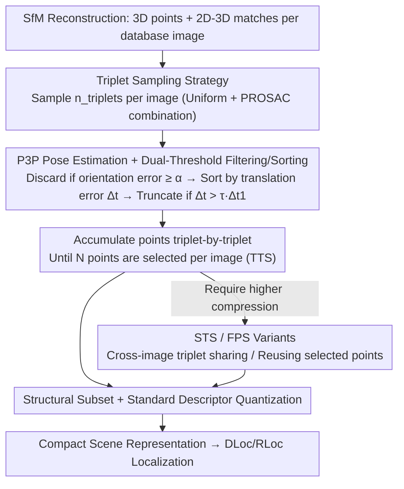

# Simple but Effective Triplet-Based Compression Strategies for Compact Visual Localization

**Conference**: CVPR 2026  
**Paper**: [CVF Open Access](https://openaccess.thecvf.com/content/CVPR2026/html/Sattler_Simple_but_Effective_Triplet_Based_Compression_Strategies_for_Compact_Visual_Localization_CVPR_2026_paper_html)  
**Code**: https://github.com/tsattler/triplet-based-structure-compression  
**Area**: 3D Vision / Visual Localization / SfM Point Cloud Compression  
**Keywords**: Visual Localization, Structure Compression, SfM Point Cloud, P3P, Triplet Sampling

## TL;DR
In response to the long-standing problem of "SfM point cloud compression" in visual localization—which traditionally relies on solving complex optimization problems (Set Cover / Integer Programming / Quadratic Programming)—this paper proposes an **almost trivial** strategy: randomly sample triplets for each database image, estimate poses using P3P, and retain the points belonging to the triplets that yield the most accurate database image poses. By using "pose accuracy" as the direct selection criterion, combined with standard descriptor quantization, this approach matches or even exceeds the performance of current SOTA compression and learning-based methods.

## Background & Motivation

**Background**: Visual localization (estimating camera pose from a query image) is a critical module for AR and autonomous robots. The most mature scene representation is the SfM sparse point cloud, where each 3D point is associated with local feature descriptors. The query image pose is estimated via 2D-3D matching followed by P3P/RANSAC. Due to memory constraints on mobile devices and the need for fast disk I/O in the cloud, **compressing the scene representation** (selecting point subsets and compressing descriptors) is a long-standing research topic.

**Limitations of Prior Work**: Mainstream structure compression (point subset selection) models the problem as an **N-cover (set cover)** variant—ensuring each database image sees at least $N$ selected points. Since Set Cover is NP-hard, exact solutions require Integer Linear Programming (ILP), which can take minutes to hours for large scenes, while efficient approximations require greedy algorithms or Quadratic Programming (QP). These methods are **complex to implement and computationally expensive**.

**Key Challenge**: Existing methods optimize **indirect, geometric-distribution-based proxy conditions** (e.g., whether points are uniformly distributed or descriptors are distinct), but **never directly incorporate "pose accuracy" into the selection criteria**. They assume that satisfying the coverage condition will lead to accurate poses, but this relationship is only indirect.

**Goal**: To replace complex optimization with a strategy that is **almost trivial to implement**, while directly aligning point selection with the ultimate goal of "pose accuracy."

**Key Insight**: For a calibrated camera, **three 2D-3D matches (a triplet) are sufficient for P3P-based pose estimation**. Thus, rather than selecting points individually, it is better to **select triplets**. Triplets that yield accurate poses for database images are typically composed of points that are accurately triangulated and non-degenerate (not collinear, high signal-to-noise ratio). Under the standard assumption that "database images approximate query viewpoints," these points are also likely to form well-conditioned triplets in query images, providing accurate poses.

**Core Idea**: Use the "pose estimation error of a triplet on the database image" as the selection criterion. Randomly sample triplets → estimate poses with P3P → retain points from the triplets that yield the highest accuracy. **Use pose accuracy to select points directly, replacing the solution of complex coverage optimizations.**

## Method

### Overall Architecture
The input is an SfM reconstruction (camera parameters, 3D points, and 2D feature coordinates for each point, i.e., a set of 2D-3D matches for each database image), and the output is a **3D point subset** that maintains localization accuracy. The core algorithm, Trivial Triplet Sampling (TTS), processes each database image independently: sample several triplets → estimate camera pose for each triplet using P3P → filter out poor poses using an orientation error threshold $\alpha$ → sort the remaining triplets by translation error → truncate using a relative threshold $\tau$ → accumulate points from triplets into the selection set until the image meets the target number of selected points $N$. Following structure selection, standard descriptor compression (PCA / Product Quantization) is applied. The authors also present two variants (STS / FPS) to navigate different trade-offs between compression ratio and accuracy.

### Key Designs

**1. Pose Accuracy as a Direct Selection Criterion: Triplets + P3P Replaces Coverage Optimization**

Existing methods only ensure geometric coverage (each image sees $N$ points) but do not directly manage pose accuracy. Ours changes the criterion to "whether this set of points allows for accurate estimation of the database image pose." Since query poses are unavailable, the authors use database poses (reference poses from SfM) as proxies. In calibrated cameras, three 2D-3D matches enable P3P estimation, making the **triplet** the minimum unit of selection. Triplets yielding accurate database poses naturally consist of accurately triangulated and non-degenerate points. Under the assumption of viewpoint similarity, these points are likely to yield accurate query poses. This criterion replaces indirect coverage with direct accuracy signals, which is the root cause of the method's simplicity and effectiveness.

**2. Trivial Triplet Sampling (TTS) Algorithm: Dual-Threshold Filtering + Translation Error Sorting**

TTS is the simplest implementation of the above criterion. For each database image, $n_{\text{triplets}}$ triplets are sampled (fixed at $n_{\text{triplets}}=10000$). P3P returns up to 4 candidate poses per triplet, each compared against the reference pose: orientation error $\text{orient\_err}=\arccos\big((\text{trace}(R_{\text{sfm}}^{-1}R_i)-1)/2\big)$; if $\ge\alpha$ (set to $\alpha=5^\circ$), it is discarded. Retained triplets are sorted by **translation error** $\Delta_t=\|c_t-c_{\text{sfm}}\|$ in ascending order. Let the best triplet error be $\Delta_{t_1}$. Triplets with $\Delta_t>\tau\cdot\Delta_{t_1}$ are discarded ($\tau$ controls the quality threshold; experiments show $\tau=10$ is generally effective). Points are then added to the selection set triplet-by-triplet until the image reaches $N$ points. The algorithm involves only sampling, P3P, thresholding, sorting, and accumulation, requiring no optimization solvers.

**3. Sampling Strategy: Uniform / PROSAC / Combined, Balancing Sharing and Accuracy**

The sampling strategy directly affects the compression ratio. Naive uniform sampling (like RANSAC) leads to triplets across different images being almost disjoint, resulting in high exclusivity and poor compression. An alternative is **PROSAC-style biased sampling**, where 2D-3D matches are sorted by their visibility (number of database images observing the point). This increases the probability of sharing 3D points across images. However, in scenes like "King's College," some points are visible from great distances but poorly triangulated; PROSAC's preference for these points can degrade accuracy. Consequently, the authors use a **combined sampling** of $n_{\text{triplets}}$ uniform and $n_{\text{triplets}}$ PROSAC samples as the default to balance sharing and accuracy.

**4. STS and FPS Variants: Further Compressing the Point Set**

Even with PROSAC, TTS triplets tend to be mutually exclusive across images, making it difficult to select minimal point sets. **Sharing-Based Triplet Selection (STS)** includes triplets in an image's candidate list that also yield good poses in other images, scoring them by how many images they satisfy and selecting in descending order. This covers more images with fewer points at a slight cost to accuracy. **Fine-Grained Point Selection (FPS)** addresses the redundancy of adding new points triplet-by-triplet: when selecting triplets, it **prioritizes those containing already selected 3D points** (even if the pose accuracy is slightly lower), thereby fulfilling the $N$ requirement with fewer unique points. These can be combined (TTS+FPS, STS+FPS) to provide more aggressive points on the compression-accuracy curve.

## Key Experimental Results

### Main Results
The evaluation uses standard visual localization benchmarks: 7Scenes, Cambridge Landmarks, and Aachen Day-Night v1.0. Metrics include success rate within given thresholds (e.g., Cambridge 10cm/1°, 7Scenes 5cm/5°, Aachen 0.25m/2°) and median pose error, alongside the total memory (MB) required per scene. Structure compression is compared against QP (current SOTA), Greedy Set Cover, and Track Length. Localization is performed using two pipelines: DLoc (direct 2D-3D matching) and RLoc (hierarchical retrieval + LightGlue).

| Dataset / Threshold | Baselines | Ours (TTS and variants) | Conclusion |
|---------------------|-----------|-------------------------|------------|
| Cambridge 10cm/1° | QP / Greedy / Track Length | TTS, TTS+FPS, STS, STS+FPS | **Significantly better** memory-accuracy trade-off |
| 7Scenes 5cm/5° | Same as above | Same as above | **Consistently better** memory-accuracy curve |
| Aachen fine 25cm/2° | Same as above | TTS series | **Outperforms baselines** |

On Cambridge and 7Scenes, all four proposed strategies provide a better "memory-pose accuracy" curve than QP, Greedy, or Track Length. They also excel under fine thresholds on Aachen. When combined with standard descriptor quantization (8-bit scalar / product quantization), the overall performance is competitive with or exceeds recent learning-based compact localization methods.

### Ablation Study

| Configuration | Phenomenon | Explanation |
|---------------|------------|-------------|
| Uniform Sampling | Limited compression due to point exclusivity | Stable across different scenes |
| PROSAC Sampling | Superior at low memory, significant drop in King's College | Prefers highly visible but poorly triangulated points |
| Combined (Default) | Performance comparable to Uniform, but more stable | Balances sharing and accuracy |
| $\tau$ Variation | Virtually no impact on TTS (if large enough) | Consistent $\tau=10$ used throughout |

### Key Findings
- **The sampling strategy is the most critical design choice in TTS**: The choice between Uniform, PROSAC, and Combined directly determines the compression ratio and accuracy. Combined sampling is the most robust; PROSAC is best only for extremely low memory requirements (approx. 2.5MB).
- **Explanation for PROSAC failure cases**: In scenes like King's College, "distant points observed by many cameras but poorly triangulated" are favored by PROSAC, leading to accuracy drops—highlighting that "high visibility $\neq$ high accuracy."
- **Significant efficiency advantage**: For Aachen at $N=20$, TTS/STS takes approx. 5/9 minutes on a single core (with 4 minutes for triplet selection), while FPS adds $<30$s. Parallelization reduces this to 2/5 minutes. In contrast, ILP can take minutes to hours even on small instances.

## Highlights & Insights
- **"Changing the criterion" beats "changing the solver"**: Shifting point selection from "geometric coverage" to "pose accuracy" simplifies the problem from NP-hard optimization to random sampling + P3P. This approach of redefining the target rather than optimizing the old one more aggressively is highly instructive.
- **Triplets as the minimum selection unit is natural**: It aligns with the minimal requirements of P3P while implicitly favoring accurately triangulated, non-degenerate points, effectively providing geometric quality filtering for free.
- **Simplicity is a strength**: The method uses only standard components like P3P, thresholds, and sorting, allowing it to be easily integrated into existing pipelines to replace inferior structure compression modules.

## Limitations & Future Work
- The method inherently assumes that **database viewpoints approximate query viewpoints**. In scenarios where viewpoints differ drastically, the proxy of "database pose accuracy $\Rightarrow$ query pose accuracy" may fail.
- TTS defaults to $n_{\text{triplets}}=10000$ and independent selection per image; **insufficient cross-image point sharing** makes it difficult to select minimal point sets. STS/FPS alleviate this but at the cost of pose accuracy.
- PROSAC sampling shows noticeable accuracy drops in scenes dominated by "distant points," requiring reliance on combined sampling, suggesting that sampling strategies may still need scene-specific tuning.
- Beyond structure compression, descriptor compression relies on off-the-shelf PCA / Product Quantization; the optimal joint configuration for both has not been deeply explored.

## Related Work & Insights
- **vs. QP (Quadratic Programming, prev. SOTA) / Greedy Set Cover / ILP**: These methods model compression as coverage-based optimization, which is expensive (ILP takes minutes to hours) and only optimizes geometric proxies. Ours uses random triplets + P3P to align with pose accuracy directly, achieving comparable or superior results with extreme simplicity.
- **vs. Learning-based Compact Localization (e.g., differentiable QP, scene coordinate regression)**: These methods are more complex and have not yet consistently outperformed SfM-based compression on large scales. Ours demonstrates that **simple structure and descriptor compression already achieve or exceed SOTA** while remaining easily swappable within existing pipelines.

## Rating
- Novelty: ⭐⭐⭐⭐ Does not rely on algorithmic complexity but succeeds by "redefining selection criteria."
- Experimental Thoroughness: ⭐⭐⭐⭐⭐ Comprehensive evaluation across three benchmarks, two localization pipelines, various features, and multiple compression levels.
- Writing Quality: ⭐⭐⭐⭐⭐ Logical progression from motivation to criterion, algorithm, and variants, with clear pseudo-code and failure analysis.
- Value: ⭐⭐⭐⭐ High practical value for engineering deployment due to ease of implementation and compatibility with existing pipelines.

<!-- RELATED:START -->

1. **Active Search for Real-Time Vision-Based 3D Localization**, CVPR 2012. (Foundational work on 2D-3D matching and prioritization)
2. **Efficient 3D-2D Matching for Model Based 3D Localization**, ICCV 2011. (Baseline for structure compression using set cover strategies)
3. **To Learn or Not to Learn: Visual Localization from Essential Matrices**, CVPR 2019. (Comparison between classical and learning-based localization)

<!-- RELATED:END -->

## Related Papers

- [\[CVPR 2026\] AsymLoc: Towards Asymmetric Feature Matching for Efficient Visual Localization](asymloc_towards_asymmetric_feature_matching_for_efficient_visual_localization.md)
- [\[CVPR 2026\] CoLoR: The Devil is in Scene Coordinate Regression for Large-Scale Visual Localization](color_the_devil_is_in_scene_coordinate_regression_for_large-scale_visual_localiz.md)
- [\[CVPR 2026\] Towards Visual Query Localization in the 3D World](towards_visual_query_localization_in_the_3d_world.md)
- [\[CVPR 2026\] ULF-Loc: Unbiased Landmark Feature for Robust Visual Localization with 3D Gaussian Splatting](ulf-loc_unbiased_landmark_feature_for_robust_visual_localization_with_3d_gaussia.md)
- [\[CVPR 2026\] VGA: Empowering Aerial-Ground Localization by Visual Geometry Alignment](vga_empowering_aerial-ground_localization_by_visual_geometry_alignment.md)

<!-- RELATED:END -->
