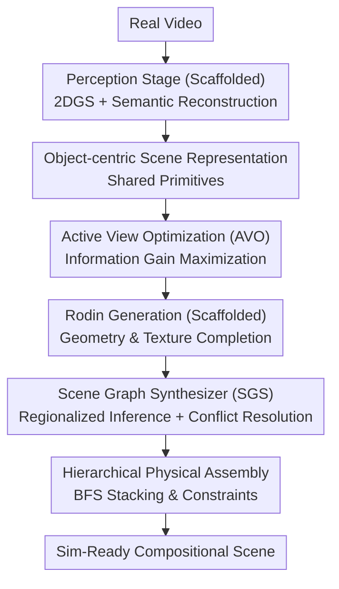

# SimRecon: SimReady Compositional Scene Reconstruction from Real Videos

**Conference**: CVPR 2026  
**arXiv**: [2603.02133](https://arxiv.org/abs/2603.02133)  
**Code**: [https://xiac20.github.io/SimRecon/](https://xiac20.github.io/SimRecon/)  
**Area**: Others  
**Keywords**: Compositional Scene Reconstruction, Sim-Ready, Scene Graph, Active View Optimization, Physical Assembly

## TL;DR

The SimRecon framework proposes a "Perception → Generation → Simulation" pipeline to automatically construct simulator-ready compositional 3D scenes from real-world videos. The core innovations include Active View Optimization (AVO) to find optimal projection views for single-object generation and a Scene Graph Synthesizer (SGS) to guide physically plausible hierarchical assembly.

## Background & Motivation

**Background**: 3D scene reconstruction primarily follows three paths: monolithic neural reconstruction (3DGS/NeRF, non-interactive), handcrafted or procedural simulators (AI2-THOR, ProcTHOR), and emerging compositional reconstruction (decomposing individual objects from multi-view data).

**Limitations of Prior Work**: 
   - Monolithic reconstruction lacks object boundaries and complete geometry, making it unsuitable for simulation and interaction.
   - Handcrafted/procedural simulators are high-cost and lack realistic layouts.
   - Existing compositional methods (DPRecon, InstaScene) rely on heuristic view selection leading to deformed generated objects, and their outputs remain visual representations rather than sim-ready scenes.

**Key Challenge**: There are two fractures between real-world videos and sim-ready scenes: the **visual fidelity** issue in the "Perception → Generation" stage and the **physical plausibility** issue in the "Generation → Simulation" stage.

**Key Insight**: Rather than redesigning the entire pipeline, this work designs two **bridge modules** to resolve the core issues during stage transitions.

**Core Idea**: Use Active View Optimization to obtain projection maps with maximum information gain as generation conditions, and use a Scene Graph Synthesizer to guide hierarchical physical assembly.

## Method

### Overall Architecture

SimRecon addresses the task of automatically producing "sim-ready" compositional scenes from a real-world video—requiring each object to have complete geometry/clean textures and correct physical relationships (e.g., stacking or attachment) for immediate interaction in a simulator. The pipeline integrates three stages: **Perception** reconstructs a semantic Gaussian field using 2DGS and semantic segmentation to extract object poses, scales, and labels; **Generation** uses AVO to find the most informative view for each extracted object and feeds it into the Rodin model to complete geometry and texture; **Simulation** uses SGS to infer physical relationship graphs and hierarchically assembles objects in Blender/Isaac Sim. A unified object-centric representation serves as the bridge between stages, with attributes filled progressively.

The central insight is to introduce two bridge modules at the "fracture points": AVO ensures **visual fidelity** (preventing deformation due to poor view selection) at the perception-to-generation transition, while SGS ensures **physical plausibility** (handling assembly logic) at the generation-to-simulation transition.

### Key Designs

**1. Object-centric Scene Representation: A Shared Data Interface**

To prevent fragmented information transfer, SimRecon unifies the scene as a set of discrete object primitives $\mathcal{S}_\text{comp} = \{o_1, o_2, ..., o_L\}$. Each $o_i$ includes **intrinsic attributes**—spatial pose $T_i \in SE(3)$, appearance $\mathcal{M}_i, \mathcal{T}_i$, and physical properties $l_i, \text{mat}_i, m_i$ (label, material, mass)—and **relational attributes** (support/attachment edges in the scene graph). These are filled progressively: Perception provides poses and labels, Generation provides geometry and textures, and Simulation identifies relations and physical quantities.

**2. Active View Optimization (AVO): Principled View Selection via Information Gain**

Single-object generation models require a projection map. Poor view selection—such as facing an occluded side—causes deformation. Unlike heuristics (fixed sampling or pixel coverage), AVO formalizes view selection as an information theory problem: $IG(v) = H(X|v_0) - H(X|v)$, measuring how much uncertainty about the object a new view $v$ eliminates relative to prior observations $v_0$. Since $IG$ is non-differentiable, AVO uses the accumulated opacity rendered by 3DGS as a differentiable proxy—the more "solid" Gaussians seen, the higher the information gain:

$$\max_v IG(v) = \max_v A(v) = \max_v \sum_{p \in \mathcal{P}_\text{obj}(v)} \alpha(p,v)$$

This allows view parameters to be optimized in 3D space via gradients. To prevent the camera from collapsing into the object surface, a depth regularization term pulls the camera to a scale-adaptive distance $d_\text{target}(s_i)$:

$$L_\text{depth}(v) = \frac{\lambda_\text{depth}}{|\mathcal{P}_\text{obj}(v)|}\sum_p (D(p,v) - d_\text{target}(s_i))^2$$.

AVO also performs **iterative view expansion**: after selecting $v_k^*$, the opacity of Gaussians already visualized is decayed: $\alpha_i^{(k)} = \alpha_i^{(k-1)} \cdot (1 - \text{clip}(\alpha_i'(v_k^*), 0, 1))$, naturally pushing subsequent optimization towards unobserved regions.

**3. Scene Graph Synthesizer (SGS): Reasoning Before Assembly**

Directly placing reconstructed objects results in physical errors like floating or penetration. SGS infers a global scene graph of support/attachment relations to guide assembly. To avoid VLM (Vision-Language Model) omissions in large scenes, SGS uses **regionalized reasoning**: objects are clustered via DBSCAN, and an optimal viewpoint is chosen via AVO for the VLM (Qwen2.5-VL) to infer a local subgraph $\mathcal{G}_k$. Subgraphs are merged via **Online Conflict Resolution**: during BFS merging, if a conflict is detected (e.g., cycles or contradictory hierarchies), a specific adjudication view is rendered for VLM re-evaluation. Final **Hierarchical Physical Assembly** proceeds via BFS from the floor/walls; support relations are stabilized via gravity settling, and attachment relations are fixed via constraints.

### A Complete Example

In a desktop scene video: Perception extracts primitives for the floor, table, lamp, and books. For the lamp, AVO rotates to an upper-side view to capture the shade and neck (avoiding book occlusions). After the first view, the shade's opacity contribution is decayed, forcing the second view to focus on the base. Rodin then completes the lamp's geometry. SGS clusters the desk items, and the VLM infers "Books → Supported-by → Table" and "Lamp → Supported-by → Table". During assembly, the table settles on the floor, and the lamp/books settle on the table, resulting in a physically consistent, non-penetrating scene.

### Loss & Training

The framework does not involve end-to-end training. It reuses independent pre-trained models (2DGS, SceneSplat, Rodin). Only AVO's view parameters (including $L_\text{depth}$) are optimized online, taking approximately 30 seconds per object.

## Key Experimental Results

### Main Results — Compositional 3D Reconstruction on ScanNet

| Method | CD↓ | F-Score↑ | NC↑ | PSNR↑ | SSIM↑ | LPIPS↓ | MUSIQ↑ | Time |
|:---|:---:|:---:|:---:|:---:|:---:|:---:|:---:|:---:|
| Gen3DSR | 11.69 | 30.19 | 70.50 | 19.26 | 0.886 | 0.425 | 60.94 | 17min |
| DPRecon | 9.26 | 46.12 | 78.28 | 21.97 | 0.913 | 0.257 | 71.49 | 10h42m |
| InstaScene | 6.90 | 49.69 | 82.55 | 22.35 | 0.907 | 0.302 | 71.57 | 29min |
| **Ours (SimRecon)** | **4.34** | **62.65** | **87.37** | **24.43** | **0.924** | **0.153** | **73.56** | 21min |

### Ablation Study

| Configuration | Description |
|:---|:---|
| Max. 2D Visibility | Pure pixel coverage maximization; views lack information content. |
| w/o $L_\text{depth}$ | Viewpoint collapses onto object surface; invalid projection. |
| Full AVO | Max Info-Gain + Depth Reg → Optimal view selection. |
| Global Infer. (SGS) | Single-pass global inference misses objects and relations. |
| Naive Merging (SGS) | Merging without conflict resolution creates contradictory relations. |
| **Full SGS** | Regionalized reasoning + Online conflict resolution → Consistent scene graph. |

### Key Findings
- AVO reduces Chamfer Distance (CD) by 37% compared to InstaScene (4.34 vs 6.90), proving view quality is vital for generation.
- Maximizing 2D visibility does not equate to maximizing 3D information; small objects may have high coverage but remain severely occluded.
- SGS hierarchical assembly shows significantly better physical plausibility than MCMC post-processing used in MetaScenes.
- Modular design allows for the flexible replacement of models (reconstructors/generators/simulators).

## Highlights & Insights
- **Information-driven View Optimization**: Formalizes view selection as information gain maximization using 3DGS opacity as a differentiable proxy.
- **Bridge Module Paradigm**: Identifies bottlenecks in stage transitions and designs specific bridge modules instead of a monolithic overhaul.
- **Scene Graph as Physical Scaffold**: Decouples physical reasoning from reconstruction, making the assembly both guided and interpretable.
- **Decay Mechanism for View Expansion**: Iteratively covers unobserved areas by decaying the contribution of already-visualized Gaussians.

## Limitations & Future Work
- Relies on VLMs (Qwen2.5-VL) for physical relations, which can still produce erroneous edges.
- Evaluated only on 20 ScanNet scenes; large-scale or outdoor scenes are untested.
- Generation quality depends on Rodin, which may struggle with complex, transparent, or reflective objects.
- Conflict resolution in SGS requires extra VLM calls, potentially reducing efficiency in complex scenes.
- Reasoning for physical properties (mass, material) lacks rigorous quantitative validation.

## Rating
- Novelty: ⭐⭐⭐⭐ (Innovation in AVO's info-theory approach and SGS online merging)
- Experimental Thoroughness: ⭐⭐⭐ (Limited dataset size with 20 ScanNet scenes)
- Writing Quality: ⭐⭐⭐⭐ (Clear structure and intuitive pipeline illustrations)
- Value: ⭐⭐⭐⭐ (Provides a practical end-to-end "video-to-sim" solution)

<!-- RELATED:START -->

## Related Papers

- [\[CVPR 2026\] Learning a Particle Dynamics Model with Real-world Videos](learning_a_particle_dynamics_model_with_real-world_videos.md)
- [\[CVPR 2026\] Pano3DComposer: Feed-Forward Compositional 3D Scene Generation from Single Panoramic Image](pano3dcomposer_feed-forward_compositional_3d_scene_generation_from_single_panora.md)
- [\[CVPR 2025\] SLAM3R: Real-Time Dense Scene Reconstruction from Monocular RGB Videos](../../CVPR2025/3d_vision/slam3r_real-time_dense_scene_reconstruction_from_monocular_rgb_videos.md)
- [\[AAAI 2026\] Dynamic Gaussian Scene Reconstruction from Unsynchronized Videos](../../AAAI2026/3d_vision/dynamic_gaussian_scene_reconstruction_from_unsynchronized_videos.md)
- [\[CVPR 2026\] AnyLift: Scaling Motion Reconstruction from Internet Videos via 2D Diffusion](anylift_scaling_motion_reconstruction_from_internet_videos_via_2d_diffusion.md)

<!-- RELATED:END -->
