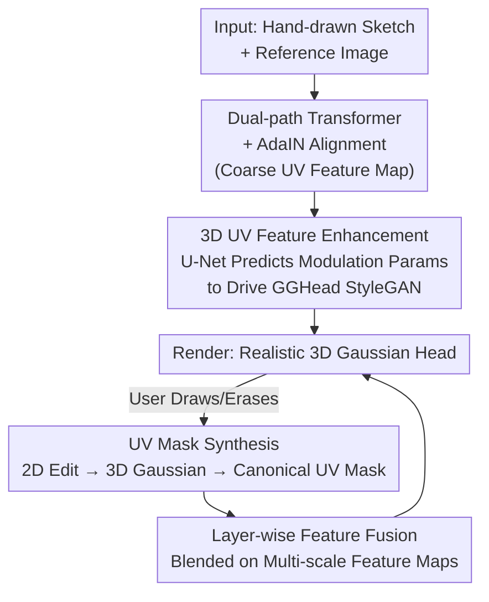

# SketchFaceGS: Real-Time Sketch-Driven Face Editing and Generation with Gaussian Splatting

**Conference**: CVPR 2026  
**arXiv**: [2604.19202](https://arxiv.org/abs/2604.19202)  
**Code**: None  
**Area**: 3D Vision  
**Keywords**: 3D Gaussian Splatting, Sketch-driven, Face generation, Real-time editing, UV features

## TL;DR
SketchFaceGS utilizes a feed-forward, coarse-to-fine architecture to map a single hand-drawn sketch (plus an optional reference image) to a real-time renderable photorealistic 3D Gaussian face in a single pass. By employing UV Mask Fusion and layer-wise feature fusion, it achieves free-view, optimization-free local real-time editing, outperforming SketchFaceNeRF in both generation fidelity (FID 92.65) and editing latency (~0.3s / 243 FPS).

## Background & Motivation
**Background**: 3D Gaussian Splatting (3DGS) has become the dominant representation for digital human head modeling, enabling photorealistic rendering at real-time speeds. Built upon this, 3D-GANs (such as EG3D) and methods that bind Gaussians to template meshes (like GGHead) have enabled the controllable generation of high-quality 3D avatars.

**Limitations of Prior Work**: Intuitively and interactively "creating or editing" a 3D Gaussian head remains difficult. Text-driven editing lacks the granularity for fine-grained local modifications. SketchFaceNeRF, the closest sketch-driven 3D face method, uses tri-plane prediction; however, its coarse tri-planes fail to recover fine details (such as complex hair strands) and lack photorealism. More critically, it relies on **per-instance optimization** for every edit (~10s per modification), and continuous editing leads to **error accumulation**, making real-time interactive creation impossible.

**Key Challenge**: 2D sketches are the ideal interaction method for rapid conceptual design, yet they are **sparse, depth-ambiguous, and lack high-frequency appearance cues**. Inferring a dense, geometrically consistent 3D Gaussian structure from a few lines is a highly ill-posed problem, especially under real-time constraints. Optimization-based methods can resolve this ambiguity but are slow and prone to drift; feed-forward methods are fast but struggle with fidelity.

**Goal**: (1) Feed-forward generation of geometrically consistent, photorealistic 3D Gaussian heads from a single sketch; (2) Support for real-time, optimization-free, free-view local editing without compromising the identity of unedited regions.

**Key Insight**: Decompose "sketch-to-3D" into a coarse-to-fine process. First, use a Transformer in UV space to establish a **low-frequency but geometrically consistent** skeleton. Then, leverage a **pre-trained 3D-GAN (GGHead) as a high-frequency texture prior** to inject photorealistic details. Editing is performed entirely via fusion in the generator's **feature space**, rather than through hard-composition in the 3D Gaussian space.

**Core Idea**: A feed-forward coarse-to-fine architecture bridges sparse sketches to a powerful 3D generation prior, while UV-mask-guided layer-wise feature fusion enables precise, optimization-free local editing.

## Method

### Overall Architecture
Given a portrait reference image and a hand-drawn sketch, SketchFaceGS separates the process into **generation** and **editing** pipelines. Generation follows a coarse-to-fine approach: in the coarse stage, dual parallel Transformers extract geometry from the sketch and appearance from the reference, respectively. These are aligned and fused via AdaIN into a geometrically consistent coarse UV feature map. In the fine stage, a U-Net translates this coarse UV map into a global latent vector and multi-scale spatial modulation parameters to drive a pre-trained GGHead StyleGAN generator. This outputs a high-fidelity UV map encoding full Gaussian attributes for splatting. The editing pipeline projects 2D screen-space drawing/erasing operations onto the 3D Gaussians, mapping them back to a canonical UV space to obtain a precise UV mask. Finally, it performs **layer-wise fusion** of the edited and unedited regions across the multi-scale feature maps of the StyleGAN generator to achieve seamless, view-consistent results.

The key to the framework is decomposing the ill-posed mapping from sketch to dense 3D into three steps: establishing a geometric skeleton in UV space, filling high-frequency details using a generative prior, and performing local fusion in the feature space during editing. Each step circumvents the ambiguities of direct mapping.

### Key Designs

**1. Dual-path Parallel Transformer + AdaIN Alignment: Establishing a Coarse Skeleton**

Sketches provide geometric cues while reference images provide appearance. If their structures are inconsistent, independent feature extraction will conflict. Inspired by LAM's 3D-aware query mechanism, the authors use a set of learnable queries corresponding to canonical head template vertices. These queries interact with DINOv2 deep features of the sketch/reference via cross-attention: the geometry branch yields $F_{\text{G}}, F_{\text{ID-G}} = \mathbf{T}_{\text{G}}((f_{\text{g}}, f_{\text{ID-g}}), F_{\text{sketch}})$, and the appearance branch yields $F_{\text{A}}, F_{\text{ID-A}} = \mathbf{T}_{\text{A}}((f_{\text{a}}, f_{\text{ID-a}}), F_{\text{ref}})$. Vertex features are projected onto a UV map via barycentric interpolation to obtain dense $F_{\text{UV-G}}, F_{\text{UV-A}}$.

To prevent conflicts, an AdaIN alignment network $G_c$ is used: it normalizes the geometry feature map and applies scaling and shifting using the scalar components of the appearance features to produce $F_{\text{UV-align}} = G_c(F_{\text{UV-G}}, F_{\text{UV-A}})$. This is concatenated with the geometry map as the coarse output. This ensures that appearance is "fitted" to the geometric skeleton.

**2. 3D UV Feature Enhancement: Using GGHead as a High-Frequency Prior**

Coarse UV maps are geometrically accurate but overly smooth. Instead of training a new generator, the authors apply the "generative modulation" concept to the 3D UV feature space. A U-Net processes the coarse UV map to predict modulation parameters for the pre-trained GGHead generator: a global latent vector $F_{latent}$ and a multi-resolution spatial feature pyramid $F_{spatial}$. The global vector is aggregated with identity vectors and mapped to the StyleGAN $\mathcal{W}^+ $ space:

$$\mathcal{W} = \mathrm{MLP}\bigl(\mathrm{concat}(F_{\text{latent}}, F_{\text{ID-G}}, F_{\text{ID-A}})\bigr)$$

The final UV map $F_{output}$, encoding full Gaussian attributes, is synthesized via global identity injection and local detail modulation. This repurposes the StyleGAN backbone as a **controllable decoder**.

**3. UV Mask Synthesis: Mapping 2D Edits to Canonical UV Space**

Precise local editing is challenging because user strokes occur in 2D pixel space, while features are in UV space. First, 2D editing regions are localized via sketch differencing and dilation to create a pixel mask $\mathcal{M}$. Ray back-projection identifies the 3D Gaussians contributing to these pixels. Following GaussianEditor, the influence weight of each Gaussian is accumulated based on its opacity-transmittance product:

$$w_i = \sum_{p \in \mathcal{M}} \alpha_i(p) \cdot T_i(p)$$

After filtering for visibility and mapping to canonical UV space via FLAME coordinates, a precise binary mask $\mathbf{M}_{\text{UV}}$ is generated and resampled for each generator layer $k$ as $\mathbf{M}_{\text{UV}}^{(k)}$.

**4. Layer-wise Feature Fusion: Blending in Feature Space**

Directly concatenating Gaussians in 3D space creates visible seams. Instead, the authors perform fusion at **every layer** of the generator. Let the original intermediate feature map at layer $k$ be $\mathbf{f}_k^{\text{orig}}$ and the new (edited) one be $\mathbf{f}_k^{\text{new}}$. The UV mask is used to selectively retain unedited regions:

$$\mathbf{f}_k^{\text{fused}} = (1 - \mathbf{M}_{\text{UV}}^{(k)}) \odot \mathbf{f}_k^{\text{orig}} + \mathbf{M}_{\text{UV}}^{(k)} \odot \mathbf{f}_k^{\text{new}}$$

The fused tensor serves as input for the next layer: $\mathbf{f}_{k+1}^{\text{new}} = \text{Layer}_k(\mathbf{f}_k^{\text{fused}}, \mathcal{W}_{\text{new}})$. This multi-level fusion naturally suppresses seams and ensures identity stability in unedited areas.

### Loss & Training
The model is trained in three stages: coarse generation, fine generation, and editing. Optimization uses a combination of pixel-level L1, perceptual (VGG), LPIPS, color consistency, and adversarial losses to ensure geometric consistency, color controllability, and photorealistic detail.

## Key Experimental Results

### Main Results

**Sketch-to-3D Head Generation** (FID / KID, lower is better):

| Method | FID ↓ | KID (×100) ↓ |
|------|-------|--------------|
| S3D | 96.03 | 4.50 ± 1.0 |
| Nano-LAM | 133.72 | 7.61 ± 0.9 |
| SketchFaceNeRF | 94.94 | 4.53 ± 0.6 |
| **Ours** | **92.65** | **4.00 ± 0.4** |

**Sketch-driven 3D Head Editing** (Quality and Performance):

| Method | FID ↓ | KID (×100) ↓ | Time (s) ↓ | FPS ↑ |
|------|-------|--------------|-----------|-------|
| MagicQuill | 46.48 | 0.78 ± 0.2 | ~6.0 | — |
| Nano-LAM | 74.26 | 3.01 ± 0.3 | ~15.0 | 281 |
| SketchFaceNeRF | 62.49 | 2.65 ± 0.3 | ~10.0 | 42 |
| **Ours** | **44.60** | **0.69 ± 0.2** | **~0.3** | 243 |

**Identity Preservation in Unedited Regions**:

| Metric | SF-NeRF (No Opt.) | SF-NeRF (W/ Opt.) | Ours |
|------|------------------|----------------|------|
| PSNR ↑ | 22.30 | 27.78 | **31.12** |
| SSIM ↑ | 0.90 | 0.95 | **0.97** |

Ours achieves the best results in both generation and editing quality, reducing latency from ~10s to ~0.3s (approx. 30x speedup).

### Ablation Study

| Configuration | FID ↓ | KID (×100) ↓ | Description |
|------|-------|--------------|------|
| Full Model (Ours) | 92.65 | 4.00 ± 0.4 | Full model |
| w/o Enhancement Module | 104.08 | 6.14 ± 1.3 | Geometry persists but is smooth/lacks detail |
| w/o Translation Network | 108.26 | 8.10 ± 0.7 | Serious artifacts when sketch/ref conflict |
| w/o Layer-wise Fusion | 68.42 | 1.89 ± 0.2 | Using 3D Gaussian Compositing (seams at boundaries) |

### Key Findings
- **AdaIN Alignment Network is critical**: Removing it caused the FID to jump from 92.65 to 108.26, proving that reconciling the sketch/reference conflict is the core challenge.
- **Layer-wise feature fusion outperforms 3D space blending**: Feature space fusion (FID 44.60) is significantly better than 3D Gaussian compositing (FID 68.42).
- **Fine-stage enhancement is the source of high-frequency detail**: The model relies on the prior for photorealism rather than the coarse stage.

## Highlights & Insights
- **Repurposing 3D-GAN as a "Controllable Decoder"**: By predicting modulation parameters for a frozen GGHead StyleGAN, the model inherits a high-frequency texture prior while maintaining sketch control.
- **Editing in Feature Space**: Most 3DGS methods blend in 3D space, which causes seams. Moving fusion to StyleGAN feature maps across multiple abstraction levels suppresses seams and enables sub-second latency.
- **UV Space as a Bridge**: Using canonical UV space to parameterize 3D Gaussian attributes converts the ill-posed mapping into a manageable image-to-image translation task.

## Limitations & Future Work
- **Identity Drift**: Large geometric conflicts between sketch and reference still cause slight identity shifts.
- **Prior Dependency**: Performance is bounded by the GGHead prior, making it difficult to handle rare accessories or extreme OOD inputs.
- **Static Heads Only**: Currently lacks animation support. The authors plan to extend this to dynamic 3DGS models.

## Related Work & Insights
- **vs SketchFaceNeRF**: Both do sketch-driven editing, but SketchFaceNeRF relies on per-instance optimization (~10s). Ours is feed-forward (~0.3s) and avoids error accumulation through UV-based fusion.
- **vs MagicQuill**: MagicQuill is 2D-based and limited to the original viewpoint. Ours is a true 3D representation supporting free-view editing.

## Rating
- Novelty: ⭐⭐⭐⭐ First optimization-free, feed-forward sketch-driven 3DGS framework.
- Experimental Thoroughness: ⭐⭐⭐⭐ Comprehensive comparisons and ablations.
- Writing Quality: ⭐⭐⭐⭐ Clear pipelines and well-explained concepts.
- Value: ⭐⭐⭐⭐ High practical value for digital avatar creation tools by reducing latency from 10s to sub-second.

<!-- RELATED:START -->

## Related Papers

- [\[CVPR 2026\] GHPT: Real-Time Relightable Gaussian Splatting using Hybrid Path Tracing](ghpt_real-time_relightable_gaussian_splatting_using_hybrid_path_tracing.md)
- [\[CVPR 2026\] Seele: A Unified Acceleration Framework for Real-Time Gaussian Splatting on Mobile Devices](seele_a_unified_acceleration_framework_for_real-time_gaussian_splatting_on_mobil.md)
- [\[CVPR 2026\] HyperGaussians: High-Dimensional Gaussian Splatting for High-Fidelity Animatable Face Avatars](hypergaussians_high-dimensional_gaussian_splatting_for_high-fidelity_animatable_.md)
- [\[ICCV 2025\] MeshPad: Interactive Sketch-Conditioned Artist-Reminiscent Mesh Generation and Editing](../../ICCV2025/3d_vision/meshpad_interactive_sketch-conditioned_artist-reminiscent_mesh_generation_and_ed.md)
- [\[CVPR 2026\] KV-Tracker: Real-Time Pose Tracking with Transformers](kv-tracker_real-time_pose_tracking_with_transformers.md)

<!-- RELATED:END -->
