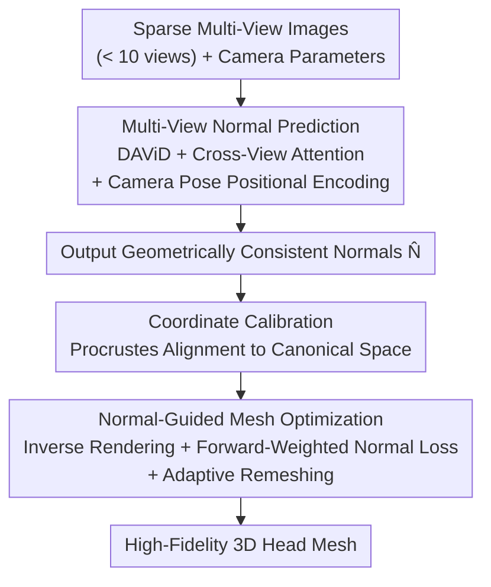

# Skullptor: High Fidelity 3D Head Reconstruction in Seconds with Multi-View Normal Prediction

**Conference**: CVPR 2026  
**Paper**: [CVF Open Access](https://openaccess.thecvf.com/content/CVPR2026/html/Artru_Skullptor_High_Fidelity_3D_Head_Reconstruction_in_Seconds_with_Multi-View_CVPR_2026_paper.html)  
**Code**: Project page https://skullptor.github.io (The paper states that the code and models will be open-sourced)  
**Area**: 3D Vision  
**Keywords**: 3D head reconstruction, multi-view normal prediction, inverse rendering, cross-view attention, sparse views

## TL;DR
Skullptor combines "data-driven multi-view normal prediction" and "inverse rendering mesh optimization" into a two-stage pipeline: first, a normal estimation model with cross-view attention predicts geometrically consistent surface normals from fewer than 10 sparse images; then, these normals are leveraged as strong geometric priors to optimize the mesh. Consequently, a 3D human head is reconstructed within 30 seconds using only 10 cameras, achieving quality comparable to traditional photogrammetry with dozens to hundreds of views while successfully recovering high-frequency details such as wrinkles and skin folds.

## Background & Motivation

**Background**: Reconstructing high-fidelity 3D human head geometry from images currently follows three main paradigms. Traditional photogrammetry (e.g., COLMAP/Meshroom) remains the gold standard in industrial VFX and gaming, leveraging dense triangulation from 25–200+ synchronized cameras to yield exceptional detail. Data-driven foundation models can reconstruct geometry in a feedforward manner from a single image, offering highly simplified capture but producing blurry details. Optimization-based methods (e.g., 2DGS, SuGaR) explicitly enforce multi-view consistency to achieve higher fidelity than foundation models, but still require dense views and costly per-scene optimization.

**Limitations of Prior Work**: None of the three paradigms simultaneously satisfy the three requirements of "high geometric accuracy, sparse-view input, and computational efficiency." Photogrammetry requires a massive number of cameras and immense compute power, with 4D sequence storage scaling up to terabytes, additionally suffering from artifacts in specular or hair regions that require manual cleanup. Single-image foundation models rely on learned, often vague 3D shape priors instead of physical multi-view geometric constraints, thereby losing individual high-frequency details. Pure optimization-based methods fail completely under sparse views due to the lack of strong priors, necessitating a high density of cameras to compensate for insufficient constraints.

**Key Challenge**: The core issue lies in the trade-off between "priors" and "geometric constraints." Data-driven methods possess priors but lack explicit multi-view constraints, leading to inaccurate "hallucinated" details. Meanwhile, optimization methods have multi-view constraints but lack strong priors, so constraint scarcity under sparse views requires stacking more cameras. Thus, the two approaches are perfectly complementary.

**Goal**: Under sparse setups (fewer than 10 cameras), achieve a level of detail comparable to dense-view photogrammetry while reducing the reconstruction time to seconds. This is decomposed into two sub-problems: (1) how to obtain surface normals from sparse images that are geometrically consistent across views while preserving high-frequency details; and (2) how to use these normals as priors to robustly optimize a detailed mesh.

**Key Insight**: The authors observe that single-view normal foundation models (such as DAViD) can already predict high-resolution normals, only lacking "cross-view consistency." Conversely, inverse rendering optimization lacks only a "strong geometric prior." The proposed approach directly feeds the output of the former into the latter, utilizing normals to translate the "data prior" into "geometric supervision consumable by the optimizer."

**Core Idea**: Replace single-image normals with "multi-view consistent normal prediction," and output these normals as geometric priors to guide inverse rendering mesh optimization, thereby using sparse views to achieve photogrammetry-grade fidelity.

## Method

### Overall Architecture
Skullptor divides 3D head mesh reconstruction into two sequential stages. **Stage 1 (Sec 3.1)** takes $m$ sparse multi-view color images $I=\{I_1,\dots,I_m\}$ and their corresponding camera parameters $(R_i,T_i,K_i)$ as input. A multi-view Transformer fuses cross-view information to output a set of **geometrically consistent normal maps** $N=\Psi(I,\{(R_i,T_i)\})$. **Stage 2 (Sec 3.2)** treats the predicted normals as geometric priors. Starting from a unit sphere mesh, it iteratively updates vertex positions via an inverse rendering framework, matching the rendered mesh normals to the predicted ones to eventually reconstruct a mesh with high-frequency details like wrinkles and folds. This pipeline bypasses the dense acquisition and heavy computational costs of photogrammetry, generating results in 30 seconds using only 10 cameras.

### Key Designs

**1. Cross-view attention enables the single-view normal model to "look at other views"**

The main pain point is straightforward: single-view normal models (using DAViD as the backbone here, a ViT+CNN model built on Dense Prediction Transformer and pre-trained on synthetic data) predict each view independently, leading to mutually contradictory normals across views that cannot be assembled into a coherent 3D mesh. The authors handle this by inserting a **view-aware cross-attention** layer between each Transformer encoder block and the fully connected layer in DAViD. The feature sequence $F_i\in\mathbb{R}^{L\times D}$ ($L=577$ tokens, $D=1024$) encoded from the $i$-th image is treated as the query, attending to key/values obtained by concatenating all views—

$$Q_i = F_i W_Q,\quad K=[F_1 W_K;\dots;F_m W_K],\quad V=[F_1 W_V;\dots;F_m W_V]$$

$$\text{Attention}(Q_i,K,V)=\text{softmax}\!\left(\frac{Q_i K^\top}{\sqrt{D}}\right)V$$

In this way, when predicting its own normal map, each image can absorb high-frequency geometric cues from other views, explicitly enforcing cross-view consistency directly through the attention mechanism. Crucially, this only adds a lightweight attention layer with initialization from pre-trained weights and fine-tuning on top of the original DAViD, requiring only 0.4 seconds of additional inference time (1.5s vs 1.1s) while significantly improving accuracy over independent single-view predictions.

**2. Camera pose positional encoding informs tokens of their view origin**

Merely using cross-view attention is insufficient, as the concatenated tokens have no "identity." The model cannot distinguish which tokens originate from which camera, leading to blurry attention. The authors encode each camera's extrinsic parameters into positional embeddings: the rotation matrix $R_i$ is first converted to a unit quaternion $q_i=(q_w,q_x,q_y,q_z)$, and concatenated with the translation $T_i$ to form a 7-dimensional pose vector $p_i=[q_i;T_i]\in\mathbb{R}^7$. This vector is projected to the feature dimension, added to each token in $F_i$, and then processed with cross-attention. This provides a "geometric coordinate system" for cross-view attention, enabling the model to effectively distinguish between tokens from different view sources—a prerequisite for establishing consistent prediction.

**3. Normal-guided inverse rendering mesh optimization (with forward weighting + adaptive remeshing)**

With cross-view consistent normals, how can they be converted into a detailed mesh? Starting from a unit sphere mesh $M$, differentiable rendering $\bar N_i=F(M,R_i^*,T_i^*,K_i)$ is utilized to render the current mesh normals, and vertex coordinates are optimized to approximate the predicted normals $\hat N^*$. Two engineering designs are essential here. The first is **coordinate calibration**: predicted normals are within their local camera coordinate systems and must be aligned to a canonical space. The authors detect 2D facial landmarks, triangulate them into 3D points $X$ by minimizing multi-view reprojection errors, and perform a Procrustes analysis (SVD) with template landmarks $Y$ to find the similarity transformation $G$. The camera extrinsics are corrected using $G^{-1}$, and normals are rotated to the canonical space via $R_g^{-1}$. The second is the **forward-weighted normal loss**:

$$L_{normal}=1-\frac{1}{m}\sum_{i=1}^{m}\hat W_i\cdot(\hat N_i^*\cdot \bar N_i)$$

The pixel-wise weight $\hat W_i(u,v)=\dfrac{\exp[\alpha(\hat N_i^*(u,v)\cdot d_i)]-1}{\exp(\alpha)-1}$ uses the camera viewing direction $d_i$ to assign higher weights to areas that "directly face the camera" (where $\alpha$ scales the weight intensity), since normal predictions in these areas are more reliable, whereas grazing-angle areas are downweighted due to lower credibility. The total loss also includes a Laplacian smoothing regularizer: $L=L_{normal}+\lambda_{lap}L_{lap}$. After each optimization step, **Continuous Remeshing** (edge splits/collapses/flips) is applied to dynamically adjust the mesh resolution based on local geometric complexity, while preventing self-intersections and degenerated faces. This is key to stably carving out high-frequency details without collapsing the mesh.

### Loss & Training
Stage 1 normal prediction is trained using a cosine similarity loss: $L_{cos}=1-\frac{1}{m}\sum_i \hat N_i\cdot N_i$. The DAViD backbone is initialized with pre-trained weights and fine-tuned end-to-end. Training data is obtained from Triplegangers high-quality 3D head scans (50 subjects × 20 static expressions × 55 lightstage cameras, holding out 5 subjects for validation). A crucial trick is **not training with fixed lightstage views, but rendering ground truth geometry (with texture) from randomly sampled virtual cameras to obtain training images and normals**. This exposes the model to diverse camera configurations, allowing it to generalize to arbitrary multi-view setups (validated on different camera configurations in NPHM/Multiface) while increasing data diversity without requiring extra physical captures. Stage 2 is a per-scene optimization and requires no training.

## Key Experimental Results

### Main Results

Normal estimation (Multiface / NPHM, comparing with single-view baselines; angular error and normal gradient error, lower is better):

| Dataset | Method | Mean Angular Error ↓ | Normal Gradient Error ↓ | <10° (%) ↑ | Time (s) ↓ |
|--------|------|------|------|------|------|
| Multiface | DAViD | 9.16 | 0.250 | 69.7 | 1.1 |
| Multiface | Sapiens 2B | 9.23 | 0.257 | 69.3 | 41.3 |
| Multiface | **Skullptor** | **9.13** | **0.234** | 69.2 | 1.5 |
| NPHM | DAViD | 7.86 | 0.190 | 73.8 | 1.1 |
| NPHM | Sapiens 2B | 6.86 | 0.185 | 80.0 | 43.7 |
| NPHM | **Skullptor** | 7.29 | **0.166** | 76.8 | 1.5 |

The key highlight is that Skullptor achieves the best performance across all datasets on the **normal gradient error** (a custom metric measuring high-frequency detail preservation) while requiring only 1.5s of inference time—an order of magnitude faster than Sapiens 2B. The angular errors are close to the baselines; the authors note that angular error is insensitive to fine geometry, making gradient error a more meaningful metric.

Mesh reconstruction (compared to photogrammetry / Gaussian Splatting):

| Dataset | Method | Depth Error (mm) ↓ | Normal Gradient Error ↓ | <10° (%) ↑ | Runtime (min) ↓ | Views |
|--------|------|------|------|------|------|------|
| Multiface | Meshroom (Photogrammetry) | 0.467 | 0.143 | 85.1 | 7.8 | 26 |
| Multiface | 2DGS | 5.73 | 0.206 | 68.6 | 50 | 26 |
| Multiface | SuGaR | 5.54 | 0.324 | 66.1 | 42 | 26 |
| Multiface | **Skullptor** | 2.43 | 0.156 | **91.5** | **0.67** | 26 |
| Multiface | **Skullptor (10 views)** | 2.99 | 0.157 | 86.8 | **0.48** | 10 |
| NPHM | Meshroom (Photogrammetry) | 2.54 | 0.114 | 88.3 | 9.5 | 23 |
| NPHM | SuGaR | 3.23 | 0.232 | 77.9 | 50 | 23 |
| NPHM | **Skullptor (10 views)** | **2.36** | 0.117 | 87.3 | **0.50** | 10 |

Skullptor substantially outperforms 2DGS/SuGaR across all metrics while being an order of magnitude faster. Compared to Meshroom, on NPHM, it matches the geometric quality while using less than half the views (10 vs 23) and is an order of magnitude faster. On Multiface, Meshroom's extremely low depth error (0.467mm) is due to its ground truth itself being generated via photogrammetry (introducing a correlation bias; a "broken nose" artifact in the GT actually penalized Skullptor's correct reconstruction). NPHM utilizes active structured light scanning, which suffers no such bias, making its conclusions more impartial.

### Ablation Study

| Dataset | Configuration | Normal Angular Error ↓ | Normal Gradient ↓ | Mesh Depth ↓ | Description |
|------|------|------|------|------|------|
| NPHM | DAViD | 7.80 | 0.188 | 2.68 | Original baseline |
| NPHM | DAViD ft mono | 8.43 | 0.174 | 3.53 | Fine-tuned single-view only (degraded performance) |
| NPHM | DAViD ft multi | 7.13 | 0.176 | 2.87 | Multi-view input without cross-view attention |
| NPHM | **Skullptor** | **7.05** | **0.167** | **2.44** | Full model (with cross-attention) |
| Multiface | DAViD ft mono | 8.88 | 0.228 | 4.32 | Fine-tuned single-view only (similarly degraded) |
| Multiface | **Skullptor** | **8.54** | **0.226** | **3.29** | Full model (best) |

### Key Findings
- **Domain adaptation alone is not the source of improvement**: DAViD ft mono (fine-tuning only single-views on this dataset) degraded performance rather than improving it, proving that the gain stems from multi-view structure rather than dataset domain shift.
- **Multi-view training + cross-view attention are the true contributions**: DAViD ft multi (multi-view training without cross-attention) already outperforms single-view, and the full Skullptor incorporating cross-attention yields the best performance across all benchmarks, highlighting that "explicitly aligning cross-view consistency" is key to resolving geometric ambiguity.
- **Learned geometric priors compensate for sparse views**: Comparing Skullptor with Meshroom on NPHM using 3/6/10/16/23 views—Skullptor maintains high-fidelity reconstructions even with only 3 cameras, whereas Meshroom quickly degrades when using $<16$ views and fails almost entirely with 3 views.

## Highlights & Insights
- **Normals serve as the bridge translating "data prior" to "optimization supervision"**: Normals are both highly predictable by foundation models and directly consumable as geometric supervision by inverse rendering. Choosing normals as the intermediate representation seamlessly bridges the two paradigms, representing a very clever design choice.
- **Lightweight refitting rather than retraining**: Simply inserting a cross-view attention layer into each block of DAViD and reusing pre-trained weights gains consistency with only 0.4s of extra overhead, demonstrating how a "small modification yields a giant return" in engineering.
- **Forward-weighted normal loss**: Using camera viewing directions to weight reliable, camera-facing regions higher and downweight untrustworthy grazing angles is a highly practical trick transferable to any multi-view normal/depth fusion task.
- **Virtual camera rendering for data augmentation**: Not restricting the training to a fixed physical lightstage setup, but instead rendering the GT from random virtual cameras, directly translates to generalization capability across arbitrary capture setups—a highly practical generalization approach for normal/depth feedforward models.
- **Custom normal gradient error metric**: Applying L1 loss after Sobel filtering specifically isolates high-frequency details. It reveals that methods with low angular errors but over-smoothed geometry are exposed by this metric, serving as an excellent supplement for evaluating detail fidelity.

## Limitations & Future Work
- The authors acknowledge that the method is tailored for **controlled lighting + synchronized cameras** capture setups; strong specularities, noisy images, and facial accessories can lead to erroneous normal predictions that propagate to the geometry.
- Self-identified limitations: Stage 2 involves a per-scene optimization (though requiring only 30s–0.7min) and is not fully feedforward; it only reconstructs geometry without appearance/material, and photogrammetry-based GT contains self-biases that skew metrics (e.g., the "broken nose" case on Multiface where depth error was inflated 20-fold).
- Future directions: The authors propose jointly predicting normals and albedo for complete appearance capture, as well as introducing material and illumination estimation to support relighting.

## Related Work & Insights
- **vs Photogrammetry (Meshroom/COLMAP)**: These rely on dense 25–200+ cameras for triangulation, presenting the gold standard for details but being slow and failing under sparse views. This work compensates for view constraints using learned normal priors, matching quality with $<10$ cameras while being an order of magnitude faster.
- **vs Single-image Foundation Models (Sapiens/DAViD/MeshLRM)**: These offer extremely simple captures but rely on "hallucinated" priors, yielding blurry details and cross-view inconsistencies. This work forces cross-view consistency and preserves high-frequency details using cross-attention.
- **vs Optimization Methods (2DGS/SuGaR)**: These explicitly enforce multi-view photo-consistency but lack strong priors, requiring dense views and costly optimization. This work utilizes normal priors to drastically reduce view and compute requirements, leading across all metrics.

## Rating
- Novelty: ⭐⭐⭐⭐ The combination of "data prior + inverse rendering" is not entirely new, but using cross-view attention normals as a bridge to achieve photogrammetry-grade fidelity under sparse views makes for a very solid approach.
- Experimental Thoroughness: ⭐⭐⭐⭐⭐ Evaluated on two datasets, capturing both normal and mesh levels, view-number sweeps, and a four-configuration ablation study, with an honest discussion on GT bias.
- Writing Quality: ⭐⭐⭐⭐⭐ The logical flow of pain point $\rightarrow$ core challenge $\rightarrow$ solution is highly clear, custom metrics are explicitly defined, and diagrams are comprehensive.
- Value: ⭐⭐⭐⭐ Directly addresses key pain points in industrial VFX/game pipelines, yielding high-fidelity head reconstructions in 30 seconds using only 10 cameras, rendering it highly viable for industrial deployment.

<!-- RELATED:START -->

## Related Papers

- [\[CVPR 2026\] Multi-view Consistent 3D Gaussian Head Avatars 'without' Multi-view Generation](multi-view_consistent_3d_gaussian_head_avatars_without_multi-view_generation.md)
- [\[CVPR 2026\] FHAvatar: Fast and High-Fidelity Reconstruction of Face-and-Hair Composable 3D Head Avatar from Few Casual Captures](fhavatar_fast_and_high-fidelity_reconstruction_of_face-and-hair_composable_3d_he.md)
- [\[CVPR 2026\] Intrinsic Image Fusion for Multi-View 3D Material Reconstruction](intrinsic_image_fusion_for_multi-view_3d_material_reconstruction.md)
- [\[CVPR 2026\] CustomTex: High-fidelity Indoor Scene Texturing via Multi-Reference Customization](customtex_high-fidelity_indoor_scene_texturing_via_multi-reference_customization.md)
- [\[CVPR 2026\] 3D Gaussian Splatting with Self-Constrained Priors for High Fidelity Surface Reconstruction](3d_gaussian_splatting_with_self-constrained_priors_for_high_fidelity_surface_rec.md)

<!-- RELATED:END -->
