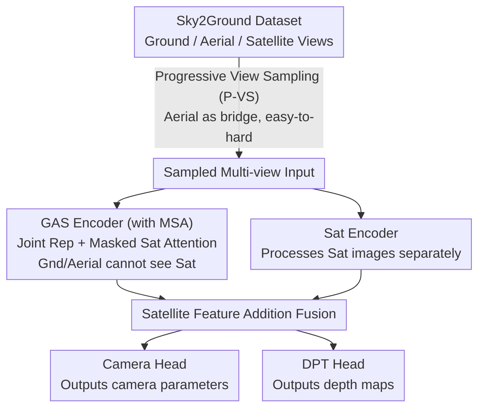

# Sky2Ground: A Benchmark for Site Modeling under Varying Altitude

**Conference**: CVPR 2026  
**arXiv**: [2603.13740](https://arxiv.org/abs/2603.13740)  
**Code**: Coming soon  
**Area**: 3D Vision / Cross-view Localization  
**Keywords**: Cross-view Localization, Satellite-Aerial-Ground, Multi-altitude 3D Reconstruction, Gaussian Splatting, Curriculum Learning

## TL;DR
This paper introduces the Sky2Ground dataset (51 scenes, 80k images, unified coverage of synthetic and real images across satellite, aerial, and ground views) and the SkyNet model (dual-stream encoder + masked satellite attention + progressive view sampling). It represents the first systematic study of joint camera localization across ground, aerial, and satellite perspectives, achieving gains of 9.6% in RRA@5 and 18.1% in RTA@5.

## Background & Motivation
1. **Background**: Multi-view 3D reconstruction and camera localization are fundamental computer vision tasks. Recent neural-based methods like DUSt3R, MASt3R, and VGGT have made significant progress but are primarily trained and evaluated on ground-aerial perspectives.
2. **Limitations of Prior Work**: (1) Lack of datasets containing ground, aerial, and satellite views simultaneously—nuScenes/KITTI only have ground views, AerialMegaDepth lacks satellite views, and MatrixCity/BungeeNeRF contain only synthetic data; (2) The joint localization problem across three perspectives has not been studied; (3) There is a massive distribution shift between satellite and ground/aerial images.
3. **Key Challenge**: Satellite images provide globally consistent geographic coverage and stable references, but visual differences from ground/aerial views are extreme (near-orthogonal views, kilometer-scale altitude differences). Intuitively, adding satellite data should provide more information, but experiments show it actually degrades localization performance.
4. **Goal**: (1) Construct the first dataset covering three views with both real and synthetic images; (2) Analyze why satellite images impair existing model performance; (3) Propose a new architecture that effectively utilizes satellite information.
5. **Key Insight**: Authors found that simple fine-tuning of VGGT with satellite data leads to a performance crash of 18.2%, whereas pair-wise processing networks like DUSt3R/MASt3R benefit. This suggests the issue is not distribution shift itself, but that global attention architectures cause interference when ground/aerial tokens interact with satellite tokens.
6. **Core Idea**: Use Masked Satellite Attention to prevent ground/aerial tokens from directly attending to satellite tokens, combined with a progressive sampling strategy to gradually introduce distant views for joint cross-altitude localization.

## Method

### Overall Architecture
This paper addresses a counter-intuitive problem: adding satellite images to multi-view camera localization, which should provide a global reference and improve accuracy, actually causes models like VGGT to fail. The authors rebuild the model based on the cause of this failure: SkyNet uses VGGT as a backbone but splits the single global encoder into two streams—a GAS encoder that takes the joint representation of all views but deliberately cuts off the attention from ground/aerial tokens to satellite tokens, and a Sat encoder that processes satellite images separately. The two streams are merged via additive fusion of satellite features before being passed to a shared Camera Head and DPT Head to output camera parameters and depth maps. The core design focuses not on "how to use more data," but on "how to ensure the heterogeneous satellite modality contributes information without polluting the representation."

### Key Designs

**1. Sky2Ground Dataset: Integrating Satellite/Aerial/Ground views into one benchmark**

Previous datasets lacked either satellite views or real-world ground views, making joint 3-view localization impossible to train or evaluate. Sky2Ground covers 51 geographic locations globally, assembling four sources for each scene: 120 satellite ortho-rectified images (1–2km altitude), 1080 synthetic aerial images (descending from 250–800m in spiral trajectories), 50–250 synthetic ground images, plus 120 real aerial/ground images manually collected from Google Maps and YouTube. Synthetic portions are rendered via Google Earth Studio with COLMAP-generated dense depth labels for precise ground truth; real portions provide noise like lighting and weather. This complementarity provides clean supervision while retaining real-world distributions.

**2. Masked Satellite Attention (MSA): Asymmetric attention for unidirectional isolation**

The root cause of VGGT's performance crash is "pollution" of ground/aerial features by satellite features through global self-attention. As satellite images are near-orthogonal and at extreme altitudes, bidirectional interaction biases healthy representations. MSA implements standard intra-frame self-attention followed by a directional mask in each GAS encoder block: satellite tokens can attend to ground/aerial tokens, but the reverse is prohibited by setting the Sat $\rightarrow$ Gnd/Aerial attention matrix values to $-\infty$. Thus, ground/aerial tokens never "see" the satellite, preserving VGGT's zero-shot capabilities, while satellite tokens unidirectionally absorb information for self-localization.

**3. Progressive View Sampling (P-VS): Using aerial views as a "bridge" for curriculum learning**

Ground and satellite views are extreme opposites with minimal visual overlap. P-VS uses aerial views as a bridge, increasing difficulty via a curriculum: training starts with high aerial sampling ($N_a \approx N$) to establish associations across the altitude chain. As training progresses, aerial images are phased out ($N_a \approx 0$), eventually leaving the challenging ground-satellite combination. This allows the model to transition smoothly from simpler joint localization to the difficult ground + satellite objective.

### Loss & Training
The multi-task loss is defined as $\mathcal{L} = \mathcal{L}_{\text{cam, sat}} + 0.4 \cdot \mathcal{L}_{\text{cam, gnd/aerial}} + \mathcal{L}_{\text{depth}}$. The satellite camera loss receives the highest weight, reflecting that satellite tokens are the primary targets for optimization. Training also utilizes Curriculum Aware Camera-Sampling (CA-CS), which initially samples nearby camera pairs before expanding to distant pairs based on a metric of "rotation distance + 0.5 $\times$ translation distance."

## Key Experimental Results

### Main Results (GAS setup, RRA@5 / RTA@5 %)

| Method | Training Data | Ground RRA/RTA | Sat RRA/RTA | Aerial RRA/RTA | Avg RRA/RTA |
|------|---------|---------------|-------------|---------------|------------|
| VGGT | Zero-shot | 75.1/60.9 | 66.6/0.0 | 79.2/72.6 | 73.6/44.5 |
| VGGT | Sky2Ground | 50.0/46.1 | 86.6/53.3 | 29.7/31.5 | 55.4/43.6 |
| SkyNet | Sky2Ground | **76.7/64.2** | **88.9/57.3** | **84.0/78.1** | **83.2/66.5** |

### Ablation Study (G+S setup)

| Configuration | MSA | CA-CS | P-VS | Avg Performance |
|------|-----|-------|------|---------|
| VGGT Fine-tune | ✗ | ✗ | ✗ | 47.8 |
| VGGT Zero-shot | ✗ | ✗ | ✗ | 52.9 |
| +MSA | ✓ | ✗ | ✗ | 62.7 (+8.2) |
| +P-VS | ✗ | ✗ | ✓ | 61.1 (+7.3) |
| +MSA+CA-CS+P-VS | ✓ | ✓ | ✓ | **65.1 (+12.2)** |

### Key Findings
- **Fine-tuning VGGT with satellite data leads to severe degradation**: RRA dropped from 73.6% to 55.4% (-18.2%).
- **MSA is the most significant single component**: +8.2%, as it protects ground/aerial features from satellite interference.
- **P-VS is more effective than CA-CS**: +7.3% vs +1.4%, showing that "using aerial as a bridge" is more critical than "near-to-far sampling."
- **Pair-wise networks benefit from satellite data**: DUSt3R/MASt3R performance improved because high co-visibility in satellite-satellite pairs within pair-wise processing aids global alignment.
- **Real images impair rendering quality**: PSNR consistently decreased with real images due to domain gaps making it difficult for GS to mix sources.
- **2DGS consistently outperforms 3DGS**: Perceptual quality was better for 2D Gaussian Splatting across all views and densities.

## Highlights & Insights
- **Counter-intuitive finding on data**: Adding satellite data—an information-rich source—actually hurts performance, suggesting that when distribution shifts are large enough, more data does not equal better results. This challenges the "scale everything" mindset.
- **Transferable MSA design**: In any Transformer architecture involving heterogeneous modalities (e.g., text+image, RGB+thermal), asymmetric attention masks can be used to avoid interference if distribution differences are too large.
- **Bridge modality curriculum learning**: The strategy of transitioning from an intermediate modality to extreme ones can be generalized to any multi-modal alignment task.

## Limitations & Future Work
- The method is two-stage (pose prediction followed by Gaussian Splatting); future work could explore unified models.
- 51 scenes may be insufficient for large-scale training.
- Satellite ortho-rectification relies on additional processing.
- Real image poses are estimated via COLMAP, with limited accuracy.
- Advanced domain adaptation techniques to bridge the synthetic-real gap remain unexplored.

## Related Work & Insights
- **vs AerialMegaDepth**: Most relevant dataset, but lacks satellite views; Sky2Ground is a superset.
- **vs VGGT**: SkyNet builds on VGGT but solves its failure on satellite perspectives.
- **vs DUSt3R/MASt3R**: Pair-wise processing utilizes satellite info but has $O(N^2)$ complexity, unsuitable for real-time use.
- **vs Dragon**: Dragon also uses progressive strategies for different altitudes but only for reconstruction, not localization.

## Rating
- Novelty: ⭐⭐⭐⭐ First systematic study of 3-view joint localization; creative MSA and P-VS designs.
- Experimental Thoroughness: ⭐⭐⭐⭐⭐ Covers both localization and rendering; multiple benchmarks and detailed ablations.
- Writing Quality: ⭐⭐⭐⭐ Deep analysis with clear presentation of counter-intuitive findings.
- Value: ⭐⭐⭐⭐ Dataset and benchmark are highly valuable for the cross-view localization field.

<!-- RELATED:START -->

## Related Papers

- [\[CVPR 2026\] FreeArtGS: Articulated Gaussian Splatting Under Free-Moving Scenario](freeartgs_articulated_gaussian_splatting_under_free-moving_scenario.md)
- [\[CVPR 2026\] Revisiting Pose Sensitivity in Splat-based Computed Tomography under Sparse-view Reconstruction](revisiting_pose_sensitivity_in_splat-based_computed_tomography_under_sparse-view.md)
- [\[CVPR 2026\] Solvability of the Viewing Graph Under the Affine Camera Model](solvability_of_the_viewing_graph_under_the_affine_camera_model.md)
- [\[CVPR 2026\] NimbusGS: Unified 3D Scene Reconstruction under Hybrid Weather](nimbusgs_unified_3d_scene_reconstruction_under_hybrid_weather.md)
- [\[CVPR 2026\] Revisiting Optimal Coding for I-ToF under Practical Sensor Constraints](revisiting_optimal_coding_for_i-tof_under_practical_sensor_constraints.md)

<!-- RELATED:END -->
